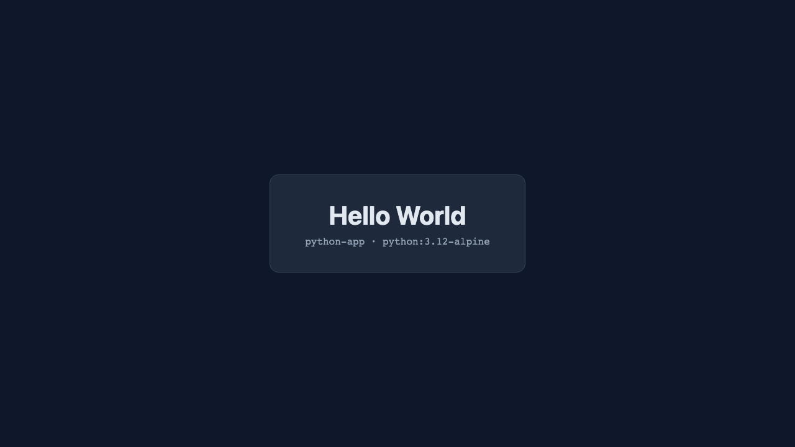
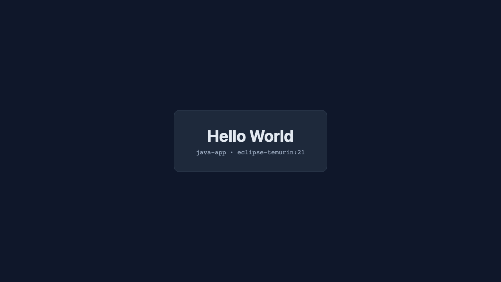
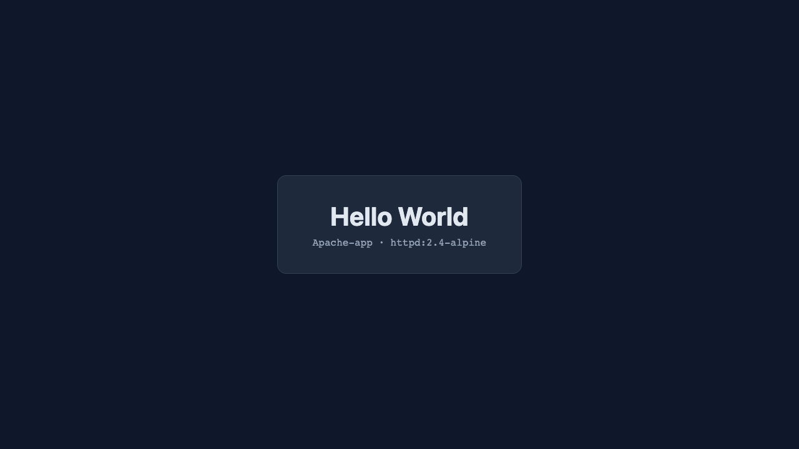
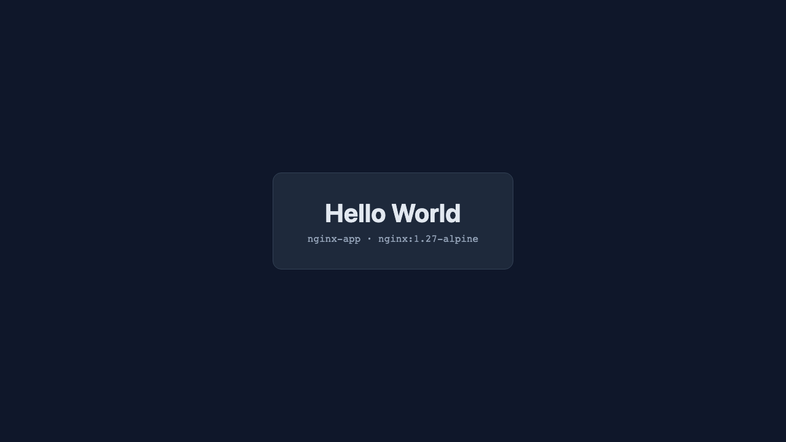
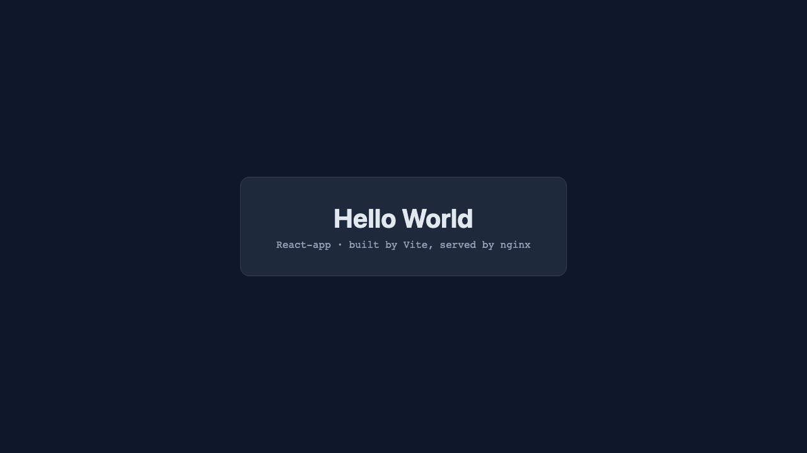

# Docker: Hello World Applications

Six Hello World web apps, one folder each, one Dockerfile each. All six were built, run
and opened in a browser. Screenshots are in [screenshots/](screenshots/).

## Folder structure

```text
05-docker-hello-world/
├── nodejs-app/     Node's built-in http module
├── python-app/     Python + Flask
├── java-app/       Java, JDK's built-in HTTP server, two-stage build
├── Apache-app/     Apache httpd serving a static page
├── nginx-app/      nginx serving a static page
├── React-app/      React built with Vite, served by nginx
├── screenshots/
└── README.md
```

## All six at a glance

| App | Base image | Container port | Host port | Image size |
|---|---|---|---|---|
| nodejs-app | `node:22-alpine` | 3000 | 8101 | 228 MB |
| python-app | `python:3.12-alpine` | 8000 | 8102 | 108 MB |
| java-app | `eclipse-temurin:21` (2 stages) | 8080 | 8103 | 286 MB |
| Apache-app | `httpd:2.4-alpine` | 80 | 8104 | 105 MB |
| nginx-app | `nginx:1.27-alpine` | 80 | 8105 | 75.9 MB |
| React-app | node build → `nginx:1.27-alpine` | 80 | 8106 | 76.1 MB |

I put every app on a host port in the 81xx range rather than using each app's default
port. It keeps them all reachable at once and avoids clashing with whatever is already
running on 3000, 5000 or 8080. Only the host side of the mapping changed; each app still
listens on its normal port inside its own container.

---

## 1. nodejs-app

`server.js` uses Node's own `http` module, so the app has **no npm dependencies at
all**. Express would work equally well; the standard library is enough for one route and
it means the image needs no install step.

```dockerfile
FROM node:22-alpine

WORKDIR /app

COPY package.json server.js ./

EXPOSE 3000
CMD ["node", "server.js"]
```

The one detail that matters is in `server.js`:

```js
server.listen(PORT, '0.0.0.0', () => { ... });
```

Bound to `0.0.0.0`, not `127.0.0.1`. A container's loopback belongs to the container, so
an app bound to `127.0.0.1` is unreachable from outside no matter what `-p` says. This is
the single most common reason a published port appears to do nothing.

```text
$ docker build -t hello-node 05-docker-hello-world/nodejs-app
$ docker run -d --name hw-node -p 8101:3000 hello-node

$ docker logs hw-node
nodejs-app listening on port 3000

$ curl -s -o /dev/null -w "%{http_code}\n" http://localhost:8101
200
```


---

## 2. python-app

Flask, three lines of app plus the page.

```dockerfile
FROM python:3.12-alpine

WORKDIR /app

COPY requirements.txt ./
RUN pip install --no-cache-dir -r requirements.txt

COPY app.py ./

EXPOSE 8000
CMD ["python", "app.py"]
```

Two deliberate choices here:

**`requirements.txt` is copied on its own, before `app.py`.** Docker caches each
instruction as a layer and reuses it while its inputs are unchanged. Copying only the
dependency file first means editing `app.py` reuses the cached `pip install` layer, so
the rebuild is instant instead of re-downloading Flask. If both were copied in one
`COPY . .`, every source edit would invalidate the install.

**`--no-cache-dir`** stops pip keeping its download cache inside the image, where it
would only add weight.

`app.run(host="0.0.0.0", port=8000)` for the same reason as the Node app.

```text
$ docker run -d --name hw-python -p 8102:8000 hello-python

$ docker logs hw-python
 * Running on http://172.17.0.5:8000
Press CTRL+C to quit
192.168.65.1 - - [03/Sep/2026 17:22:08] "GET / HTTP/1.1" 200 -
```

Flask's dev server prints a warning about not being production-ready, which is fair —
a real deployment would put gunicorn or uvicorn in front. For Hello World it is fine.



---

## 3. java-app

`Hello.java` uses `com.sun.net.httpserver`, which ships inside the JDK, so there is no
Maven, no Gradle and no third-party jar.

This is the only one of the six that needs a **two-stage build**, because Java has a
genuine compile step:

```dockerfile
FROM eclipse-temurin:21-jdk-alpine AS build

WORKDIR /src
COPY Hello.java ./
RUN javac Hello.java

# the compiler is only needed above, so the final image ships the JRE only
FROM eclipse-temurin:21-jre-alpine

WORKDIR /app
COPY --from=build /src/Hello.class ./

EXPOSE 8080
CMD ["java", "Hello"]
```

Stage one has the full JDK and produces `Hello.class`. Stage two starts from a clean
JRE image and copies in just that one file. The compiler never reaches the shipped
image.

I first wrote this as a single stage using `CMD ["java", "Hello.java"]`, which works
because the JDK can compile and run a single source file in one step. It is fewer lines,
but the image came out at **555 MB** because the whole JDK has to stay. Splitting it into
two stages brought it down to **286 MB** for exactly the same behaviour, so the two
stages are worth the four extra lines.

```text
$ docker run -d --name hw-java -p 8103:8080 hello-java

$ docker logs hw-java
java-app listening on port 8080
```



---

## 4. Apache-app

No application code at all — a static page dropped into the official Apache image.

```dockerfile
FROM httpd:2.4-alpine

COPY index.html /usr/local/apache2/htdocs/index.html

EXPOSE 80
```

`/usr/local/apache2/htdocs` is where this image's Apache serves from. There is
deliberately **no `CMD`**: the base image already starts `httpd` in the foreground.
Adding one would only risk overriding something that already works.

```text
$ docker run -d --name hw-apache -p 8104:80 hello-apache
```



---

## 5. nginx-app

Same idea, different document root.

```dockerfile
FROM nginx:1.27-alpine

COPY index.html /usr/share/nginx/html/index.html

EXPOSE 80
```

```text
$ docker run -d --name hw-nginx -p 8105:80 hello-nginx
```

At **75.9 MB** this is the smallest of the six, because it is a web server and one HTML
file with no language runtime at all.



---

## 6. React-app

A real React app created with Vite, compiled to static files, then served by nginx.

```dockerfile
FROM node:22-alpine AS build

WORKDIR /app
COPY package.json ./
RUN npm install
COPY . .
RUN npm run build

# a built React app is only static files, so nginx is enough to serve it
FROM nginx:1.27-alpine
COPY --from=build /app/dist /usr/share/nginx/html

EXPOSE 80
```

This is the most useful pattern of the six. Node, Vite and React are needed to *produce*
`dist/`. Once it exists, the app is plain HTML, CSS and JS, and nothing in the build
toolchain is needed to serve it. I checked what each stage actually holds:

```text
$ docker build -t react-buildstage --target build React-app
$ docker run --rm react-buildstage sh -c 'ls node_modules | wc -l; du -sh node_modules; du -sh dist'
37
39.6M	node_modules
156.0K	dist
```

39.6 MB of `node_modules` produces 156 KB of output. Only that 156 KB reaches the final
image, which is why it comes out at **76.1 MB**, essentially the same as the bare nginx
app, versus 228 MB for the Node image that still carries a runtime.

There is also a `.dockerignore` listing `node_modules` and `dist`, so a local build on my
Mac never gets copied into the image where it would shadow the one built inside it.

```text
$ docker run -d --name hw-react -p 8106:80 hello-react
```

One thing I noticed verifying this one: `curl` returns an almost empty page —

```text
$ curl -s http://localhost:8106 | grep -o "<h1>[^<]*</h1>"
(nothing)
```

— because a React page is an empty `<div id="root">` plus a script tag, and the heading
only exists after the browser runs the JavaScript. The HTTP status is still 200. So
`curl` cannot verify this app; the browser screenshot is the actual proof.



---

## Building and running all six

```bash
cd 05-docker-hello-world

docker build -t hello-node   nodejs-app
docker build -t hello-python python-app
docker build -t hello-java   java-app
docker build -t hello-apache Apache-app
docker build -t hello-nginx  nginx-app
docker build -t hello-react  React-app

docker run -d --name hw-node   -p 8101:3000 hello-node
docker run -d --name hw-python -p 8102:8000 hello-python
docker run -d --name hw-java   -p 8103:8080 hello-java
docker run -d --name hw-apache -p 8104:80   hello-apache
docker run -d --name hw-nginx  -p 8105:80   hello-nginx
docker run -d --name hw-react  -p 8106:80   hello-react
```

### The images

```text
$ docker images
REPOSITORY      TAG       SIZE
hello-java      latest    286MB
hello-node      latest    228MB
hello-python    latest    108MB
hello-apache    latest    105MB
hello-react     latest    76.1MB
hello-nginx     latest    75.9MB
```

### The running containers

```text
$ docker ps
NAMES        IMAGE          STATUS         PORTS
hw-react     hello-react    Up 6 seconds   0.0.0.0:8106->80/tcp
hw-nginx     hello-nginx    Up 6 seconds   0.0.0.0:8105->80/tcp
hw-apache    hello-apache   Up 6 seconds   0.0.0.0:8104->80/tcp
hw-java      hello-java     Up 6 seconds   0.0.0.0:8103->8080/tcp
hw-python    hello-python   Up 6 seconds   0.0.0.0:8102->8000/tcp
hw-node      hello-node     Up 7 seconds   0.0.0.0:8101->3000/tcp
```

### Verifying all six

```text
$ for p in 8101 8102 8103 8104 8105 8106; do
    printf "localhost:%s -> %s\n" "$p" "$(curl -s -o /dev/null -w '%{http_code}' http://localhost:$p)"
  done
localhost:8101 -> 200
localhost:8102 -> 200
localhost:8103 -> 200
localhost:8104 -> 200
localhost:8105 -> 200
localhost:8106 -> 200

$ for p in 8101 8102 8103 8104 8105 8106; do
    printf "%s : %s\n" "$p" "$(curl -s http://localhost:$p | grep -o '<h1>[^<]*</h1>' | head -1)"
  done
8101 : <h1>Hello World</h1>
8102 : <h1>Hello World</h1>
8103 : <h1>Hello World</h1>
8104 : <h1>Hello World</h1>
8105 : <h1>Hello World</h1>
8106 :
```

All six return 200 and five of the six serve the heading directly. The blank one is
React, for the reason explained above.

### Cleanup

```bash
docker rm -f hw-node hw-python hw-java hw-apache hw-nginx hw-react
docker rmi hello-node hello-python hello-java hello-apache hello-nginx hello-react
```

---

## What I took away from this

**A Dockerfile is just the setup steps you would run by hand, written down.** Pick a
base image, copy the code in, install what it needs, declare the port, give the command
that starts it.

**`EXPOSE` publishes nothing.** It is documentation that records which port the app uses.
`-p 8101:3000` on `docker run` is what actually opens a port, and it reads
`host:container`. That is why the Node app can listen on 3000 internally and be served
on 8101.

**The app must bind `0.0.0.0`.** Bound to `127.0.0.1` it is only reachable from inside
its own container, and the port mapping looks broken when it is the app that is wrong.

**Layer order decides your rebuild time.** Copy the dependency manifest and install
before copying source, so source edits do not trigger a reinstall.

**Multi-stage builds pay off when the build output differs from its input.** React is the
clearest case: 76 MB instead of 228 MB, because only `dist/` survives. Java is the same
argument with a compiler: 286 MB instead of 555 MB. For an interpreted app with no build
step there is much less to gain — see [../06-docker-multistage/](../06-docker-multistage/)
where the saving was only 6 MB.

**Static apps need no `CMD`.** Apache and nginx already start their servers. The three
application images need one, because otherwise the container would have nothing to run
and would exit immediately.

**Alpine variants are worth defaulting to.** I built the same Python app both ways to
check:

```text
$ docker images
hello-python-slim   234MB
hello-python        108MB
```

Changing one word in the `FROM` line more than halved the image. The caveat is that
Alpine uses musl instead of glibc, so a dependency needing compiled C extensions can
fail to build there — at which point `-slim` is the fallback.
