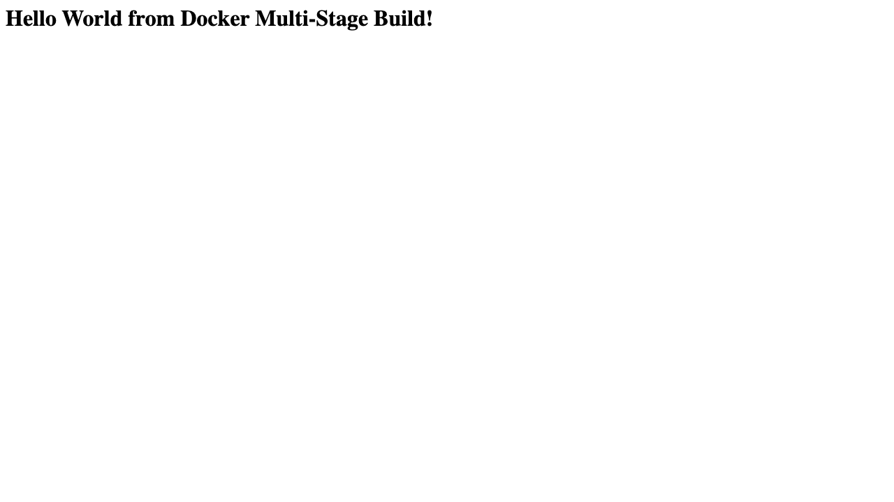

# Docker Multi-Stage Build

**Name:** Abdur Rahman Ibne Munir
**Enrollment number:** 24BCS10244

---

## Task 1: Run the multi-stage Dockerfile

### Where it came from

The multi-stage Dockerfile is the one from the class repo:

```bash
git clone https://github.com/Nency-Ravaliya/devops-heros.git
cd devops-heros/session6-7-docker/multi-stage-dockerfile
```

I copied that folder into this repo as [hello-multistage/](hello-multistage/) so the
submission is self-contained. It has `Dockerfile`, `package.json` and `server.js`. I
also added `Dockerfile.singlestage`, which is the same app built the ordinary way, so
the two image sizes can be compared — that is mine, not from the class repo.

### The app

A four-line Express server:

```js
const express = require("express");

const app = express();
const PORT = 3000;

app.get("/", (req, res) => {
  res.send("<h1>Hello World from Docker Multi-Stage Build!</h1>");
});

app.listen(PORT, () => {
  console.log(`Server running on port ${PORT}`);
});
```

### The Dockerfile

```dockerfile
FROM node:24-alpine AS builder
WORKDIR /app
COPY package*.json ./
RUN npm install
COPY . .

FROM node:24-alpine AS production
WORKDIR /app
COPY --from=builder /app/package*.json ./
RUN npm install --omit=dev
COPY --from=builder /app/server.js ./
EXPOSE 3000
CMD ["npm", "start"]
```

Two `FROM` lines means two stages. Each `FROM` starts a **fresh filesystem**, so nothing
from `builder` exists in `production` unless it is explicitly copied across with
`COPY --from=builder`.

- `builder` installs everything, dev dependencies included, and copies the whole source
  tree in.
- `production` starts clean, brings over only `package*.json` and `server.js`, and
  installs with `--omit=dev` so dev dependencies are left out.

Only the **last** stage becomes the image you ship. Whatever is left in `builder` — the
source tree, npm's cache, any dev tooling — is discarded.

### Build the image

```text
$ docker build -t multistage-hello 06-docker-multistage/hello-multistage
...
#12 [production 5/5] COPY --from=builder /app/server.js ./
#12 DONE 0.0s
#13 exporting to image
#13 naming to docker.io/library/multistage-hello:latest done
```

### Run the container on port 8080

The app listens on 3000 inside the container, so host port 8080 maps to container port
3000:

```text
$ docker run -d --name multistage-app -p 8080:3000 multistage-hello
25b29e6ceb130b126dcd88129fb28b78c79fc17dbcdebaba8bb4a00fb10d3456

$ docker logs multistage-app

> docker-hello-world@1.0.0 start
> node server.js

Server running on port 3000
```

### Verify the running container with `docker ps`

```text
$ docker ps
CONTAINER ID   IMAGE              STATUS         PORTS                                         NAMES
25b29e6ceb13   multistage-hello   Up 4 seconds   0.0.0.0:8080->3000/tcp, [::]:8080->3000/tcp   multistage-app
```

The `PORTS` column reads `0.0.0.0:8080->3000/tcp`, which confirms the app is published
on **port 8080** on the host.

### Access the application

```text
$ curl -i http://localhost:8080
HTTP/1.1 200 OK
X-Powered-By: Express
Content-Type: text/html; charset=utf-8
Content-Length: 51
ETag: W/"33-gCAsBJJtlso/BVPWoV3U/pWC3Ak"
Date: Thu, 03 Sep 2026 17:22:24 GMT
Connection: keep-alive
Keep-Alive: timeout=5

$ curl http://localhost:8080
<h1>Hello World from Docker Multi-Stage Build!</h1>
```

The page shows **Hello World from Docker Multi-Stage Build**, which is what the task
asked for. `X-Powered-By: Express` confirms it is the Express app answering.

---

## Task 2: Documentation

**Name:** Abdur Rahman Ibne Munir
**Enrollment number:** 24BCS10244

### The application running in the browser

`http://localhost:8080` showing the heading *Hello World from Docker Multi-Stage Build!*



The page is unstyled because this is the class repo's app kept exactly as it was given.

### `docker ps` showing the container on port 8080

```text
$ docker ps
CONTAINER ID   IMAGE              COMMAND                  CREATED         STATUS         PORTS                                         NAMES
25b29e6ceb13   multistage-hello   "docker-entrypoint.s…"   3 seconds ago   Up 3 seconds   0.0.0.0:8080->3000/tcp, [::]:8080->3000/tcp   multistage-app
```

### Does the multi-stage build actually save anything here?

I built the same app both ways to find out:

```text
$ docker build -t singlestage-hello -f hello-multistage/Dockerfile.singlestage hello-multistage

$ docker images
multistage-hello    latest    243MB
singlestage-hello   latest    249MB
```

**Only 6 MB saved.** That is an honest result and worth explaining rather than hiding.

The reason is that this app has nothing to throw away. Express has no dev dependencies,
and there is no compile step, so `--omit=dev` removes nothing:

```text
$ docker run --rm multistage-hello  sh -c "ls node_modules | wc -l"
65
$ docker run --rm singlestage-hello sh -c "ls node_modules | wc -l"
65
```

Identical. The 6 MB is just the source files and npm metadata that the single-stage
image still carries.

What is actually inside the final stage:

```text
$ docker run --rm multistage-hello ls -la /app
drwxr-xr-x   67 root  root   4096  node_modules
-rw-r--r--    1 root  root  30932  package-lock.json
-rw-r--r--    1 root  root    179  package.json
-rw-r--r--    1 root  root    259  server.js
```

```text
$ docker history multistage-hello
SIZE      CREATED BY
0B        CMD ["npm" "start"]
0B        EXPOSE [3000/tcp]
12.3kB    COPY /app/server.js ./
9.45MB    RUN /bin/sh -c npm install --omit=dev
45.1kB    COPY /app/package*.json ./
8.19kB    WORKDIR /app
```

Only four small layers sit on top of the `node:24-alpine` base. The base image itself is
the 230-odd MB, which no amount of staging can remove — the only way down from there is
a smaller base or a runtime that is not Node.

**Where multi-stage really pays off** is when the build step produces something
*different* from its input:

| Case | Single stage | Multi stage | Why |
|---|---|---|---|
| This Express app | 249 MB | 243 MB | nothing to discard |
| React app (see [../05-docker-hello-world/](../05-docker-hello-world/)) | 228 MB | 76.1 MB | 39.6 MB of `node_modules` produces 156 KB of static files; only those ship |
| Java app (same folder) | 555 MB | 286 MB | JDK needed to compile, JRE enough to run |

So the lesson is not "multi-stage always shrinks the image". It is "multi-stage lets you
throw away the build toolchain, and that only matters when there is a toolchain to throw
away."

---

## Task 3: Deploying three different types of application

Three applications of genuinely different types, all from
[../05-docker-hello-world/](../05-docker-hello-world/):

```bash
docker build -t hello-node   ../05-docker-hello-world/nodejs-app
docker build -t hello-python ../05-docker-hello-world/python-app
docker build -t hello-java   ../05-docker-hello-world/java-app

docker run -d --name hw-node   -p 8101:3000 hello-node
docker run -d --name hw-python -p 8102:8000 hello-python
docker run -d --name hw-java   -p 8103:8080 hello-java
```

| # | Type | Base image | Port |
|---|---|---|---|
| 1 | Node.js, built-in `http` module | `node:22-alpine` | 8101 |
| 2 | Python, Flask | `python:3.12-alpine` | 8102 |
| 3 | Java, JDK HTTP server, two-stage JDK → JRE | `eclipse-temurin:21` | 8103 |

### All of them running at once

```text
$ docker ps
CONTAINER ID   IMAGE              STATUS          PORTS                      NAMES
25b29e6ceb13   multistage-hello   Up 15 minutes   0.0.0.0:8080->3000/tcp     multistage-app
77aafed06b6a   hello-java         Up 15 minutes   0.0.0.0:8103->8080/tcp     hw-java
6b4343d5ba6a   hello-python       Up 15 minutes   0.0.0.0:8102->8000/tcp     hw-python
78ed1b6db612   hello-node         Up 15 minutes   0.0.0.0:8101->3000/tcp     hw-node
```

### Verifying each one

```text
multi-stage (Node/Express)   http://localhost:8080  -> 200
Node.js                      http://localhost:8101  -> 200
Python                       http://localhost:8102  -> 200
Java                         http://localhost:8103  -> 200
```

Browser screenshots for these three are in
[../05-docker-hello-world/screenshots/](../05-docker-hello-world/screenshots/).

Note on ports: 8080 is taken by the multi-stage app, so the three apps stay on their
81xx host ports from the previous task. Only the host side of each mapping differs; the
apps still listen on 3000, 8000 and 8080 inside their own containers, and two containers
can both use 8080 internally without clashing because each has its own network
namespace.

---

## Cleanup

```bash
docker rm -f multistage-app hw-node hw-python hw-java
docker rmi multistage-hello singlestage-hello
```

---

## What I understood

A multi-stage Dockerfile is several `FROM` lines in one file. Each one starts a new
stage with a clean filesystem, `COPY --from=<stage>` pulls specific paths out of an
earlier stage, and only the final stage becomes the image.

The reason to bother is that **the tools you need to build software are usually not the
tools you need to run it**. A compiler, a package manager with dev dependencies, and the
source tree are all build-time things. Leaving them in the shipped image makes it bigger
to store and pull, and gives anyone who breaks into the container more to work with.

`--target` is useful while developing: `docker build --target builder ...` stops after
that stage, so you can shell into it and see what the build actually produced.

`EXPOSE` is documentation only. What made the app reachable on 8080 was `-p 8080:3000`
on `docker run`, which reads `host:container`. That is also how the app listens on 3000
internally and is served on 8080 outside.
