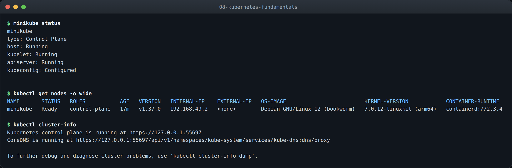
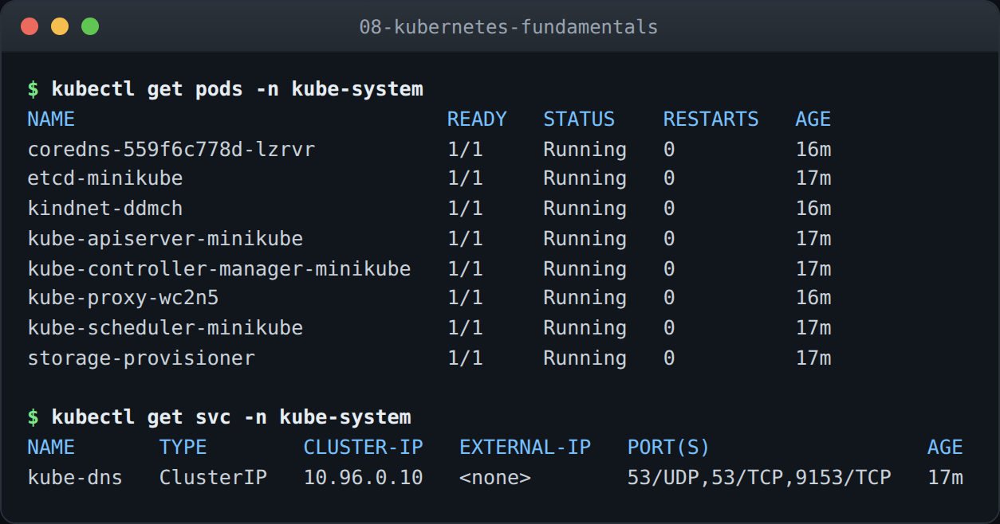

# Kubernetes Fundamentals

**Name:** Abdur Rahman Ibne Munir
**Enrollment number:** 24BCS10244

A single-node Kubernetes cluster running locally with minikube, and what each piece of it
actually does. Every command output below was run on my machine and pasted in.

The images in each folder are rendered from the terminal transcripts captured during
these runs — same text as the blocks below, just easier to scan.

## Environment

| | |
|---|---|
| Host | macOS (Darwin 27.0), Apple Silicon (arm64) |
| minikube | v1.39.0 |
| Driver | `docker` (Docker Desktop) |
| Kubernetes | v1.37.0 |
| Container runtime | containerd 2.3.4 |
| Node OS | Debian GNU/Linux 12 (bookworm), kernel 7.0.12-linuxkit |

---

## 1. Starting the cluster

```bash
minikube start --driver=docker
```

minikube supports several drivers — `hyperkit`, `virtualbox`, `qemu`, `docker`. The
`docker` driver runs the entire Kubernetes node as a **container** on Docker Desktop
rather than booting a separate virtual machine. It starts faster and uses less memory,
and on Apple Silicon it avoids a second layer of virtualisation.

The trade-off shows up later. The node ends up with an address on a Docker-internal
network that macOS has no route to, which is why sections 10 and 11 reach services through
`kubectl port-forward` instead of the node IP. That is a property of this driver, not of
Kubernetes.

```text
$ minikube status
minikube
type: Control Plane
host: Running
kubelet: Running
apiserver: Running
kubeconfig: Configured
```

Four separate checks, and it is worth reading them as four rather than as one "it works":

- **host** — the container running the node is up
- **kubelet** — the agent on the node that actually starts and stops containers
- **apiserver** — the front door; every `kubectl` command is an HTTPS call to it
- **kubeconfig** — my local `~/.kube/config` is pointed at this cluster

That last one is a client-side check, not a cluster one. `kubeconfig: Configured` means my
laptop knows where the cluster is and holds credentials for it. A cluster can be perfectly
healthy while `kubectl` fails because the context is pointed somewhere else.

```text
$ kubectl get nodes -o wide
NAME       STATUS   ROLES           AGE   VERSION   INTERNAL-IP    EXTERNAL-IP   OS-IMAGE                         KERNEL-VERSION            CONTAINER-RUNTIME
minikube   Ready    control-plane   17m   v1.37.0   192.168.49.2   <none>        Debian GNU/Linux 12 (bookworm)   7.0.12-linuxkit (arm64)   containerd://2.3.4
```

One node carrying the `control-plane` role, and no separate workers — so the control plane
and my workloads share a machine. A production cluster separates them, and control-plane
nodes usually carry a taint that keeps ordinary pods off. minikube removes that taint,
which is the only reason anything I deploy in later sections gets scheduled at all.

`EXTERNAL-IP` is `<none>`: nothing outside the Docker network can reach this node directly.

The runtime is `containerd://`, not `docker://`. Docker Desktop provides the *machine*;
containerd runs the containers inside it. Kubernetes removed its built-in Docker support in
v1.24, and containerd is what most clusters use now — Docker itself has used containerd
under the hood for years, so this removed a translation layer rather than a feature.

```text
$ kubectl cluster-info
Kubernetes control plane is running at https://127.0.0.1:55697
CoreDNS is running at https://127.0.0.1:55697/api/v1/namespaces/kube-system/services/kube-dns:dns/proxy
```

The API server answers on `127.0.0.1:55697` — a random high port Docker forwarded from the
node container to my Mac. That forwarded port is the only reason `kubectl` works from the
host at all. Note the port is not 6443, the usual API server port; that is the port
*inside* the node, and Docker published it to a free one outside.



### What I understood

The word "cluster" hides how many separate things have to line up. The node container has
to be running, the kubelet inside it has to be up, the API server has to be serving, and my
laptop has to hold a valid context pointing at a forwarded port. `minikube status` checks
all four precisely because any one of them failing looks identical from `kubectl` — a
timeout.

The driver choice is not cosmetic either. Picking `docker` bought me a faster start and
cost me direct network access to the node, and that single decision is behind every
port-forward in the two sections that follow.

---

## 2. Control plane components

```text
$ kubectl get pods -n kube-system
NAME                               READY   STATUS    RESTARTS   AGE
coredns-559f6c778d-lzrvr           1/1     Running   0          16m
etcd-minikube                      1/1     Running   0          17m
kindnet-ddmch                      1/1     Running   0          16m
kube-apiserver-minikube            1/1     Running   0          17m
kube-controller-manager-minikube   1/1     Running   0          17m
kube-proxy-wc2n5                   1/1     Running   0          16m
kube-scheduler-minikube            1/1     Running   0          17m
storage-provisioner                1/1     Running   0          17m
```

Kubernetes runs its own control plane as pods on the cluster it manages.

| Pod | Role | Scope |
|---|---|---|
| `kube-apiserver` | the only component that talks to etcd; everything else talks to it | control plane |
| `etcd` | key-value store holding the entire cluster state | control plane |
| `kube-scheduler` | decides which node an unscheduled pod lands on | control plane |
| `kube-controller-manager` | runs the reconcile loops (ReplicaSet, node, endpoints, …) | control plane |
| `kube-proxy` | programs iptables on each node so Service IPs route to pods | per node |
| `coredns` | in-cluster DNS; resolves Service names | add-on |
| `kindnet` | the CNI plugin; gives every pod an IP and connects them | add-on |
| `storage-provisioner` | fulfils PersistentVolumeClaims on minikube | add-on |

The split that took me a moment to see: the first four are the **control plane** and exist
once per cluster. `kube-proxy` and `kindnet` are **per-node** — on a multi-node cluster
there would be one of each on every worker, scheduled by a DaemonSet. Here there is one
node, so there is one of everything, and the distinction is invisible unless you look for it.

The names give it away, though. `etcd-minikube`, `kube-apiserver-minikube` — the node name
is appended, because these are *static pods*, defined by manifest files on the node's disk
rather than by anything in the API. `coredns-559f6c778d-lzrvr` and `kindnet-ddmch` have
random suffixes, because those are ordinary pods created by a Deployment and a DaemonSet.

That difference exists to solve a bootstrapping problem. The API server cannot be created
through the API server. So the kubelet reads `/etc/kubernetes/manifests/` at start-up and
runs whatever it finds there directly, no scheduler and no API involved.

### The path a command actually takes

Putting the table together, `kubectl apply -f pod.yml` in the next section does this:

1. `kubectl` sends an HTTPS request to the **API server** at `127.0.0.1:55697`
2. the API server authenticates it, validates the object, and writes it to **etcd**
3. the **scheduler** notices a pod with no node assigned and picks one — here, the only one
4. the **kubelet** on that node sees a pod assigned to it and asks **containerd** to start it
5. **kindnet** gives the container an IP on the pod network
6. `kubectl get pods` reads the result back out through the API server

Nothing in that chain talks to anything else directly. Every component watches the API
server and reacts. That is why the control plane can lose a component and keep working in
a degraded way — kill the scheduler and existing pods keep running, new ones just sit
`Pending`.

```text
$ kubectl get svc -n kube-system
NAME       TYPE        CLUSTER-IP   EXTERNAL-IP   PORT(S)                  AGE
kube-dns   ClusterIP   10.96.0.10   <none>        53/UDP,53/TCP,9153/TCP   17m
```

`10.96.0.10` is the DNS server every pod in this cluster is configured to use. It shows up
again in sections 10 and 11 — every `nslookup` in those transcripts is answered by this
address. The Service is called `kube-dns` for backwards compatibility even though CoreDNS
is what is actually running behind it; the name outlived the implementation.

Port 53 is exposed on both UDP and TCP. DNS uses UDP normally and falls back to TCP when a
response is too large for a single datagram — which is exactly what happens with the
headless Service in section 10, where one lookup returns three A records.



### What I understood

Running the control plane as pods looks circular at first, but the payoff is that one set
of mechanisms manages everything. Health checks, restarts, resource limits and logging work
the same for `etcd` as for my nginx pods, and `kubectl logs -n kube-system` debugs the
platform the same way it debugs an app. Static pods are the escape hatch that makes the
circularity resolvable.

The other thing that landed is that Kubernetes is built out of independent reconcile loops,
not a central orchestrator. Each controller watches for a gap between declared and actual
state and closes it. I say "three replicas", the ReplicaSet controller counts two, it
creates one. Nobody issues commands. That is why the ReplicaSet in the next section heals
itself without anything being told to do so, and why a dead scheduler degrades the cluster
instead of breaking it.

---

## Notes

**`Ready` is not immediate.** Straight after `minikube start` the node reported `NotReady`.
It only flipped to `Ready` once the CNI plugin — `kindnet` here — was up and the node could
hand out pod IPs. A node with no working pod network is correctly considered not ready,
because any pod scheduled onto it would have nowhere to attach.

**Add-ons are not part of Kubernetes.** `storage-provisioner` and the ingress controller
enabled in section 11 are minikube conveniences, installed with `minikube addons enable`.
On a real cluster somebody installs an equivalent deliberately — an EBS CSI driver, an
ingress-nginx Helm chart. Treating them as built in is a habit that breaks the first time
you touch a production cluster and find `Ingress` objects that route nothing.

**Reproducing this section.**

```bash
minikube start --driver=docker
minikube status
kubectl get nodes -o wide
kubectl cluster-info
kubectl get pods -n kube-system
kubectl get svc -n kube-system
```
