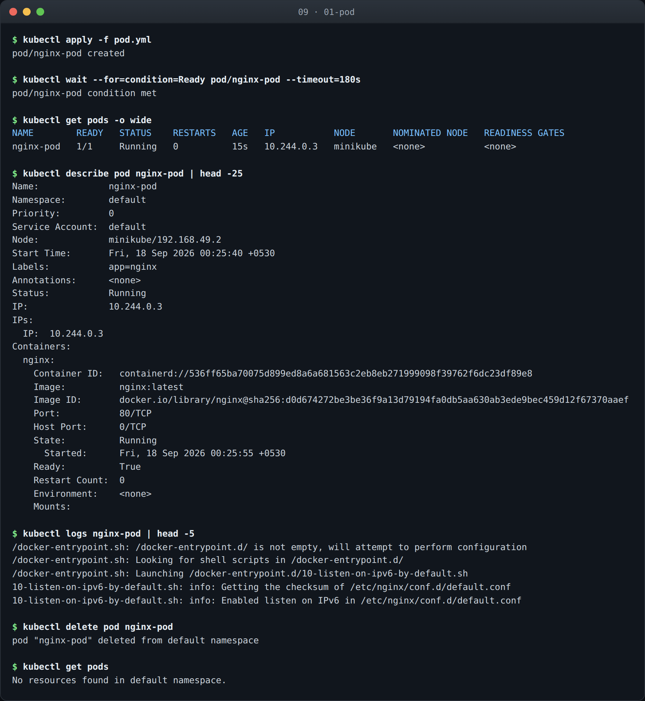
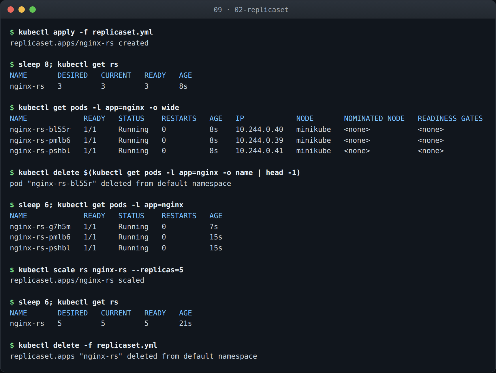
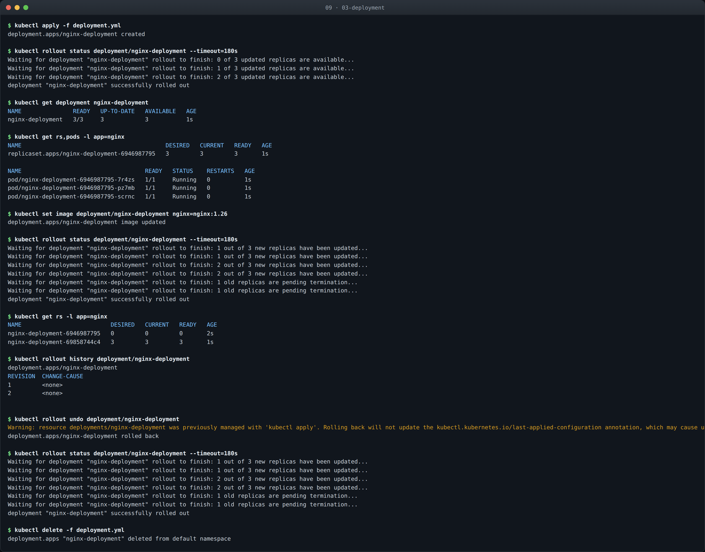

# Kubernetes Pods, ReplicaSets and Deployments

**Name:** Abdur Rahman Ibne Munir
**Enrollment number:** 24BCS10244

The three core workload objects, built up in order: a bare Pod, then a ReplicaSet that
keeps a set of Pods alive, then a Deployment that manages ReplicaSets for you.

> **Status:** in progress. Manifests, output blocks and screenshots below are placeholders.

## Folder structure

```text
09-kubernetes-pods-replicasets-deployments/
├── 01-pod/
├── 02-replicaset/
├── 03-deployment/
└── README.md
```

## All three at a glance

| # | Object | Manages | Survives a pod delete | Rolling updates |
|---|---|---|---|---|
| 1 | Pod | one set of containers | no | no |
| 2 | ReplicaSet | a fixed number of identical Pods | yes | no |
| 3 | Deployment | ReplicaSets | yes | yes |

---

## 1. Pod

_Pending._



## 2. ReplicaSet

_Pending._



## 3. Deployment

_Pending._


