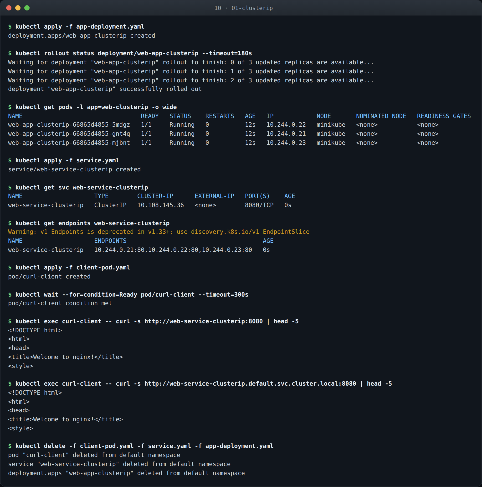
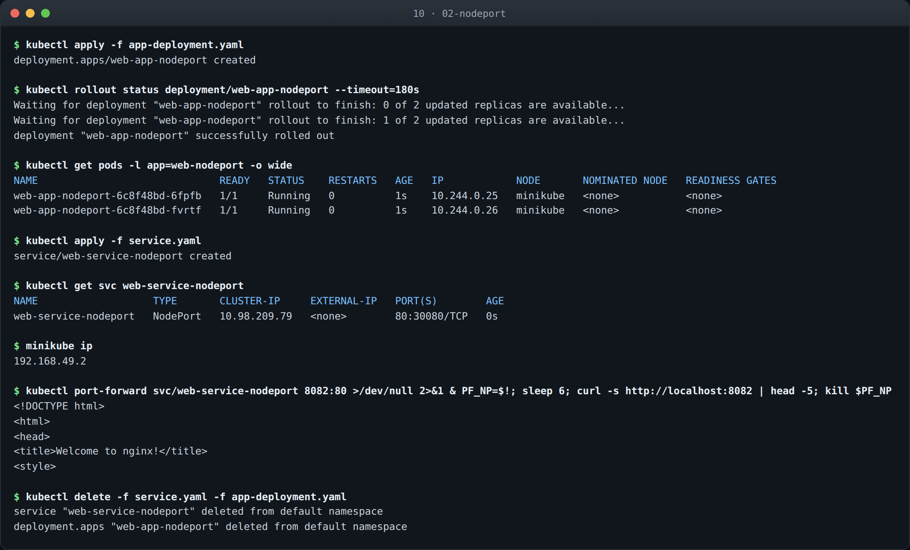
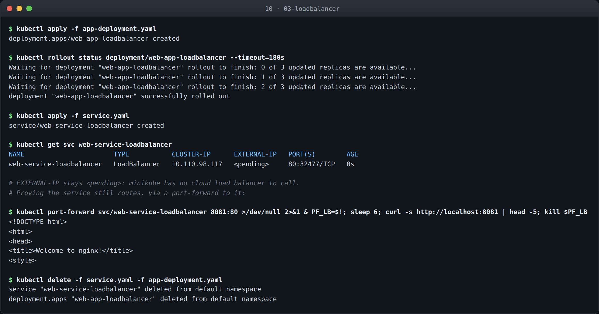
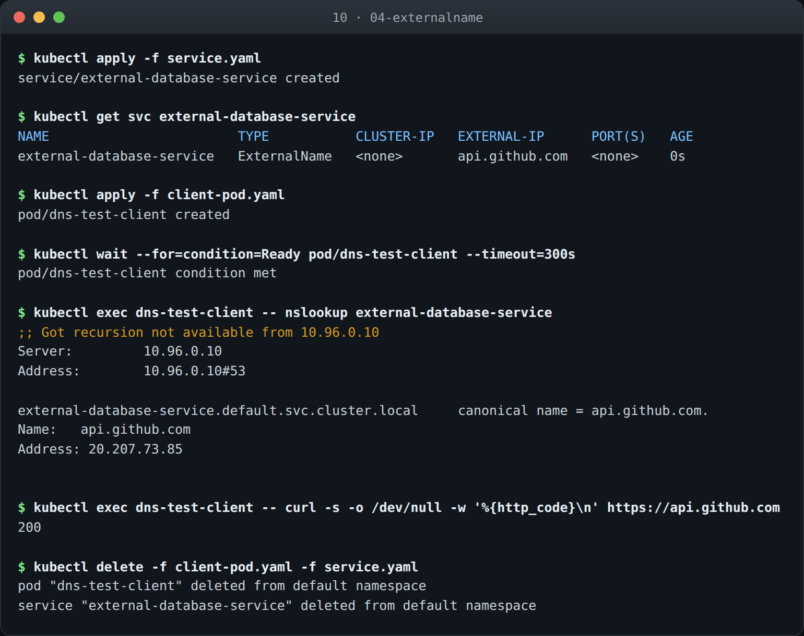
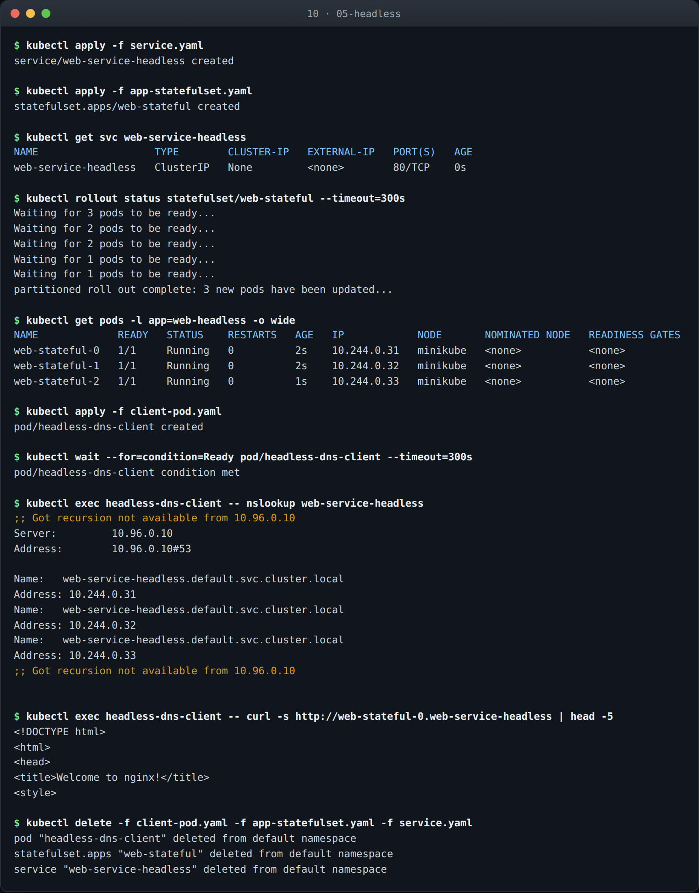

# Kubernetes Networking & Services

**Name:** Abdur Rahman Ibne Munir
**Enrollment number:** 24BCS10244

The five Service types, each backed by the same kind of nginx workload so the only thing
that changes between them is how traffic reaches the pods. Every command output below was
run on my machine and pasted in.

The images in each folder are rendered from the terminal transcripts captured during
these runs — same text as the blocks below, just easier to scan.

## Folder structure

```text
10-kubernetes-networking-services/
├── 01-clusterip/      app-deployment.yaml  service.yaml  client-pod.yaml
├── 02-nodeport/       app-deployment.yaml  service.yaml
├── 03-loadbalancer/   app-deployment.yaml  service.yaml
├── 04-externalname/   service.yaml         client-pod.yaml
├── 05-headless/       app-statefulset.yaml service.yaml  client-pod.yaml
└── README.md

Each subsection folder also holds its `*_24BCS10244.png` terminal capture.
```

## All five at a glance

| # | Type | Reachable from | Virtual IP | DNS returns | Typical use |
|---|---|---|---|---|---|
| 1 | ClusterIP | inside the cluster | `10.108.145.36` | the Service IP | service-to-service calls |
| 2 | NodePort | any node IP, port 30080 | `10.98.209.79` | the Service IP | local or bare-metal access |
| 3 | LoadBalancer | the internet, via a cloud LB | `10.110.98.117` | the Service IP | public traffic |
| 4 | ExternalName | inside the cluster | none | a CNAME | aliasing an external host |
| 5 | Headless | inside the cluster, per-pod | `None` | every pod IP | StatefulSets |

## A note on running these on macOS

The cluster runs on minikube with the `docker` driver, so the node is a container on an
internal Docker network at `192.168.49.2`. macOS has no route to that address, which is why
the reachability tests below use `kubectl port-forward` rather than curling the node IP
directly. The Services themselves behave exactly as they would on a real cluster — it is
only the path from my laptop to the node that differs, and I have called that out in each
section rather than glossing over it.

---

## 1. ClusterIP

The default type. Kubernetes allocates a stable virtual IP that only exists inside the
cluster, and load-balances across whichever pods currently match the selector.

```yaml
spec:
  type: ClusterIP
  selector:
    app: web-clusterip
  ports:
    - name: http
      port: 8080        # the port the Service exposes
      targetPort: 80    # the port nginx listens on
```

```text
$ kubectl get pods -l app=web-clusterip -o wide
NAME                                 READY   STATUS    RESTARTS   AGE   IP            NODE
web-app-clusterip-66865d4855-5mdgz   1/1     Running   0          12s   10.244.0.22   minikube
web-app-clusterip-66865d4855-gnt4q   1/1     Running   0          12s   10.244.0.21   minikube
web-app-clusterip-66865d4855-mjbnt   1/1     Running   0          12s   10.244.0.23   minikube

$ kubectl get svc web-service-clusterip
NAME                    TYPE        CLUSTER-IP      EXTERNAL-IP   PORT(S)    AGE
web-service-clusterip   ClusterIP   10.108.145.36   <none>        8080/TCP   0s

$ kubectl get endpoints web-service-clusterip
NAME                    ENDPOINTS                                      AGE
web-service-clusterip   10.244.0.21:80,10.244.0.22:80,10.244.0.23:80   0s
```

The endpoints line is the one to read closely. The Service found all three pod IPs and
bound to them on port 80 — the `targetPort`, not the `port`. If this list ever comes back
empty, the selector does not match the pod labels, and that is the single most common
reason a Service appears to do nothing.

`kubectl` also warned that `v1 Endpoints` is deprecated in favour of
`discovery.k8s.io/v1 EndpointSlice` — the newer API scales better on large clusters, where
one Endpoints object listing thousands of IPs became a bottleneck.

Testing from inside the cluster, using a `nicolaka/netshoot` pod:

```text
$ kubectl exec curl-client -- curl -s http://web-service-clusterip:8080 | head -5
<!DOCTYPE html>
<html>
<head>
<title>Welcome to nginx!</title>

$ kubectl exec curl-client -- curl -s http://web-service-clusterip.default.svc.cluster.local:8080 | head -5
<!DOCTYPE html>
<html>
<head>
<title>Welcome to nginx!</title>
```

Both forms work. The short name resolves because pods get a search domain of
`default.svc.cluster.local`; the long form is the fully qualified name and is what you want
when calling across namespaces.



### What I understood

The endpoints list is the Service. Everything else — the virtual IP, the DNS name — is
stable packaging around that list, and the list is rebuilt continuously from whatever pods
currently match the selector. When a Service "doesn't work", `kubectl get endpoints` tells
you in one line whether it is a routing problem or a labelling problem, and it is almost
always labelling.

The `port` / `targetPort` split confused me until I saw the endpoints bound to `:80` rather
than `:8080`. `port` is what callers dial on the Service; `targetPort` is what the container
listens on. They are independent on purpose, so the Service can present a tidy port without
the application changing.

---

## 2. NodePort

Opens the same port on every node in the cluster and forwards it to the Service.

```yaml
spec:
  type: NodePort
  ports:
    - port: 80
      targetPort: 80
      nodePort: 30080
```

```text
$ kubectl get svc web-service-nodeport
NAME                   TYPE       CLUSTER-IP     EXTERNAL-IP   PORT(S)        AGE
web-service-nodeport   NodePort   10.98.209.79   <none>        80:30080/TCP   0s

$ minikube ip
192.168.49.2
```

`80:30080/TCP` means port 80 inside the cluster, 30080 on the node. A NodePort is a
ClusterIP *plus* a node-level port — it does not replace the virtual IP, it adds a way in.

`30080` sits inside the default 30000–32767 range. Kubernetes reserves that band so a
NodePort cannot collide with a normal service port like 80 or 443 already bound on the host.

The node's address is `192.168.49.2`, which is inside Docker's network and not routable
from macOS, so the reachability check goes through a forwarded port instead:

```text
$ kubectl port-forward svc/web-service-nodeport 8082:80 & sleep 6; curl -s http://localhost:8082 | head -5
<!DOCTYPE html>
<html>
<head>
<title>Welcome to nginx!</title>
```

On a bare-metal or cloud cluster, `curl http://<node-ip>:30080` would have worked directly.
`minikube service web-service-nodeport --url` is the other way to get a usable address — it
opens the same kind of tunnel.



### What I understood

A NodePort does not replace the ClusterIP, it adds to it — the output still shows
`10.98.209.79` alongside `80:30080/TCP`. That is the first hint that these types are layered
rather than alternatives.

The 30000–32767 range is a deliberate reservation so a NodePort can never collide with a
normal service port already bound on the host. The cost is ugly URLs, and the deeper problem
is that the port is opened on *every* node, so in front of a real cluster you still need
something to spread traffic across them. That is the gap LoadBalancer fills.

---

## 3. LoadBalancer

Asks the underlying infrastructure for an external load balancer and points it at the
Service.

```text
$ kubectl get svc web-service-loadbalancer
NAME                       TYPE           CLUSTER-IP      EXTERNAL-IP   PORT(S)        AGE
web-service-loadbalancer   LoadBalancer   10.110.98.117   <pending>     80:32477/TCP   0s
```

`EXTERNAL-IP` is `<pending>`, and it will stay that way. A LoadBalancer Service is a
*request* to a cloud provider's controller — on EKS it provisions an ELB, on GKE a Google
load balancer. minikube has nobody to ask, so the request is never fulfilled. It is not an
error; it is the honest state of a cloud-dependent object on a local cluster.

Note that it still allocated `32477` as a node port. A LoadBalancer is layered on top of
NodePort, which is layered on ClusterIP — each type builds on the one before it.

The Service still routes correctly, which the port-forward shows:

```text
$ kubectl port-forward svc/web-service-loadbalancer 8081:80 & sleep 6; curl -s http://localhost:8081 | head -5
<!DOCTYPE html>
<html>
<head>
<title>Welcome to nginx!</title>
```

`minikube tunnel` is the other option — it runs a process that assigns the pending external
IP and routes to it, but it needs root because it binds privileged ports.



### What I understood

`<pending>` is not a failure, it is an unanswered request. A LoadBalancer Service asks the
infrastructure for an external address; on EKS a controller provisions an ELB and writes the
address back, and on minikube there is nobody listening. Seeing it stay pending made the
type make more sense than it would have on a cloud cluster, where it just works and the
mechanism stays hidden.

The node port it still allocated — `32477` — confirms the layering: LoadBalancer is
NodePort plus an external address, and NodePort is ClusterIP plus a node-level port. Three
types, one object, each adding a way in.

---

## 4. ExternalName

The odd one out: no selector, no pods, no virtual IP. It is a DNS alias that lets in-cluster
code use a stable internal name for something that lives outside.

```yaml
spec:
  type: ExternalName
  externalName: api.github.com
```

```text
$ kubectl get svc external-database-service
NAME                        TYPE           CLUSTER-IP   EXTERNAL-IP      PORT(S)   AGE
external-database-service   ExternalName   <none>       api.github.com   <none>    0s
```

`CLUSTER-IP` is `<none>` and `PORT(S)` is `<none>` — there is nothing to load-balance and
no port to map, because this Service never handles traffic.

```text
$ kubectl exec dns-test-client -- nslookup external-database-service
Server:		10.96.0.10
Address:	10.96.0.10#53

external-database-service.default.svc.cluster.local	canonical name = api.github.com.
Name:	api.github.com
Address: 20.207.73.85

$ kubectl exec dns-test-client -- curl -s -o /dev/null -w '%{http_code}\n' https://api.github.com
200
```

CoreDNS returned a **CNAME**, not an A record — the request is handed off to normal DNS from
there, which resolved `api.github.com` to `20.207.73.85`. The traffic never passes through
kube-proxy at all.

The practical use: point `database-service` at an RDS hostname in production and at a
container in staging, and the application code stays identical. The catch is that TLS and
`Host` headers still see the *real* name, so an ExternalName in front of an HTTPS endpoint
needs the certificate to match the target, not the alias.



### What I understood

This is the one type that never touches kube-proxy. There is no virtual IP and no endpoints
list, so no traffic passes through the Service at all — CoreDNS answers with a CNAME and the
pod resolves the real name itself. `CLUSTER-IP: <none>` and `PORT(S): <none>` in the output
are the tell.

The practical value is that the same application code can point at `database-service` and
have it mean RDS in production and an in-cluster container in staging. The catch I would not
have predicted is that TLS and `Host` headers still see the *real* hostname — the alias is
only a DNS indirection, so a certificate has to match the target, not the name the app uses.

---

## 5. Headless

Set `clusterIP: None` and Kubernetes skips the virtual IP entirely. DNS then returns the
pod addresses themselves.

```yaml
spec:
  clusterIP: None
  selector:
    app: web-headless
```

Backed by a StatefulSet rather than a Deployment, so the pods get stable ordinal names:

```text
$ kubectl get svc web-service-headless
NAME                   TYPE        CLUSTER-IP   EXTERNAL-IP   PORT(S)   AGE
web-service-headless   ClusterIP   None         <none>        80/TCP    0s

$ kubectl rollout status statefulset/web-stateful
Waiting for 3 pods to be ready...
Waiting for 2 pods to be ready...
Waiting for 1 pods to be ready...
partitioned roll out complete: 3 new pods have been updated...

$ kubectl get pods -l app=web-headless -o wide
NAME             READY   STATUS    RESTARTS   AGE   IP            NODE
web-stateful-0   1/1     Running   0          2s    10.244.0.31   minikube
web-stateful-1   1/1     Running   0          2s    10.244.0.32   minikube
web-stateful-2   1/1     Running   0          1s    10.244.0.33   minikube
```

`web-stateful-0`, `-1`, `-2` — predictable names, created in order, unlike the random
suffixes a Deployment hands out. The rollout output counts down one pod at a time because a
StatefulSet starts them sequentially rather than all at once.

```text
$ kubectl exec headless-dns-client -- nslookup web-service-headless
Server:		10.96.0.10
Address:	10.96.0.10#53

Name:	web-service-headless.default.svc.cluster.local
Address: 10.244.0.31
Name:	web-service-headless.default.svc.cluster.local
Address: 10.244.0.32
Name:	web-service-headless.default.svc.cluster.local
Address: 10.244.0.33
```

Three A records, one per pod — compare that with ClusterIP, where the same lookup returned
a single virtual IP. The client now sees the individual backends and decides for itself
which to talk to.

Each pod is also individually addressable:

```text
$ kubectl exec headless-dns-client -- curl -s http://web-stateful-0.web-service-headless | head -5
<!DOCTYPE html>
<html>
<head>
<title>Welcome to nginx!</title>
```

`<pod-name>.<service-name>` resolves to one specific pod. That is what makes headless
Services the right fit for databases and message brokers: a Postgres replica needs to reach
the *primary*, not "whichever node the load balancer picked."



### What I understood

Setting `clusterIP: None` inverts the whole model. Instead of hiding three pods behind one
address, DNS hands back all three and the client chooses. That is useless for stateless web
servers and essential for anything stateful: a Postgres replica needs to reach *the primary*,
not whichever backend a load balancer happened to pick.

The StatefulSet is what makes that addressable. `web-stateful-0/-1/-2` are stable, ordered
names, created one at a time — visible in the rollout output counting down — where a
Deployment would have produced three random suffixes in parallel. Combining stable names
with per-pod DNS gives `web-stateful-0.web-service-headless`, an address that survives the
pod being rescheduled.

---

## Notes

**The types are layered, not parallel.** ClusterIP is the base. NodePort is ClusterIP plus a
port on every node. LoadBalancer is NodePort plus a cloud load balancer pointed at it. That
is visible in the output above — the LoadBalancer Service still shows a ClusterIP *and* a
node port. ExternalName and Headless sit outside that stack; neither allocates a virtual IP.

**Everything hinges on labels.** Every Service except ExternalName finds its pods with a
selector. Whenever a Service returns nothing, `kubectl get endpoints <name>` is the first
command to run: empty endpoints means the selector and the pod labels disagree.

**Reproducing this section.** Each folder is self-contained:

```bash
cd 01-clusterip
kubectl apply -f app-deployment.yaml -f service.yaml -f client-pod.yaml
# ...
kubectl delete -f client-pod.yaml -f service.yaml -f app-deployment.yaml
```
