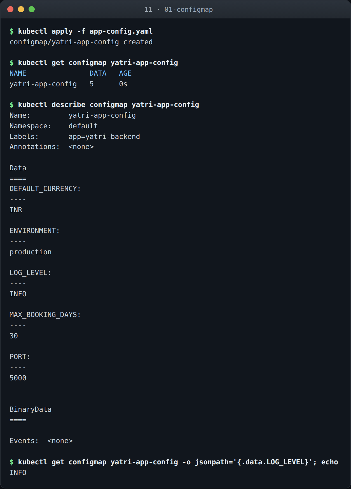
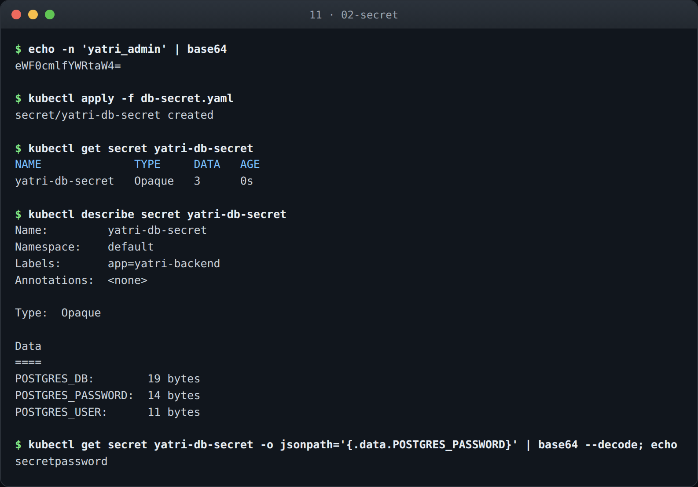
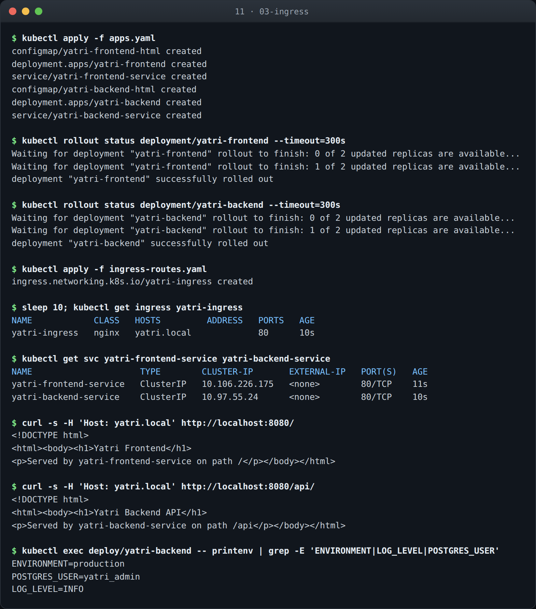

# Kubernetes Ingress, ConfigMaps and Secrets

**Name:** Abdur Rahman Ibne Munir
**Enrollment number:** 24BCS10244

Configuration and routing for a two-service app: non-sensitive settings in a ConfigMap,
credentials in a Secret, and one NGINX Ingress putting both services behind a single entry
point. Every command output below was run on my machine and pasted in.

The images in each folder are rendered from the terminal transcripts captured during
these runs — same text as the blocks below, just easier to scan.

Every credential in these manifests is a lab placeholder, not a real secret.

## Folder structure

```text
11-kubernetes-ingress-configmaps-secrets/
├── 01-configmap/   app-config.yaml       configmap_24BCS10244.png
├── 02-secret/      db-secret.yaml        secret_24BCS10244.png
├── 03-ingress/     apps.yaml  ingress-routes.yaml  ingress_24BCS10244.png
└── README.md
```

## All three at a glance

| # | Object | Holds | Reaches the pod as | Encoded |
|---|---|---|---|---|
| 1 | ConfigMap | environment, log level, port | env vars or a mounted file | no |
| 2 | Secret | database user, password, db name | env vars or a mounted file | base64 |
| 3 | Ingress | host and path routing rules | handled by the controller | n/a |

The three build on each other: section 3 deploys a frontend and a backend, injects the
ConfigMap and Secret from sections 1 and 2 into the backend, and routes to both through one
Ingress.

---

## 1. ConfigMap

```yaml
apiVersion: v1
kind: ConfigMap
metadata:
  name: yatri-app-config
  labels:
    app: yatri-backend
data:
  ENVIRONMENT: "production"
  LOG_LEVEL: "INFO"
  PORT: "5000"
  DEFAULT_CURRENCY: "INR"
  MAX_BOOKING_DAYS: "30"
```

```text
$ kubectl get configmap yatri-app-config
NAME               DATA   AGE
yatri-app-config   5      0s

$ kubectl describe configmap yatri-app-config
Name:         yatri-app-config
Namespace:    default
Labels:       app=yatri-backend

Data
====
DEFAULT_CURRENCY:
----
INR

ENVIRONMENT:
----
production

LOG_LEVEL:
----
INFO

MAX_BOOKING_DAYS:
----
30

PORT:
----
5000

BinaryData
====

Events:  <none>
```

`describe` prints every value in full, in plain text. That is the defining difference from a
Secret, and it is deliberate — there is nothing here worth hiding.

Note the values are all quoted in the YAML. `PORT: 5000` unquoted would be parsed as an
integer and rejected: a ConfigMap's `data` map must be string to string. `MAX_BOOKING_DAYS`
has the same issue, and `"true"`/`"false"` catch people out the same way.

A single key can be pulled out directly, which is handy in scripts:

```text
$ kubectl get configmap yatri-app-config -o jsonpath='{.data.LOG_LEVEL}'
INFO
```



### What I understood

A ConfigMap is deliberately transparent — `describe` prints every value in full, because
there is nothing here worth hiding. That is the cleanest way to see the difference from a
Secret, which prints byte counts instead.

The typing rule caught me out in the manifest: `data` is a string-to-string map, so
`PORT: 5000` unquoted is parsed as an integer and rejected. Same for `MAX_BOOKING_DAYS`, and
`true`/`false` bite people the same way. Quoting everything under `data:` is the habit.

---

## 2. Secret

```yaml
apiVersion: v1
kind: Secret
metadata:
  name: yatri-db-secret
type: Opaque
data:
  POSTGRES_USER: eWF0cmlfYWRtaW4=
  POSTGRES_PASSWORD: c2VjcmV0cGFzc3dvcmQ=
  POSTGRES_DB: eWF0cmlfcHJvZHVjdGlvbl9kYg==
```

Values under `data:` must be base64:

```text
$ echo -n 'yatri_admin' | base64
eWF0cmlfYWRtaW4=
```

`-n` matters. Without it `echo` appends a newline, the newline gets encoded along with the
value, and the application ends up authenticating with `yatri_admin\n` — which fails with a
completely unhelpful error. (`stringData:` avoids the whole problem by letting you write
plain text and having Kubernetes encode it.)

```text
$ kubectl get secret yatri-db-secret
NAME              TYPE     DATA   AGE
yatri-db-secret   Opaque   3      0s

$ kubectl describe secret yatri-db-secret
Name:         yatri-db-secret
Namespace:    default
Type:  Opaque

Data
====
POSTGRES_DB:        19 bytes
POSTGRES_PASSWORD:  14 bytes
POSTGRES_USER:      11 bytes
```

`describe` shows byte counts instead of values — the one place Kubernetes treats Secrets
differently from ConfigMaps in its tooling.

That protection is shallow, though:

```text
$ kubectl get secret yatri-db-secret -o jsonpath='{.data.POSTGRES_PASSWORD}' | base64 --decode
secretpassword
```

One command and the password is on screen. **Base64 is encoding, not encryption.** Anyone
with `get secret` permission can read every value, and by default etcd stores them
unencrypted at rest. What actually protects a Secret is RBAC — restricting who can read it
— plus encryption at rest on etcd, and in production an external manager like Vault or AWS
Secrets Manager with the values never committed to git at all.

`type: Opaque` just means arbitrary key-value data. The other types are specialised:
`kubernetes.io/tls` for certificates, `kubernetes.io/dockerconfigjson` for registry
credentials.



### What I understood

Base64 is encoding, not encryption, and I could prove it in one command — `base64 --decode`
put the password on screen. `describe` hiding the values is a courtesy so you don't leak
them into a terminal recording, not a security control.

What actually protects a Secret is RBAC deciding who may run `get secret` at all, plus
encryption at rest on etcd, and in production an external manager like Vault with the values
never committed to git. Storing a Secret manifest in a repository is barely different from
storing the password in plain text, which is worth being honest about given this file is in
a public repo — hence the placeholder credentials.

---

## 3. Ingress

A Service gets you one entry point per service. An Ingress gets you **one entry point for
all of them**, with routing by host and path — and on a cloud provider, one load balancer
bill instead of five.

An Ingress resource is only a set of rules; something has to enforce them. On minikube:

```bash
minikube addons enable ingress
```

### The routing rules

```yaml
apiVersion: networking.k8s.io/v1
kind: Ingress
metadata:
  name: yatri-ingress
  annotations:
    nginx.ingress.kubernetes.io/ssl-redirect: "false"
    nginx.ingress.kubernetes.io/use-regex: "true"
    nginx.ingress.kubernetes.io/rewrite-target: /$2
spec:
  ingressClassName: nginx
  rules:
    - host: yatri.local
      http:
        paths:
          - path: /api(/|$)(.*)
            pathType: ImplementationSpecific
            backend:
              service:
                name: yatri-backend-service
                port:
                  number: 80
          - path: /
            pathType: Prefix
            backend:
              service:
                name: yatri-frontend-service
                port:
                  number: 80
```

`rewrite-target: /$2` pairs with the capture groups in `/api(/|$)(.*)`. Without it a request
for `/api/health` would arrive at the backend still spelled `/api/health`, and the backend —
which knows nothing about the `/api` prefix — would return 404. `$2` is the part after
`/api`, so the backend receives `/health`. This is the single most common reason a
path-based Ingress returns 404 when everything else looks right.

Both backends are ClusterIP Services. They are deliberately *not* exposed individually — the
Ingress is the only way in, which is the point.

```text
$ kubectl get ingress yatri-ingress
NAME            CLASS   HOSTS         ADDRESS   PORTS   AGE
yatri-ingress   nginx   yatri.local             80      10s

$ kubectl get svc yatri-frontend-service yatri-backend-service
NAME                     TYPE        CLUSTER-IP       EXTERNAL-IP   PORT(S)   AGE
yatri-frontend-service   ClusterIP   10.106.226.175   <none>        80/TCP    11s
yatri-backend-service    ClusterIP   10.97.55.24      <none>        80/TCP    10s
```

### Both routes, one entry point

Reached through a port-forward to the ingress controller, since the node IP is not routable
from macOS (same constraint as section 10). The `Host` header stands in for a DNS entry for
`yatri.local`:

```text
$ curl -s -H 'Host: yatri.local' http://localhost:8080/
<!DOCTYPE html>
<html><body><h1>Yatri Frontend</h1>
<p>Served by yatri-frontend-service on path /</p></body></html>

$ curl -s -H 'Host: yatri.local' http://localhost:8080/api/
<!DOCTYPE html>
<html><body><h1>Yatri Backend API</h1>
<p>Served by yatri-backend-service on path /api</p></body></html>
```

Same host, same port, two different backends. The `Host` header is not decoration — remove
it and the controller has no matching rule, because the Ingress is scoped to
`host: yatri.local`.

### Config and secrets reaching the container

The backend Deployment pulls both in with `envFrom`:

```yaml
envFrom:
  - configMapRef:
      name: yatri-app-config
  - secretRef:
      name: yatri-db-secret
```

```text
$ kubectl exec deploy/yatri-backend -- printenv | grep -E 'ENVIRONMENT|LOG_LEVEL|POSTGRES_USER'
ENVIRONMENT=production
POSTGRES_USER=yatri_admin
LOG_LEVEL=INFO
```

This is the part that ties the section together. `ENVIRONMENT` and `LOG_LEVEL` came from the
ConfigMap, `POSTGRES_USER` from the Secret, and inside the container they are ordinary
environment variables — the application cannot tell which came from where, and does not need
to. The Secret arrives already decoded.



### What I understood

The payoff of this section is the last command rather than the routing. `printenv` inside
the backend shows `ENVIRONMENT` and `LOG_LEVEL` from the ConfigMap sitting next to
`POSTGRES_USER` from the Secret, as ordinary environment variables. The container cannot
tell which came from where and does not need to — that indirection is the whole point, and
it is what lets one image run unchanged in dev, staging and production.

On the Ingress itself, `rewrite-target: /$2` is doing more work than it looks. Without it a
request for `/api/health` reaches the backend still spelled `/api/health`, and a backend that
knows nothing about the prefix returns 404 — which looks exactly like a broken Ingress. The
capture groups in `/api(/|$)(.*)` exist purely so `$2` can be the part after `/api`.

The other thing worth stating plainly: an Ingress is not a Service and has no IP of its own.
The path is load balancer → controller pod → ClusterIP Service → pod, and the Ingress object
is only the routing table the controller reads. Deleting the controller leaves the rules in
place and routes nothing.

---

## Notes

**Why split configuration out of the image at all.** The same image has to run in dev,
staging and production. Baking settings in means rebuilding per environment, and then what
you tested is not what you shipped. ConfigMaps and Secrets keep one image and vary only what
is injected at start-up.

**`envFrom` versus volume mounts.** Environment variables are read once at container start,
so changing a ConfigMap does **not** update a running pod — it needs a restart. Mounting a
ConfigMap as a volume does propagate updates, with a delay, which is why config files are
often mounted rather than injected. The frontend and backend here mount their `index.html`
from a ConfigMap for exactly that reason.

**The Ingress is not a Service.** It has no ClusterIP of its own. The traffic path is: load
balancer → ingress controller pod → ClusterIP Service → pod. The Ingress object is just the
routing table the controller reads.

**Reproducing this section.**

```bash
minikube addons enable ingress
kubectl apply -f 01-configmap/app-config.yaml -f 02-secret/db-secret.yaml
kubectl apply -f 03-ingress/apps.yaml -f 03-ingress/ingress-routes.yaml
kubectl port-forward -n ingress-nginx service/ingress-nginx-controller 8080:80
curl -H 'Host: yatri.local' http://localhost:8080/
```
