# Kubernetes Volumes

**Name:** Abdur Rahman Ibne Munir
**Enrollment number:** 24BCS10244

Session 13, Task 1. Covers `emptyDir`, `hostPath`, PersistentVolume, PersistentVolumeClaim,
StorageClass and dynamic provisioning. Every screenshot below is my own terminal, running
against a single-node minikube cluster (docker driver) on my Mac.

## Folder structure

```text
01-kubernetes-volumes/
├── 01-emptydir-hostpath/    emptydir-pod.yaml  hostpath-pod.yaml
├── 02-persistent-storage/   pv.yaml  pvc.yaml  pod.yaml
├── 03-storageclass/         pvc.yaml
└── README.md
```

Each folder has a `screenshots/` directory; the images are referenced in order below.

## The five ideas at a glance

| | What it is | Lives as long as | Data is stored | Good for |
|---|---|---|---|---|
| `emptyDir` | A scratch directory created when the Pod starts | the **Pod** | the node's disk (or RAM with `medium: Memory`) | caches, temp files, sharing files between containers in one Pod |
| `hostPath` | A directory on the node mounted into the Pod | the **node** | a fixed path on that node | node agents, log collectors, local testing |
| PersistentVolume (PV) | A piece of storage registered with the cluster | until it is deleted (independent of any Pod) | whatever backs it: disk, NFS, cloud volume, hostPath | real application data |
| PersistentVolumeClaim (PVC) | A Pod's *request* for storage (size + access mode) | until it is deleted | in the PV it binds to | decoupling apps from storage details |
| StorageClass | A recipe for creating PVs on demand | — | decided by its provisioner | dynamic provisioning: no admin pre-creates PVs |

---

## 1. `emptyDir`: storage that dies with the Pod

```yaml
volumes:
  - name: app-storage
    emptyDir: {}
```

**Create the Pod and check it is running**

```bash
kubectl apply -f emptydir-pod.yaml
kubectl get pods
```


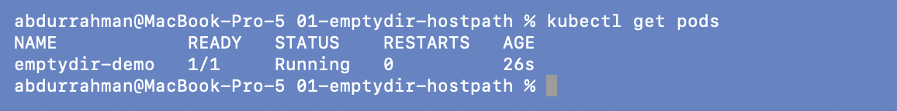

**Write a file into the volume**

```bash
kubectl exec -it emptydir-demo -- bash
echo "Hello Kubernetes" > /data/message.txt
cat /data/message.txt
exit
```

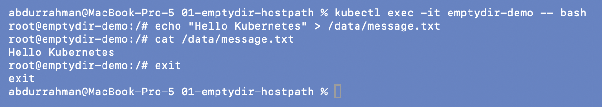

**Inspect the Pod**: the volume is listed as
`EmptyDir (a temporary directory that shares a pod's lifetime)` and mounted at `/data`.

```bash
kubectl describe pod emptydir-demo
```

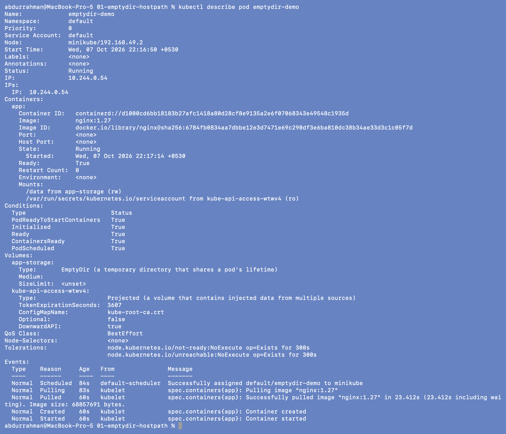

**Delete and recreate the Pod, then look for the file**

```bash
kubectl delete pod emptydir-demo
kubectl apply -f emptydir-pod.yaml
kubectl exec emptydir-demo -- cat /data/message.txt
```

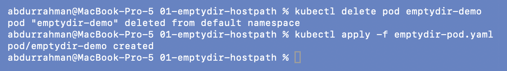
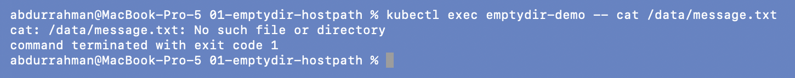

`No such file or directory`: the new Pod got a brand-new, empty `emptyDir`. The data
would have survived a *container* restart inside the same Pod, but not the Pod itself
being deleted.

---

## 2. `hostPath`: storage that lives on the node

The lecture notes only show a snippet for `hostPath`, so I ran the same experiment as
above with `hostpath-pod.yaml` to see the difference.

```yaml
volumes:
  - name: host-storage
    hostPath:
      path: /tmp/hostpath-data
      type: DirectoryOrCreate
```

```bash
kubectl apply -f hostpath-pod.yaml
kubectl exec hostpath-demo -- sh -c 'echo "Written by hostpath-demo" > /data/message.txt'
kubectl exec hostpath-demo -- cat /data/message.txt
```

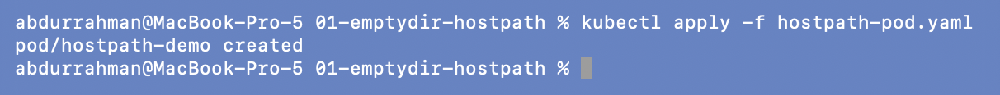
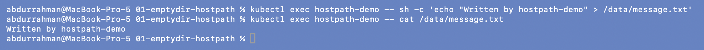

**The file is really on the node.** With the docker driver the "node" is the minikube
container, not my Mac, so I read it over `minikube ssh`:

```bash
minikube ssh -- cat /tmp/hostpath-data/message.txt
```

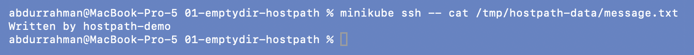

**Delete and recreate the Pod: the data is still there**

```bash
kubectl delete pod hostpath-demo
kubectl apply -f hostpath-pod.yaml
kubectl exec hostpath-demo -- cat /data/message.txt
```

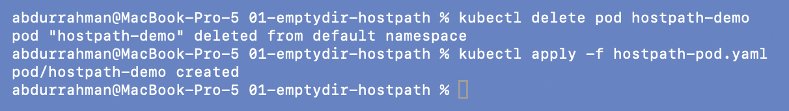
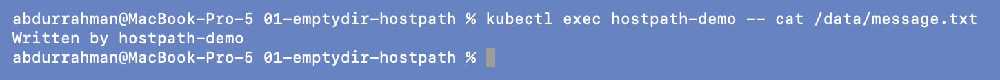

That only works because there is one node. On a multi-node cluster the new Pod could land
on a different node and find an empty directory, which is why `hostPath` is not used for
application data in production. It also gives the Pod access to the node's filesystem,
which is a security concern.

**Cleanup**

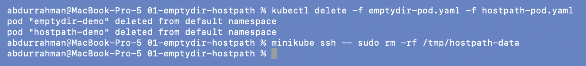

---

## 3. PersistentVolume + PersistentVolumeClaim (static provisioning)

```text
Pod ──uses──▶ PVC (student-pvc, 500Mi) ──binds to──▶ PV (student-pv, 1Gi) ──▶ /tmp/student-data on the node
```

**Create the PV**

```bash
kubectl get pv
kubectl apply -f pv.yaml
kubectl get pv
```


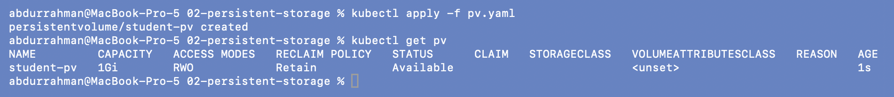

`student-pv` is `Available`: registered, but not claimed by anyone yet.

### Problem found: the PVC from the notes did not bind to `student-pv`

```bash
kubectl apply -f pvc.yaml
kubectl get pvc
kubectl get pv
```

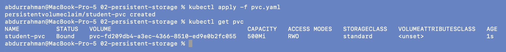
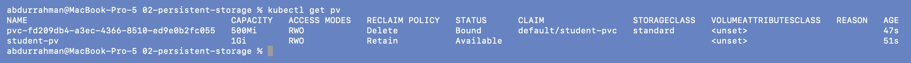

The notes expect `student-pvc  Bound  student-pv`. Instead the claim bound to a new volume
`pvc-fd209db4-…` with STORAGECLASS `standard`, and `student-pv` stayed `Available`.

**Root cause.** The PVC does not set `storageClassName`. minikube has a *default*
StorageClass (`standard`), and Kubernetes fills the default in for any claim that leaves
the field out. A claim with class `standard` can only bind to PVs of class `standard`, and
`student-pv` has no class, so it doesn't match. The `standard` provisioner then created a
fresh volume for the claim.

**Fix.** Set `storageClassName: ""` on the claim. An explicit empty string means "no class,
static binding only", so the claim can only bind to a pre-created PV like `student-pv`.

```bash
kubectl delete -f pvc.yaml
cat pvc.yaml
```

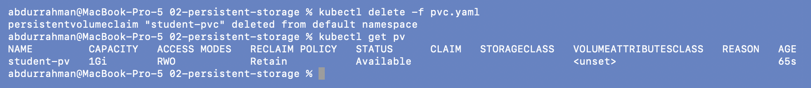
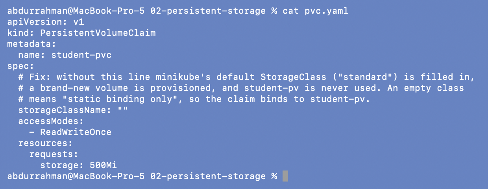

Deleting that claim also deleted the auto-created volume, because dynamic volumes use
reclaim policy `Delete`.

```bash
kubectl apply -f pvc.yaml
kubectl get pvc
kubectl get pv
```

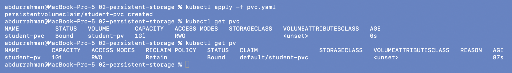

Now `student-pvc` is `Bound` to `student-pv`. Capacity shows **1Gi**, not the 500Mi I
asked for: a claim gets the whole PV it binds to.

```bash
kubectl describe pv student-pv
kubectl describe pvc student-pvc
```

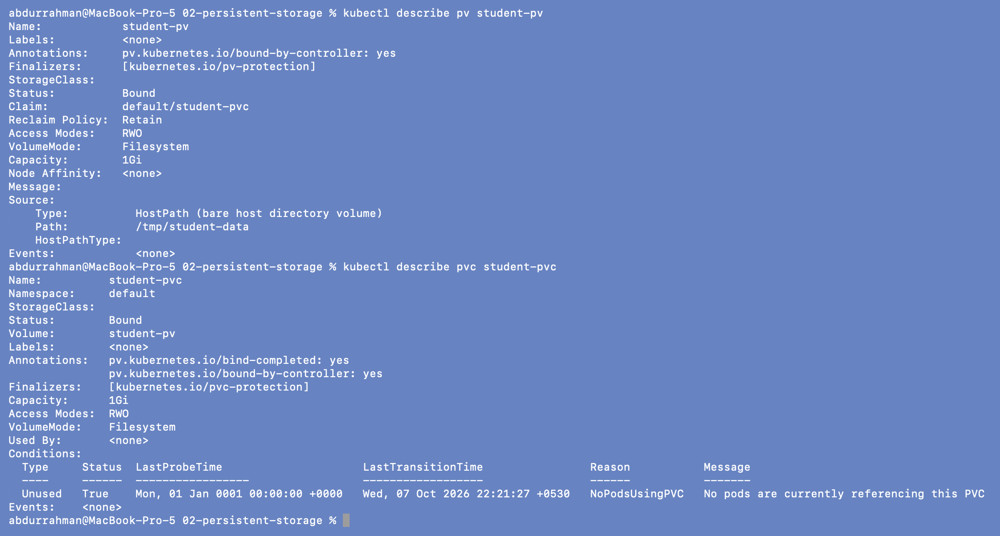

### Data survives the Pod

```bash
kubectl apply -f pod.yaml
kubectl get pods
```

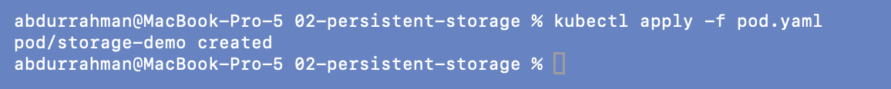
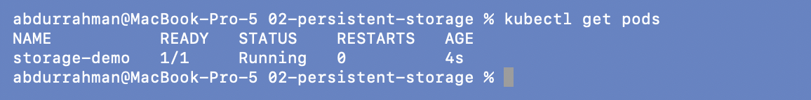

```bash
kubectl exec -it storage-demo -- bash
echo "Kubernetes Storage" > /data/message.txt
cat /data/message.txt
exit
```

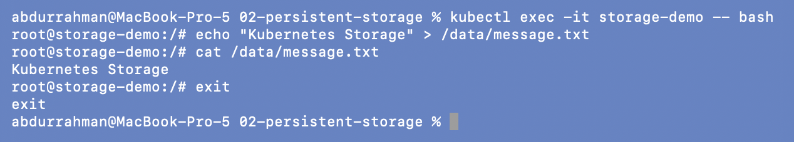

```bash
kubectl delete pod storage-demo
kubectl apply -f pod.yaml
kubectl exec storage-demo -- cat /data/message.txt
minikube ssh -- cat /tmp/student-data/message.txt
```

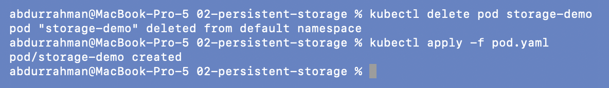
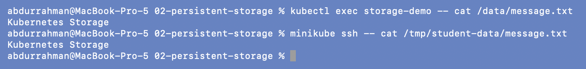

The new Pod reads `Kubernetes Storage`, and the same file is visible at the PV's path on
the node.

### Reclaim policy `Retain`

```bash
kubectl delete -f pod.yaml -f pvc.yaml
kubectl get pv
```

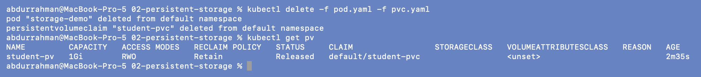

With the claim gone the PV becomes `Released`, not deleted. It still remembers
`default/student-pvc`, so a new claim won't bind to it until an admin cleans it up.
Even after deleting the PV object, the data is still on disk:

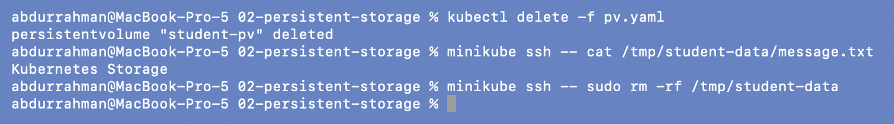

### Access modes

| Mode | Short | Meaning |
|---|---|---|
| ReadWriteOnce | RWO | read-write by Pods on **one node** |
| ReadOnlyMany | ROX | read-only by many nodes |
| ReadWriteMany | RWX | read-write by many nodes (needs NFS/CephFS-type storage) |
| ReadWriteOncePod | RWOP | read-write by exactly **one Pod** |

---

## 4. StorageClass and dynamic provisioning

```bash
kubectl get storageclass
kubectl describe storageclass standard
```

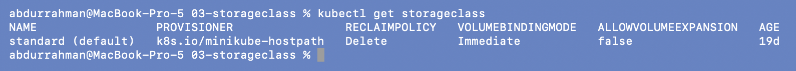
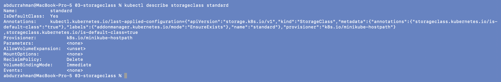

`standard` is the default class (`IsDefaultClass: Yes`). Its provisioner is
`k8s.io/minikube-hostpath`, `ReclaimPolicy: Delete`, `VolumeBindingMode: Immediate`
(the volume is created as soon as the claim exists, not when a Pod first uses it).

**Create a claim and let Kubernetes make the PV**

```bash
kubectl apply -f pvc.yaml
kubectl get pvc
kubectl get pv
minikube ssh -- ls -l /tmp/hostpath-provisioner/default/
```

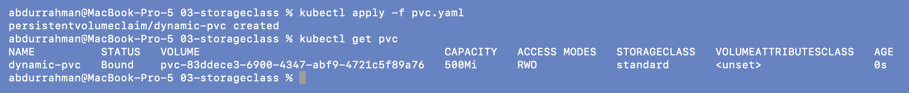
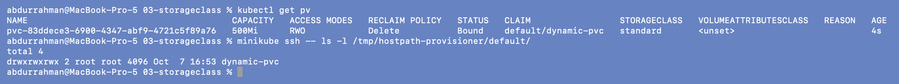

I never wrote a PV, but `pvc-83ddece3-…` (500Mi, exactly what was asked) now exists, and
the provisioner created a matching directory on the node.

```bash
kubectl describe pvc dynamic-pvc
```

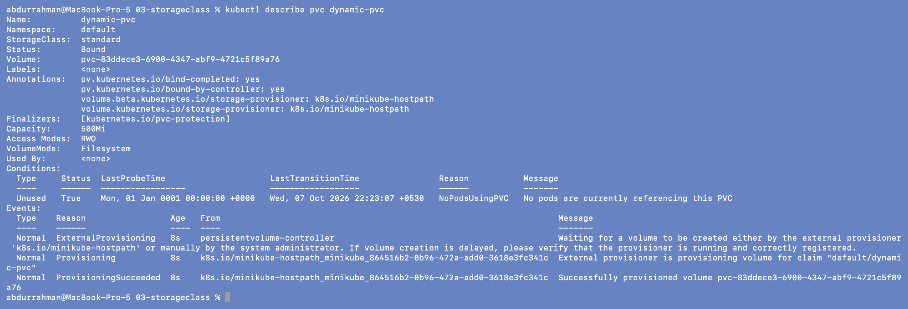

The events show the chain: `ExternalProvisioning` → `Provisioning` →
`ProvisioningSucceeded`.

**Delete the claim**

```bash
kubectl delete -f pvc.yaml
kubectl get pv
```

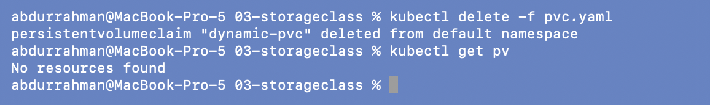

The PV disappeared with the claim. This is the opposite of section 3, because this class
uses reclaim policy `Delete`.

---

## What I understood

- **Data lifetime depends on where the volume comes from.** `emptyDir` lasts as long as
  the Pod, `hostPath` as long as the node, and a PV until someone deletes it.
- **PV and PVC split two jobs.** An admin (or a provisioner) supplies storage as a PV; a
  developer asks for storage with a PVC and never needs to know whether it's a cloud disk
  or NFS.
- **Static vs dynamic.** Static: the PV exists first and a claim binds to it. Dynamic: the
  claim names a StorageClass and the PV is created on demand. On a cluster with a default
  StorageClass, a claim that leaves out `storageClassName` is dynamic, not static. That is
  the bug I hit in section 3, and `storageClassName: ""` is how you opt out.
- **Reclaim policy decides what happens to data when the claim goes away.** `Retain`
  keeps the data, so an admin has to clean it up; `Delete` removes it, which is the
  default for dynamic volumes.
