# Horizontal Pod Autoscaler (HPA)

**Name:** Abdur Rahman Ibne Munir
**Enrollment number:** 24BCS10244

Session 13, Task 2. An nginx Deployment with a CPU request of `100m` is scaled by an HPA
between 1 and 5 replicas, targeting 50% average CPU. Load comes from busybox Pods running
`wget` in a loop against the Service. Everything ran in the `default` namespace of my
minikube cluster.

| File | What it is |
|---|---|
| `deployment.yaml` | `hpa-demo`, 1 replica, `requests.cpu: 100m`, `limits.cpu: 200m` |
| `service.yaml` | `hpa-demo-service`, ClusterIP on port 80 |
| `hpa.yaml` | `autoscaling/v2`, min 1, max 5, `averageUtilization: 50` |

---

## 1. Deploy the application

```bash
kubectl apply -f deployment.yaml
kubectl get deployment
kubectl get pods
```

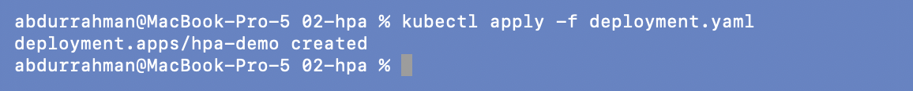


```bash
kubectl apply -f service.yaml
kubectl get svc
```

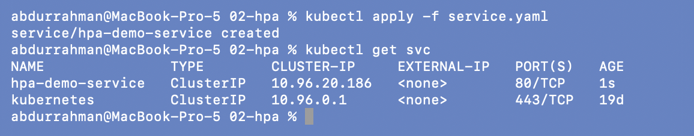

## 2. Metrics Server

HPA can only scale on CPU if something reports CPU usage. Following the notes, I first
tried `kubectl top` before enabling anything:

```bash
kubectl top nodes
kubectl top pods
```


`error: Metrics API not available`. minikube ships metrics-server as an addon:

```bash
minikube addons enable metrics-server
kubectl get pods -n kube-system
```

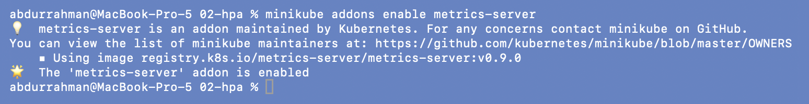
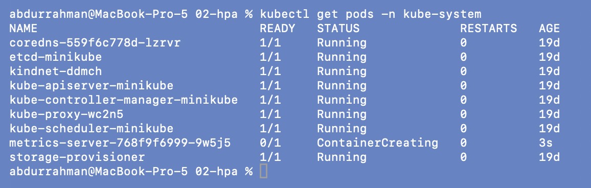

The `metrics-server` Pod is still `ContainerCreating` right after enabling it, and it needs
about a minute to collect its first samples. After that:

```bash
kubectl top nodes
kubectl top pods
```

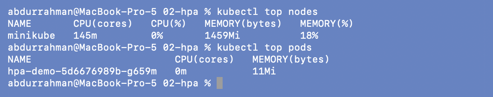

The idle nginx Pod uses `0m` CPU.

## 3. Configure the HPA

```bash
kubectl apply -f hpa.yaml
kubectl get hpa
```

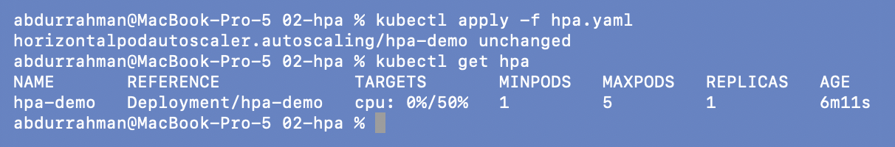

This screenshot says `unchanged` and the HPA is already 6 minutes old. My first attempt at
this step was interrupted halfway through, after the `apply` had already gone through, so
this re-run found the HPA in place. The `CreationTimestamp` in the next screenshot shows
when it was really created.

## 4. Verify the HPA before load

```bash
kubectl get hpa
kubectl describe hpa hpa-demo
```

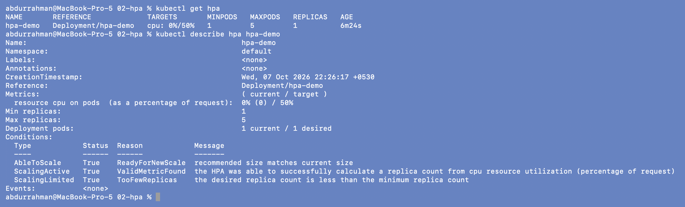

`cpu: 0%/50%`, 1 replica. The condition `ScalingLimited  True  TooFewReplicas` reads oddly
but is expected: at 0% load the HPA would like *zero* replicas, and `minReplicas: 1` stops
it.

## 5. Deploy a load generator

```bash
kubectl run load-generator --image=busybox:1.36 --restart=Never -- \
  /bin/sh -c "while true; do wget -q -O- http://hpa-demo-service; done"
```

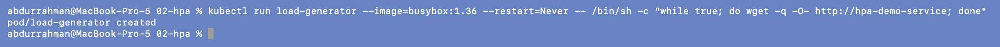

While it ran I watched the HPA in one terminal and the Pods in another:

```bash
kubectl get hpa -w
kubectl get pods -w
```

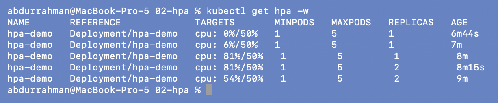
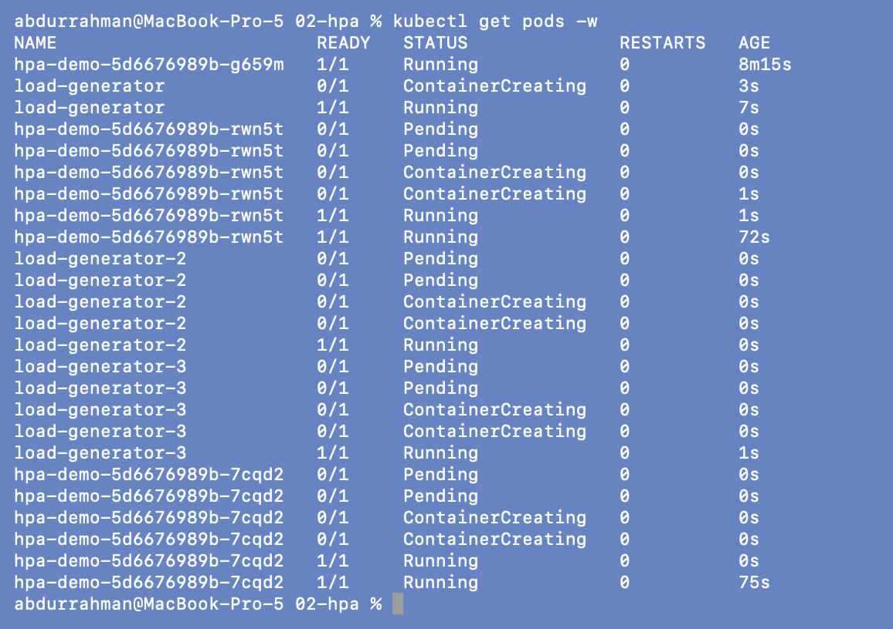

CPU went from 0% to **81%** of the request, the HPA raised replicas from **1 to 2**, and
average CPU dropped back to 54% because the same traffic was now split over two Pods. The
Pod watch shows the second `hpa-demo-…` Pod going `Pending → ContainerCreating → Running`.

## 6. Increase the load

One generator was only enough for two replicas, so I started two more:

```bash
kubectl run load-generator-2 --image=busybox:1.36 --restart=Never -- /bin/sh -c "while true; do wget -q -O- http://hpa-demo-service; done"
kubectl run load-generator-3 --image=busybox:1.36 --restart=Never -- /bin/sh -c "while true; do wget -q -O- http://hpa-demo-service; done"
kubectl get hpa -w
```

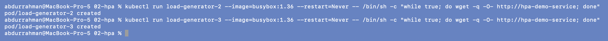
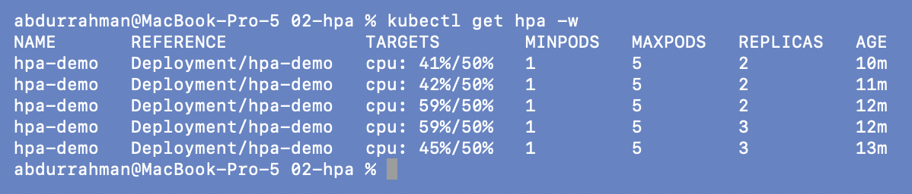

At 59% the HPA went to **3 replicas**, and usage settled at 45%, just under the target.

## 7. Observe CPU and the scaling decisions

```bash
kubectl top pods
kubectl get deployment hpa-demo
kubectl describe hpa hpa-demo
```

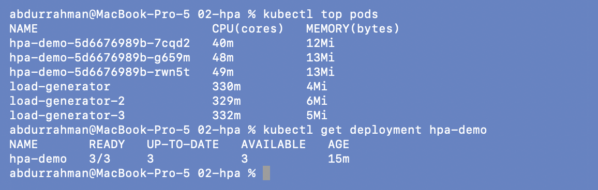
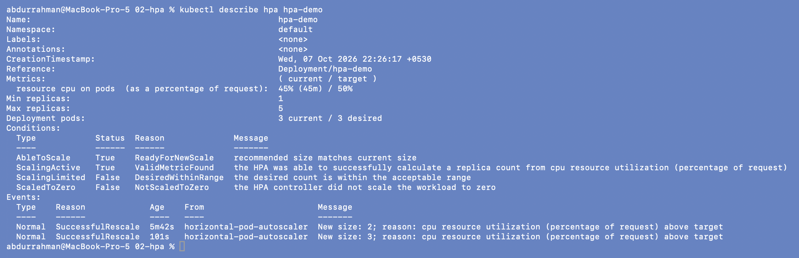

Each nginx Pod uses 40–49m, roughly 45% of its 100m request. The HPA percentage is always
measured against the **request**, not the node's CPU. Interestingly, each load generator
burns ~330m, far more than the nginx Pods it's hammering: serving a tiny static page is
cheap, spawning `wget` in a tight loop is not.

The events show both decisions:
`New size: 2; reason: cpu resource utilization (percentage of request) above target`, then
`New size: 3`. They match the HPA formula
`desired = ceil(current replicas × current% / target%)`: `ceil(1 × 81/50) = 2` and
`ceil(2 × 59/50) = 3`.

## 8. Stop the load and watch it scale down

```bash
kubectl delete pod load-generator load-generator-2 load-generator-3
kubectl get hpa -w
```

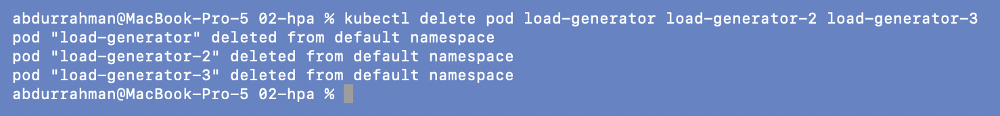
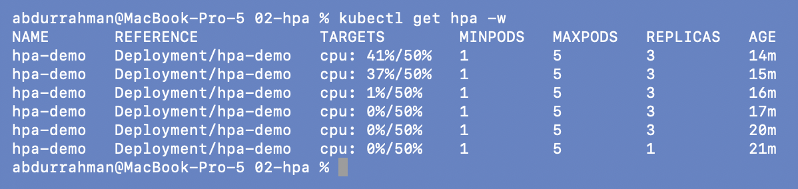

CPU dropped to 0% within a minute, but replicas stayed at 3 from the 16m mark until 20m and
only then went **3 → 1** in one step. That delay is the default **5-minute scale-down
stabilization window**: the HPA uses the highest recommendation from the last 5 minutes, so
a brief dip in traffic doesn't cause Pods to be killed and recreated over and over.
Scale-up has no such delay.

## 9. Cleanup

```bash
kubectl delete -f hpa.yaml -f service.yaml -f deployment.yaml
kubectl get all
```

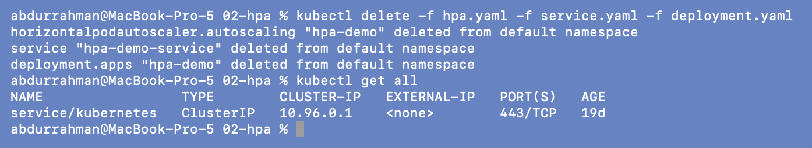

---

## What I understood

- The HPA needs two things to work: **metrics-server** (no metrics means `<unknown>` and
  no scaling) and a **CPU request** on the container (utilization is a percentage of the
  request).
- It scales out, not up: more Pods of the same size. The number comes straight from
  `ceil(replicas × current / target)`, which I could check against the events.
- Scale-up is fast, scale-down is deliberately slow (5-minute stabilization) to avoid
  flapping.
- A single `wget` loop has a ceiling on how much load it can produce. To see the HPA go
  past 2 replicas I had to add more generators. That is the "increase application load"
  step in the task.
