# Liveness, Readiness and Startup Probes

**Name:** Abdur Rahman Ibne Munir
**Enrollment number:** 24BCS10244

Session 13 lecture material on health checks. Three nginx Pods each use a different
probe. Then I deliberately broke the readiness and liveness checks to see what Kubernetes
does about each.

This part ran in its own namespace, `probes-lab`, so it could run at the same time as the
HPA demo. My terminal's kubeconfig had `probes-lab` as its default namespace, so the
commands are exactly as in the notes, without `-n`.

| File | Probe(s) |
|---|---|
| `liveness.yaml` | `livenessProbe` GET `/` every 5s, fail after 3 |
| `readiness.yaml` | `readinessProbe` GET `/` every 5s, after a 5s initial delay |
| `startup.yaml` | `startupProbe` (up to 30 × 2s = 60s to start), then liveness + readiness |

| Probe | Question it asks | What happens when it fails |
|---|---|---|
| Startup | Has the app finished starting? | Container is restarted; the other probes are held off until it passes |
| Readiness | Can it take traffic right now? | Pod is marked not ready and removed from the Service's endpoints. **No restart.** |
| Liveness | Is it still healthy? | Container is restarted |

---

## 1. Liveness probe

```bash
kubectl create namespace probes-lab
kubectl apply -f liveness.yaml
kubectl get pod liveness-demo
kubectl describe pod liveness-demo
```


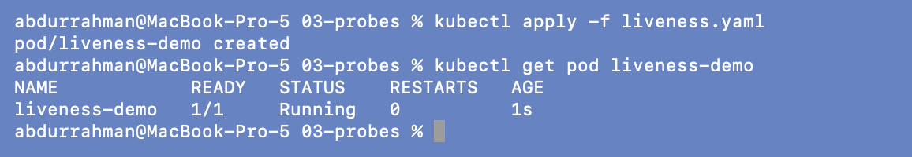
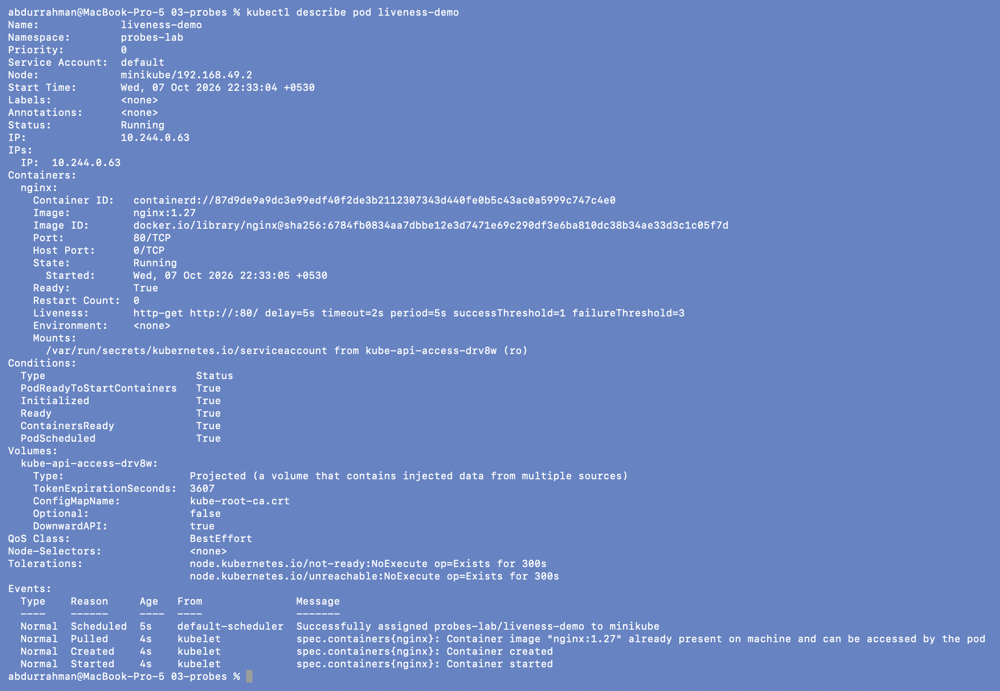

`describe` shows the probe exactly as configured:
`Liveness: http-get http://:80/ delay=5s timeout=2s period=5s … failureThreshold=3`.

## 2. Readiness probe

```bash
kubectl apply -f readiness.yaml
kubectl get pod readiness-demo
```

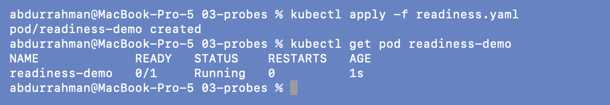

Right after creation the Pod is `Running` but `0/1` ready. The readiness probe waits 5s
(`initialDelaySeconds`) before its first check, and until a check passes the Pod is not
ready.

```bash
kubectl get pod readiness-demo
kubectl expose pod readiness-demo --name=readiness-service --port=80
kubectl get endpoints readiness-service
```

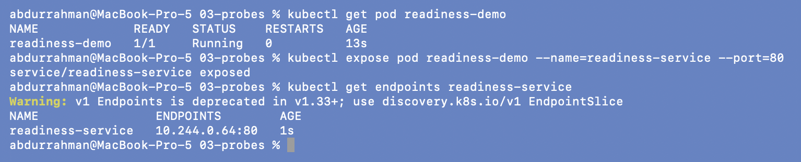

A few seconds later it is `1/1`, and its IP is listed as an endpoint of the Service. (The
yellow warning is because `v1 Endpoints` is deprecated in favour of EndpointSlices since
Kubernetes 1.33; the command still works.)

## 3. Startup probe

```bash
kubectl apply -f startup.yaml
kubectl get pod startup-demo
kubectl describe pod startup-demo
```


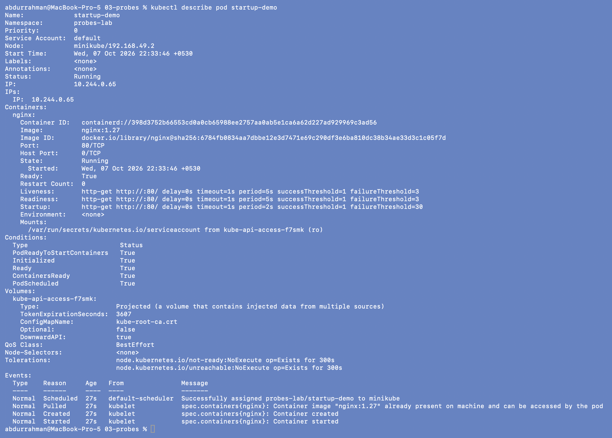

All three probes are listed. The startup probe allows `failureThreshold=30` ×
`period=2s` = 60 seconds for the app to come up. Liveness and readiness don't run until it
passes, so a slow-starting app isn't killed by liveness while it's still booting. nginx
starts in about a second, so here it passes immediately.

---

## 4. Breaking readiness

Changed the readiness path from `/` to `/wrong-path` and applied again, as the notes say:

```bash
sed -i '' 's#path: /$#path: /wrong-path#' readiness.yaml
grep -n "path:" readiness.yaml
kubectl apply -f readiness.yaml
```

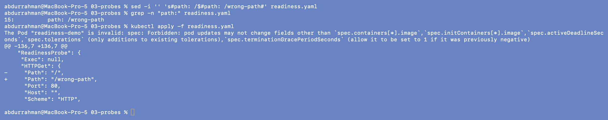

### Problem found: `kubectl apply` is rejected

`The Pod "readiness-demo" is invalid: spec: Forbidden: pod updates may not change fields
other than spec.containers[*].image, …`

**Root cause.** A bare Pod's spec is almost entirely immutable. Only the image, tolerations
and a couple of timing fields can change in place. Probes aren't on that list, so the
notes' "edit and apply again" can't work for a Pod. (It would for a Deployment, which
handles the change by creating new Pods.)

**Fix.** Delete the Pod and create it again from the edited file:

```bash
kubectl delete pod readiness-demo
kubectl apply -f readiness.yaml
```


### Result

```bash
kubectl get pod readiness-demo
kubectl get endpoints readiness-service
kubectl describe pod readiness-demo | tail -n 12
```

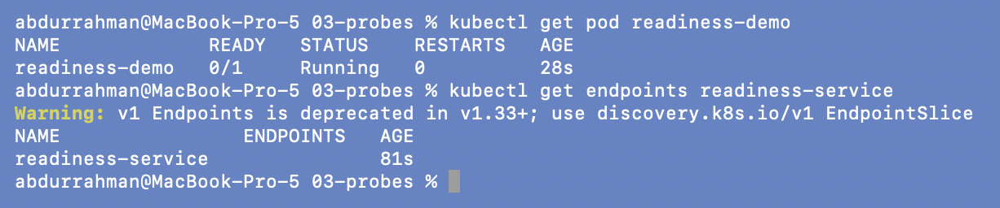
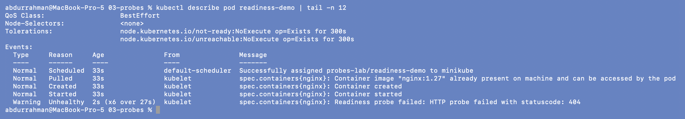

The Pod is `Running` with `0/1` ready and **0 restarts**. The Service now has **no
endpoints**, so no traffic would reach it. The events show
`Readiness probe failed: HTTP probe failed with statuscode: 404`. The container is
fine; Kubernetes just won't send it traffic.

## 5. Breaking liveness

Same change to the liveness probe. The `apply` is rejected for the same reason, so I
deleted and recreated the Pod:

```bash
sed -i '' 's#path: /$#path: /wrong-path#' liveness.yaml
grep -n "path:" liveness.yaml
kubectl apply -f liveness.yaml
kubectl delete pod liveness-demo
kubectl apply -f liveness.yaml
kubectl get pod liveness-demo -w
```

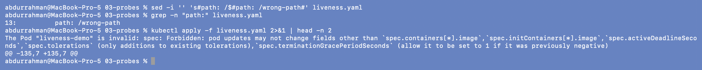

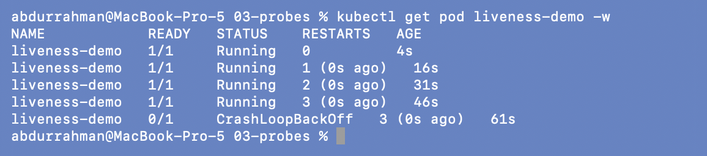

This time the container is **restarted**: 1, 2, 3 restarts, about 15 seconds apart
(5s initial delay + 3 failures × 5s period). Then the status becomes `CrashLoopBackOff`,
where the kubelet waits longer and longer between restarts.

## 6. Debugging the probe failure

```bash
kubectl describe pod liveness-demo | tail -n 14
kubectl logs liveness-demo --previous | tail -n 8
kubectl get events --sort-by=.lastTimestamp | tail -n 15
```

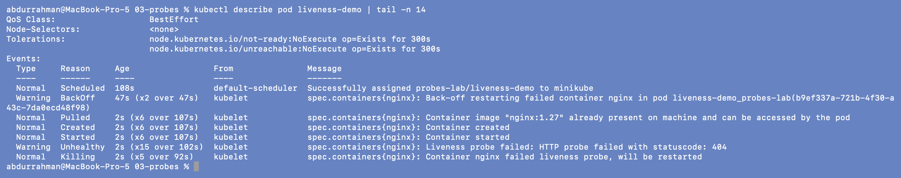
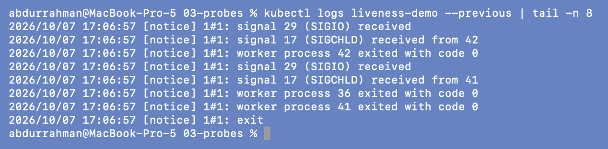
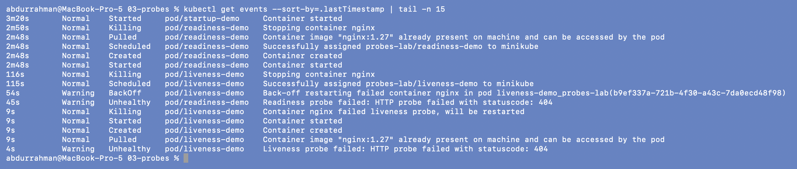

- `describe` gives the whole story: `Liveness probe failed: HTTP probe failed with
  statuscode: 404`, then `Container nginx failed liveness probe, will be restarted`, then
  `Back-off restarting failed container`.
- `logs --previous` shows the *killed* container's last lines: nginx receiving the stop
  signal and exiting cleanly. That's a useful hint that the app didn't crash; it was killed
  from outside.
- The sorted events show both failures side by side: readiness failing on
  `readiness-demo` with no restart, liveness failing on `liveness-demo` with
  `Killing … will be restarted`.

Then I tested the endpoint from inside a container, as the notes suggest:

```bash
kubectl exec -it startup-demo -- sh
wget -qO- http://localhost:80/
curl -s -o /dev/null -w "%{http_code} for /\n" http://localhost:80/
curl -s -o /dev/null -w "%{http_code} for /wrong-path\n" http://localhost:80/wrong-path
exit
```

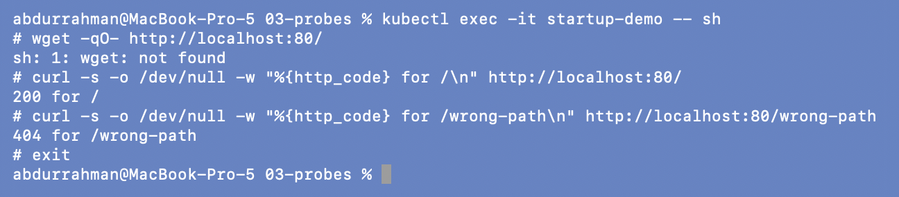

**Small problem in the notes:** `wget: not found`. The `nginx:1.27` image is Debian-based
and doesn't include `wget`, but it does have `curl`. With curl the cause is obvious: `/`
returns `200`, `/wrong-path` returns `404`, and the probe only accepts 200–399.

## 7. Fix and verify

```bash
sed -i '' 's#path: /wrong-path#path: /#' readiness.yaml liveness.yaml
grep -n "path:" readiness.yaml liveness.yaml
kubectl delete pod readiness-demo liveness-demo
kubectl apply -f readiness.yaml -f liveness.yaml
kubectl get pods
kubectl get endpoints readiness-service
```

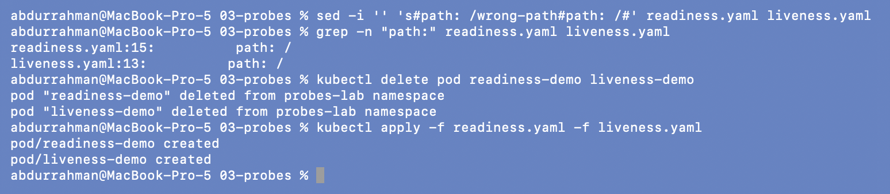
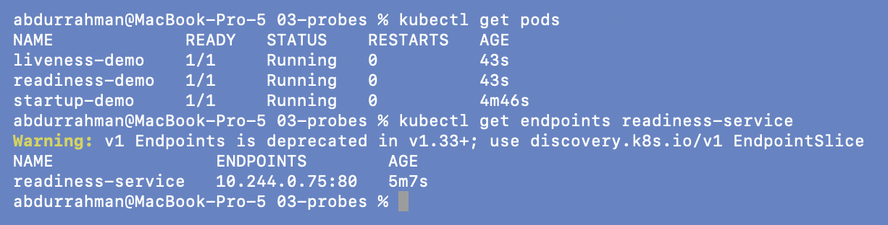

All three Pods are `1/1 Running` with 0 restarts, and the Service has an endpoint again.

```bash
kubectl delete namespace probes-lab
```


---

## What I understood

- **Readiness and liveness fail differently.** Readiness failure only takes the Pod out
  of the Service (0/1, no endpoints, no restart). Liveness failure restarts the
  container, and repeated failures lead to `CrashLoopBackOff`. I saw both in the same
  event list.
- **A startup probe protects slow starters.** It holds off liveness until the app is up,
  so you don't need a huge `initialDelaySeconds` on the liveness probe.
- **Pod specs are immutable.** Changing a probe means recreating the Pod. In real use
  probes live in a Deployment, which rolls out new Pods for you.
- **Debug order:** `describe` (events) → `logs --previous` (the dead container) →
  `exec` and hit the endpoint yourself.
