# Mini Project: Production-Ready Kubernetes Web App

**Name:** Abdur Rahman Ibne Munir
**Enrollment number:** 24BCS10244

Session 13, Task 3. One nginx Deployment that combines everything from the session:

- **Persistence:** a PVC mounted at `/data`, so files outlive the Pod
- **Elastic scaling:** an HPA keeping 2–5 replicas around 50% CPU
- **Health checks:** startup, readiness and liveness probes on every Pod

All objects live in their own namespace, `production-webapp`.

```text
                 Service: web-service (ClusterIP :80)
                               │
          ┌────────────────────┼────────────────────┐
          ▼                    ▼                    ▼
    web-app Pod          web-app Pod    …     (2–5 replicas, set by web-app-hpa)
    startup / readiness / liveness probes, cpu request 100m
          │                    │
          └──── /data ── PVC web-data (500Mi, RWO, StorageClass "standard")
```

| File | Object |
|---|---|
| `namespace.yaml` | Namespace `production-webapp` |
| `pvc.yaml` | PVC `web-data`, 500Mi, ReadWriteOnce (no class set, so the default `standard` provisions it) |
| `deployment.yaml` | `web-app`, 2 replicas, `strategy: Recreate`, requests 100m/64Mi, limits 200m/128Mi, all three probes, `/data` from the PVC |
| `service.yaml` | `web-service`, ClusterIP port 80 |
| `hpa.yaml` | `web-app-hpa`, min 2, max 5, 50% CPU |

---

## 1. Deploy step by step

```bash
kubectl apply -f namespace.yaml
kubectl apply -f pvc.yaml
kubectl get pvc -n production-webapp
```

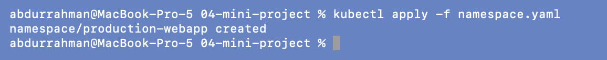
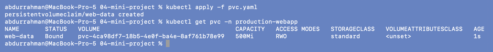

The claim is `Bound` immediately to an automatically created volume. This time that's what
we want: unlike the static-PV exercise, there's no pre-made PV, so the default StorageClass
provisions one.

```bash
kubectl apply -f deployment.yaml
kubectl apply -f service.yaml
kubectl get pods -n production-webapp
```

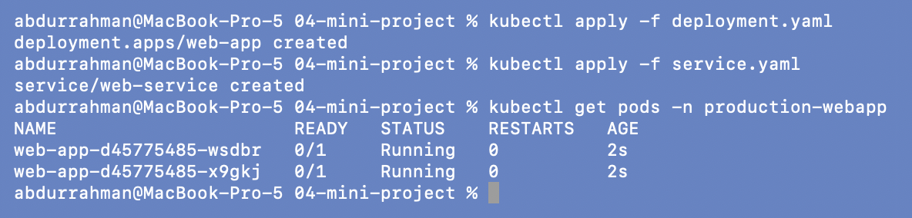
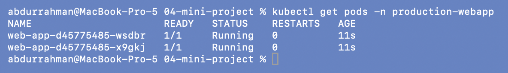

Straight after creation both Pods are `Running` but `0/1`: the startup probe has to pass
first, then the readiness probe (5s initial delay). A few seconds later both are `1/1`.

```bash
kubectl apply -f hpa.yaml
kubectl get hpa -n production-webapp
```

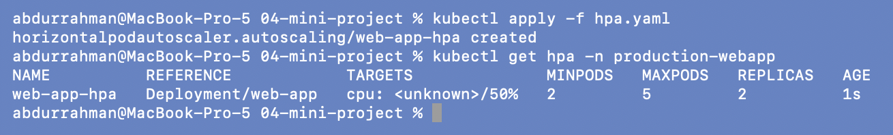

`cpu: <unknown>/50%` is normal for the first ~30 seconds, until metrics-server has a sample
for the new Pods.

---

## 2. Verification task 1: storage persistence

I wrote my own name instead of the example name from the notes.

```bash
POD_NAME=$(kubectl get pods -n production-webapp -l app=web-app -o jsonpath='{.items[0].metadata.name}')
echo $POD_NAME
kubectl exec -n production-webapp "$POD_NAME" -- sh -c 'echo "Student: Abdur Rahman Ibne Munir" > /data/student.txt'
kubectl exec -n production-webapp "$POD_NAME" -- cat /data/student.txt
kubectl delete pod -n production-webapp "$POD_NAME"
```

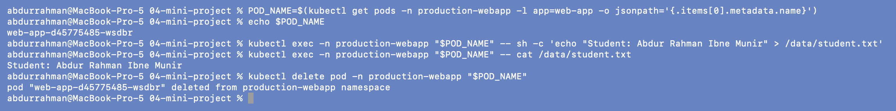

```bash
NEW_POD=$(kubectl get pods -n production-webapp -l app=web-app -o jsonpath='{.items[0].metadata.name}')
echo $NEW_POD
kubectl get pods -n production-webapp
kubectl exec -n production-webapp "$NEW_POD" -- cat /data/student.txt
```

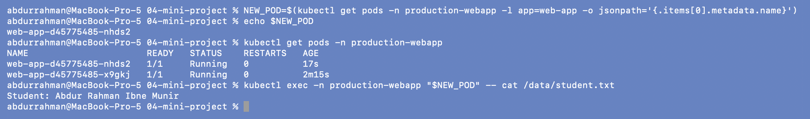

The file was written through `web-app-…-wsdbr`, which I then deleted. `NEW_POD` is
`web-app-…-nhds2`, and `kubectl get pods` shows it is only 17s old, so it really is the
replacement Pod, and it still reads `Student: Abdur Rahman Ibne Munir`.

Two things I noticed while doing this:
- `items[0]` just takes the first Pod in the list, which could have been the *other*,
  older replica. That would prove nothing, which is why I printed the name and the Pod ages.
- Both replicas mount the same `ReadWriteOnce` claim. That only works because minikube has
  a single node: RWO means one *node*, not one Pod. On a multi-node cluster the second
  replica could get stuck if it were scheduled elsewhere.

## 3. Verification task 2: the Service

```bash
kubectl port-forward -n production-webapp svc/web-service 8080:80
curl http://localhost:8080
```

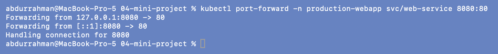
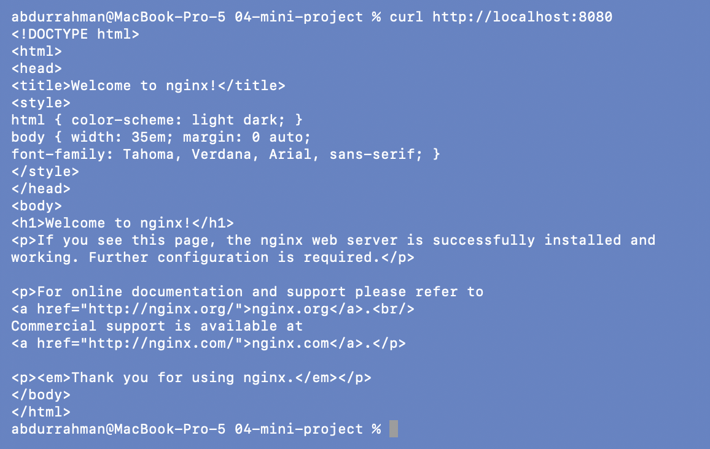

The port-forward window logs `Handling connection for 8080` when the curl arrives, and
curl gets the nginx welcome page through the Service.

## 4. Verification task 3: HPA scaling

```bash
kubectl run load-generator -n production-webapp --image=busybox:1.36 --restart=Never -- \
  /bin/sh -c "while true; do wget -q -O- http://web-service; done"
kubectl get hpa -n production-webapp -w
```

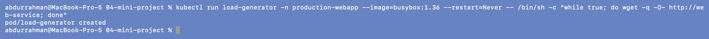
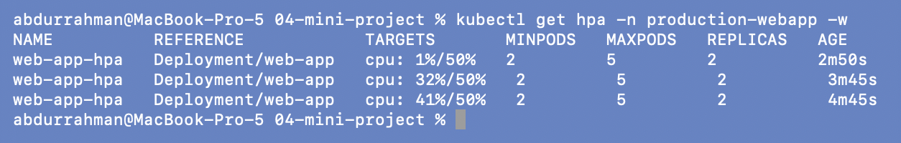

**One load generator was not enough.** CPU rose to 32% and then 41%, but never crossed
the 50% target, so the HPA stayed at 2 replicas. The notes show it reaching 110%. The
difference is `minReplicas: 2`: the single `wget` loop is spread over two Pods from the
start, and one busybox loop can't push two nginx Pods past half their CPU request.

So I increased the load with two more generators:

```bash
kubectl run load-generator-2 -n production-webapp --image=busybox:1.36 --restart=Never -- /bin/sh -c "while true; do wget -q -O- http://web-service; done"
kubectl run load-generator-3 -n production-webapp --image=busybox:1.36 --restart=Never -- /bin/sh -c "while true; do wget -q -O- http://web-service; done"
kubectl get hpa -n production-webapp -w
```

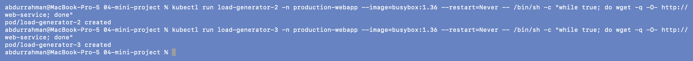


At 57% the HPA went **2 → 3** replicas, and usage dropped to 48%.

```bash
kubectl top pods -n production-webapp
kubectl describe hpa web-app-hpa -n production-webapp | tail -n 4
```

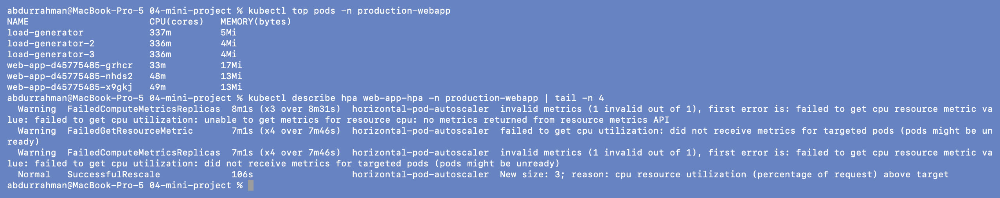

The events include `New size: 3; reason: cpu resource utilization (percentage of
request) above target`. The older `FailedGetResourceMetric` warnings are from the first
minute, before metrics-server had data for the new Pods, which matches the
`<unknown>` seen in step 1.

---

## 5. Bonus challenge 1: lower the target to 30%

With the load still running:

```bash
sed -i '' 's/averageUtilization: 50/averageUtilization: 30/' hpa.yaml
grep -n averageUtilization hpa.yaml
kubectl apply -f hpa.yaml
kubectl get hpa -n production-webapp -w
```

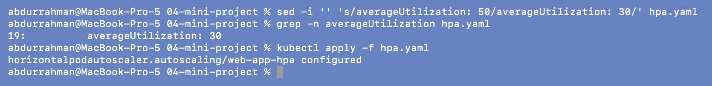
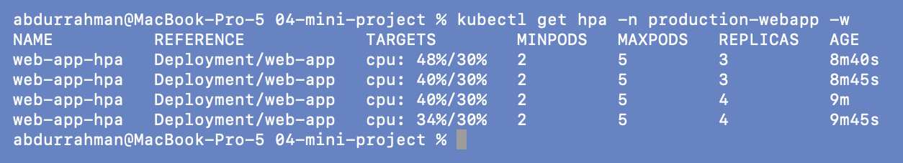

The same traffic is now 40% against a 30% target, so the HPA added a fourth replica
(`ceil(3 × 40/30) = 4`). A lower target means more headroom per Pod and more Pods for the
same load.

## 6. Stop the load and watch it scale down

```bash
sed -i '' 's/averageUtilization: 30/averageUtilization: 50/' hpa.yaml
kubectl apply -f hpa.yaml
kubectl delete pod -n production-webapp load-generator load-generator-2 load-generator-3
kubectl get hpa -n production-webapp -w
```

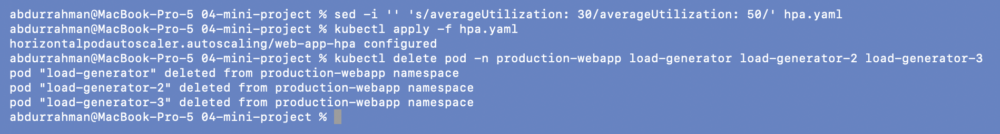
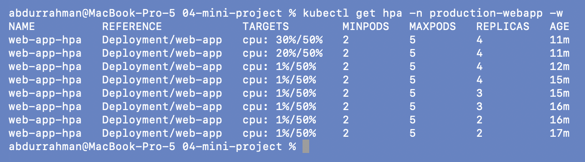

CPU fell to 1% within a minute, but the replica count held at 4 for about 5 minutes and
then stepped down 4 → 3 → 2. It stops at **2**, not 1, because of `minReplicas: 2`.

## 7. Bonus challenge 2: readiness gating

```bash
perl -0pi -e 's#(readinessProbe:\n\s+httpGet:\n\s+path: )/#${1}/does-not-exist#' deployment.yaml
grep -n -A3 "readinessProbe:" deployment.yaml
kubectl apply -f deployment.yaml
kubectl get pods -n production-webapp
kubectl get endpoints -n production-webapp web-service
```

(`perl` rather than `sed`, because the file has three `path: /` lines and only the one
under `readinessProbe` should change.)

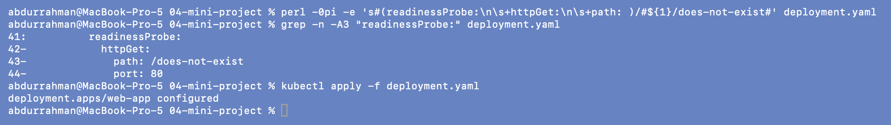
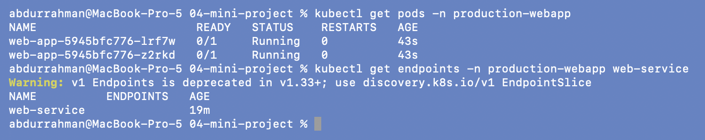

Exactly as the challenge says: both Pods `Running` but `0/1`, and the Service's endpoints
list is empty. Unlike the bare Pods in the probes demo, `kubectl apply` works here because
a Deployment replaces its Pods instead of editing them in place.

This also shows why `strategy: Recreate` is risky. It removed *both* healthy Pods before
starting the broken ones, so the app had zero ready Pods, a full outage. A `RollingUpdate`
would have kept the old Pods serving while the new ones failed their readiness check.

## 8. Bonus challenge 3: liveness restart loop

```bash
sed -i '' 's#path: /does-not-exist#path: /#' deployment.yaml
perl -0pi -e 's#(livenessProbe:\n\s+httpGet:\n\s+path: )/#${1}/crash#' deployment.yaml
grep -n -A3 -E "readinessProbe:|livenessProbe:" deployment.yaml
kubectl apply -f deployment.yaml
kubectl get pods -n production-webapp -w
```

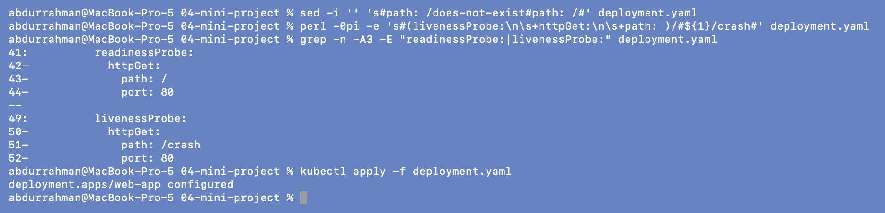
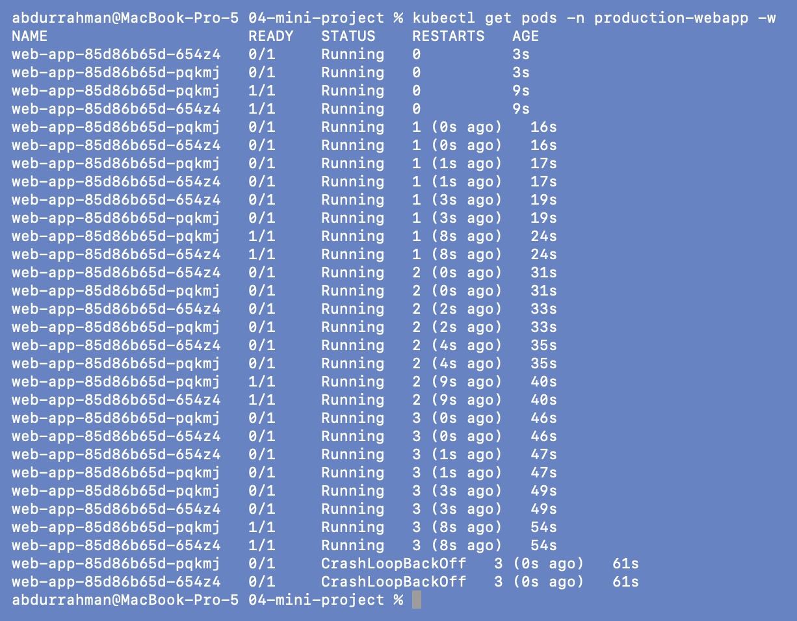

RESTARTS goes 1, 2, 3 at 16s, 31s and 46s, so every 15 seconds (5s initial delay + 3
failures × 5s), then `CrashLoopBackOff`. Each Pod briefly shows `1/1` between restarts:
after a restart the startup probe on `/` passes and readiness passes too, until liveness
on `/crash` fails three times again.

## 9. Restore, verify, clean up

```bash
sed -i '' 's#path: /crash#path: /#' deployment.yaml
grep -c "path: /$" deployment.yaml
kubectl apply -f deployment.yaml
kubectl get pods -n production-webapp
kubectl get endpoints -n production-webapp web-service
```

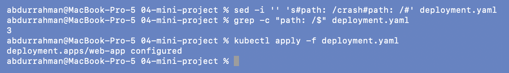
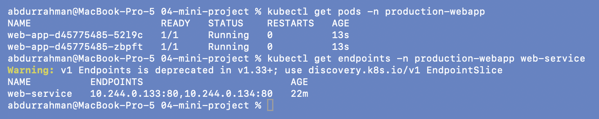

All three probe paths are back to `/` (the `grep -c` prints 3). Both Pods are `1/1` with
0 restarts, and the Service has two endpoints again.

```bash
kubectl delete namespace production-webapp
kubectl get pv
```

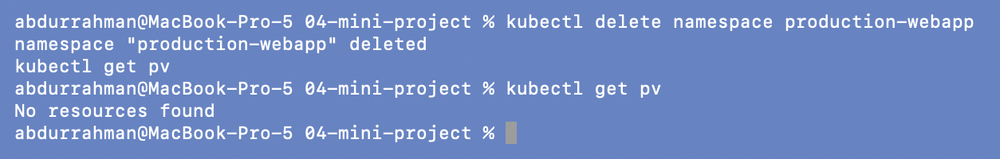

Deleting the namespace removed everything in it, including the PVC. The dynamically
provisioned volume went with it (reclaim policy `Delete`), so `get pv` is empty. The line
`kubectl get pv` appears twice because I typed it while the namespace deletion was still
running, and the terminal echoed it early.

---

## What I understood

- The three pieces work together: the **PVC** keeps data when Pods are replaced, the
  **HPA** changes how many Pods there are, and the **probes** decide which of them get
  traffic and which get restarted.
- **The HPA only reacts if the load per Pod is above target.** With `minReplicas: 2`, one
  load generator was spread too thin to trigger scaling. That isn't a failure, it's the
  HPA correctly deciding 2 Pods were enough.
- **Readiness failure means no traffic; liveness failure means restarts.** In a Deployment
  with `Recreate`, a bad readiness probe takes the whole app down. Rolling updates exist to
  prevent exactly that.
- **ReadWriteOnce is per node, not per Pod.** Sharing one RWO volume between replicas only
  worked here because there's one node.
