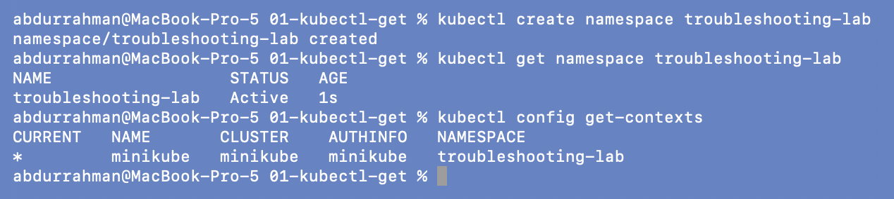
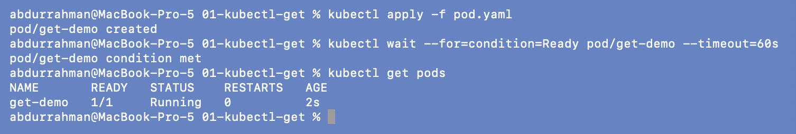
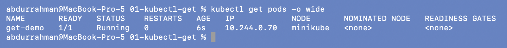
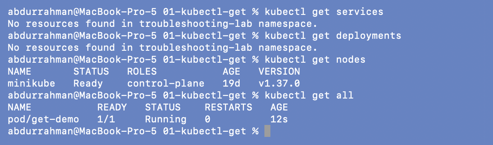
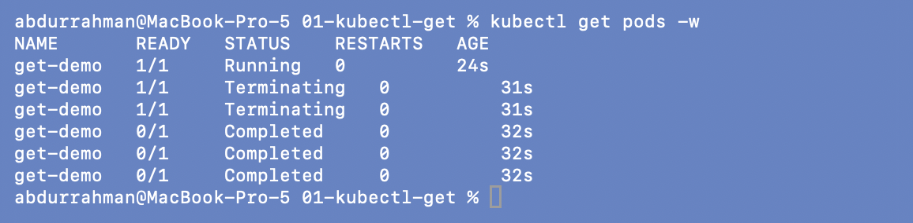
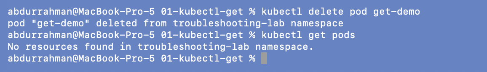

# 01: `kubectl get`

**Name:** Abdur Rahman Ibne Munir
**Enrollment number:** 24BCS10244

Session 14, Task 1. `kubectl get` is the first command in every investigation. It answers
"what is happening right now?" but not "why".

Files: `pod.yaml` (an `nginx:1.27` Pod called `get-demo`, copied from the lecture).

---

## 0. Create my namespace

Everything in this session ran in the namespace `troubleshooting-lab`. My terminal's
kubeconfig has it as the default namespace, so the commands below don't need `-n`.

```bash
kubectl create namespace troubleshooting-lab
kubectl get namespace troubleshooting-lab
kubectl config get-contexts
```



The NAMESPACE column of `get-contexts` shows `troubleshooting-lab` on the current
`minikube` context.

## 1. Create the Pod and check it

```bash
kubectl apply -f pod.yaml
kubectl wait --for=condition=Ready pod/get-demo --timeout=60s
kubectl get pods
```



`READY 1/1`, `STATUS Running`, `RESTARTS 0`: one container, started, never restarted.
I added `kubectl wait` so the screenshot wasn't taken while the Pod was still
`ContainerCreating`.

| Column | Meaning |
|---|---|
| NAME | Pod name |
| READY | ready containers / total containers |
| STATUS | Pod phase or the container's waiting reason (`Running`, `Pending`, `CrashLoopBackOff`, ...) |
| RESTARTS | how many times the kubelet restarted a container |
| AGE | time since the Pod object was created |

## 2. `-o wide`

```bash
kubectl get pods -o wide
```



`-o wide` adds the Pod IP (`10.244.0.70`) and the node (`minikube`). That matters later:
a Pod with `NODE <none>` was never scheduled (section 08), and the Pod IP is what a
Service's endpoints point to (section 09).

## 3. Other resource types

```bash
kubectl get services
kubectl get deployments
kubectl get nodes
kubectl get all
```



My namespace has no Services or Deployments yet, only the Pod. `kubectl get nodes` is
cluster-wide and shows the single `minikube` node (control-plane, `v1.37.0`).

## 4. Watch a change live

The lecture says to run `kubectl get pods -w` and delete the Pod "from another
terminal". I did exactly that with two Terminal windows.

```bash
# window 1
kubectl get pods -w
# window 2
kubectl delete pod get-demo
kubectl get pods
```




The watch printed a new line for every state change: `Running` → `Terminating` →
`Completed` (nginx exited cleanly on SIGTERM), and then the Pod was gone. The second window
confirms there are no Pods left.

---

## What I understood

- `kubectl get` is the quick overview: STATUS, READY and RESTARTS show *that* something
  is wrong, not *why*.
- `-o wide` adds the IP and node, which I needed for networking and scheduling problems.
- `-w` streams changes instead of making me re-run the command, which is handy for
  watching restarts or image pulls happen.
- After `get` comes `describe`, `logs` and events, which explain the "why".
