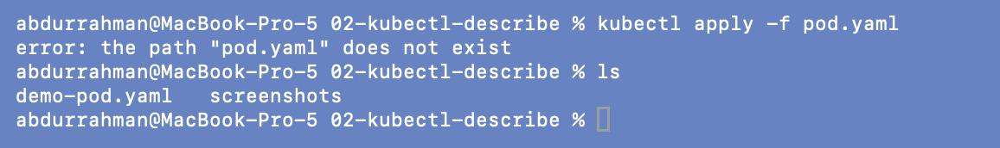
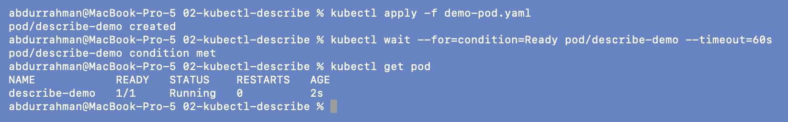
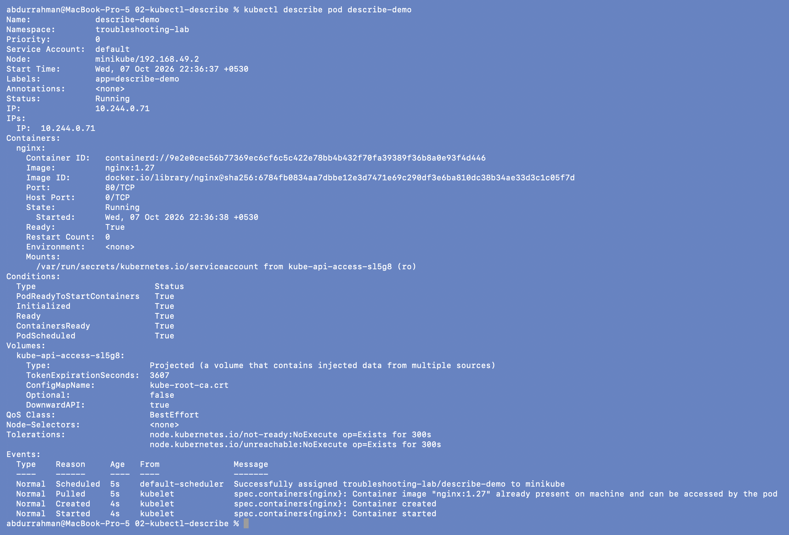
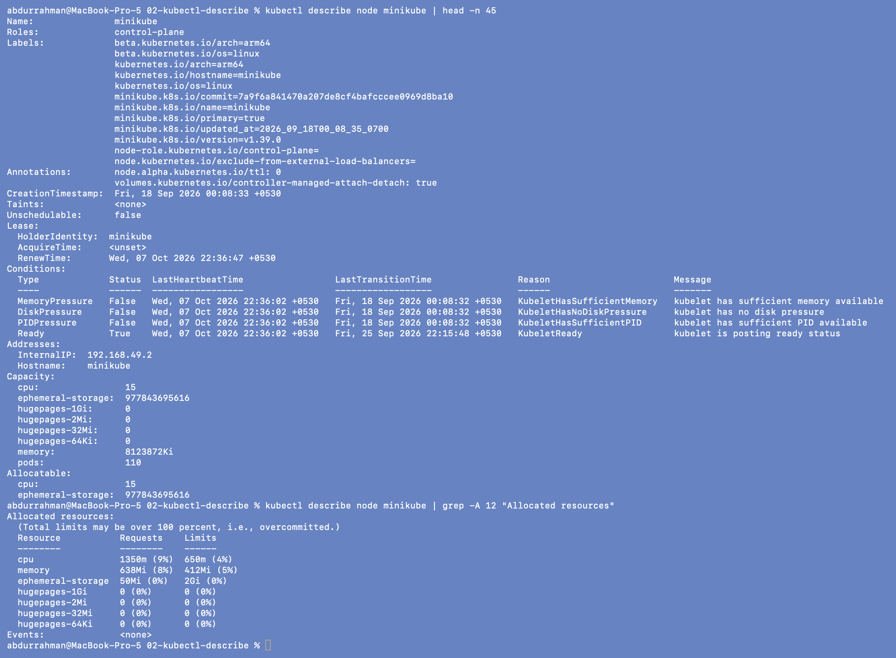
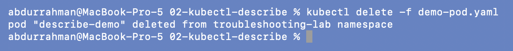

# 02: `kubectl describe`

**Name:** Abdur Rahman Ibne Munir
**Enrollment number:** 24BCS10244

Session 14, Task 1. `kubectl get` tells me something is wrong; `kubectl describe` shows
the details and the Events that usually explain it.

Files: `demo-pod.yaml` (an `nginx:1.27` Pod called `describe-demo`). The lecture folder
also has a `demo-chart/` directory: a default `helm create` scaffold that this lesson never
uses, so I didn't copy it.

---

## 1. Create the Pod

### Problem found: the README's file name is wrong

```bash
kubectl apply -f pod.yaml
ls
```



`error: the path "pod.yaml" does not exist`.

**Root cause.** The lecture README says `kubectl apply -f pod.yaml`, but the manifest in
this folder is called `demo-pod.yaml`. It's a doc/file-name mismatch; the YAML itself is
fine.

**Fix.** Use the real file name. I added a two-line comment at the top of my copy of
`demo-pod.yaml` so the next person doesn't trip on it.

```bash
kubectl apply -f demo-pod.yaml
kubectl wait --for=condition=Ready pod/describe-demo --timeout=60s
kubectl get pod
```



`describe-demo` is `1/1 Running`.

## 2. Describe the Pod

```bash
kubectl describe pod describe-demo
```



The sections I'll be looking at in every later problem:

| Section | What it showed here | Why it matters when debugging |
|---|---|---|
| Node / IP | `minikube/192.168.49.2`, `10.244.0.71` | `Node: <none>` means it was never scheduled |
| Labels | `app=describe-demo` | must match a Service selector |
| Containers → Image | `nginx:1.27` | first thing to check for ImagePullBackOff |
| Containers → State / Last State | `Running`, Restart Count `0` | `Last State: Terminated, Exit Code` explains crashes |
| Conditions | all `True` | `PodScheduled False` = scheduling problem |
| Events | `Scheduled` → `Pulled` → `Created` → `Started` | what the scheduler and kubelet tried, in order |

The `Pulled` event says the image was "already present on machine", because earlier
sessions had already pulled `nginx:1.27` onto the minikube node.

## 3. Describe other resources

The lecture lists `describe deployment`, `describe service` and `describe node`. This
folder has no Deployment or Service (those come up in 09 and the mini-project), so here
I described the node. The output is long, so I cut it with `head` and `grep`:

```bash
kubectl describe node minikube | head -n 45
kubectl describe node minikube | grep -A 12 "Allocated resources"
```



The node has no taints, all pressure conditions are `False`, and `Ready` is `True`. It
has 15 CPUs and `8123872Ki` (about 7.7Gi) of memory allocatable; at that moment about 9%
CPU and 8% memory were requested by Pods. I used these numbers again in the Pending
scenario (`scenarios/scenario-3-pending`).

## 4. Cleanup

```bash
kubectl delete -f demo-pod.yaml
```



---

## What I understood

- `get` answers "what"; `describe` answers "why", mostly through the State, Last State,
  Conditions and Events sections.
- Events read like a timeline: if it stops at `Scheduled` the problem is the image or
  volumes; if there is no `Scheduled` at all, the scheduler couldn't place the Pod.
- `describe node` shows capacity, what is already allocated, taints and pressure
  conditions, which is what I need to explain `Pending` Pods.
- Not every error is in the cluster. The first one here was simply a wrong file name in
  the notes.
