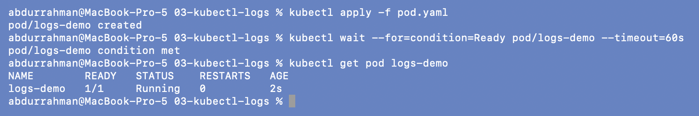
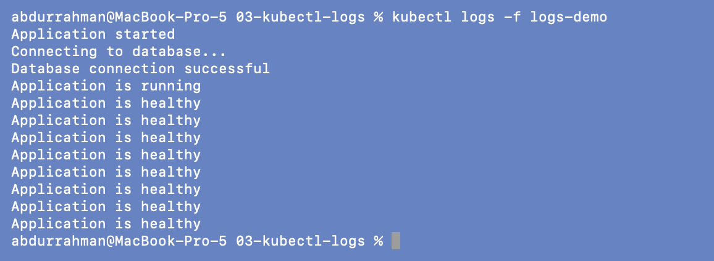
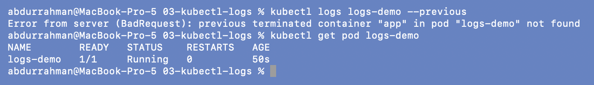
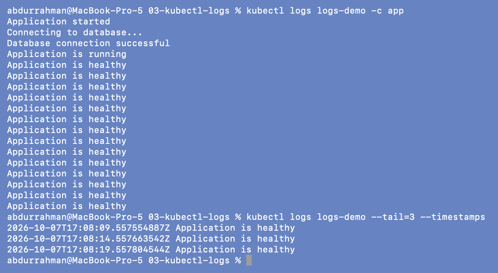

# 03: `kubectl logs`

**Name:** Abdur Rahman Ibne Munir
**Enrollment number:** 24BCS10244

Session 14, Task 1. `kubectl logs` shows what the application itself wrote to stdout and
stderr. It answers "what is the application saying?".

Files: `pod.yaml`, a `busybox:1.36` Pod (`logs-demo`, container name `app`) that prints
four start-up lines and then "Application is healthy" every 5 seconds.

---

## 1. Create the Pod

```bash
kubectl apply -f pod.yaml
kubectl wait --for=condition=Ready pod/logs-demo --timeout=60s
kubectl get pod logs-demo
```



## 2. Read the logs

```bash
kubectl logs logs-demo
```


The four start-up lines appear exactly as the notes expect, followed by one
"Application is healthy" line per 5 seconds since the Pod started.

## 3. Follow the logs

```bash
kubectl logs -f logs-demo     # stopped with Ctrl-C after ~15 s
```



With `-f`, kubectl prints the existing lines and then keeps the stream open. New
"healthy" lines arrived every 5 seconds until I pressed Ctrl-C.

## 4. Previous container logs

### Problem found: `--previous` fails on this Pod

```bash
kubectl logs logs-demo --previous
kubectl get pod logs-demo
```



`Error from server (BadRequest): previous terminated container "app" in pod "logs-demo" not found`.

**Root cause.** `--previous` shows the logs of the container instance *before the last
restart*. `RESTARTS` is `0`, so there is no earlier instance. The command isn't wrong;
it just doesn't apply to a healthy Pod.

**Fix.** Only use `--previous` once RESTARTS is above 0. I showed it working in
[06-crashloopbackoff](../06-crashloopbackoff/README.md#5-logs---previous-when-it-works-and-when-it-doesnt).
That section also shows a second case where it still fails.

## 5. Choose a container, tail, timestamps

```bash
kubectl logs logs-demo -c app
kubectl logs logs-demo --tail=3 --timestamps
```



`-c app` names the container. This Pod has only one, so the output is the same, but with
a sidecar kubectl would ask which container I mean. `--tail=3 --timestamps` (my addition)
shows only the last three lines with their RFC3339 times, five seconds apart.

## 6. Cleanup

```bash
kubectl delete -f pod.yaml
```


---

## What I understood

- Logs are the application's view; events are Kubernetes' view. A crash needs both.
- `-f` follows, `--tail` limits, `--timestamps` adds times, and `-c` picks a container.
- `--previous` is for crashed containers only. With `RESTARTS 0` there is nothing to show.
- Logs only show what the app writes to stdout/stderr. An app that logs to a file inside
  the container shows nothing here.
