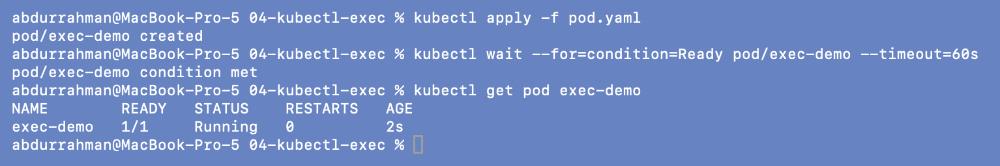
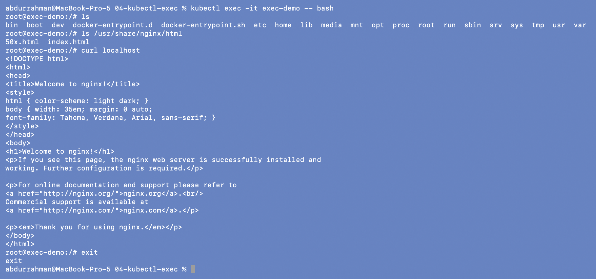
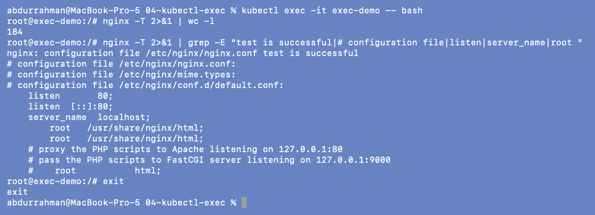
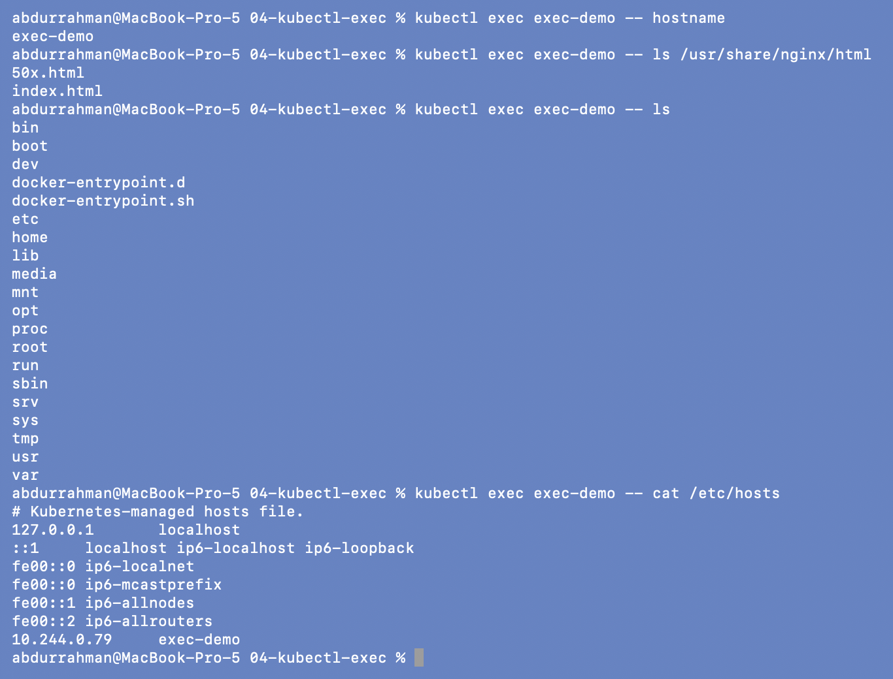

# 04: `kubectl exec`

**Name:** Abdur Rahman Ibne Munir
**Enrollment number:** 24BCS10244

Session 14, Task 1. `kubectl exec` runs a command inside a running container, so I can
check things from the application's side of the network.

Files: `pod.yaml`, an `nginx:1.27` Pod called `exec-demo`.

---

## 1. Create the Pod

```bash
kubectl apply -f pod.yaml
kubectl wait --for=condition=Ready pod/exec-demo --timeout=60s
kubectl get pod exec-demo
```



## 2. Open a shell and look around

```bash
kubectl exec -it exec-demo -- bash
ls
ls /usr/share/nginx/html
curl localhost
exit
```



The prompt changed to `root@exec-demo:/#`, so I was inside the container. The web root
has `index.html` and `50x.html`, and `curl localhost` returned the "Welcome to nginx!"
page. The `nginx:1.27` image (Debian based) ships `curl`, so the lecture's "if curl is
available" case applies here.

## 3. Inspect the nginx configuration

`nginx -T` prints the whole configuration (184 lines here), which doesn't fit in one
screenshot, so I counted the lines and filtered the important ones:

```bash
kubectl exec -it exec-demo -- bash
nginx -T 2>&1 | wc -l
nginx -T 2>&1 | grep -E "test is successful|# configuration file|listen|server_name|root "
exit
```



The config test is successful. `default.conf` listens on port 80 (IPv4 and IPv6) and
serves `/usr/share/nginx/html`. Port 80 is the number a Service's `targetPort` must
match, which is the bug I reproduce in
[13-pod-networking-targetport](../13-pod-networking-targetport/README.md).

## 4. One-off commands without a shell

```bash
kubectl exec exec-demo -- hostname
kubectl exec exec-demo -- ls /usr/share/nginx/html
kubectl exec exec-demo -- ls
kubectl exec exec-demo -- cat /etc/hosts
```



The hostname is the Pod name. `/etc/hosts` is "Kubernetes-managed" and maps the Pod's own
IP (`10.244.0.79`) to `exec-demo`. Without `-it` the output is plain, which is easier to
use in scripts.

## 5. Cleanup

```bash
kubectl delete -f pod.yaml
```


---

## What I understood

- `exec` checks the app from inside. If `curl localhost` works in the container but the
  Service doesn't, the problem is in the Service, DNS or ports, not the app.
- `-it` gives an interactive shell; without it, exec runs one command and returns.
- It only works on a running container. A crash-looping container gives me nothing to
  exec into, so then I rely on `logs --previous`, `describe` or `kubectl debug`.
- Minimal images may lack `bash`, `curl` or `wget` (I hit this with the DNS test image
  in 09), so sometimes the fix is a separate debug Pod.
