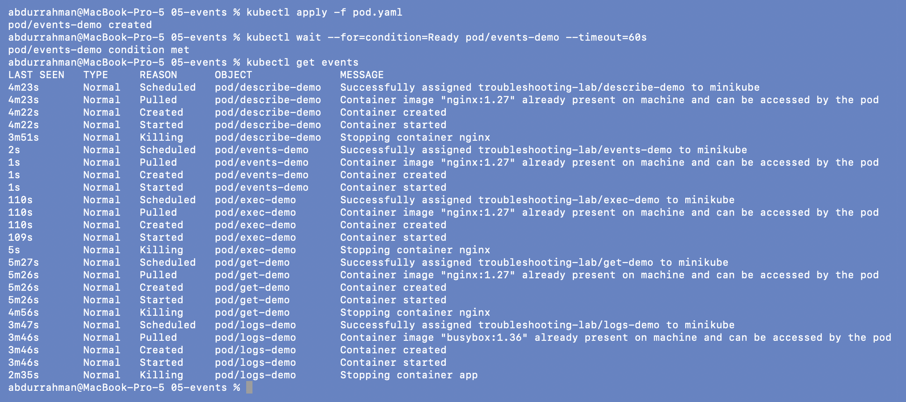
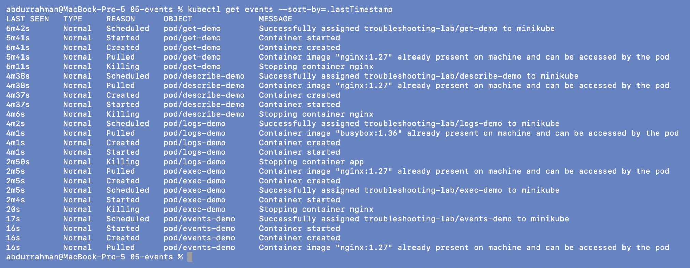
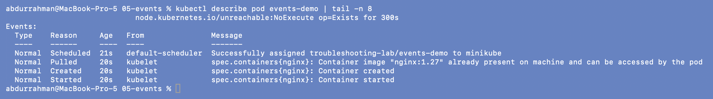
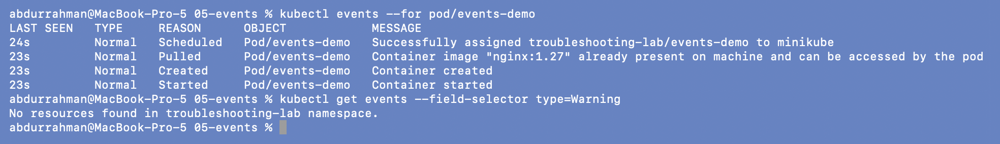
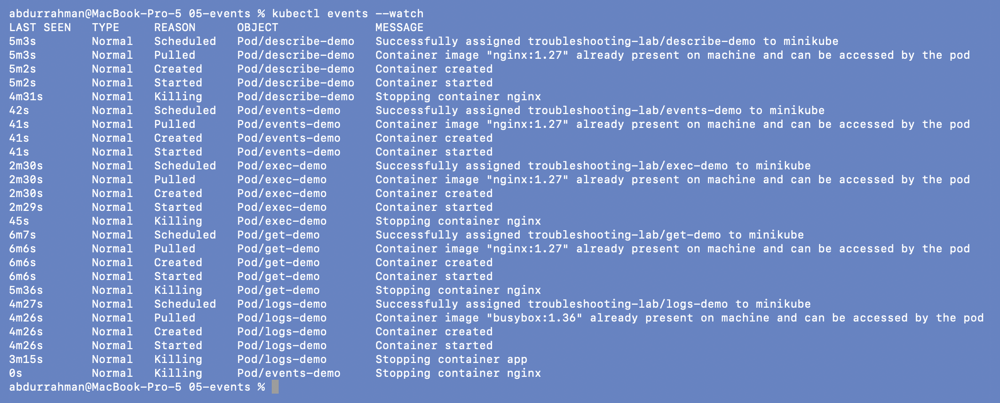

# 05: Kubernetes Events

**Name:** Abdur Rahman Ibne Munir
**Enrollment number:** 24BCS10244

Session 14, Task 1. Events are Kubernetes' own activity log: what the scheduler and the
kubelet tried to do with a resource and whether it worked.

Files: `pod.yaml`, an `nginx:1.27` Pod called `events-demo`.

---

## 1. Create the Pod and list events

```bash
kubectl apply -f pod.yaml
kubectl wait --for=condition=Ready pod/events-demo --timeout=60s
kubectl get events
```



Events are namespaced and kept for a while after the object is gone, so the list also
has the Pods from sections 01–04, each with `Scheduled` → `Pulled` → `Created` →
`Started` → `Killing`. Without sorting, kubectl groups them by object name
(`describe-demo`, `events-demo`, `exec-demo`, ...), not by time.

## 2. Sort by time

```bash
kubectl get events --sort-by=.lastTimestamp
```



Now it reads as a timeline: `get-demo` first, `events-demo` last. Inside one second the
order can still look odd (`Started` before `Created`) because `lastTimestamp` only has
one-second resolution.

## 3. Events in `describe`

```bash
kubectl describe pod events-demo | tail -n 8
```



`describe` shows the same events, filtered to this one Pod, with the component that
reported each (`default-scheduler` or `kubelet`).

## 4. `kubectl events` and the Warning filter

```bash
kubectl events --for pod/events-demo
kubectl get events --field-selector type=Warning
```



`kubectl events --for` is the newer command. It sorts by time by default and filters to
one object. The Warning filter from the lecture's "Key Learning" returned
`No resources found`: nothing has failed in this namespace yet. Later sections use the same
filter to pull out just the failures (07, mini-project, scenarios).

## 5. Watch events live

As in 01, I watched in one window and deleted the Pod from another.

```bash
# window 1
kubectl events --watch
# window 2
kubectl delete -f pod.yaml
```




The watch first printed the existing events, then a new `Killing ... Stopping container
nginx` line for `events-demo` with age `0s` as soon as the delete ran.

---

## What I understood

- Events answer "what did Kubernetes try, and what happened?". The `Reason` column
  (`FailedScheduling`, `FailedMount`, `BackOff`, `Failed`) usually names the problem.
- `--sort-by=.lastTimestamp` or `kubectl events` gives a proper timeline;
  `--field-selector type=Warning` cuts out the noise during an incident.
- Events outlive their Pods but expire after about an hour, so they're useful soon
  after a problem, not days later.
- The source column matters: the scheduler reports placement problems; the kubelet
  reports image, volume and container problems.
