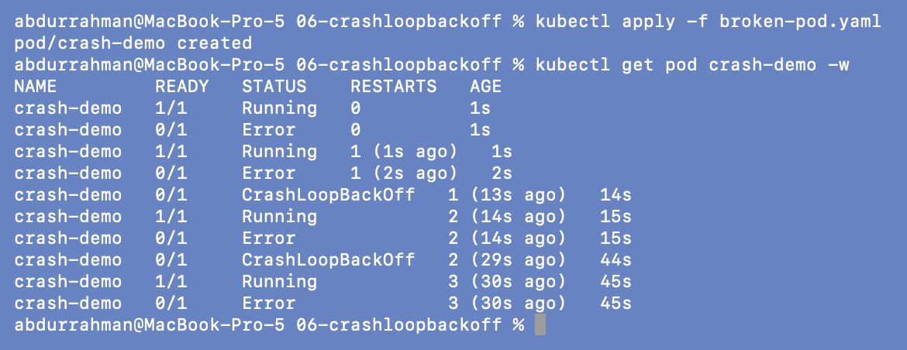
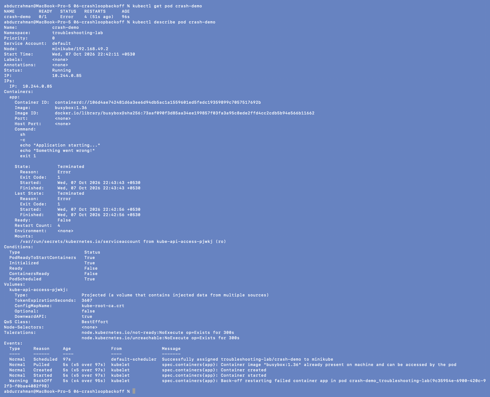
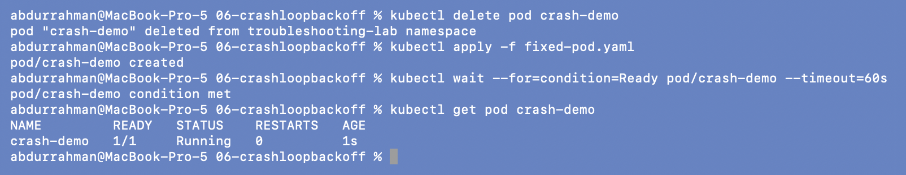
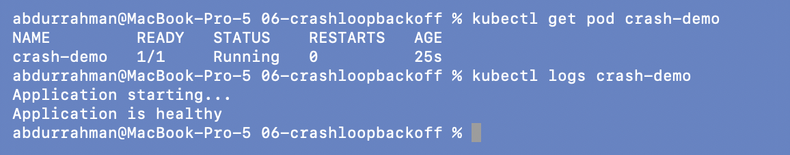
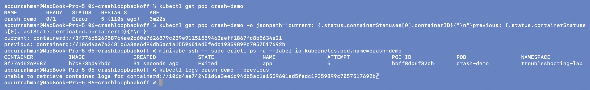
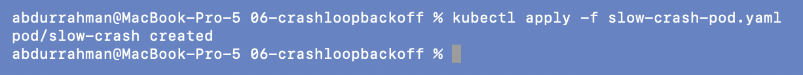
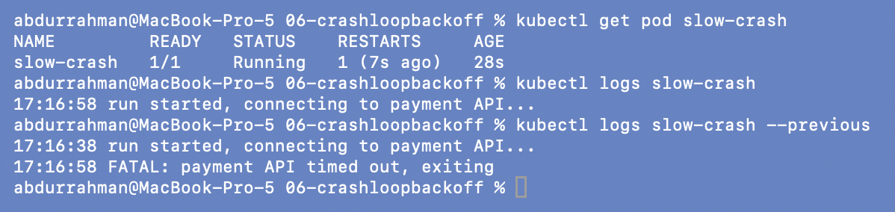
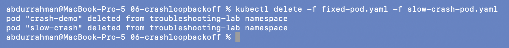

# 06: `CrashLoopBackOff`

**Name:** Abdur Rahman Ibne Munir
**Enrollment number:** 24BCS10244

Session 14, Task 2. The container starts, exits with an error, gets restarted, exits
again, and the kubelet waits longer before each retry.

Files:

| File | From | What it is |
|---|---|---|
| `broken-pod.yaml` | lecture | busybox prints two lines and runs `exit 1` |
| `fixed-pod.yaml` | lecture | same Pod, prints "healthy" and `sleep 3600` |
| `slow-crash-pod.yaml` | **my addition** | runs 20 s, then exits 1, so `--previous` has something to show |

---

## 1. Identify: create the broken Pod and watch it

```bash
kubectl apply -f broken-pod.yaml
kubectl get pod crash-demo -w          # stopped after 75 s
kubectl get pod crash-demo
```




The watch shows the loop: `Running` → `Error` → `Running` → `Error` → `CrashLoopBackOff`.
The gap between restarts grows (about 1 s, 13 s, then 30 s), which is the back-off
(10 s, 20 s, 40 s, ... up to 5 minutes). Between retries the STATUS column flips between
`Error` (the last exit) and `CrashLoopBackOff` (waiting for the next try).

## 2. Investigate: describe

```bash
kubectl get pod crash-demo
kubectl describe pod crash-demo
```



What `describe` gives that `get` doesn't:

- **State: Terminated, Reason: Error, Exit Code: 1** and **Last State** with the same
  values: the process itself is exiting with code 1. It isn't being killed (that would be
  137 / OOMKilled) and the image isn't missing.
- **Restart Count: 4**.
- **Command:** shows the script, including `exit 1`.
- **Events:** `Pulled/Created/Started (x5)` and `Warning BackOff ... Back-off restarting
  failed container app`. Kubernetes did its part every time; the app keeps failing.

## 3. Investigate: logs

```bash
kubectl logs crash-demo
kubectl logs crash-demo --previous
kubectl get pod crash-demo -o jsonpath="{.status.containerStatuses[0].lastState.terminated.exitCode}{\"\n\"}"
```


`kubectl logs` prints `Application starting...` and `Something went wrong!`, the app's last
words before exiting. The jsonpath query confirms the exit code is `1`.
`kubectl logs --previous` did **not** work, though. See section 5.

## 4. Root cause and fix

```bash
cat broken-pod.yaml
diff broken-pod.yaml fixed-pod.yaml
```


**Root cause:** the container's command ends with `exit 1`, so the main process fails
every time it starts. Restarting can't help, because each restart runs the same script.
(This stands in for a real app that exits on a bad config, a missing dependency or
an exception.)

**Fix:** the fixed command keeps the process running (`sleep 3600`) instead of exiting
with an error. A Pod's `command` can't be changed in place, so I deleted and recreated it.

```bash
kubectl delete pod crash-demo
kubectl apply -f fixed-pod.yaml
kubectl wait --for=condition=Ready pod/crash-demo --timeout=60s
kubectl get pod crash-demo
```



**Verify** (25 s later):

```bash
kubectl get pod crash-demo
kubectl logs crash-demo
```



`1/1 Running`, `RESTARTS 0`, and the log says `Application is healthy`.

## 5. `logs --previous`: when it works and when it doesn't

### Problem found: `--previous` fails even on a crash-looping Pod

The lecture says `kubectl logs crash-demo --previous` is "extremely useful" here, but it
returned `unable to retrieve container logs for containerd://f2bb92ff...`. I looked
at the container IDs and at the node's container runtime:

```bash
kubectl get pod crash-demo
kubectl get pod crash-demo -o jsonpath='current: {.status.containerStatuses[0].containerID}{"\n"}previous: {.status.containerStatuses[0].lastState.terminated.containerID}{"\n"}'
minikube ssh -- sudo crictl ps -a --label io.kubernetes.pod.name=crash-demo
kubectl logs crash-demo --previous
```



**Root cause.** The runtime only has **one** container left for this Pod (attempt 5,
`3f776d...`, state `Exited`). The "previous" one (`106d4a...`) that `--previous` asks for
has already been removed. The kubelet's garbage collector keeps only one dead container
per Pod. With a container that dies instantly, the *current* container is already dead
during the back-off wait, so it takes that one slot and the older one is deleted. Plain
`kubectl logs crash-demo` (no `--previous`) is what shows the last crash here.

**Fix / demonstration (addition).** `--previous` is useful when the current container
is running again after a crash. `slow-crash-pod.yaml` runs for 20 seconds and then exits 1:

```bash
kubectl apply -f slow-crash-pod.yaml
# waited until RESTARTS = 1 and the new container was running
kubectl get pod slow-crash
kubectl logs slow-crash
kubectl logs slow-crash --previous
```




Now `kubectl logs` shows only the new run (`17:16:58 run started...`), while
`--previous` shows the crashed run, including the
`17:16:58 FATAL: payment API timed out, exiting` line that explains the restart. That is
the case `--previous` exists for.

## 6. Cleanup

```bash
kubectl delete -f fixed-pod.yaml -f slow-crash-pod.yaml
```



---

## What I understood

- `CrashLoopBackOff` is a symptom: the kubelet is waiting before restarting a container
  that keeps exiting. The cause is in the exit code and the app's own logs.
- In `describe`, Last State's reason and exit code split the cases: `Error` + 1 = the app
  failed, `OOMKilled` + 137 = memory limit, `Completed` + 0 = it finished but the Pod
  restarts it anyway (I hit that in `scenarios/scenario-1-crashloop`).
- `--previous` needs the previous container to still exist. For a container that dies
  instantly, plain `kubectl logs` already shows the last crash.
- Deleting or restarting the Pod is not a fix. The command or config has to change.
