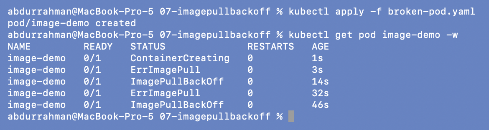
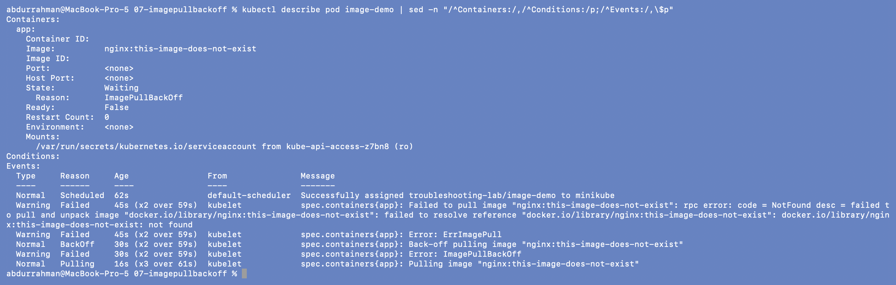
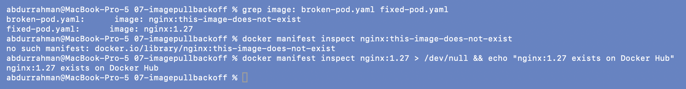
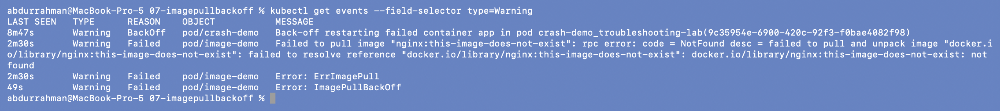
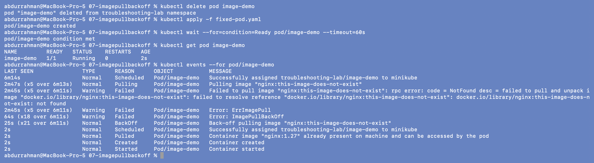
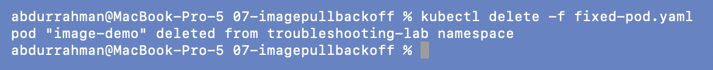

# 07: `ErrImagePull` / `ImagePullBackOff`

**Name:** Abdur Rahman Ibne Munir
**Enrollment number:** 24BCS10244

Session 14, Task 2. The kubelet can't download the container image, so the container is
never created.

Files: `broken-pod.yaml` (`image: nginx:this-image-does-not-exist`) and `fixed-pod.yaml`
(`image: nginx:1.27`), both from the lecture.

---

## 1. Identify: create the broken Pod and watch the status

```bash
kubectl apply -f broken-pod.yaml
kubectl get pod image-demo -w          # stopped after 50 s
```



This captures both statuses the homework asks about:

- **`ErrImagePull`** (at 3 s and 32 s): a pull was just attempted and failed.
- **`ImagePullBackOff`** (at 14 s and 46 s): the kubelet is waiting before trying again,
  with the delay growing each time.

The two alternate. `RESTARTS` stays `0` because no container was ever created, unlike
CrashLoopBackOff.

## 2. Investigate: describe

```bash
kubectl describe pod image-demo | sed -n "/^Containers:/,/^Conditions:/p;/^Events:/,\$p"
```



`State: Waiting, Reason: ImagePullBackOff`, and `Container ID` / `Image ID` are empty. The
key event is:

```text
Failed to pull image "nginx:this-image-does-not-exist": rpc error: code = NotFound ...
failed to resolve reference "docker.io/library/nginx:this-image-does-not-exist": ... not found
```

The runtime (containerd) expanded the short name to `docker.io/library/nginx`, reached
Docker Hub, and got **NotFound**. That rules out network and auth problems: the registry
answered, and that tag doesn't exist.

## 3. Root cause: confirm the tag doesn't exist

```bash
grep image: broken-pod.yaml fixed-pod.yaml
docker manifest inspect nginx:this-image-does-not-exist
docker manifest inspect nginx:1.27 > /dev/null && echo "nginx:1.27 exists on Docker Hub"
```



I checked the registry from my Mac without involving Kubernetes. `docker manifest inspect`
only fetches metadata (nothing is downloaded): `no such manifest` for the broken tag, while
`nginx:1.27` exists.

**Root cause:** wrong image tag. The `nginx` repository is fine, but the
`this-image-does-not-exist` tag has never been published.

```bash
kubectl get events --field-selector type=Warning
```



The Warning filter from 05 now earns its keep: only the failures are listed (plus the
leftover `BackOff` from the crash-demo in 06).

## 4. Fix and verify

```bash
kubectl delete pod image-demo
kubectl apply -f fixed-pod.yaml
kubectl wait --for=condition=Ready pod/image-demo --timeout=60s
kubectl get pod image-demo
kubectl events --for pod/image-demo
```



`image-demo` is `1/1 Running`. Its event history shows both lives of the Pod: the broken
one (`Pulling` x5, `Failed` x5, `ImagePullBackOff` x18, `BackOff` x21 over 6 minutes), then
the new one going `Scheduled` → `Pulled` → `Created` → `Started` in 2 seconds.

```bash
kubectl delete -f fixed-pod.yaml
```



---

## What I understood

- `ErrImagePull` is a single failed attempt; `ImagePullBackOff` is the waiting state
  between attempts. Both mean the container was never created.
- The event message's wording tells me which kind of pull problem it is: `not found` =
  wrong name or tag; `pull access denied ... may require authorization` = private image or
  no such repository; `429 Too Many Requests` = registry rate limit (I hit that in
  `scenarios/`); a timeout = network.
- A short name like `nginx:1.27` means `docker.io/library/nginx:1.27`.
- I can check an image without the cluster using `docker manifest inspect`.
