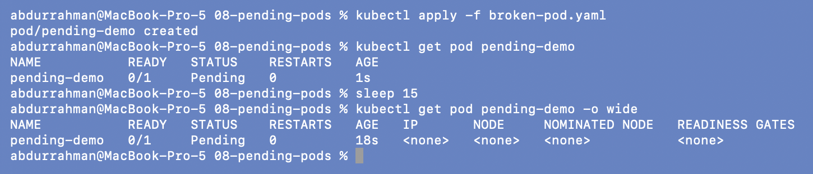
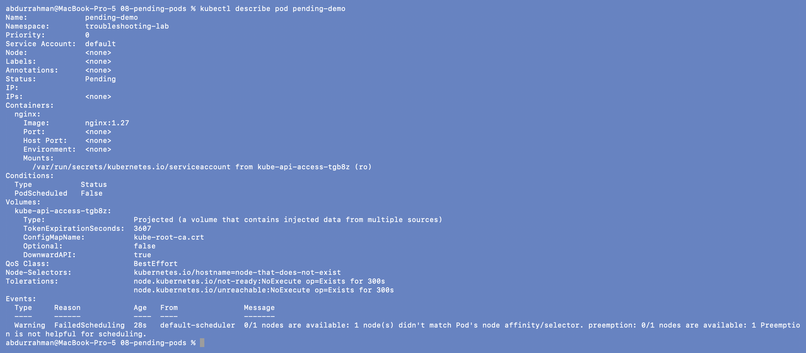
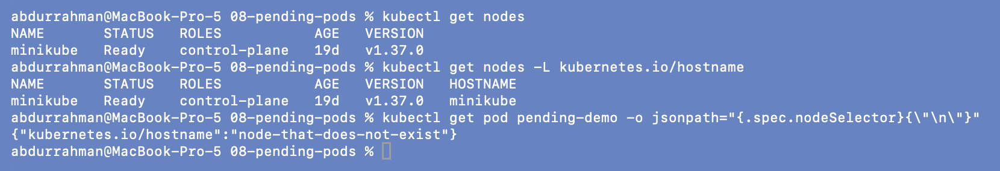
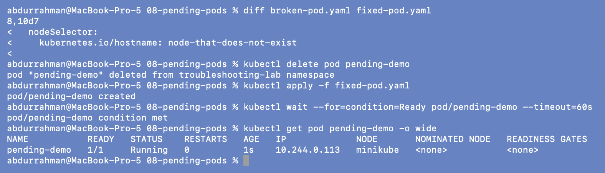
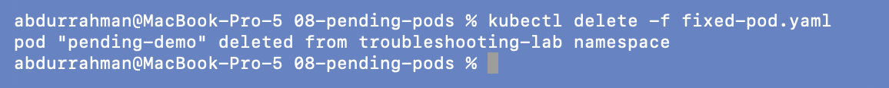

# 08: `Pending` Pods

**Name:** Abdur Rahman Ibne Munir
**Enrollment number:** 24BCS10244

Session 14, Task 2. A `Pending` Pod exists in the API but the scheduler hasn't found a node
for it, so nothing has started yet.

Files: `broken-pod.yaml` (nginx with `nodeSelector: kubernetes.io/hostname:
node-that-does-not-exist`) and `fixed-pod.yaml` (same Pod without the selector), both from
the lecture. A second Pending cause, impossible CPU and memory requests, is in
[`scenarios/scenario-3-pending`](../scenarios/README.md#scenario-3-pending-impossible-resource-requests).

---

## 1. Identify

```bash
kubectl apply -f broken-pod.yaml
kubectl get pod pending-demo
sleep 15
kubectl get pod pending-demo -o wide
```



Still `Pending` after 18 seconds, and `-o wide` shows `IP <none>` and `NODE <none>`: it was
never assigned to a node, so no image pull or container was even attempted.

## 2. Investigate: describe

```bash
kubectl describe pod pending-demo
```



- `Node: <none>`. Conditions has only `PodScheduled False`.
- `Node-Selectors: kubernetes.io/hostname=node-that-does-not-exist`
- The only event, from `default-scheduler`:

```text
Warning  FailedScheduling  0/1 nodes are available: 1 node(s) didn't match Pod's node
affinity/selector. preemption: 0/1 nodes are available: 1 Preemption is not helpful for scheduling.
```

The scheduler checked my one node and rejected it because of the selector. It also says
preemption (evicting lower-priority Pods) wouldn't help, because the mismatch is about
labels, not capacity.

## 3. Compare with the real node

```bash
kubectl get nodes
kubectl get nodes -L kubernetes.io/hostname
kubectl get pod pending-demo -o jsonpath="{.spec.nodeSelector}{\"\n\"}"
```



**Root cause:** the only node's `kubernetes.io/hostname` label is `minikube`, but the Pod
requires `node-that-does-not-exist`. No node can ever match, so the Pod would wait forever.

## 4. Fix and verify

`nodeSelector` can't be edited on an existing Pod, so I deleted it and applied the fixed
version (selector removed):

```bash
diff broken-pod.yaml fixed-pod.yaml
kubectl delete pod pending-demo
kubectl apply -f fixed-pod.yaml
kubectl wait --for=condition=Ready pod/pending-demo --timeout=60s
kubectl get pod pending-demo -o wide
```



`1/1 Running` on node `minikube` with IP `10.244.0.113`. Setting the selector to
`kubernetes.io/hostname: minikube` would also have worked, but pinning a Pod to one node
by hostname is rarely what you want.

```bash
kubectl delete -f fixed-pod.yaml
```



---

## What I understood

- `Pending` with `NODE <none>` is a scheduling problem. The explanation is always in the
  `FailedScheduling` event from `default-scheduler`.
- The message lists *why each node was rejected*: selector/affinity mismatch, untolerated
  taint, `Insufficient cpu/memory`, unbound PVC, and so on.
- The fix depends on the cause: correct the selector, add a toleration, lower the requests,
  or add capacity. Deleting and recreating the Pod unchanged does nothing.
- A Pod can also be `Pending` after scheduling (image pulling, volumes mounting). Then
  NODE is filled in and the status shows `ContainerCreating` (see 11).
