# 09: Service and DNS troubleshooting

**Name:** Abdur Rahman Ibne Munir
**Enrollment number:** 24BCS10244

Session 14, Task 2 (service connectivity and DNS issues). The chain I'm checking:

```text
Pod labels ──matched by──▶ Service selector ──▶ Endpoints (Pod IP:targetPort)
                                    │
                         ClusterIP ◀── DNS name  web-service.<namespace>.svc.cluster.local
```

Files (all from the lecture; two fixed in my copy, see below):

| File | What it is |
|---|---|
| `deployment.yaml` | `web`: 2 nginx replicas labelled `app=web` |
| `service.yaml` | `web-service`, ClusterIP port 80 → targetPort 80. **Fixed**: selector was `app: web-ahsgdf` |
| `broken-service.yaml` | `broken-service` with `selector: app: does-not-exist` (intentionally broken) |
| `dns-test-pod.yaml` | a Pod with DNS tools. **Fixed**: the image name didn't exist |

The lecture folder also contains a `pod.yaml` that is a stray copy of the `logs-demo` Pod
from 03. Nothing in this lesson uses it, so I didn't copy it.

---

## 1. Create the application

```bash
kubectl apply -f deployment.yaml
kubectl rollout status deployment/web --timeout=60s
kubectl get pods
```

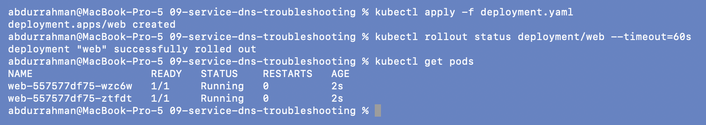

## 2. Create the Service

```bash
kubectl apply -f service.yaml
kubectl get service
```

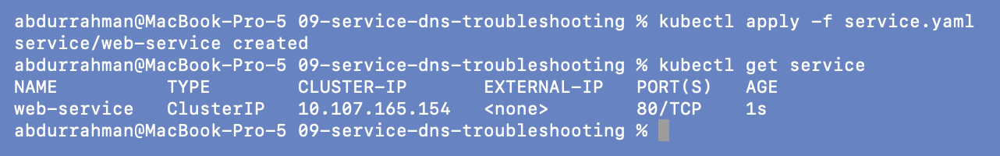

`web-service` got ClusterIP `10.107.165.154`. Creating a Service always succeeds, even
when it can't route anywhere, as the next step shows.

## 3–4. Check the Service and its endpoints

### Problem found: the lecture's Service has no endpoints

```bash
kubectl describe service web-service
kubectl get endpoints web-service
kubectl get pods --show-labels
```

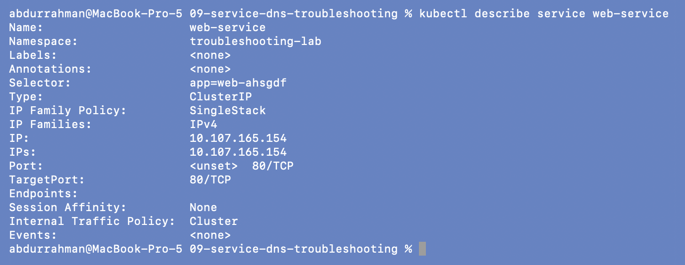
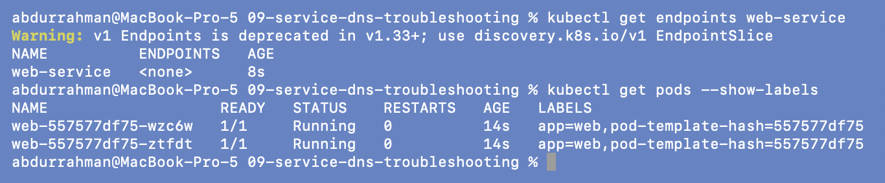

The README expects two Pod IPs. Instead, `Endpoints:` is empty and
`kubectl get endpoints` shows `<none>`.

**Root cause.** `Selector: app=web-ahsgdf`, but the Pods are labelled `app=web`. The
README itself says the Service uses `app: web`, so the YAML has stray characters in the
selector. No Pod matches, so the Service has no backends.

The yellow `Warning: v1 Endpoints is deprecated in v1.33+` is kubectl telling me that on
Kubernetes 1.37 the real objects are **EndpointSlices**; `get endpoints` still works, so
I show both below.

**Fix.** Set the selector in my copy of `service.yaml` back to `app: web` (with a comment)
and re-apply. A Service's selector *can* be changed in place.

```bash
grep -A3 "selector" service.yaml
kubectl apply -f service.yaml
kubectl describe service web-service
kubectl get endpoints web-service
kubectl get endpointslices -l kubernetes.io/service-name=web-service
kubectl get pods -o wide
```

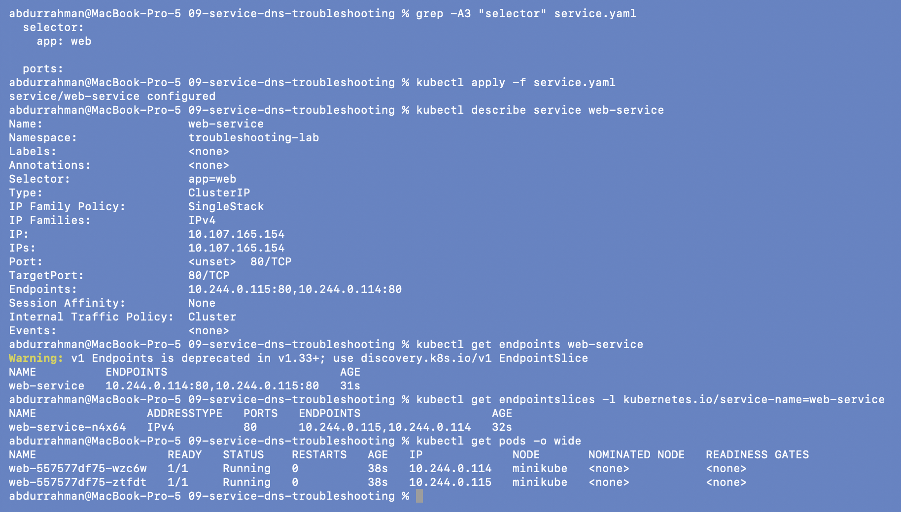

`service/web-service configured`. Endpoints are now `10.244.0.114:80,10.244.0.115:80`,
which are exactly the two Pod IPs from `get pods -o wide`, and the EndpointSlice
`web-service-n4x64` lists the same addresses.

## 6. Create the DNS test Pod

### Problem found: the DNS test image doesn't exist

```bash
kubectl apply -f dns-test-pod.yaml
kubectl wait --for=condition=Ready pod/dns-test --timeout=180s
kubectl get pod dns-test
```

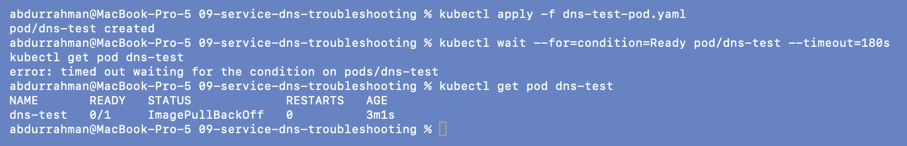

The wait timed out after 3 minutes and the Pod sat in `ImagePullBackOff`, the same failure
type as section 07, so I used the same approach.

```bash
kubectl events --for pod/dns-test --types=Warning
docker manifest inspect registry.k8s.io/e2e-test-images/dnsutils:1.3
docker manifest inspect registry.k8s.io/e2e-test-images/jessie-dnsutils:1.3 | grep architecture
```

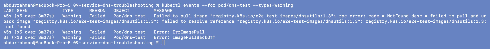
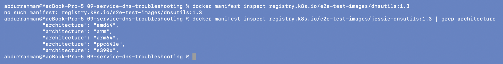

**Root cause.** `registry.k8s.io/e2e-test-images/dnsutils:1.3` → `not found` / `no such
manifest`. The Kubernetes test image with `nslookup` and `dig` is named
**`jessie-dnsutils`** (the one the official "Debugging DNS Resolution" page uses), and tag
`1.3` exists for arm64, which my Apple Silicon minikube needs.

**Fix.** Changed the image in my copy of `dns-test-pod.yaml` (commented) and recreated
the Pod:

```bash
kubectl delete pod dns-test
kubectl apply -f dns-test-pod.yaml
kubectl wait --for=condition=Ready pod/dns-test --timeout=180s
kubectl get pod dns-test
```

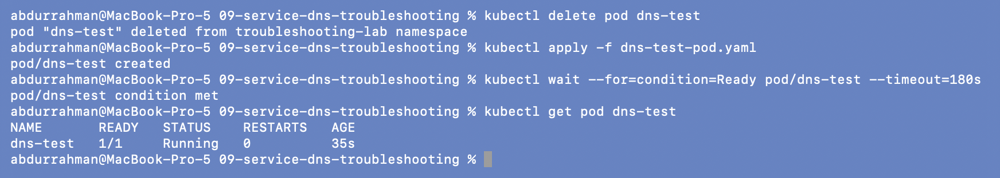

## 7. Test Service DNS

```bash
kubectl exec -it dns-test -- nslookup web-service
kubectl exec -it dns-test -- nslookup web-service.default.svc.cluster.local
kubectl exec -it dns-test -- nslookup web-service.troubleshooting-lab.svc.cluster.local
```

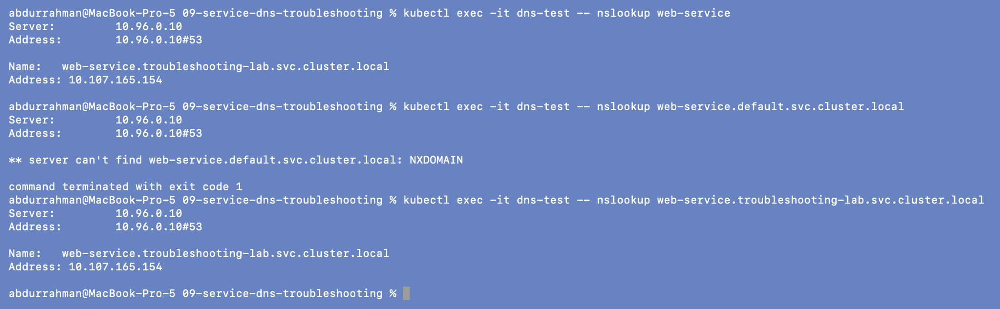

- The short name `web-service` resolves to `10.107.165.154`, the ClusterIP. The answer
  is `web-service.troubleshooting-lab.svc.cluster.local` because the Pod's own namespace
  is in its DNS search list.
- The lecture's FQDN `web-service.default.svc.cluster.local` gives **NXDOMAIN**. It isn't
  broken: I ran this session in namespace `troubleshooting-lab`, not `default`, and there's
  no `web-service` in `default`. A small DNS issue of its own: the namespace part of the
  FQDN has to be the Service's namespace.
- With the right namespace (`...troubleshooting-lab.svc.cluster.local`) it resolves.

## 8. Test the HTTP connection

### Problem found: the DNS image has no `wget`

```bash
kubectl exec dns-test -- wget -qO- http://web-service
kubectl exec dns-test -- sh -c 'for t in wget curl nc dig nslookup; do printf "%-9s" $t; command -v $t || echo "(not installed)"; done'
```

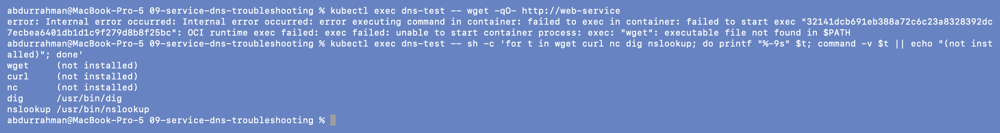

`exec: "wget": executable file not found in $PATH`. The image only has `dig` and
`nslookup`, no `wget`, `curl` or `nc`.

**Fix.** Use a throwaway busybox Pod for the HTTP test (busybox has `wget`). `--rm`
deletes it when the command finishes. I noted this in the comment in `dns-test-pod.yaml`.

```bash
kubectl run http-test --rm -i --restart=Never --image=busybox:1.36 -- sh -c 'sleep 2; wget -qO- http://web-service'
```

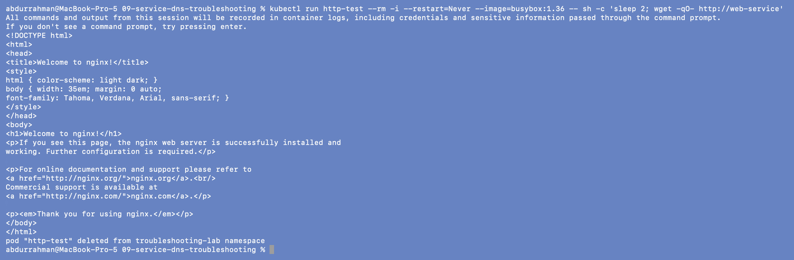

The nginx welcome page came back: DNS resolved, the Service routed to an endpoint, and
the Pod answered. (The `sleep 2` is there because without it kubectl sometimes attached
after wget had already printed, and part of the output was lost.)

## 9. Intentionally break a Service

```bash
kubectl apply -f broken-service.yaml
kubectl get service broken-service
kubectl get endpoints broken-service
kubectl describe service broken-service | grep -E "Selector|Endpoints"
```

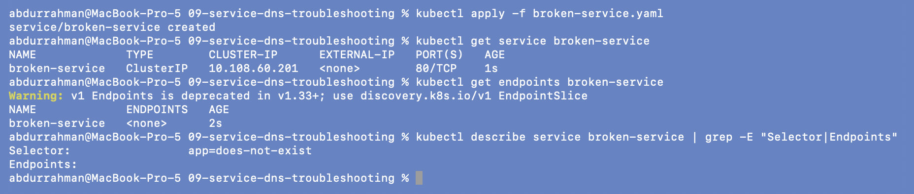

`broken-service` has a ClusterIP (`10.108.60.201`) but `ENDPOINTS <none>`, because
`Selector: app=does-not-exist` matches no Pod.

### "DNS works but HTTP fails" (README section 17)

```bash
kubectl exec -it dns-test -- nslookup broken-service
kubectl run http-test --rm -i --restart=Never --image=busybox:1.36 -- sh -c 'sleep 2; wget -qO- -T 3 http://broken-service'
```

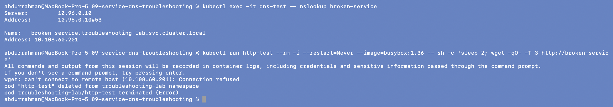

This is the case the lecture warns about. `nslookup broken-service` resolves
fine (`10.108.60.201`), yet HTTP fails with
`can't connect to remote host (10.108.60.201): Connection refused`. DNS isn't the problem:
the name exists as soon as the Service object exists, endpoints or not. kube-proxy
rejects connections to a ClusterIP that has no endpoints, which is why it's an immediate
"refused" and not a timeout.

## 10–11. Remove the broken Service

```bash
kubectl delete service broken-service
kubectl get service web-service
kubectl get endpoints web-service
```

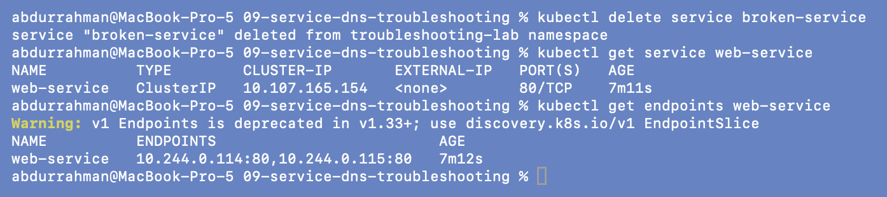

## 13. Compare Pod labels with the selector

```bash
kubectl get pods --show-labels
kubectl describe service web-service | grep Selector
```

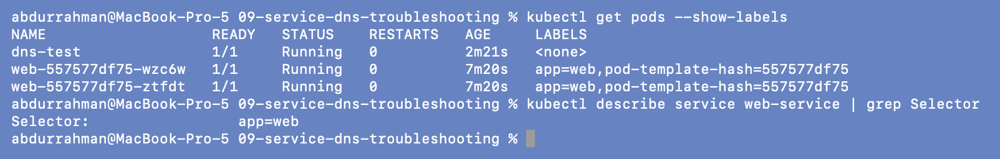

Both web Pods carry `app=web` and the selector is `app=web`. `dns-test` has no labels,
so it's correctly not an endpoint.

## 14–16. Check CoreDNS

These are read-only looks at `kube-system`.

```bash
kubectl get pods -n kube-system
kubectl get pods -n kube-system -l k8s-app=kube-dns -o wide
kubectl exec -it dns-test -- cat /etc/resolv.conf
```

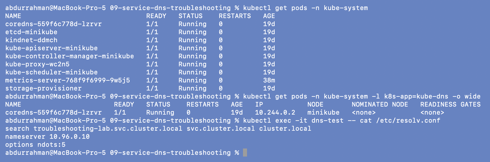

- One `coredns` Pod, `1/1 Running`, 0 restarts.
- The Pod's `/etc/resolv.conf` points at `nameserver 10.96.0.10` with search domains
  `troubleshooting-lab.svc.cluster.local svc.cluster.local cluster.local` and
  `options ndots:5`. That search list is why the short name `web-service` worked in step 7.

```bash
kubectl get service kube-dns -n kube-system
kubectl logs -n kube-system -l k8s-app=kube-dns
```

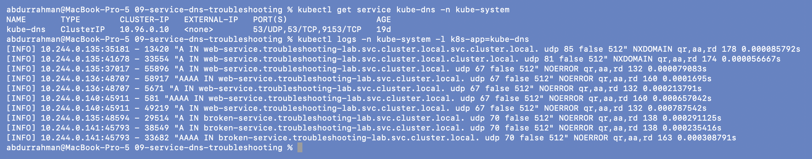

`10.96.0.10` is the ClusterIP of the `kube-dns` Service, so Pods reach CoreDNS through a
normal Service. The minikube CoreDNS has query logging on, so I can see my own lookups
from `10.244.0.135` (dns-test). The first two lines are `NXDOMAIN` for
`web-service.troubleshooting-lab.svc.cluster.local.svc.cluster.local` and
`...cluster.local.cluster.local`. That's `ndots:5` at work: a name with fewer than 5 dots
is tried with each search domain appended before being tried as-is, so a "failed" query in
the logs isn't necessarily a problem. `-l` with logs shows only the last 10 lines per
Pod by default, which is why older queries aren't there.

## Cleanup

```bash
kubectl delete -f deployment.yaml -f service.yaml -f dns-test-pod.yaml
kubectl get all
```

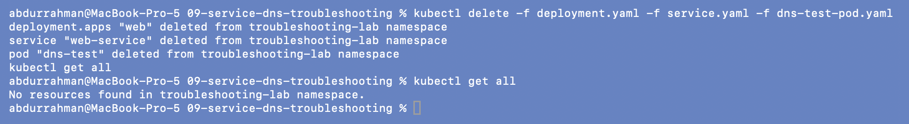

---

## What I understood

- A Service is only as good as its endpoints. An empty `Endpoints:` line almost always means
  the selector doesn't match the Pod labels (or the matching Pods aren't Ready).
- DNS and connectivity are separate checks. `nslookup` succeeding only proves the Service
  object exists; `wget`/`curl` proves traffic reaches a Pod.
- The DNS name includes the namespace: `<svc>.<ns>.svc.cluster.local`. The short name
  only works from the same namespace because of the search list in `/etc/resolv.conf`.
- A good debug toolkit needs the right tools in it. The lecture's test image name was
  wrong, and the fixed one had no HTTP client, so a `kubectl run --rm` busybox Pod was the
  quickest way to test HTTP.
