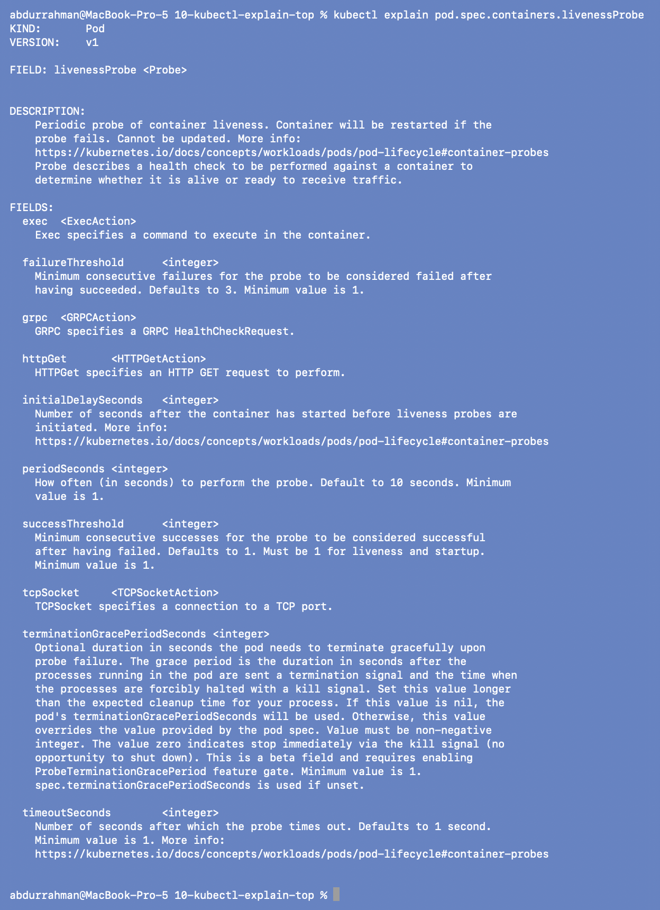
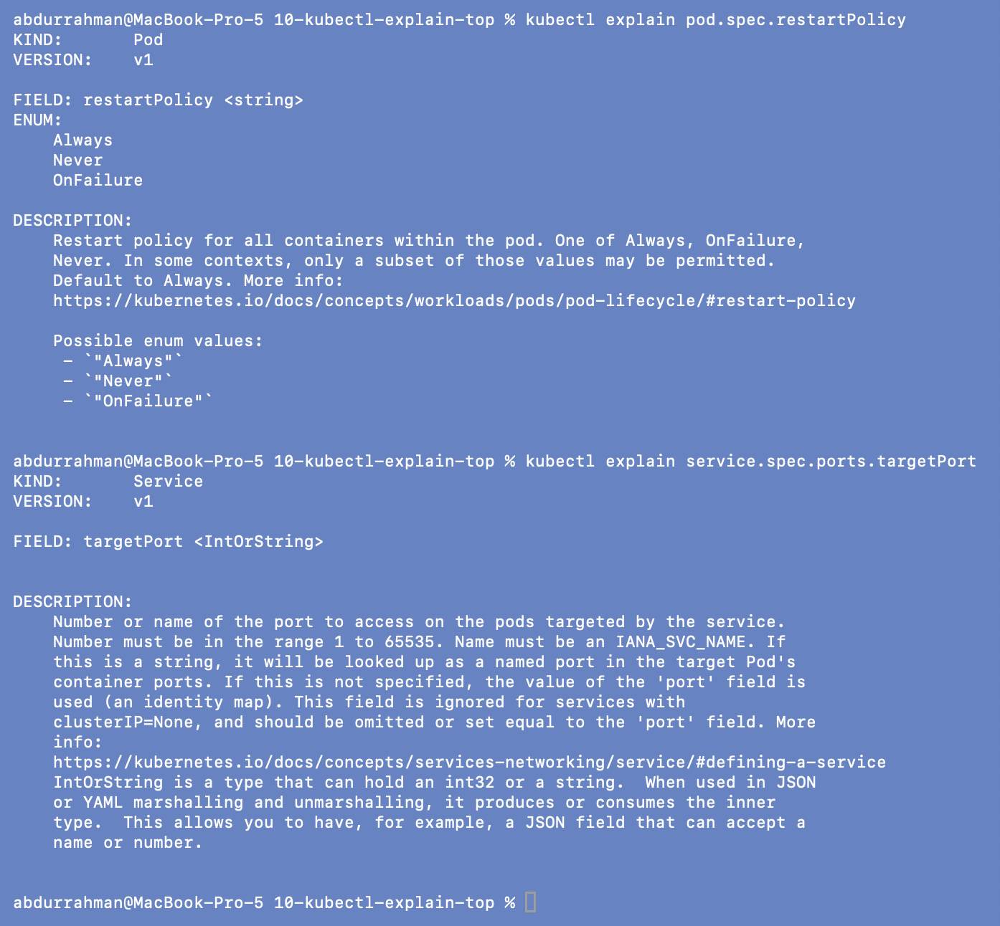
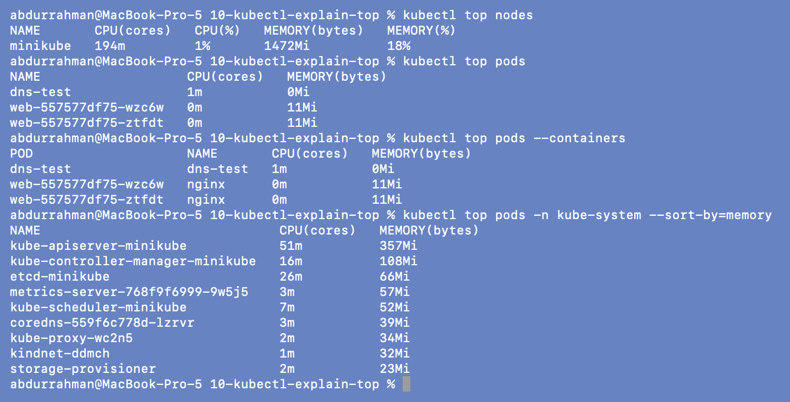

# 10: `kubectl explain` and `kubectl top` (addition)

**Name:** Abdur Rahman Ibne Munir
**Enrollment number:** 24BCS10244

Session 14, Task 1. The homework lists `explain` and `top` alongside the other commands,
but the lecture folders don't cover them, so this folder is my addition. No manifests:
`explain` reads the API schema, and `top` reads live metrics from the minikube
`metrics-server` addon. I ran `top` while the 09 Deployment was still up so there would
be Pods to measure.

---

## 1. `kubectl explain`: field documentation from the cluster

```bash
kubectl explain pod.spec.containers.livenessProbe
```



`explain` prints the documentation for any field path straight from the cluster's API
schema, so it always matches the cluster's version (here v1.37). For `livenessProbe` it
lists the probe types (`exec`, `grpc`, `httpGet`, `tcpSocket`) and the timing fields with
their defaults: `periodSeconds` 10, `timeoutSeconds` 1, `failureThreshold` 3. A failing
liveness probe is another common cause of CrashLoopBackOff.

```bash
kubectl explain pod.spec.restartPolicy
kubectl explain service.spec.ports.targetPort
```



I looked these two up because they turned out to be the root causes of two problems later:

- `restartPolicy`: `Always | Never | OnFailure`, **default `Always`**. That default is why
  the scenario 1 and 5 scripts keep restarting after a clean exit 0
  ([scenarios](../scenarios/README.md)).
- `targetPort` is `IntOrString`: a number *or the name of a container port*, and it
  defaults to `port` if unset. Pointing it at a port nothing listens on is the bug in
  [13-pod-networking-targetport](../13-pod-networking-targetport/README.md), and a named
  port is how I fixed it.

## 2. `kubectl top`: live CPU and memory

```bash
kubectl top nodes
kubectl top pods
kubectl top pods --containers
kubectl top pods -n kube-system --sort-by=memory
```



- The node uses 194m CPU (1% of 15 cores) and 1472Mi memory (18%), so the cluster had
  plenty of room. That matters when deciding whether `Insufficient cpu/memory` in a
  `FailedScheduling` event is a real capacity problem or a bad request (scenario 3).
- In my namespace each nginx Pod uses about 11Mi; `dns-test` (just `sleep`) rounds to 0Mi.
  `--containers` splits it per container.
- In `kube-system` (read-only) the API server is the biggest user at 357Mi.

`top` shows *usage*; `describe node` shows *requests*. The scheduler places Pods by
requests, not by actual usage.

---

## What I understood

- `kubectl explain <resource>.<field>` is the fastest way to check a field's type, allowed
  values and default without leaving the terminal, and it matches the cluster's version.
- Knowing the defaults explained two of my bugs: `restartPolicy: Always` and
  `targetPort` defaulting to `port`.
- `kubectl top` needs metrics-server. It's the first check for "is this Pod about to be
  OOMKilled?" or "is the node actually busy?".
- Usage (`top`) and requests (`describe node` → Allocated resources) are different numbers,
  and scheduling only looks at requests.
