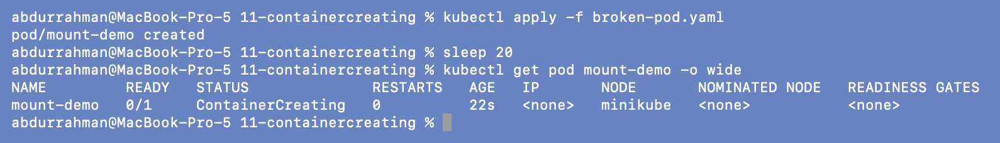
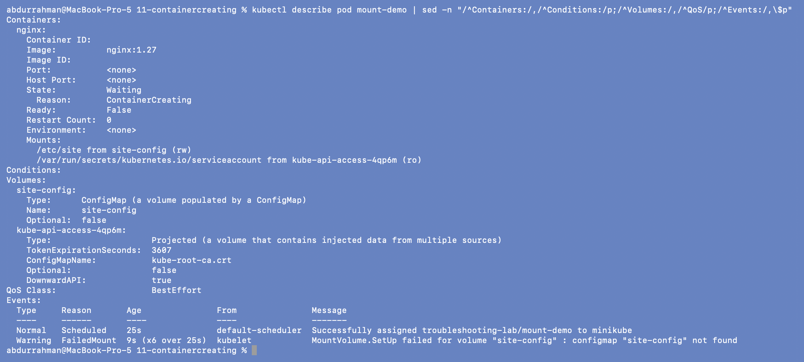
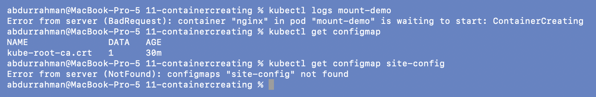
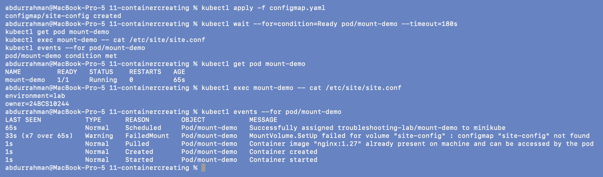
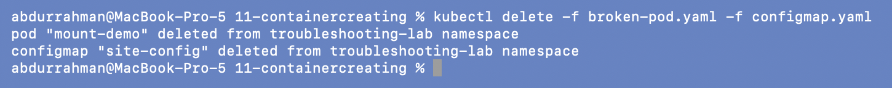

# 11: Stuck in `ContainerCreating` (addition)

**Name:** Abdur Rahman Ibne Munir
**Enrollment number:** 24BCS10244

Session 14, Task 2. The homework lists `ContainerCreating` as a problem to troubleshoot, but
the lecture has no example of it, so I wrote a minimal one: a Pod that mounts a
ConfigMap that doesn't exist yet.

Files (my own):

| File | What it is |
|---|---|
| `broken-pod.yaml` | `mount-demo`: nginx with a `configMap` volume `site-config` mounted at `/etc/site` |
| `configmap.yaml` | the missing `site-config` ConfigMap (`site.conf` with two lines) |

---

## 1. Identify

```bash
kubectl apply -f broken-pod.yaml
sleep 20
kubectl get pod mount-demo -o wide
```



After 22 s it's still `ContainerCreating`. Unlike the Pending Pod in 08, `NODE` is
`minikube`, so scheduling worked and the hold-up is on the node.

## 2. Investigate: describe

```bash
kubectl describe pod mount-demo | sed -n "/^Containers:/,/^Conditions:/p;/^Volumes:/,/^QoS/p;/^Events:/,\$p"
```



- `State: Waiting, Reason: ContainerCreating`, with an empty `Container ID`: no container
  exists yet.
- `Volumes: site-config: Type ConfigMap, Name site-config, Optional: false`.
- The event that explains it, from the kubelet:

```text
Warning  FailedMount  (x6 over 25s)  kubelet  MountVolume.SetUp failed for volume "site-config" : configmap "site-config" not found
```

The kubelet won't start a container until all its volumes are set up, and it keeps
retrying the mount (6 tries in 25 s).

## 3. Confirm the root cause

```bash
kubectl logs mount-demo
kubectl get configmap
kubectl get configmap site-config
```



`kubectl logs` can't help: `container "nginx" ... is waiting to start: ContainerCreating`.
The namespace only has the automatic `kube-root-ca.crt` ConfigMap, and
`site-config` is `NotFound`.

**Root cause:** the Pod depends on a ConfigMap that was never created (in real life:
forgotten in the deploy, wrong name, or created in a different namespace). Since the
volume isn't `optional: true`, the kubelet refuses to start the container.

## 4. Fix and verify

The Pod spec is fine; the missing object just needs to exist. I created the ConfigMap
and didn't touch the Pod:

```bash
kubectl apply -f configmap.yaml
kubectl wait --for=condition=Ready pod/mount-demo --timeout=180s
kubectl get pod mount-demo
kubectl exec mount-demo -- cat /etc/site/site.conf
kubectl events --for pod/mount-demo
```



On its next retry the kubelet mounted the volume, and the same Pod went `1/1 Running`
with no restart or recreate. The file is in the container
(`environment=lab`, `owner=24BCS10244`). The event list tells the whole story:
`FailedMount (x7 over 65s)`, then `Pulled` → `Created` → `Started`.

```bash
kubectl delete -f broken-pod.yaml -f configmap.yaml
```



---

## What I understood

- `ContainerCreating` that doesn't go away means the kubelet is stuck *before* starting the
  container: usually a volume (missing ConfigMap/Secret/PVC), an image still pulling, or
  a network (CNI) setup error.
- `kubectl logs` is useless here because no container has run. `describe` events
  (`FailedMount`, `FailedCreatePodSandBox`) are the place to look.
- For a missing ConfigMap/Secret the fix can be to create the object; the kubelet retries
  on its own and the Pod recovers without being recreated.
- `optional: true` on the volume would let the Pod start without it, but then the app
  runs without its config, which may be worse than not starting.
