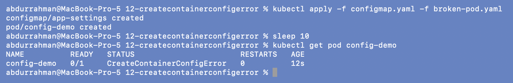
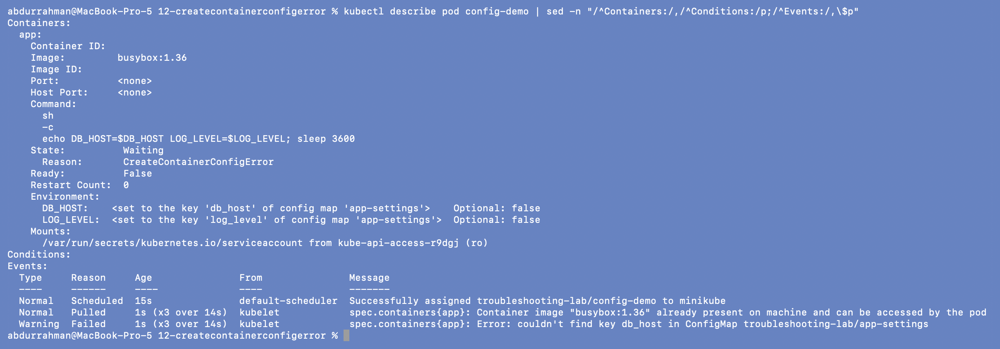
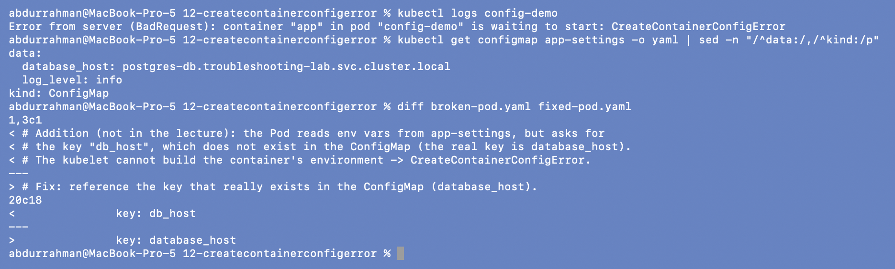
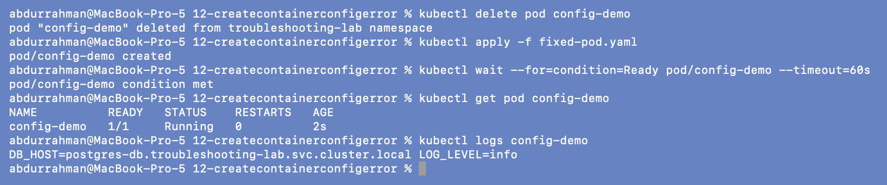
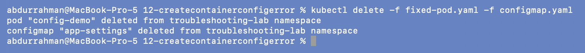

# 12: Configuration issue: `CreateContainerConfigError` (addition)

**Name:** Abdur Rahman Ibne Munir
**Enrollment number:** 24BCS10244

Session 14, Task 2 ("configuration issues"). Not covered in the lecture, so this is my own
minimal example: a Pod that reads an environment variable from a ConfigMap key that
doesn't exist.

Files (my own):

| File | What it is |
|---|---|
| `configmap.yaml` | `app-settings` with keys `database_host` and `log_level` |
| `broken-pod.yaml` | `config-demo`: env `DB_HOST` from key **`db_host`** (wrong), `LOG_LEVEL` from `log_level` |
| `fixed-pod.yaml` | same Pod, `DB_HOST` from key **`database_host`** |

---

## 1. Identify

```bash
kubectl apply -f configmap.yaml -f broken-pod.yaml
sleep 10
kubectl get pod config-demo
```



`CreateContainerConfigError`, `0/1`, `RESTARTS 0`. The ConfigMap exists, so this isn't
the missing-object case from 11.

## 2. Investigate: describe

```bash
kubectl describe pod config-demo | sed -n "/^Containers:/,/^Conditions:/p;/^Events:/,\$p"
```



- `State: Waiting, Reason: CreateContainerConfigError`, empty `Container ID`.
- `Environment:` shows where each variable comes from:
  `DB_HOST: <set to the key 'db_host' of config map 'app-settings'>  Optional: false`.
- The event from the kubelet names it exactly:

```text
Warning  Failed  (x3 over 14s)  kubelet  Error: couldn't find key db_host in ConfigMap troubleshooting-lab/app-settings
```

The image was pulled fine (`Pulled x3`). The kubelet failed while building the
container's *configuration* (its environment), before creating it.

## 3. Confirm the root cause

```bash
kubectl logs config-demo
kubectl get configmap app-settings -o yaml | sed -n "/^data:/,/^kind:/p"
diff broken-pod.yaml fixed-pod.yaml
```



Again `kubectl logs` has nothing (`waiting to start: CreateContainerConfigError`). The
ConfigMap's real keys are `database_host` and `log_level`; there's no `db_host`.

**Root cause:** a key-name mismatch between the Pod spec (`db_host`) and the ConfigMap
(`database_host`). The kind of bug that slips in when someone renames a key in one place
but not the other.

## 4. Fix and verify

`env` can't be changed on an existing Pod, so I deleted it and applied the fixed spec:

```bash
kubectl delete pod config-demo
kubectl apply -f fixed-pod.yaml
kubectl wait --for=condition=Ready pod/config-demo --timeout=60s
kubectl get pod config-demo
kubectl logs config-demo
```



`1/1 Running`, and the app prints both values from the ConfigMap:
`DB_HOST=postgres-db.troubleshooting-lab.svc.cluster.local LOG_LEVEL=info`.

```bash
kubectl delete -f fixed-pod.yaml -f configmap.yaml
```



---

## What I understood

- `CreateContainerConfigError` means the kubelet couldn't assemble the container's config:
  a missing ConfigMap/Secret used in `env`/`envFrom`, or a missing key in one.
- The event message names the object and the key, and `describe` → `Environment` shows
  the mapping, so comparing that with `kubectl get configmap -o yaml` finds it quickly.
- It differs from 11: a missing object used as a **volume** gives `ContainerCreating` +
  `FailedMount`; a missing object or key used as **env** gives `CreateContainerConfigError`.
- If the variable were genuinely optional, `optional: true` on the `configMapKeyRef` would
  let the container start without it.
