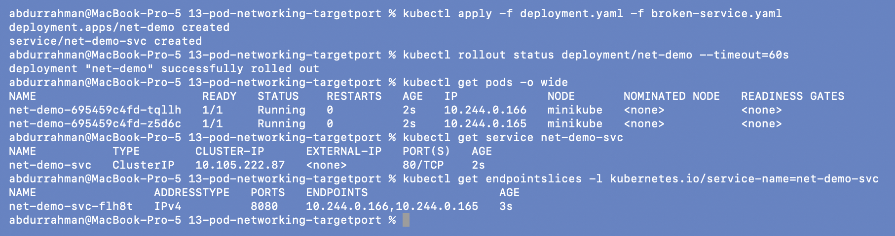
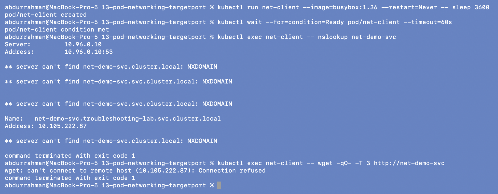
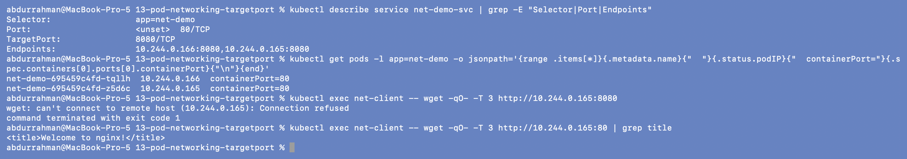
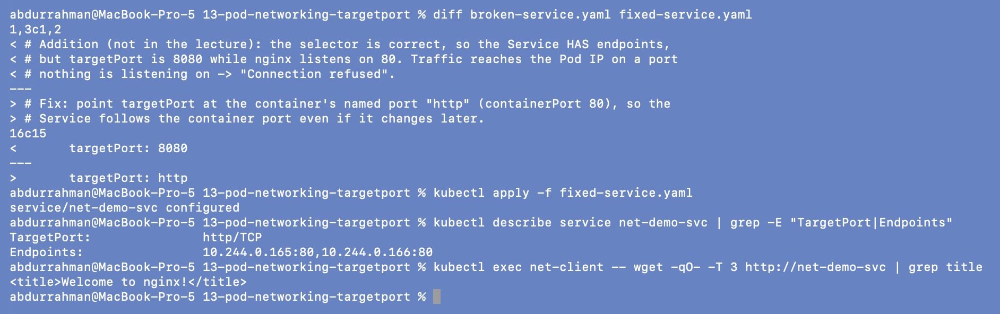
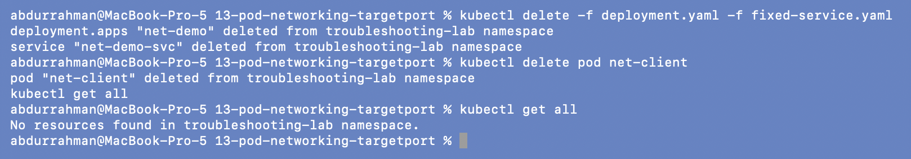

# 13: Pod networking issue: Service `targetPort` mismatch (addition)

**Name:** Abdur Rahman Ibne Munir
**Enrollment number:** 24BCS10244

Session 14, Task 2 ("pod networking issues"). The lecture's Service problems are all
"no endpoints" (selector mismatch). This addition covers the harder case the lecture
mentions in 09 §17 but never demonstrates: the Service **has** endpoints, DNS works, and
traffic still fails, because the Service sends it to the wrong port on the Pods.

Files (my own):

| File | What it is |
|---|---|
| `deployment.yaml` | `net-demo`: 2 nginx Pods, `containerPort: 80` named `http` |
| `broken-service.yaml` | `net-demo-svc`: correct selector, but `targetPort: 8080` |
| `fixed-service.yaml` | same Service with `targetPort: http` |

---

## 1. Deploy: everything looks healthy

```bash
kubectl apply -f deployment.yaml -f broken-service.yaml
kubectl rollout status deployment/net-demo --timeout=60s
kubectl get pods -o wide
kubectl get service net-demo-svc
kubectl get endpointslices -l kubernetes.io/service-name=net-demo-svc
```



Both Pods are `1/1 Running`, the Service has a ClusterIP (`10.105.222.87`), and, unlike in
09, the EndpointSlice **does** list both Pod IPs. The only odd detail is `PORTS 8080`.

## 2. Identify the symptom from a client Pod

```bash
kubectl run net-client --image=busybox:1.36 --restart=Never -- sleep 3600
kubectl wait --for=condition=Ready pod/net-client --timeout=60s
kubectl exec net-client -- nslookup net-demo-svc
kubectl exec net-client -- wget -qO- -T 3 http://net-demo-svc
```



- DNS works: `net-demo-svc.troubleshooting-lab.svc.cluster.local` → `10.105.222.87`.
  (busybox's `nslookup` also prints NXDOMAIN for the other search-domain attempts and
  exits 1 even though it found the answer, so that output looks scarier than it is.)
- HTTP fails: `can't connect to remote host (10.105.222.87): Connection refused`.

So DNS is fine and endpoints exist, but nothing answers.

## 3. Investigate: compare the Service port with the container port

```bash
kubectl describe service net-demo-svc | grep -E "Selector|Port|Endpoints"
kubectl get pods -l app=net-demo -o jsonpath='{range .items[*]}{.metadata.name}{"  "}{.status.podIP}{"  containerPort="}{.spec.containers[0].ports[0].containerPort}{"\n"}{end}'
kubectl exec net-client -- wget -qO- -T 3 http://10.244.0.165:8080
kubectl exec net-client -- wget -qO- -T 3 http://10.244.0.165:80 | grep title
```



- The Service forwards to `TargetPort: 8080/TCP`, so the endpoints are
  `10.244.0.166:8080,10.244.0.165:8080`.
- The containers expose `containerPort=80`.
- Going around the Service straight to a Pod IP: port **8080 → Connection refused**, port
  **80 → "Welcome to nginx!"**. Pod-to-pod networking works, and the app works on 80.

**Root cause:** the Service's `targetPort` (8080) doesn't match the port the app listens
on (80). kube-proxy faithfully forwards ClusterIP:80 → PodIP:8080, where nothing is
listening, so the Pod's kernel answers with a TCP reset, which shows up as "Connection
refused".

## 4. Fix and verify

```bash
diff broken-service.yaml fixed-service.yaml
kubectl apply -f fixed-service.yaml
kubectl describe service net-demo-svc | grep -E "TargetPort|Endpoints"
kubectl exec net-client -- wget -qO- -T 3 http://net-demo-svc | grep title
```



I set `targetPort: http`, the *name* of the container port, instead of hard-coding 80. Now
`TargetPort: http/TCP`, the endpoints are `...:80`, and `wget http://net-demo-svc` returns
the nginx page. With a named port, if the container port ever changes, the Service follows.

```bash
kubectl delete -f deployment.yaml -f fixed-service.yaml
kubectl delete pod net-client
kubectl get all
```



---

## What I understood

- "Endpoints exist" doesn't mean the Service works. The endpoint *port* has to be one the
  app actually listens on.
- Testing the Pod IP directly splits the problem in two: if PodIP:containerPort works but
  the Service doesn't, the Service definition (selector, port, targetPort) is wrong, not
  the network.
- `Connection refused` = reached the host, nothing listening on that port (or no
  endpoints). A timeout would point more towards a NetworkPolicy or routing problem.
- Named ports (`targetPort: http`) keep the Service and the container in sync.
