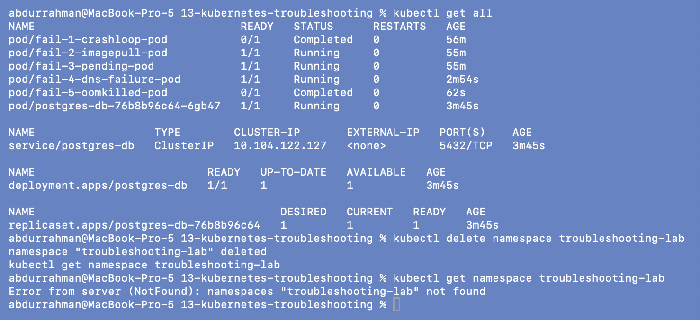

# Kubernetes Troubleshooting

**Name:** Abdur Rahman Ibne Munir
**Enrollment number:** 24BCS10244

Class session 14. Lecture material: [`session-14-kubernetes-troubleshooting`](https://github.com/Nency-Ravaliya/devops-heros/tree/main/session-14-kubernetes-troubleshooting)
in the course repo. The question for the session: *"My Kubernetes application is not
working. How do I find out why?"* I practised the core commands (`get`, `describe`,
`logs`, `exec`, events, `explain`, `top`), then broke Pods and Services in every way the
homework lists. For each one I identified the symptom, investigated, found the root
cause, fixed it and verified the fix. Finally I did the mini-project and the lecture's
five-Pod triage scenarios. Every command was run in a real terminal on my Mac against a
single-node minikube cluster, and every screenshot in this folder is that terminal
(136 in total).

## Homework tasks → where they are

| Task | What was asked | Folder |
|---|---|---|
| 1 | `kubectl get` (+ `-o wide`) | [`01-kubectl-get/`](01-kubectl-get/) |
| 1 | `kubectl describe` | [`02-kubectl-describe/`](02-kubectl-describe/) |
| 1 | `kubectl logs` | [`03-kubectl-logs/`](03-kubectl-logs/) |
| 1 | `kubectl exec` | [`04-kubectl-exec/`](04-kubectl-exec/) |
| 1 | events | [`05-events/`](05-events/) |
| 1 | `kubectl explain`, `kubectl top` (my addition) | [`10-kubectl-explain-top/`](10-kubectl-explain-top/) |
| 2 | CrashLoopBackOff | [`06-crashloopbackoff/`](06-crashloopbackoff/), [`scenarios/` #1](scenarios/README.md#scenario-1-crashloopbackoff-missing-environment-variable) |
| 2 | ImagePullBackOff / ErrImagePull | [`07-imagepullbackoff/`](07-imagepullbackoff/), [`scenarios/` #2](scenarios/README.md#scenario-2-imagepullbackoff-image-that-doesnt-exist) |
| 2 | Pending | [`08-pending-pods/`](08-pending-pods/), [`scenarios/` #3](scenarios/README.md#scenario-3-pending-impossible-resource-requests) |
| 2 | ContainerCreating (my addition) | [`11-containercreating/`](11-containercreating/) |
| 2 | Service connectivity issues | [`09-service-dns-troubleshooting/`](09-service-dns-troubleshooting/), [`mini-project/`](mini-project/) |
| 2 | DNS issues | [`09-service-dns-troubleshooting/`](09-service-dns-troubleshooting/), [`scenarios/` #4](scenarios/README.md#scenario-4-dns-failure-wrong-hostname-missing-target) |
| 2 | Pod networking issues (my addition) | [`13-pod-networking-targetport/`](13-pod-networking-targetport/) |
| 2 | Configuration issues (my addition) | [`12-createcontainerconfigerror/`](12-createcontainerconfigerror/) |
| 2 | (lecture extra) OOMKilled | [`scenarios/` #5](scenarios/README.md#scenario-5-oomkilled) |
| 3 | Troubleshooting mini-project, answers, troubleshooting table, README questions | [`mini-project/`](mini-project/README.md) |

Folders 01–09, `mini-project/` and `scenarios/` follow the lecture. Folders 10–13 are small
additions of my own for items the homework lists but the lecture doesn't demonstrate.

## Folder structure

```text
13-kubernetes-troubleshooting/
├── 01-kubectl-get/                  pod.yaml
├── 02-kubectl-describe/             demo-pod.yaml (comment added)
├── 03-kubectl-logs/                 pod.yaml
├── 04-kubectl-exec/                 pod.yaml
├── 05-events/                       pod.yaml
├── 06-crashloopbackoff/             broken-pod.yaml  fixed-pod.yaml  slow-crash-pod.yaml (mine)
├── 07-imagepullbackoff/             broken-pod.yaml  fixed-pod.yaml
├── 08-pending-pods/                 broken-pod.yaml  fixed-pod.yaml
├── 09-service-dns-troubleshooting/  deployment.yaml  service.yaml (fixed)  broken-service.yaml
│                                    dns-test-pod.yaml (fixed)
├── 10-kubectl-explain-top/          (commands only)
├── 11-containercreating/            broken-pod.yaml  configmap.yaml
├── 12-createcontainerconfigerror/   configmap.yaml  broken-pod.yaml  fixed-pod.yaml
├── 13-pod-networking-targetport/    deployment.yaml  broken-service.yaml  fixed-service.yaml
├── mini-project/                    deployment.yaml  service.yaml  broken-pod.yaml  fixed-pod.yaml (mine)
├── scenarios/                       triage_all.sh
│   ├── scenario-1-crashloop/        broken.yaml  fixed-attempt-1.yaml  fixed.yaml
│   ├── scenario-2-imagepull/        broken.yaml  fixed.yaml
│   ├── scenario-3-pending/          broken.yaml  fixed.yaml
│   ├── scenario-4-dns-failure/      broken.yaml  postgres-db.yaml  fixed.yaml
│   └── scenario-5-oomkilled/        broken.yaml  fixed-attempt-1.yaml  fixed.yaml
├── screenshots/                     01-delete-namespace (final cleanup)
└── README.md
```

Each folder has a `screenshots/` directory and a README that walks through them in order.
The lecture's `02-kubectl-describe/demo-chart/` (an unused default `helm create` scaffold)
and `09-service-dns-troubleshooting/pod.yaml` (a stray copy of the logs Pod) aren't used
by the lesson, so I didn't copy them.

## Environment

- macOS (Apple Silicon), Docker Desktop, minikube v1.39 on the docker driver, Kubernetes
  v1.37.0, one node (15 CPUs, about 7.7Gi allocatable memory), containerd runtime. The
  `metrics-server` addon was already enabled, which `kubectl top` needs.
- **Namespace.** This whole session ran in the namespace `troubleshooting-lab`, which I
  created on screen as the first step
  ([`01-kubectl-get`](01-kubectl-get/README.md#0-create-my-namespace)). It was set as the
  default namespace of my terminal's kubeconfig so other sessions could run side by side,
  which is why the commands have no `-n`. Looks at `kube-system` and the node were
  read-only. I deleted the namespace at the end:

  ```bash
  kubectl get all
  kubectl delete namespace troubleshooting-lab
  kubectl get namespace troubleshooting-lab
  ```

  

- **Namespace-dependent names.** The lecture's FQDN `web-service.default.svc.cluster.local`
  becomes `web-service.troubleshooting-lab.svc.cluster.local` for me (I show both, 09).
  Scenario 4 targets a `production` namespace; I didn't create one on the shared
  cluster and put a stand-in `postgres-db` Service in my namespace instead.
- **Ports.** The lecture has no fixed local port. For the mini-project's check from my Mac
  I port-forwarded the Service to local port **18140** (`kubectl port-forward
  service/troubleshooting-service 18140:80`).
- **Docker Hub rate limit.** Anonymous pulls from Docker Hub hit `429 Too Many Requests`
  during the scenarios. I pulled the four images the scenarios need through Google's
  Docker Hub mirror (`mirror.gcr.io`) into the minikube node and tagged them with their
  usual names, so the lecture YAMLs ran unchanged
  ([details](scenarios/README.md#problem-found-docker-hub-rate-limit-on-the-first-run)).
  The same limit showed up in the mini-project's events, and I document it there as a
  real-world complication.
- Fixing a Pod's `image`, `env`, `command`, `nodeSelector` or `resources` meant
  delete + re-apply, since those fields can't be changed on a running Pod. Services and
  ConfigMaps were fixed in place with `kubectl apply`.

## Problems found in the lecture material

I ran each step as written first, took a screenshot of the failure, then fixed my copy.
Each fixed file has a comment explaining the change.

| Where | What happened | Fix |
|---|---|---|
| top-level `README.md` | lists `08-pending-pod` and `09-service-dns`; the real folders are `08-pending-pods` and `09-service-dns-troubleshooting` | used the real names |
| `02` README | `kubectl apply -f pod.yaml` → path does not exist; the file is `demo-pod.yaml` | apply `demo-pod.yaml` ([details](02-kubectl-describe/README.md#problem-found-the-readmes-file-name-is-wrong)) |
| `03` README | `kubectl logs logs-demo --previous` → `previous terminated container "app" ... not found` (RESTARTS 0) | expected behaviour; showed `--previous` working in 06 |
| `06` README | `--previous` also fails on `crash-demo`: the previous container is already garbage-collected when the current one is dead too | used plain `logs`; added `slow-crash-pod.yaml` to show when `--previous` works ([details](06-crashloopbackoff/README.md#problem-found---previous-fails-even-on-a-crash-looping-pod)) |
| `09/service.yaml` | selector `app: web-ahsgdf` matches no Pod → no endpoints | `app: web` |
| `09/dns-test-pod.yaml` | image `registry.k8s.io/e2e-test-images/dnsutils:1.3` doesn't exist → ImagePullBackOff | `jessie-dnsutils:1.3` |
| `09` README | `kubectl exec dns-test -- wget ...` → `wget` not in the DNS image | HTTP test from a `kubectl run --rm` busybox Pod |
| `09` README | `kubectl get endpoints` prints a v1.33+ deprecation warning | also showed `kubectl get endpointslices` |
| `scenarios/triage_all.sh` | points to a `README.md` that doesn't exist | wrote [`scenarios/README.md`](scenarios/README.md) |
| scenarios 1 and 5 | scripts exit 0 when fixed, and with the default `restartPolicy: Always` they keep restarting into CrashLoopBackOff | `restartPolicy: OnFailure` |
| scenario 2 | image `yatri-api-service:v999-...` doesn't exist in any registry | stand-in `nginx:1.27`, real fix noted |
| scenario 4 | `curl -s ... \|\| true` hides the error, so the broken Pod looks healthy; target namespace and Service don't exist | correct name + stand-in Service + `curl -sS` |
| scenario 5 | comment says 200MB, the loop allocates 1000 MiB; a 256Mi limit still OOMKills | bounded allocation, 256Mi limit |

## Pending: needs the student

Nothing. This session needs no GitHub, registry or cloud access.
