# Mini-project: Kubernetes Troubleshooting Challenge

**Name:** Abdur Rahman Ibne Munir
**Enrollment number:** 24BCS10244

Session 14, Task 3. A two-replica nginx app behind a ClusterIP Service. I deployed and
checked it, then investigated an image problem and a Service selector problem without
guessing: **get → describe → events → logs → exec → test → fix → verify**.

Files:

| File | From | What it is |
|---|---|---|
| `deployment.yaml` | lecture | `troubleshooting-app`, 2 × `nginx:1.27`, label `app=troubleshooting-app` |
| `service.yaml` | lecture | `troubleshooting-service`, port 80 → 80. Temporarily broken in step 8 and restored in step 9 |
| `broken-pod.yaml` | lecture | `project-broken-pod` with `image: nginx:this-tag-does-not-exist` |
| `fixed-pod.yaml` | **mine** | the same Pod with `image: nginx:1.27` |

---

## 1. Deploy the application

```bash
kubectl apply -f deployment.yaml
kubectl apply -f service.yaml
kubectl rollout status deployment/troubleshooting-app --timeout=60s
kubectl get pods
kubectl get service
```

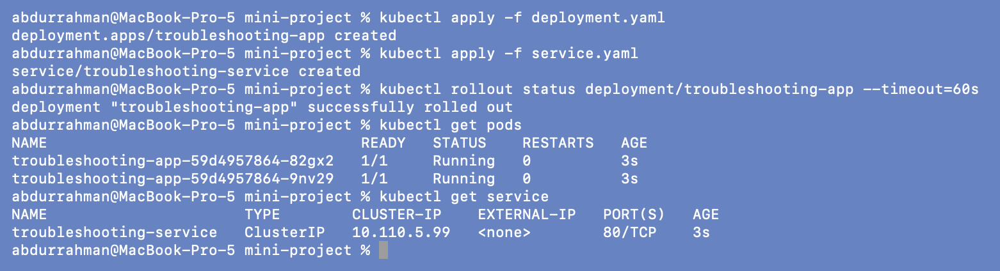

Two Pods `1/1 Running`; `troubleshooting-service` has ClusterIP `10.110.5.99`.

## 2. Check the application

```bash
kubectl get pods -o wide
kubectl describe pod troubleshooting-app-59d4957864-82gx2
kubectl logs troubleshooting-app-59d4957864-82gx2
kubectl exec -it troubleshooting-app-59d4957864-82gx2 -- bash
curl -s localhost | head -n 5
exit
```

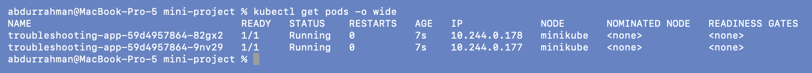
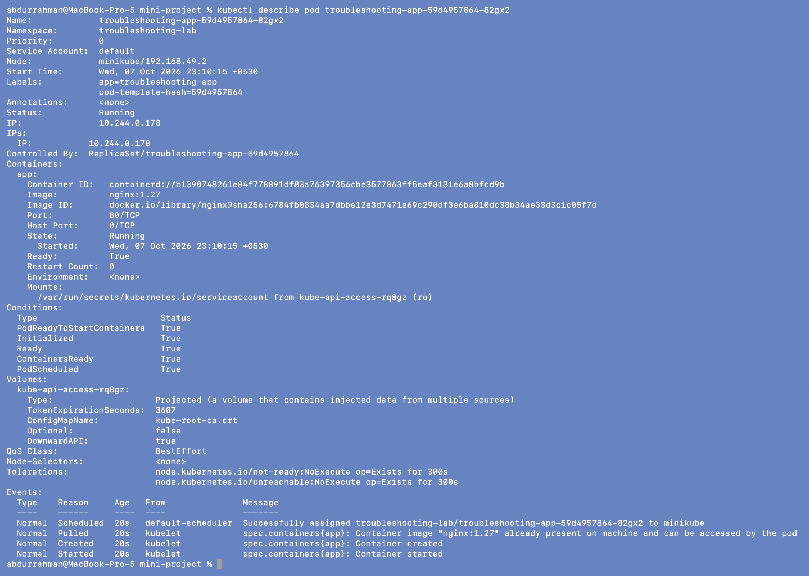
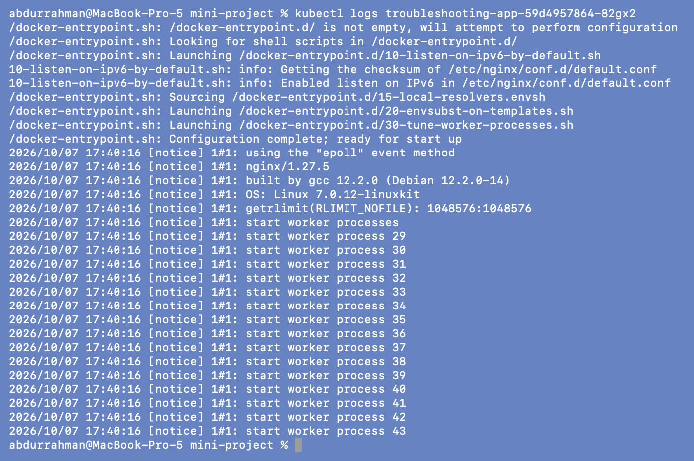
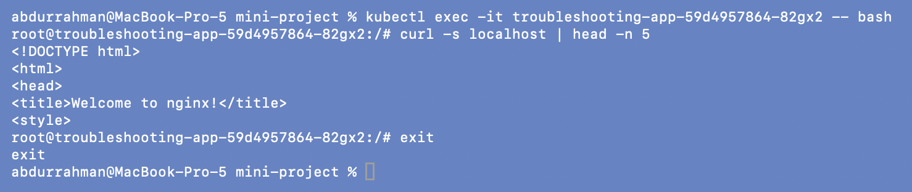

- `-o wide`: Pod IPs `10.244.0.178` and `10.244.0.177`, both on `minikube`.
- `describe`: label `app=troubleshooting-app`, `Port: 80/TCP`, all conditions `True`, and a
  clean `Scheduled → Pulled → Created → Started` event list. `Controlled By:
  ReplicaSet/...` shows it belongs to the Deployment.
- `logs`: nginx's entrypoint configured itself, started `nginx/1.27.5`, and launched one
  worker per CPU (15 workers, since the node has 15 cores).
- `exec` + `curl localhost` returns "Welcome to nginx!", so the app itself works.

## 3–4. Check the Service and endpoints

```bash
kubectl get service
kubectl describe service troubleshooting-service
kubectl get endpoints troubleshooting-service
```

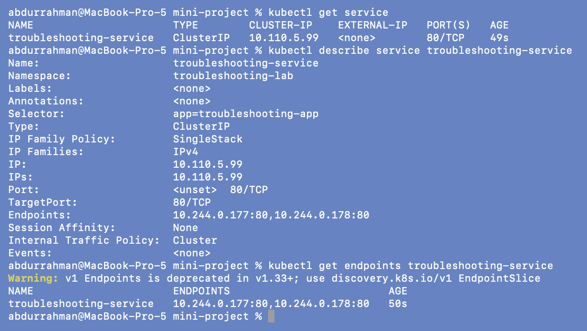

`Selector: app=troubleshooting-app`, `TargetPort: 80/TCP`, and
`Endpoints: 10.244.0.177:80,10.244.0.178:80`, the same IPs as in step 2. Baseline: healthy.

## 5. Create the broken Pod

```bash
kubectl apply -f broken-pod.yaml
kubectl get pod project-broken-pod -w          # stopped after 40 s
```

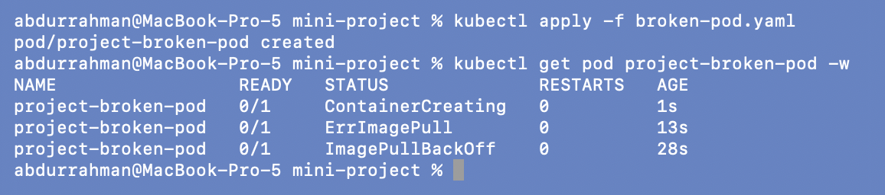

`ContainerCreating` → `ErrImagePull` (13 s) → `ImagePullBackOff` (28 s).

## 6. Troubleshoot it (no YAML changes yet)

```bash
kubectl get pod project-broken-pod
kubectl describe pod project-broken-pod | sed -n "/^Containers:/,/^Conditions:/p;/^Events:/,\$p"
```

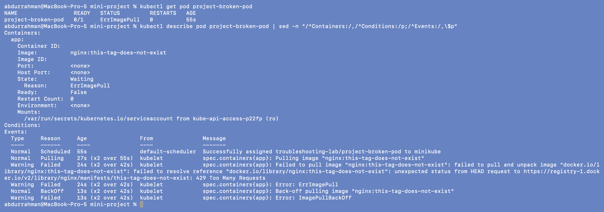

`State: Waiting, Reason: ErrImagePull`, `Image: nginx:this-tag-does-not-exist`, empty
`Container ID`.

**Something I didn't expect.** The `Failed` event did **not** say "not found" as in
section 07. It said:

```text
failed to resolve reference "docker.io/library/nginx:this-tag-does-not-exist": unexpected status
from HEAD request to https://registry-1.docker.io/v2/library/nginx/manifests/this-tag-does-not-exist: 429 Too Many Requests
```

Docker Hub was rate-limiting anonymous requests from my machine (several sessions share
this Mac and its IP), so the registry refused to answer at all. A later retry failed
differently again (`TLS handshake timeout` while fetching a token):

```bash
kubectl events --for pod/project-broken-pod --types=Warning
```

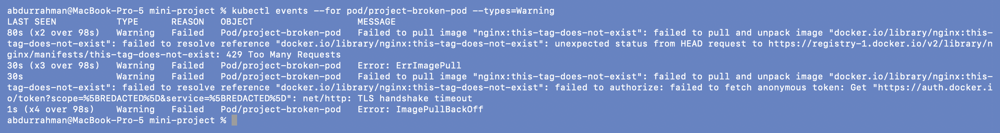

So the events showed *two* problems that hide the real one. To get a definite answer
about the tag, I asked the registry directly from my Mac:

```bash
kubectl get pod project-broken-pod -o jsonpath="{.spec.containers[0].image}{\"\n\"}"
docker manifest inspect nginx:this-tag-does-not-exist
```

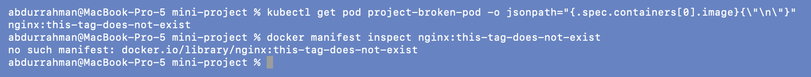

`no such manifest: docker.io/library/nginx:this-tag-does-not-exist`. The tag doesn't exist,
so even once the rate limit clears, this Pod can never start.

## 7. Answers for the broken Pod

**Question 1: What is the Pod status?**
*Answer:* `0/1`, alternating between `ErrImagePull` and `ImagePullBackOff`, with
`RESTARTS 0` because no container was ever created.

**Question 2: What is the actual error?**
*Answer:* The kubelet could not pull the image `nginx:this-tag-does-not-exist`. The
underlying reason is that this tag doesn't exist in the `nginx` repository on Docker Hub
(`docker manifest inspect` → `no such manifest`). During my run the event text showed
`429 Too Many Requests` and a `TLS handshake timeout` instead, because Docker Hub was
rate-limiting my IP. Those were real but temporary; the missing tag is the permanent cause.

**Question 3: Which command helped you find the reason?**
*Answer:* `kubectl describe pod project-broken-pod` (the `Image:` line and the `Failed`
events), together with `kubectl events --for pod/project-broken-pod --types=Warning`.
Because the events were muddied by the rate limit, `docker manifest inspect` gave the final
confirmation.

**Question 4: What is wrong with the image?**
*Answer:* The repository name is fine (`nginx`), but the tag `this-tag-does-not-exist` was
never published. The short name expands to `docker.io/library/nginx:this-tag-does-not-exist`.

**Question 5: How would you fix it?**
*Answer:* Point the Pod at a tag that exists. I used `nginx:1.27`, the same tag the
Deployment uses, in `fixed-pod.yaml`. A Pod's image could be patched in place, but I
deleted and re-applied so the YAML in the repo matches what runs.

```bash
diff broken-pod.yaml fixed-pod.yaml
kubectl delete pod project-broken-pod
kubectl apply -f fixed-pod.yaml
kubectl wait --for=condition=Ready pod/project-broken-pod --timeout=60s
kubectl get pod project-broken-pod
```

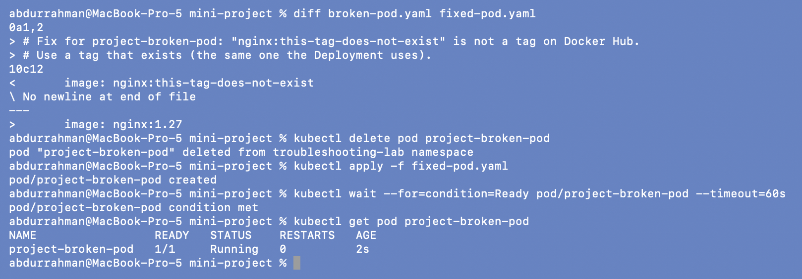

`1/1 Running` within 2 seconds, since `nginx:1.27` was already cached on the node.

## 8. Service troubleshooting challenge: break the selector

As instructed, I changed the selector in `service.yaml` to `app: wrong-app` and applied it:

```bash
sed -i '' 's/app: troubleshooting-app/app: wrong-app/' service.yaml
grep -A1 selector service.yaml
kubectl apply -f service.yaml
kubectl get service
kubectl get endpoints troubleshooting-service
```

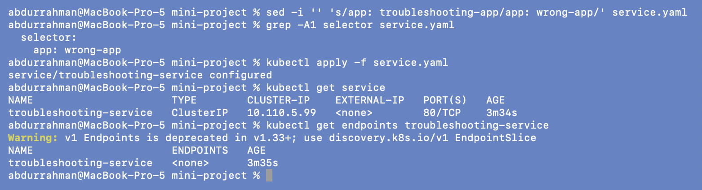

The Service still looks normal in `get service` (same ClusterIP, port 80), but
`ENDPOINTS <none>`. What a client sees:

```bash
kubectl run http-test --rm -i --restart=Never --image=busybox:1.36 -- sh -c 'sleep 2; wget -qO- -T 3 http://troubleshooting-service'
```

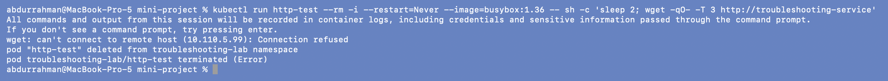

`can't connect to remote host (10.110.5.99): Connection refused`. DNS resolved the name
(the error shows the ClusterIP), but there was no backend to send traffic to.

## 9. Find the root cause and fix it

```bash
kubectl get pods --show-labels
kubectl describe service troubleshooting-service | grep -E "Selector|Endpoints"
```

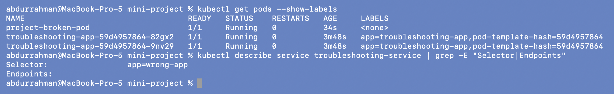

The Pods are labelled `app=troubleshooting-app`; the Service selects `app=wrong-app`.
Nothing matches, so `Endpoints:` is empty. The Pods are healthy the whole time; only the
link between Service and Pods is broken.

```bash
sed -i '' 's/app: wrong-app/app: troubleshooting-app/' service.yaml
grep -A1 selector service.yaml
kubectl apply -f service.yaml
kubectl get endpoints troubleshooting-service
kubectl get endpointslices -l kubernetes.io/service-name=troubleshooting-service
```

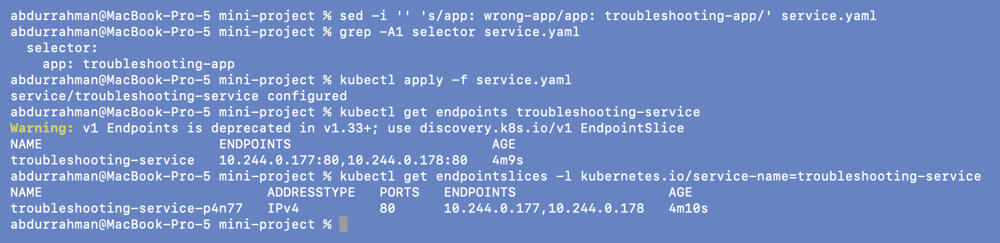

Endpoints are back: `10.244.0.177:80,10.244.0.178:80`. (`project-broken-pod` is not an
endpoint: it has no labels.) `service.yaml` in this folder is back to the lecture's
original content.

## 10. Verify the final architecture

From inside the cluster, through DNS:

```bash
kubectl run http-test --rm -i --restart=Never --image=busybox:1.36 -- sh -c 'sleep 2; nslookup troubleshooting-service.troubleshooting-lab.svc.cluster.local; wget -qO- -T 3 http://troubleshooting-service | grep title'
```

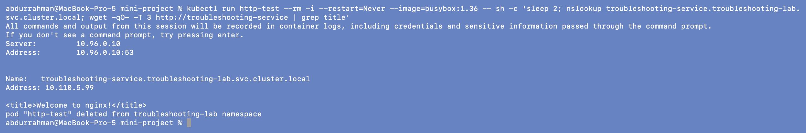

From my Mac, through a port-forward. I used **local port 18140** (my assigned range)
instead of a common port like 8080 so I wouldn't clash with other projects running on
this machine:

```bash
# window 1
kubectl port-forward service/troubleshooting-service 18140:80
# window 2
curl -s http://localhost:18140 | grep -E "title|h1"
curl -s -o /dev/null -w "HTTP %{http_code}\n" http://localhost:18140
kubectl get all
```

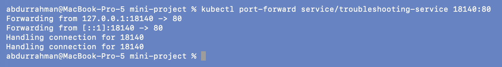
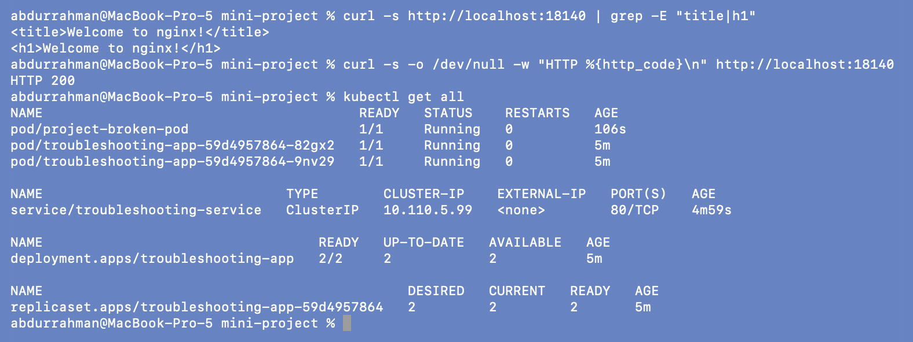

`HTTP 200` and the nginx page; the port-forward window logged "Handling connection for
18140" for both requests. `kubectl get all` shows the final state: Deployment `2/2`, three
Pods Running (including the fixed `project-broken-pod`), and the Service.

```text
                       troubleshooting-service  (ClusterIP 10.110.5.99:80)
                                    │  selector app=troubleshooting-app
                       ┌────────────┴────────────┐
                       ▼                         ▼
          troubleshooting-app-...-9nv29   troubleshooting-app-...-82gx2
              10.244.0.177:80                10.244.0.178:80
                       └────────────┬────────────┘
                                nginx 1.27
```

The checklist's last item, the namespace's Warning history for everything I broke in
this session:

```bash
kubectl get events --field-selector type=Warning --sort-by=.lastTimestamp | cut -c1-200
```

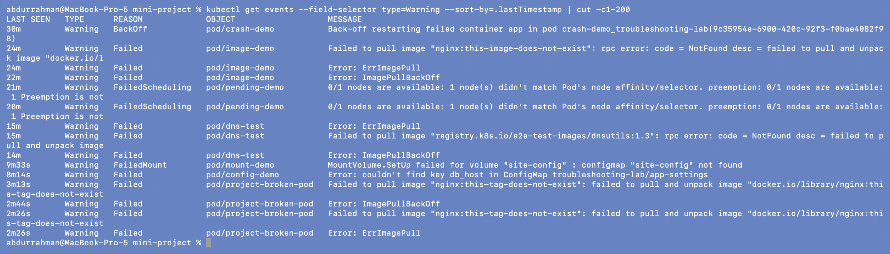

Every problem in this session is in one list: `BackOff` (crash-demo), `NotFound` image
pulls (image-demo, dns-test), `FailedScheduling` (pending-demo), `FailedMount`
(mount-demo), the missing `db_host` key (config-demo) and the project-broken-pod failures.
I cut lines at 200 characters so the table stays readable.

```bash
kubectl delete -f fixed-pod.yaml -f service.yaml -f deployment.yaml
kubectl get all
```

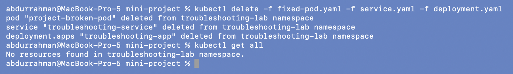

---

## 11. Troubleshooting table

The three rows the lecture asks for come first, all from this mini-project. Below them I
added a row for every other problem I worked through in this session, so the table
also summarises Task 2.

| Problem | What I saw | Command I used | Root cause | Fix |
| :--- | :--- | :--- | :--- | :--- |
| **Broken Pod** (`project-broken-pod`) | `0/1`, `ErrImagePull` ↔ `ImagePullBackOff`, `RESTARTS 0`, empty Container ID | `kubectl get pod`, `kubectl describe pod` (State + Events) | The container could never be created because its image can't be pulled | Recreate the Pod from `fixed-pod.yaml` |
| **Service Problem** (`troubleshooting-service`) | Service exists with a ClusterIP, but `ENDPOINTS <none>`; `wget` → `Connection refused` | `kubectl get endpoints`, `kubectl get pods --show-labels`, `kubectl describe service` | Selector `app=wrong-app` doesn't match Pod label `app=troubleshooting-app` | Selector back to `app: troubleshooting-app`, `kubectl apply` (selector can be changed in place) |
| **Image Problem** (`nginx:this-tag-does-not-exist`) | Events: `429 Too Many Requests`, then `TLS handshake timeout` (Docker Hub rate limit) | `kubectl events --types=Warning`, `docker manifest inspect` | Tag doesn't exist on Docker Hub (`no such manifest`); the 429 was a second, temporary problem | `image: nginx:1.27` |
| CrashLoopBackOff (06) | `Error` ↔ `CrashLoopBackOff`, restarts growing, `Exit Code: 1` | `describe`, `logs`, `logs --previous`, `crictl ps -a` | Script ends with `exit 1` | Long-running command (`fixed-pod.yaml`) |
| ErrImagePull / ImagePullBackOff (07) | Both statuses alternate; event `NotFound` | `describe`, `docker manifest inspect` | Tag `this-image-does-not-exist` | `nginx:1.27` |
| Pending (08) | `Pending`, `NODE <none>`, `FailedScheduling ... didn't match Pod's node affinity/selector` | `describe`, `get nodes -L kubernetes.io/hostname` | `nodeSelector` hostname `node-that-does-not-exist` | Remove the selector |
| Pending (scenario 3) | `FailedScheduling ... Insufficient cpu, Insufficient memory` | `describe pod`, `describe node` | Requests 500 CPU / 1000Gi on a 15-CPU / 7.7Gi node | Requests `100m` / `64Mi` |
| Service, no endpoints (09) | `Endpoints: <none>` for `web-service` | `describe service`, `get pods --show-labels` | Lecture selector typo `app: web-ahsgdf` | `app: web` |
| DNS (09) | `NXDOMAIN` for `web-service.default.svc.cluster.local` | `nslookup` from a Pod, `/etc/resolv.conf` | Service is in `troubleshooting-lab`, not `default` | Use the right namespace in the FQDN (or the short name) |
| DNS (scenario 4) | Pod `Running`, logs look fine; `curl` → `Could not resolve host` | `exec ... nslookup`, `get ns production`, `get svc -A` | Wrong hostname, and the target Service/namespace doesn't exist; `curl -s` hid the error | Correct name, a stand-in `postgres-db` Service, `curl -sS` |
| ContainerCreating (11) | Stuck `ContainerCreating`, `FailedMount ... configmap "site-config" not found` | `describe`, `get configmap` | Volume references a missing ConfigMap | Create the ConfigMap; kubelet recovers on its own |
| Configuration (12) | `CreateContainerConfigError`, `couldn't find key db_host` | `describe` (Environment + Events), `get configmap -o yaml` | env key `db_host` vs real key `database_host` | Reference `database_host` |
| Pod networking (13) | Endpoints exist, DNS works, `Connection refused` | `describe service`, `wget PodIP:8080` vs `:80` | `targetPort: 8080`, nginx listens on 80 | `targetPort: http` (named port) |
| OOMKilled (scenario 5) | `OOMKilled`, `Exit Code: 137`, CrashLoopBackOff | `describe`, `get pod -o jsonpath={...resources}` | 1000 MiB allocation vs 20Mi limit (the comment wrongly says 200MB) | Bounded allocation + 256Mi limit + `restartPolicy: OnFailure` |

## 12. README questions

**1. What does `kubectl get` tell us?**
The current state of resources in one line each: for Pods the READY count, STATUS,
RESTARTS and AGE (and with `-o wide` the IP and node). It tells me *that* something is
wrong (`0/1`, `Pending`, `CrashLoopBackOff`, a rising restart count), not why.

**2. What is the difference between `get` and `describe`?**
`get` is a short summary from the object's status. `describe` combines the full spec and
status (image, command, env, mounts, State and Last State with exit codes, conditions) with
the related Events. When `get` says `ImagePullBackOff`, `describe` tells me which image and
what the registry answered.

**3. Why do we use `kubectl logs`?**
To see what the application itself printed to stdout/stderr, for example
`[FATAL ERROR]: DATABASE_URL environment variable is MISSING!` in scenario 1. Kubernetes
only knows that the process exited; the app's own messages say why. `--previous` shows the
last crashed instance, and `-f` follows live.

**4. When would you use `kubectl exec`?**
When the container is running and I need to test from inside it: `curl localhost` to
check the app, `nslookup`/`wget` to test DNS and Services from the Pod's point of view,
`cat` config files or `/etc/resolv.conf`. In scenario 4 the logs looked fine and only
`exec ... nslookup` showed the DNS failure. It doesn't help for a container that isn't
running (crash loop, image pull, config error).

**5. What does `CrashLoopBackOff` mean?**
The container starts, its main process exits, the kubelet restarts it, and it exits again;
between attempts the kubelet waits longer each time (10 s, 20 s, 40 s ... up to 5 min).
It's a symptom; the cause is in the exit code and the logs. I saw three versions: exit 1
from an app error (06), exit 137 from `OOMKilled` (scenario 5), and even exit 0, when a
finished script runs under `restartPolicy: Always` (scenario 1).

**6. What does `ImagePullBackOff` mean?**
The kubelet couldn't pull the container image and is waiting before the next try
(`ErrImagePull` is the failed attempt itself). Causes: wrong name or tag, private image
without credentials, registry down or rate-limiting (I hit Docker Hub's 429 limit), or
network problems. The event message says which.

**7. Why can a Pod remain `Pending`?**
Because the scheduler can't find a node that fits: a `nodeSelector`/affinity no node
matches (08), requests bigger than any node's free CPU or memory (scenario 3), taints
without tolerations, or a PVC that can't bind. The `FailedScheduling` event lists the
reason for each node.

**8. Why can a Service have no endpoints?**
Its selector matches no Pods (typo or wrong label, as in 09 and the mini-project), the
matching Pods aren't Ready, or they're in a different namespace (a Service only selects
Pods in its own namespace). A Service *with* endpoints can still fail if `targetPort` is
wrong (13).

**9. What is the relationship between a Service selector and Pod labels?**
The selector is a label query. The endpoint controller continuously finds Ready Pods in the
same namespace whose labels contain all the selector's key/value pairs and writes their
`IP:targetPort` into the Service's EndpointSlices. kube-proxy then routes ClusterIP traffic
to those addresses. If labels and selector don't match, the Service exists but routes
nowhere.

**10. What is Kubernetes DNS?**
CoreDNS, running in `kube-system` behind the `kube-dns` Service (`10.96.0.10` here). Every
Pod's `/etc/resolv.conf` points at it. It gives each Service a name
`<service>.<namespace>.svc.cluster.local` that resolves to the ClusterIP, and the search
domains let Pods in the same namespace use just `<service>`. It means Pods find each other
by name instead of by IPs that change.

---

## What I understood

- Following the same order every time (get → describe → events → logs → exec → test)
  found every root cause in this project without guessing or editing YAML first.
- An event message is evidence, not always the whole story: the image problem here
  showed up as a rate limit first, and I needed a second check to find the permanent cause.
- Service problems are about matching: selector ↔ labels for endpoints, targetPort ↔
  containerPort for traffic, namespace ↔ DNS name for resolution.
- Verifying from inside (busybox `wget`) and outside (`port-forward` on 18140 + `curl`)
  checks both the in-cluster path and the user's path.
