# Scenarios: the five-Pod triage exercise

**Name:** Abdur Rahman Ibne Munir
**Enrollment number:** 24BCS10244

Session 14, Task 2. The lecture's `scenarios/` folder has a script, `triage_all.sh`, that
deploys five broken Pods at once (labelled `tier=triage-gauntlet`). There's no README for
it, so this file is my write-up of each incident:
**identify → investigate → root cause → fix → verify**.

```text
scenarios/
├── triage_all.sh                    (lecture)
├── scenario-1-crashloop/            broken.yaml (lecture)  fixed-attempt-1.yaml  fixed.yaml
├── scenario-2-imagepull/            broken.yaml (lecture)  fixed.yaml
├── scenario-3-pending/              broken.yaml (lecture)  fixed.yaml
├── scenario-4-dns-failure/          broken.yaml (lecture)  postgres-db.yaml  fixed.yaml
└── scenario-5-oomkilled/            broken.yaml (lecture)  fixed-attempt-1.yaml  fixed.yaml
```

Every `fixed*.yaml` and `postgres-db.yaml` is mine, with a comment at the top saying what
changed and why. The lecture's `broken.yaml` files are unchanged.

---

## 0. Read the script, then run it

```bash
ls -l triage_all.sh scenario-*/broken.yaml
cat triage_all.sh
ls README.md
```

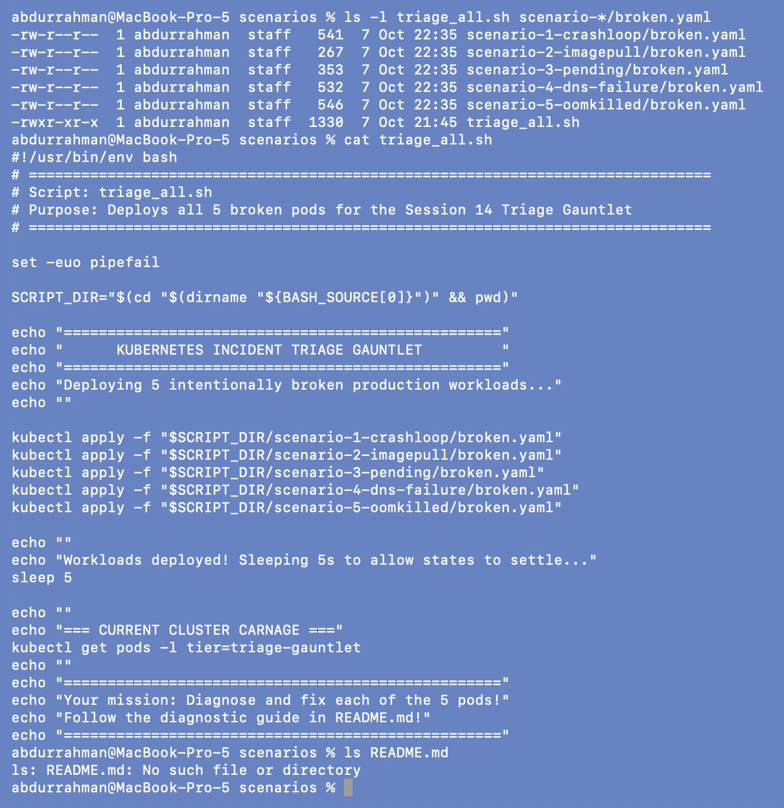

The script only runs `kubectl apply` on the five `broken.yaml` files, sleeps 5 s, and
lists the Pods, so it's safe to run. It applies into the current namespace, which for me
is `troubleshooting-lab`. Its last line says "Follow the diagnostic guide in README.md!",
but **there is no `README.md`** in the lecture's `scenarios/` folder (`No such file or
directory`). This file fills that gap.

```bash
./triage_all.sh
```

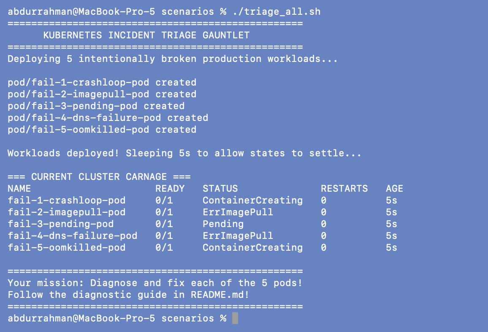

### Problem found: Docker Hub rate limit on the first run

A minute later, four of the five Pods were stuck on image pulls, not on the bugs the
scenarios are meant to show:

```bash
kubectl get pods -l tier=triage-gauntlet
kubectl get events --field-selector type=Warning,reason=Failed -o custom-columns=POD:.involvedObject.name,MESSAGE:.message --no-headers | grep '^fail-' | grep -v 'Error:' | sed -E 's/: failed to pull and unpack image.*(429 Too Many Requests|pull access denied.*)/ ... \1/'
```

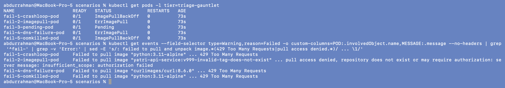

**Root cause.** `python:3.11-alpine` and `curlimages/curl:8.6.0` were not cached on the
node, and Docker Hub answered `429 Too Many Requests`: the anonymous pull limit for my IP
was used up (several homework sessions share this machine). Scenario 2's
`pull access denied` is different and is the real bug for that scenario (see below). The
`sed` only shortens the long middle of each message so the end is readable.

**Workaround.** `mirror.gcr.io` is Google's public read-only cache of Docker Hub images. I
pulled the four images the scenarios need through it inside the minikube node, then
tagged them with their normal `docker.io/...` names, so the unchanged `broken.yaml` files
find them already present:

```bash
for img in library/python:3.11-alpine curlimages/curl:8.6.0 library/postgres:16-alpine library/nginx:alpine; do
  minikube ssh -- sudo crictl pull mirror.gcr.io/$img && \
  minikube ssh -- sudo ctr -n k8s.io images tag --force mirror.gcr.io/$img docker.io/$img
done
minikube image ls | grep -E "python:3.11-alpine|curl:8.6.0|postgres:16-alpine|nginx:alpine"
```

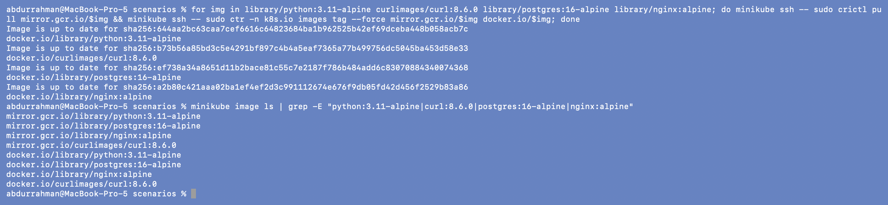

(The output says "Image is up to date" because I had already pulled them once to test
the mirror before taking this screenshot.) Then I reran the gauntlet from scratch:

```bash
kubectl delete pods -l tier=triage-gauntlet
./triage_all.sh
kubectl get pods -l tier=triage-gauntlet -o wide      # ~50 s later
```

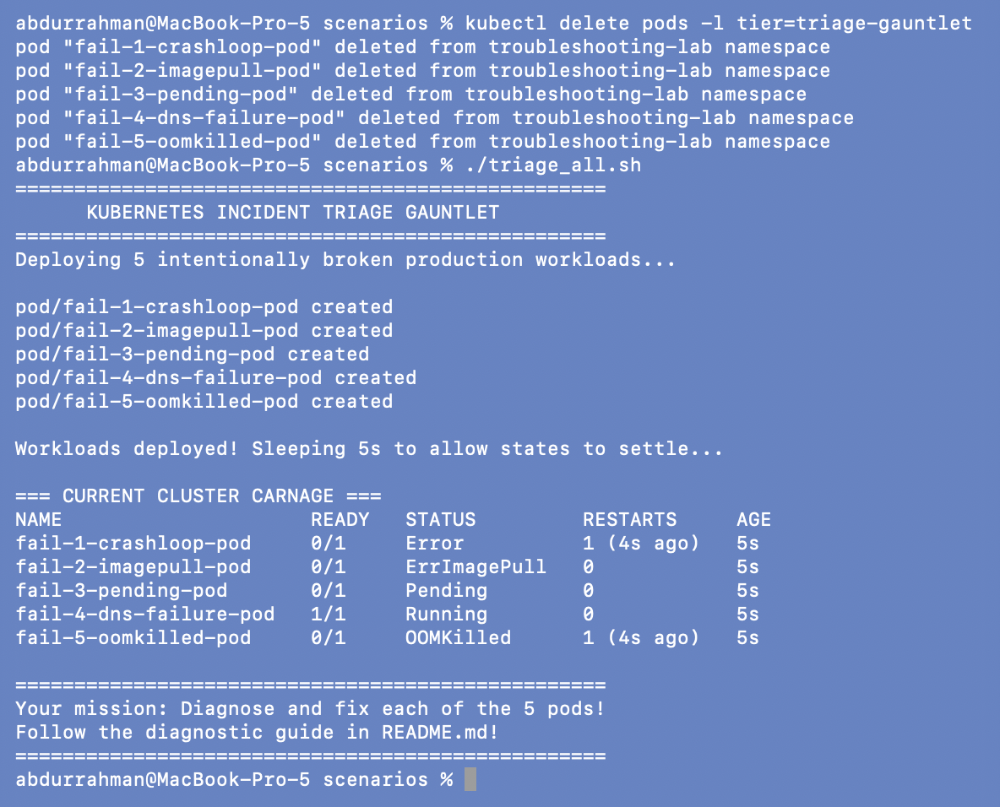
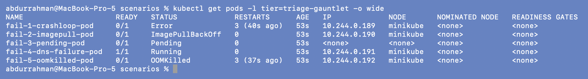

Now each Pod shows its intended symptom:

| Pod | Status | First impression |
|---|---|---|
| `fail-1-crashloop-pod` | `Error`, restarts climbing | the app exits with an error |
| `fail-2-imagepull-pod` | `ImagePullBackOff` | image can't be pulled |
| `fail-3-pending-pod` | `Pending`, `NODE <none>` | never scheduled |
| `fail-4-dns-failure-pod` | `1/1 Running` | looks healthy (it isn't) |
| `fail-5-oomkilled-pod` | `OOMKilled`, restarts climbing | killed for memory |

---

## Scenario 1: CrashLoopBackOff (missing environment variable)

**Identify and investigate**

```bash
kubectl get pod fail-1-crashloop-pod
kubectl describe pod fail-1-crashloop-pod | sed -n "/^    State:/,/Environment:/p;/^Events:/,\$p"
kubectl logs fail-1-crashloop-pod
kubectl logs fail-1-crashloop-pod --previous
kubectl get pod fail-1-crashloop-pod -o jsonpath='{.spec.containers[0].env}{"\n"}'
```

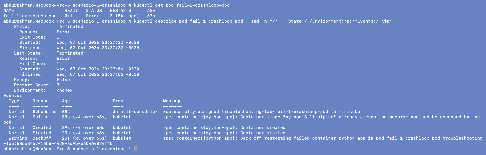


`Terminated, Reason: Error, Exit Code: 1`, restart count 3, `Environment: <none>`, and a
`BackOff` event. The log names the problem:
`[FATAL ERROR]: DATABASE_URL environment variable is MISSING!`. `--previous` fails with
`unable to retrieve container logs`, for the same reason I found in
[06-crashloopbackoff](../06-crashloopbackoff/README.md#5-logs---previous-when-it-works-and-when-it-doesnt):
the previous dead container was already garbage-collected. The env query prints an empty
line: no env vars at all.

**Root cause 1:** the app requires `DATABASE_URL` and the Pod spec doesn't set it.

**Fix attempt 1: add the variable**

```bash
diff broken.yaml fixed-attempt-1.yaml
kubectl delete pod fail-1-crashloop-pod
kubectl apply -f fixed-attempt-1.yaml
# ~50 s later
kubectl get pod fail-1-crashloop-pod
kubectl logs fail-1-crashloop-pod
kubectl describe pod fail-1-crashloop-pod | sed -n "/^    State:/,/Restart Count:/p"
```

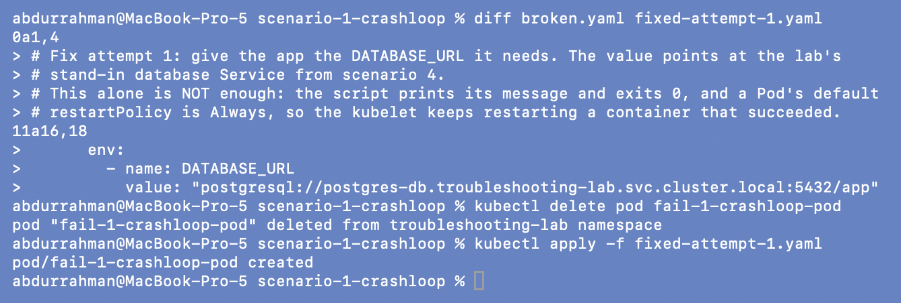
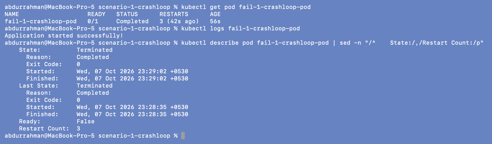

The app now prints `Application started successfully!`, but the Pod has **3 restarts in
56 seconds** and is heading back into CrashLoopBackOff. State and Last State are both
`Terminated, Reason: Completed, Exit Code: 0`.

**Root cause 2.** The script is a one-shot job: it prints a line and exits successfully.
A bare Pod defaults to `restartPolicy: Always`, so the kubelet restarts the container
after *every* exit, even a clean one, and backs off just as for a crash.

**Final fix and verify**

```bash
kubectl get pod fail-1-crashloop-pod -o jsonpath="{.spec.restartPolicy}{\"\n\"}"
diff fixed-attempt-1.yaml fixed.yaml
kubectl delete pod fail-1-crashloop-pod
kubectl apply -f fixed.yaml
sleep 20
kubectl get pod fail-1-crashloop-pod
kubectl logs fail-1-crashloop-pod
```

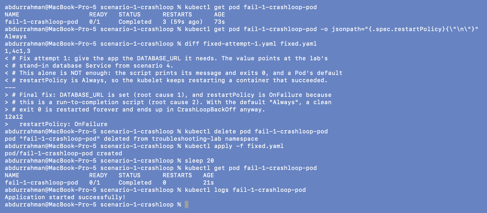

The running Pod's policy is `Always`. With `restartPolicy: OnFailure` the Pod ends as
`Completed` with `RESTARTS 0` and the success message. (A long-running app would instead
keep its process alive, and for real batch work a `Job` is the better object.)

---

## Scenario 2: ImagePullBackOff (image that doesn't exist)

```bash
kubectl get pod fail-2-imagepull-pod
kubectl describe pod fail-2-imagepull-pod | sed -n "/^    Image:/,/^    Ready:/p;/^Events:/,\$p"
```

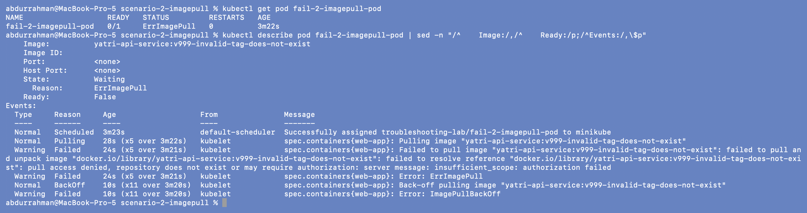

The event is a different flavour from section 07:

```text
failed to resolve reference "docker.io/library/yatri-api-service:v999-invalid-tag-does-not-exist":
pull access denied, repository does not exist or may require authorization
```

This one is **not** a rate limit and not a missing tag: Docker Hub says the repository
itself isn't there (or is private).

```bash
grep image: broken.yaml
docker manifest inspect docker.io/library/yatri-api-service:v999-invalid-tag-does-not-exist
docker search yatri-api-service --limit 5
kubectl get pod fail-2-imagepull-pod -o jsonpath="imagePullSecrets: {.spec.imagePullSecrets}{\"\n\"}"
```

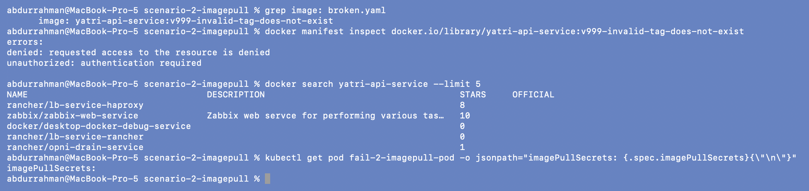

**Root cause.** `yatri-api-service:...` has no registry or user prefix, so it means
`docker.io/library/yatri-api-service`, an "official image" namespace that only Docker
itself publishes to. The registry denies it, `docker search` finds nothing with that name,
and the Pod has no `imagePullSecrets` for a private registry. The image doesn't exist
anywhere I can reach; the lecture comment calls it a typo, but there's no correct
spelling to switch to.

**Fix.** Since there's no real image, I used `nginx:1.27` as a stand-in so the Pod can run,
and wrote down in `fixed.yaml` what the real fix would be: the full
`<registry>/<repo>:<tag>` from the team that builds the service, plus an `imagePullSecret`
if that registry is private.

```bash
diff broken.yaml fixed.yaml
kubectl delete pod fail-2-imagepull-pod
kubectl apply -f fixed.yaml
kubectl wait --for=condition=Ready pod/fail-2-imagepull-pod --timeout=60s
kubectl get pod fail-2-imagepull-pod
```

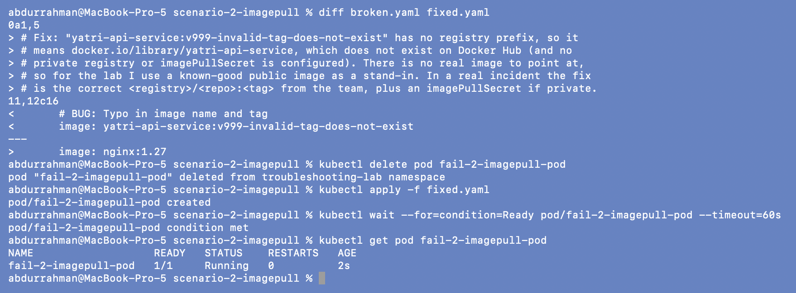

---

## Scenario 3: Pending (impossible resource requests)

```bash
kubectl get pod fail-3-pending-pod -o wide
kubectl describe pod fail-3-pending-pod | sed -n "/Requests:/,/Environment/p;/^Conditions:/,/^Volumes:/p;/^Events:/,\$p"
```

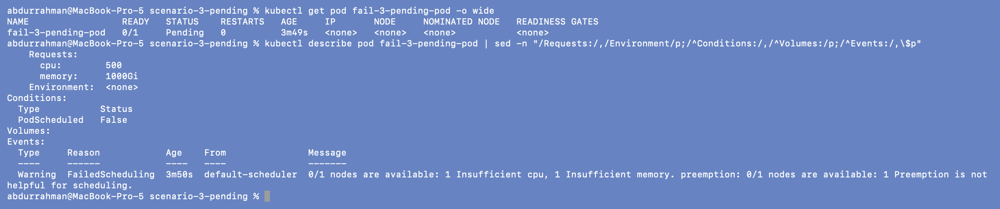

`NODE <none>`, `PodScheduled False`, requests `cpu: 500`, `memory: 1000Gi`, and:

```text
FailedScheduling  0/1 nodes are available: 1 Insufficient cpu, 1 Insufficient memory.
preemption: 0/1 nodes are available: 1 Preemption is not helpful for scheduling.
```

Compare with the node (read-only):

```bash
kubectl describe node minikube | grep -A 7 "^Allocatable:"
kubectl describe node minikube | grep -A 8 "Allocated resources"
```

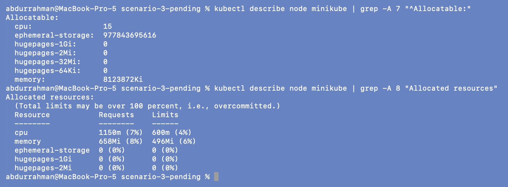

**Root cause.** The node can offer at most 15 CPUs and `8123872Ki` (about 7.7Gi) of memory,
and only 7% / 8% of that is in use. The Pod asks for 500 CPUs and 1000Gi, more than the
whole node has, so no amount of free capacity or preemption could ever fit it. This is a
wrong request, not a full cluster.

**Fix and verify.** Requests sized for an nginx Pod, plus limits:

```bash
diff broken.yaml fixed.yaml
kubectl delete pod fail-3-pending-pod
kubectl apply -f fixed.yaml
kubectl wait --for=condition=Ready pod/fail-3-pending-pod --timeout=60s
kubectl get pod fail-3-pending-pod -o wide
kubectl describe pod fail-3-pending-pod | sed -n "/Limits:/,/Environment/p;/^QoS/p"
```

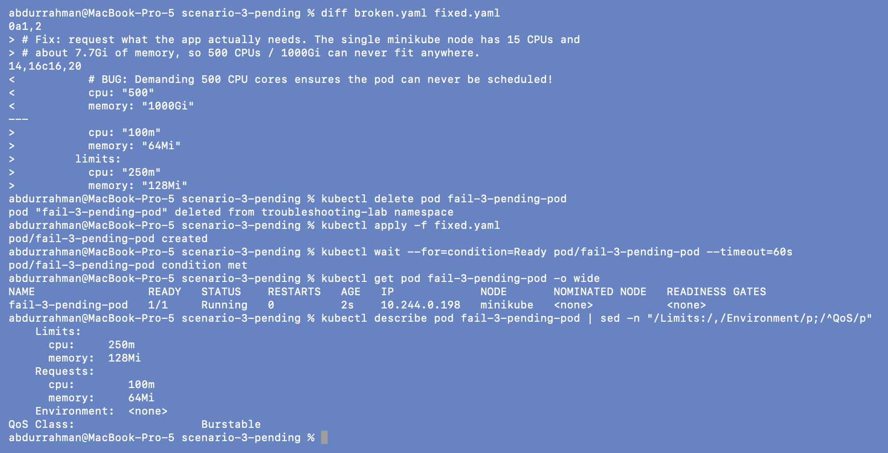

Scheduled to `minikube` and `Running` in 2 s, QoS class `Burstable` (requests lower than
limits). Resource fields can't be changed on an existing Pod here, so I deleted and
recreated it.

---

## Scenario 4: DNS failure (wrong hostname, missing target)

**Identify: it looks healthy**

```bash
kubectl get pod fail-4-dns-failure-pod
kubectl logs fail-4-dns-failure-pod
kubectl describe pod fail-4-dns-failure-pod | sed -n "/^Events:/,\$p"
```

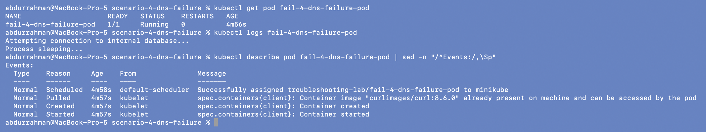

`1/1 Running`, 0 restarts, only `Normal` events, and the log shows
`Attempting connection to internal database...` then `Process sleeping...` with nothing in
between. `get`, `describe` and `logs` all look fine. The only clue is that the connection
attempt printed no result at all.

**Investigate from inside**

```bash
kubectl exec fail-4-dns-failure-pod -- curl -sS --connect-timeout 3 http://postgres-db-wrong-name.production.svc.cluster.local:5432
kubectl exec fail-4-dns-failure-pod -- nslookup postgres-db-wrong-name.production.svc.cluster.local
kubectl exec fail-4-dns-failure-pod -- nslookup kubernetes.default.svc.cluster.local
```

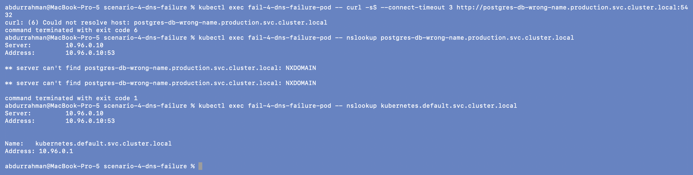

- The same curl with `-S` added shows the error the app was hiding:
  `curl: (6) Could not resolve host: postgres-db-wrong-name.production.svc.cluster.local`.
  The original script uses `curl -s`, which also silences error messages, and `|| true`,
  which throws away the exit code. That's why the logs were empty and the Pod stayed Running.
- `nslookup` → `NXDOMAIN` from `10.96.0.10`, so CoreDNS answered and simply has no such name.
- `nslookup kubernetes.default.svc.cluster.local` works, so DNS in general is healthy.
  The problem is the name, not CoreDNS.

```bash
kubectl get namespace production
kubectl get services --all-namespaces | grep -i postgres || echo "no postgres Service anywhere in the cluster"
kubectl get services
```

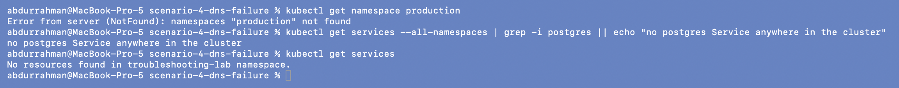

**Root cause.** Two layers:
1. The hostname is wrong (`postgres-db-wrong-name`; the intended Service is `postgres-db`).
2. Even the intended target doesn't exist on this cluster: there's no `production`
   namespace and no postgres Service in any namespace. Fixing the typo alone would still
   give NXDOMAIN.

**Fix.** I didn't create a `production` namespace on the shared cluster. Instead I deployed
a stand-in `postgres-db` (Postgres 16 Deployment + ClusterIP Service on 5432) in my own
namespace, and pointed the client at
`postgres-db.troubleshooting-lab.svc.cluster.local`. I also changed `curl -s` to `curl -sS` so
future failures show up in the logs.

```bash
kubectl apply -f postgres-db.yaml
kubectl rollout status deployment/postgres-db --timeout=120s
kubectl get pods -l app=postgres-db
kubectl get service postgres-db
kubectl get endpointslices -l kubernetes.io/service-name=postgres-db
```

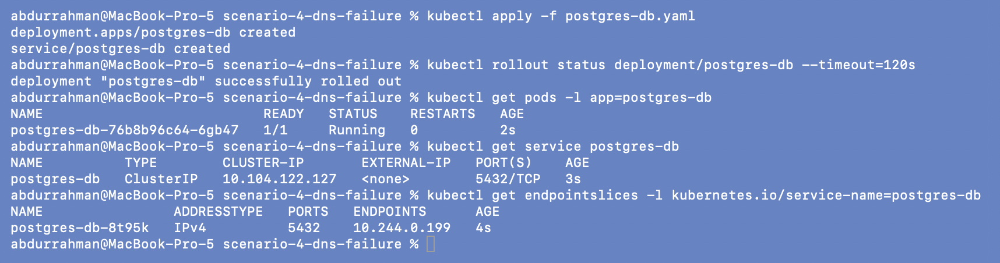

```bash
diff broken.yaml fixed.yaml
kubectl delete pod fail-4-dns-failure-pod
kubectl apply -f fixed.yaml
kubectl wait --for=condition=Ready pod/fail-4-dns-failure-pod --timeout=60s
sleep 5
kubectl logs fail-4-dns-failure-pod
```

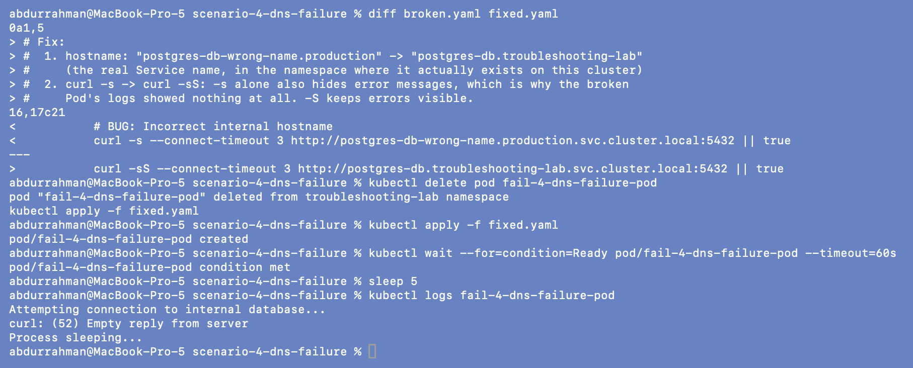

The log now has a line in the middle: `curl: (52) Empty reply from server`. That's the
expected result: the name resolved and the TCP connection to port 5432 opened, but curl
speaks HTTP and Postgres doesn't, so Postgres closed the connection. (The extra
`kubectl apply -f fixed.yaml` line under the delete output is just the terminal echoing the
next command, typed while the delete was still running.)

**Verify**

```bash
kubectl exec fail-4-dns-failure-pod -- nslookup postgres-db.troubleshooting-lab.svc.cluster.local
kubectl exec fail-4-dns-failure-pod -- nc -zv -w 3 postgres-db.troubleshooting-lab.svc.cluster.local 5432
kubectl logs deploy/postgres-db --tail=3
```

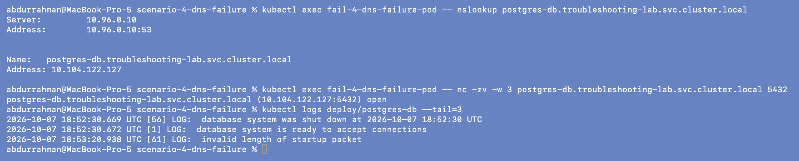

The name resolves to the Service IP `10.104.122.127`, `nc` reports port 5432 `open`, and
Postgres's own log shows `invalid length of startup packet` at the time of the curl, which
is the database seeing the HTTP request from the fixed Pod.

---

## Scenario 5: OOMKilled

**Identify and investigate**

```bash
kubectl get pod fail-5-oomkilled-pod
kubectl describe pod fail-5-oomkilled-pod | sed -n "/^    State:/,/^    Environment:/p"
kubectl logs fail-5-oomkilled-pod
```

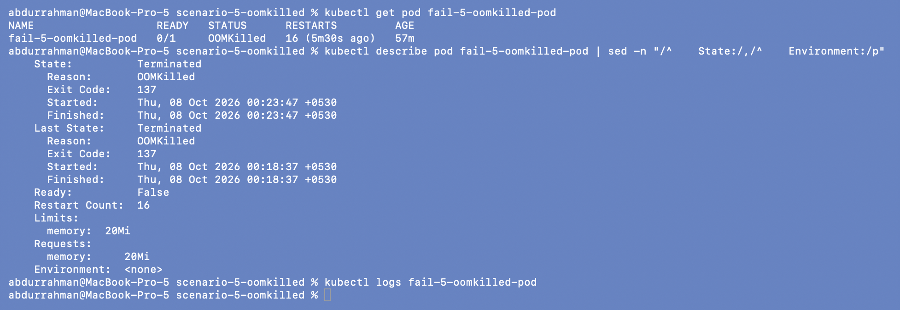

`OOMKilled`, `Exit Code: 137` (128 + 9, i.e. SIGKILL), 16 restarts, `Limits: memory 20Mi`.
(`Requests` also shows 20Mi: when only a limit is set, Kubernetes copies it into the
request.) `kubectl logs` is **empty**, even though the script prints
"Allocating memory rapidly..." first. Python buffers stdout when it isn't a terminal,
and the kernel's SIGKILL leaves no chance to flush it. With OOMKilled, `describe` is
often the only evidence.

The lecture asked me to check the memory limit before running this, so I compared the
limit with what the code allocates:

```bash
kubectl get pod fail-5-oomkilled-pod -o jsonpath='{.spec.containers[0].resources}{"\n"}'
grep -nE "BUG|range|10 \* 1024|memory:" broken.yaml
python3 -c 'print(100 * 10, "MiB requested by the loop")'
```

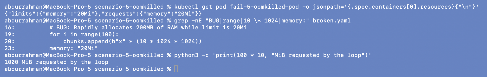

**Root cause.** The limit is 20Mi, and the loop appends 100 chunks of 10 MiB:
**1000 MiB**. The kernel's cgroup OOM killer stops the container as soon as it crosses 20Mi.
The lecture's own comment (`# BUG: Rapidly allocates 200MB`) understates this five times over.

**Fix attempt 1: believe the comment**

If the app needed "200MB", a 256Mi limit would be enough:

```bash
diff broken.yaml fixed-attempt-1.yaml
kubectl delete pod fail-5-oomkilled-pod
kubectl apply -f fixed-attempt-1.yaml
sleep 20
kubectl get pod fail-5-oomkilled-pod
kubectl describe pod fail-5-oomkilled-pod | sed -n "/^    State:/,/^    Restart Count:/p"
```

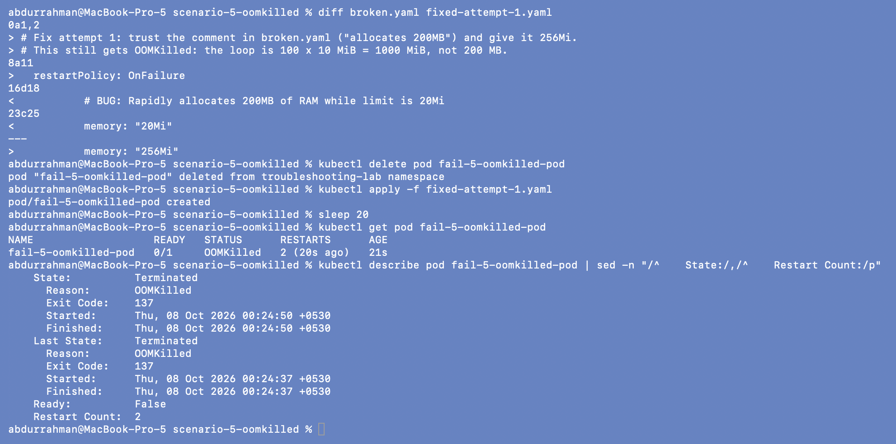

Still `OOMKilled`, exit 137, two restarts in 21 seconds. The comment was wrong; the code is
what runs.

**Final fix and verify**

Two options: raise the limit above ~1.1Gi, or make the work fit a sensible budget. On a
shared node with about 7.7Gi allocatable I didn't want a test Pod holding over a gigabyte,
so I bounded the allocation (15 × 10 MiB = 150 MiB), kept the 256Mi limit, added a 192Mi
request so the scheduler reserves the memory, and set `restartPolicy: OnFailure`, since
this is the same run-to-completion pattern as scenario 1.

```bash
diff fixed-attempt-1.yaml fixed.yaml
kubectl delete pod fail-5-oomkilled-pod
kubectl apply -f fixed.yaml
sleep 20
kubectl get pod fail-5-oomkilled-pod
kubectl logs fail-5-oomkilled-pod
kubectl describe pod fail-5-oomkilled-pod | sed -n "/^    State:/,/^    Restart Count:/p"
```

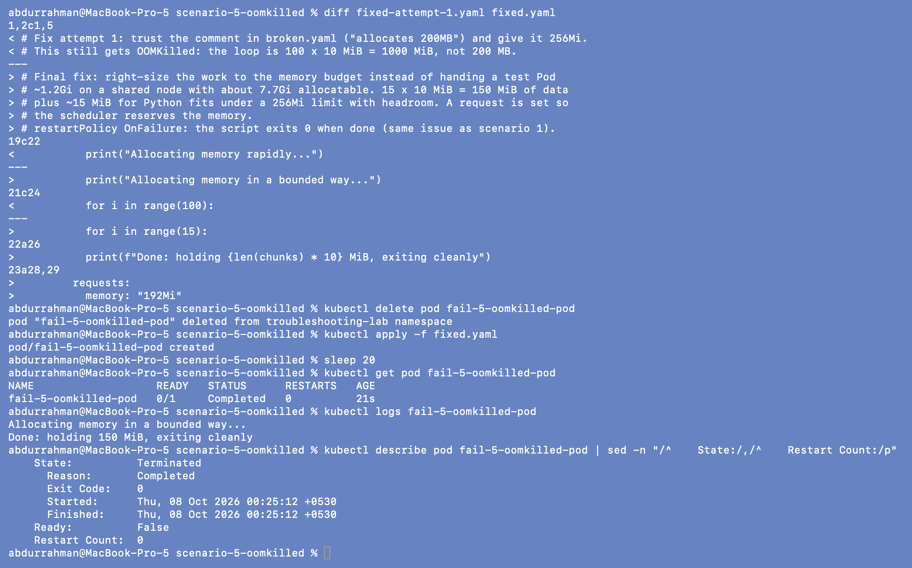

`Completed`, `Exit Code: 0`, 0 restarts, and the log shows
`Done: holding 150 MiB, exiting cleanly`.

---

## All five fixed

```bash
kubectl get pods -l tier=triage-gauntlet
kubectl get pods,services -l app=postgres-db
kubectl get services
```

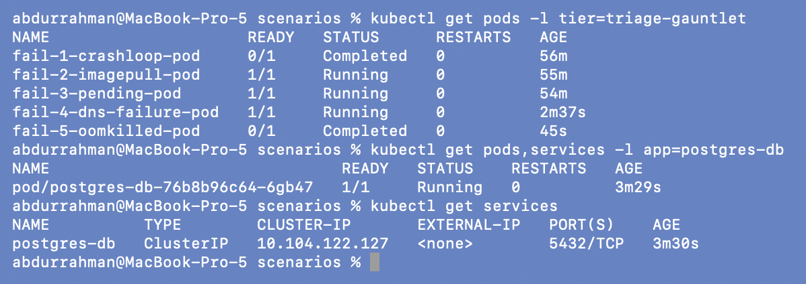

Scenarios 1 and 5 are `Completed` with 0 restarts (one-shot scripts, correct end state);
2, 3 and 4 are `Running`; the stand-in `postgres-db` serves scenario 4.

| # | Symptom | Key evidence | Root cause | Fix |
|---|---|---|---|---|
| 1 | CrashLoopBackOff | log `DATABASE_URL ... MISSING`; then `Completed`, exit 0, still restarting | missing env var; `restartPolicy: Always` on a one-shot script | add `DATABASE_URL`; `restartPolicy: OnFailure` |
| 2 | ImagePullBackOff | `pull access denied, repository does not exist` | image `docker.io/library/yatri-api-service` doesn't exist | stand-in `nginx:1.27` (real fix: correct registry path + pull secret) |
| 3 | Pending | `Insufficient cpu, Insufficient memory` | requests 500 CPU / 1000Gi > node's 15 CPU / 7.7Gi | requests 100m / 64Mi |
| 4 | Running but broken | `curl -sS` → `Could not resolve host`; NXDOMAIN; no `production` ns | wrong hostname, target Service absent, errors hidden by `curl -s` | stand-in `postgres-db`, correct FQDN, `curl -sS` |
| 5 | OOMKilled | exit 137, limit 20Mi, loop allocates 1000 MiB | allocation far above the limit (comment says 200MB) | bounded allocation, 256Mi limit + request, `OnFailure` |

---

## What I understood

- A status is a starting point, not the answer: two different `CrashLoopBackOff`s here had
  exit codes 1 and 0, and an `OOMKilled` Pod had no logs at all.
- `Running` doesn't mean working. Scenario 4 hid its failure behind `curl -s` and
  `|| true`; only testing from inside (`exec ... nslookup`) found it.
- Comments and notes can be wrong: the OOM comment understated the allocation five times,
  and the image "typo" had no correct spelling. Trust the running spec and the measured
  numbers.
- Some failures come from outside the cluster (the Docker Hub rate limit). Reading the
  exact event message is what separated that from the real bugs.
