# What is Helm: first commands, repos and search

**Name:** Abdur Rahman Ibne Munir
**Enrollment number:** 24BCS10244

Lecture topic `01-what-is-helm`. Helm is the package manager for Kubernetes: a **chart**
is the package (templates + default values), a **release** is one installed copy of a
chart, and **values** are what you pass in to customise it. This folder covers installing
Helm, the first `helm list`, a public chart from the Bitnami repo, and (as additions for
Task 1) `helm repo list/update/remove`, `helm search repo` and `helm search hub`.

## 0. Namespace for this session

```bash
kubectl create namespace helm-lab
kubectl get namespace helm-lab
kubectl config view --minify | grep namespace:
```

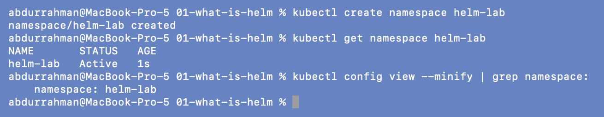

Other homework sessions were running on the same minikube cluster at the same time, so
everything in session 15 ran in `helm-lab`, set as the default namespace of my terminal's
kubeconfig. Helm reads the namespace from the kubeconfig context too, which is why every
`helm list` and `helm install` below shows `NAMESPACE: helm-lab` without passing `-n`.

## 1. Install Helm

The notes install Helm with:

```bash
curl https://raw.githubusercontent.com/helm/helm/main/scripts/get-helm-3 | bash
```

I did **not** run that. Helm 3 was already installed on my Mac through Homebrew
(`helm@3`), and the script would download a second binary into `/usr/local/bin` that
Homebrew doesn't know about, so the two could drift apart on upgrades. Piping a script
from the internet straight into `bash` is also something I'd rather not do when a package
manager already provides the tool. So I checked the existing install instead:

```bash
which helm
ls -l $(which helm)
brew list --versions helm@3
helm version
```

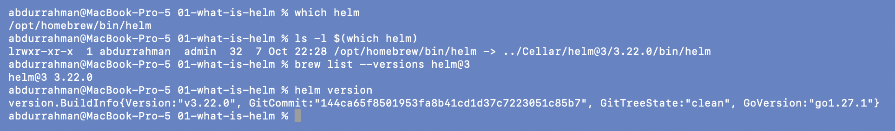

`v3.22.0`, a newer Helm 3 than the `v3.15.0` in the notes. Everything in this session
works the same on both.

## 2. First Helm command

```bash
helm list
```

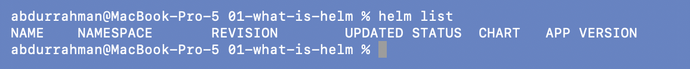

Only the header row: no releases in `helm-lab` yet.

## 3. Add the Bitnami repo (`helm repo add`, `helm repo update`)

```bash
helm repo add bitnami https://charts.bitnami.com/bitnami
helm repo update
```

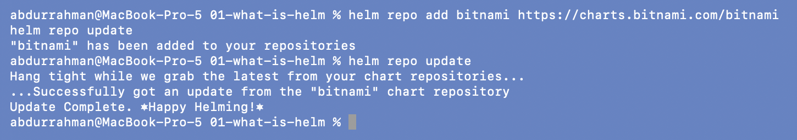

`repo add` saves the name and URL in my local Helm config. `repo update` downloads each
repo's `index.yaml`, the catalogue of charts and versions, into a local cache. Search and
install read that cache, so `update` is what makes new chart versions visible.

## 4. Install a public chart

```bash
helm install my-nginx bitnami/nginx
```

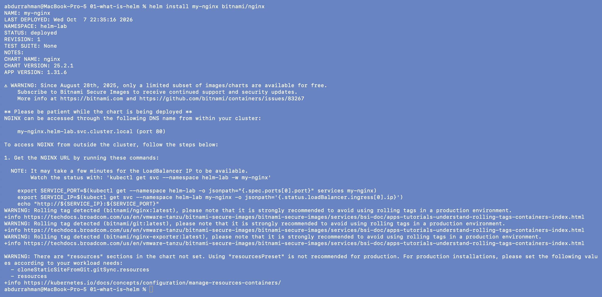

Bitnami changed its catalogue in 2025, so I expected this command might fail. It didn't.
The release is `deployed` at `REVISION: 1` (chart `nginx-25.2.1`, app `1.31.6`). The
chart's own notes print the reason I was worried: *"Since August 28th, 2025, only a
limited subset of images/charts are available for free"*. It also warns that it's using
rolling `latest` tags. nginx is in that free subset, so I kept the lecture's chart and did
not need a replacement.

```bash
kubectl get pods
kubectl get services
helm list
kubectl get pod -l app.kubernetes.io/instance=my-nginx -o jsonpath='{.items[0].spec.containers[0].image}{"\n"}'
```

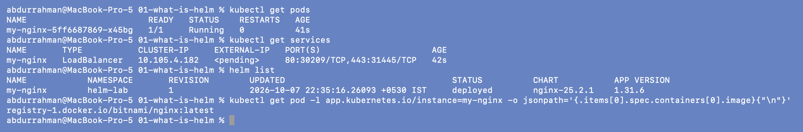

One Pod running, a `LoadBalancer` Service (ports 80 and 443), and `helm list` now shows
`my-nginx` in namespace `helm-lab`. The image really is
`registry-1.docker.io/bitnami/nginx:latest`, not a pinned version.
The Service's `EXTERNAL-IP` stays `<pending>` because nothing on minikube hands out load
balancer IPs unless `minikube tunnel` is running.

### Reaching the app

On macOS with the docker driver, NodePorts and LoadBalancer IPs can't be reached from the
Mac directly, so I used a port-forward on my session's port 18150:

```bash
kubectl port-forward svc/my-nginx 18150:80
curl -sI http://localhost:18150
curl -s http://localhost:18150 | grep -i "<title>"
```

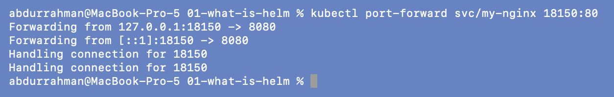
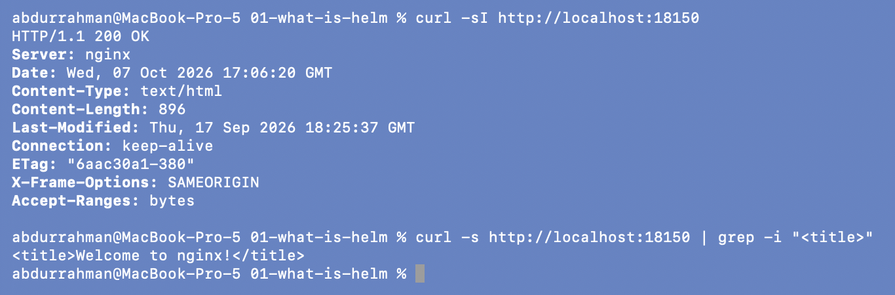

`200 OK` and "Welcome to nginx!". The port-forward prints `-> 8080` because the Bitnami
image runs nginx as a non-root user on port 8080, and the Service maps 80 to it. (The
`Server` header says only `nginx`: Bitnami hides the version number.)

## 5. Addition: `helm repo list` and `helm search`

Task 1 asks for `repo` and `search`, which the notes only list under "Useful Commands".

```bash
helm repo list
helm search repo nginx
helm search repo bitnami/nginx --versions | head -n 6
```

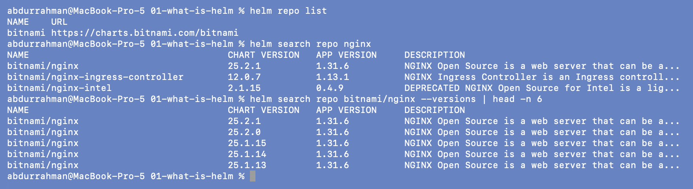

`helm search repo` only searches the repos I added (here just `bitnami`) and works from
the local cache. It matched three charts: `nginx` (25.2.1), `nginx-ingress-controller`
and the deprecated `nginx-intel`. `--versions` lists every chart version, which is how you'd find an older
version to pin with `helm install --version`.

```bash
helm search hub nginx --max-col-width 70 | head -n 15
helm search hub nginx | wc -l
```

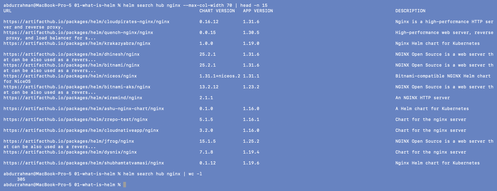

`helm search hub` asks Artifact Hub online, so it finds charts from repos I have never
added: about 300 charts for "nginx" (305 lines of output, header included). I cut the
listing to the first 15 lines with `head` so it fits the screenshot. Each URL is an Artifact Hub page with the repo URL you'd `helm repo add`.

## 6. Remove the release and the repo (`helm uninstall`, `helm repo remove`)

```bash
helm uninstall my-nginx
helm list
kubectl get all
```

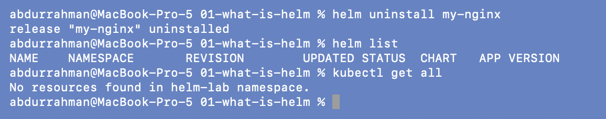

One command removed the Deployment, ReplicaSet, Pod and Service the chart created:
`No resources found in helm-lab namespace`.

```bash
helm repo remove bitnami
helm repo list
```

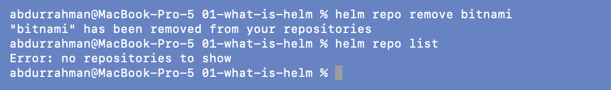

My Helm config had no repos before this session, so removing `bitnami` puts it back the
way it was.

## What I understood

- Helm 3 is just a client. It talks to the API server with my kubeconfig, so it uses my
  permissions and my default namespace. There is no Tiller in the cluster like in Helm 2.
- A repo is a URL with an `index.yaml`. `repo add` remembers it, `repo update` refreshes
  the local copy, and `search repo` only searches that local copy. `search hub` searches
  Artifact Hub online.
- `helm install` creates every object in the chart in one step, and `helm uninstall`
  deletes all of them in one step. With plain `kubectl` I would have to track each object
  myself.
- Public charts change under you. The Bitnami chart worked, but it now runs a rolling
  `latest` image, so in real use I would pin both the chart version and the image tag.
