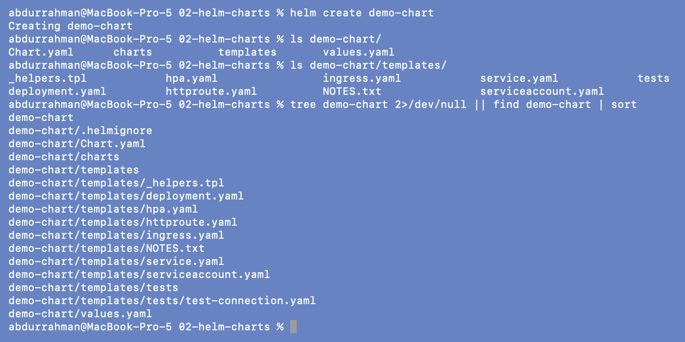
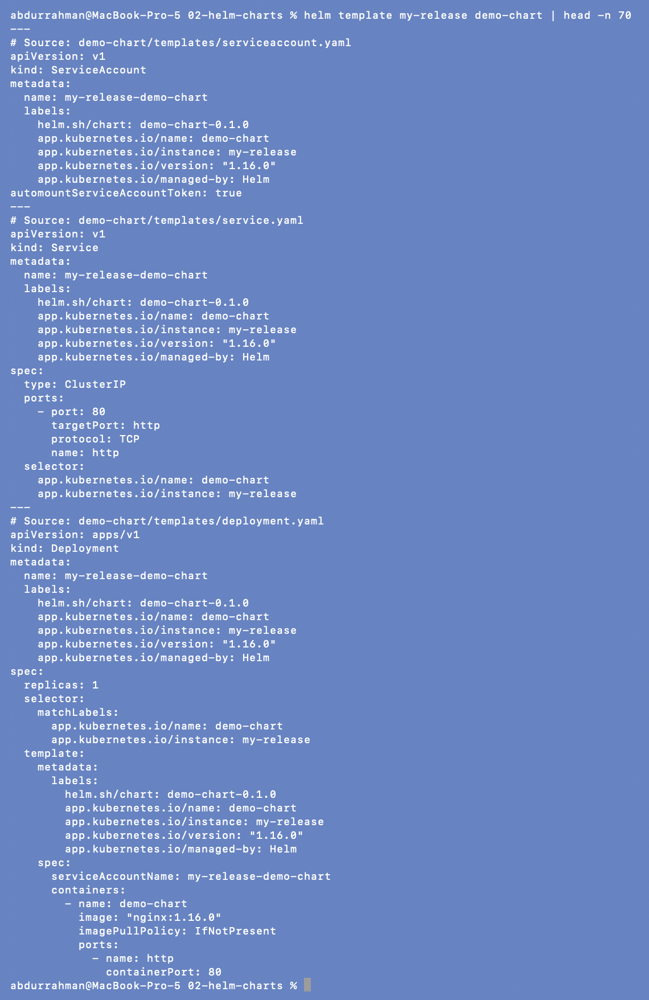
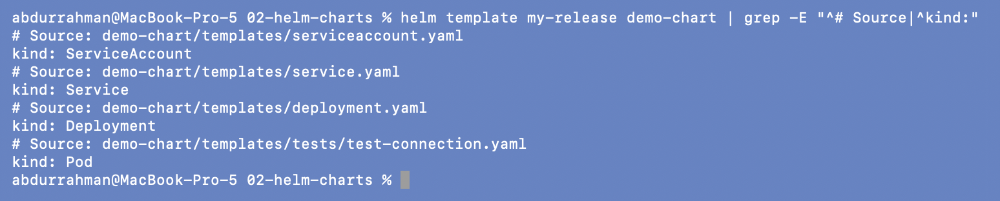
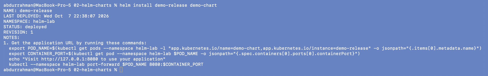
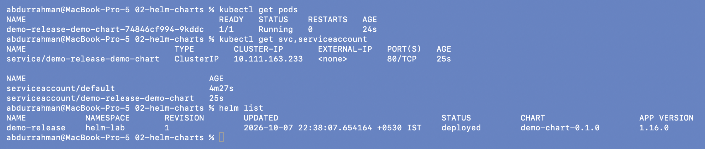
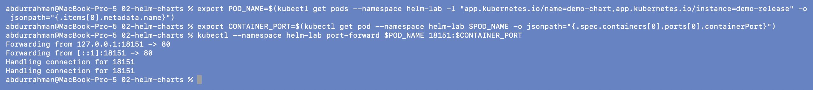
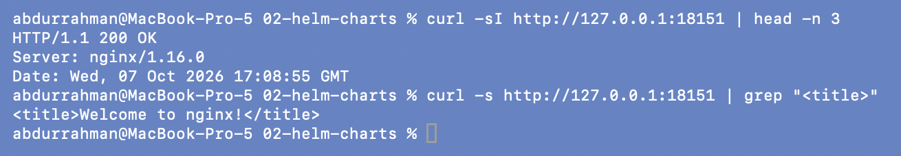
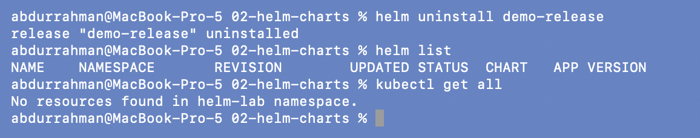

# Helm Charts: `helm create`, `helm template`, install, uninstall

**Name:** Abdur Rahman Ibne Munir
**Enrollment number:** 24BCS10244

Lecture topic `02-helm-charts`. A chart is a folder with a fixed layout: `Chart.yaml`
(metadata), `values.yaml` (defaults) and `templates/` (Kubernetes YAML with `{{ }}`
placeholders). `helm create` generates a complete working one.

```text
02-helm-charts/
├── demo-chart/      generated on screen by "helm create demo-chart"
└── screenshots/
```

## 1. Create the chart (`helm create`)

```bash
helm create demo-chart
ls demo-chart/
ls demo-chart/templates/
tree demo-chart 2>/dev/null || find demo-chart | sort
```



`Chart.yaml`, `charts/` (for dependencies, empty), `templates/` and `values.yaml`, plus a
hidden `.helmignore`. Helm 3.22 generates two files the notes don't list: `httproute.yaml`
(Gateway API, off by default) and `tests/test-connection.yaml` (a `helm test` Pod).

## 2. Render without deploying (`helm template`)

```bash
helm template my-release demo-chart | head -n 70
helm template my-release demo-chart | grep -E "^# Source|^kind:"
```




The full render is 100 lines and didn't fit one screenshot, so the first image shows the
first 70 lines through `head`. The second lists every object the chart produces, with the
template it came from: a ServiceAccount, a Service, a Deployment, and the test Pod.
Nothing is sent to the cluster; `helm template` only prints YAML, which is why it's useful
for checking a chart before installing it.

## 3. Install (`helm install`) and list (`helm list`)

```bash
helm install demo-release demo-chart
kubectl get pods
kubectl get svc,serviceaccount
helm list
```




`STATUS: deployed`, `REVISION: 1`, namespace `helm-lab`. Object names are
`<release>-<chart>` (`demo-release-demo-chart`) because the generated `_helpers.tpl`
builds a "fullname" that way. The chart's default image tag is empty, so it falls back
to `appVersion` from `Chart.yaml` (`1.16.0`), which is why `helm list` shows
`APP VERSION 1.16.0`.

### Reaching the app

`helm install` prints the chart's `NOTES.txt`, which says how to reach the app. I ran
those exact lines, changing only the local port from `8080` to my session's `18151`:

```bash
export POD_NAME=$(kubectl get pods --namespace helm-lab -l "app.kubernetes.io/name=demo-chart,app.kubernetes.io/instance=demo-release" -o jsonpath="{.items[0].metadata.name}")
export CONTAINER_PORT=$(kubectl get pod --namespace helm-lab $POD_NAME -o jsonpath="{.spec.containers[0].ports[0].containerPort}")
kubectl --namespace helm-lab port-forward $POD_NAME 18151:$CONTAINER_PORT

curl -sI http://127.0.0.1:18151 | head -n 3
curl -s http://127.0.0.1:18151 | grep "<title>"
```




`Server: nginx/1.16.0`: the version that came from `appVersion`.

## 4. Uninstall (`helm uninstall`)

```bash
helm uninstall demo-release
helm list
kubectl get all
```



Release gone, and every object it created is gone with it.

The lecture folder also contains a second generated chart, `myapp/`, that the notes never
use, so I didn't copy it.

## What I understood

- `helm create` gives a complete, production-shaped chart: helpers for names and labels,
  optional Ingress/HPA/HTTPRoute behind `enabled` flags, probes, and a test hook. It's a
  good starting point to cut down from.
- `helm template` is a dry render on my machine. It's the fastest way to see what a value
  change will do before anything reaches the cluster.
- Object names, labels and the image tag all come from the chart plus the release name.
  That's how one chart can be installed many times without name collisions.
- `NOTES.txt` is also a template, so the instructions it prints already contain the real
  namespace and release name.
