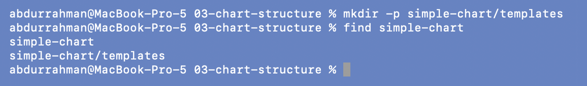
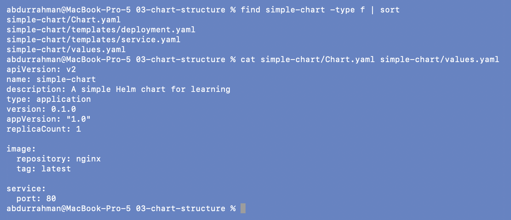
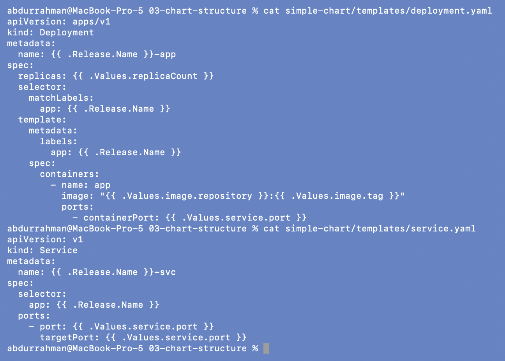
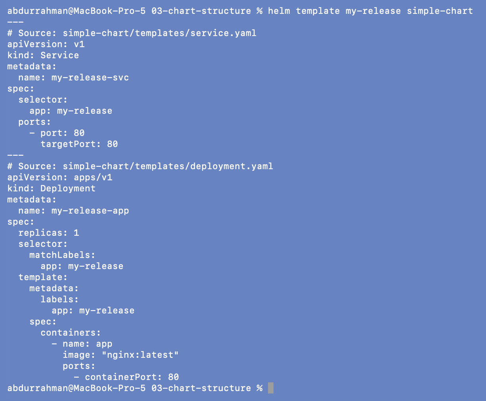
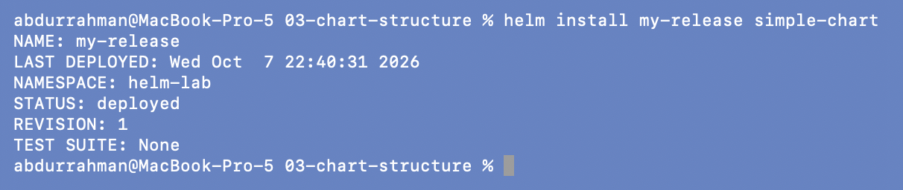
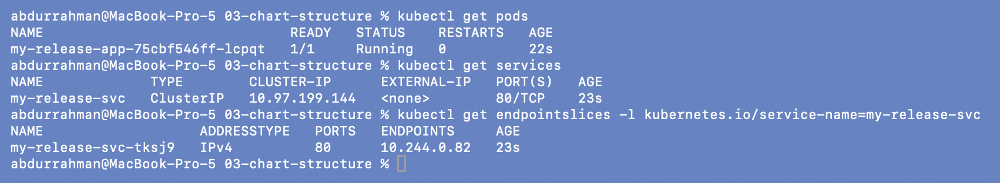
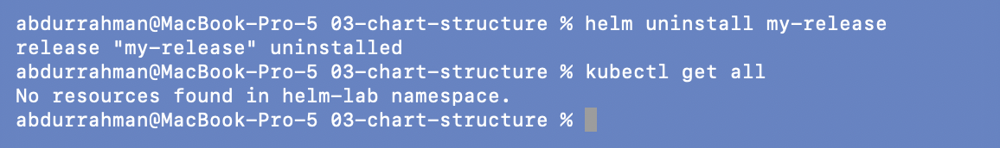

# Chart Structure: a chart written by hand

**Name:** Abdur Rahman Ibne Munir
**Enrollment number:** 24BCS10244

Lecture topic `03-chart-structure`. Instead of `helm create`, this chart is built from
four small files, so every line is easy to read.

```text
03-chart-structure/
└── simple-chart/
    ├── Chart.yaml          who is this chart?   (name, version, appVersion)
    ├── values.yaml         what are the defaults? (replicaCount, image, service.port)
    └── templates/
        ├── deployment.yaml what does it create?
        └── service.yaml
```

## 1. Create the chart directory

```bash
mkdir -p simple-chart/templates
find simple-chart
```



Then I created the four files from the lecture repo's copies (identical to the notes
except the `description` text) and checked them:

```bash
find simple-chart -type f | sort
cat simple-chart/Chart.yaml simple-chart/values.yaml
cat simple-chart/templates/deployment.yaml
cat simple-chart/templates/service.yaml
```




- `version: 0.1.0` is the chart's own version; `appVersion: "1.0"` is the app inside it.
- The templates use `{{ .Release.Name }}` for names and labels, and `{{ .Values.* }}`
  for replicas, image and port.

## 2. Render locally

```bash
helm template my-release simple-chart
```



`{{ .Release.Name }}-app` became `my-release-app`, `replicas` became `1`, and the image
became `"nginx:latest"`. The Service selector `app: my-release` matches the Pod label,
so the Service will find the Pod.

## 3. Install and check

```bash
helm install my-release simple-chart
kubectl get pods
kubectl get services
kubectl get endpointslices -l kubernetes.io/service-name=my-release-svc
```




One `my-release-app-…` Pod running and a ClusterIP Service `my-release-svc`. I added the
EndpointSlice check: it lists the Pod's IP on port 80, which proves the selector written
in the template really matches the Pod labels.

## 4. Clean up

```bash
helm uninstall my-release
kubectl get all
```



## What I understood

- Only `Chart.yaml` and a `templates/` folder are really required. `values.yaml` holds
  defaults, and `_helpers.tpl` and `NOTES.txt` are optional extras.
- `{{ .Release.Name }}` keeps two installs of the same chart from colliding, because
  every object name and label includes the release name.
- Deployment labels and Service selectors are both templated from the same value, so they
  can't drift apart the way two hand-written YAML files can.
