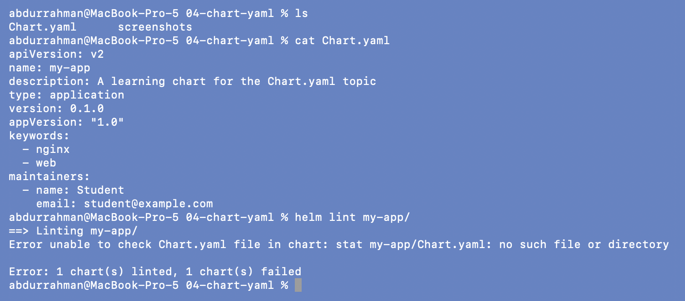
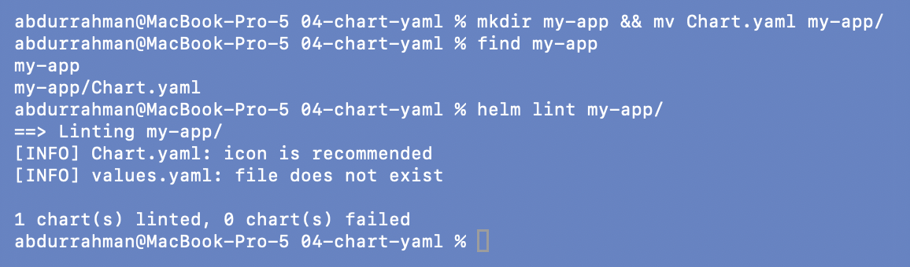
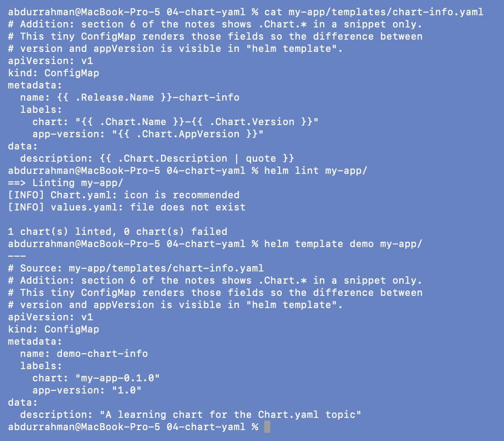
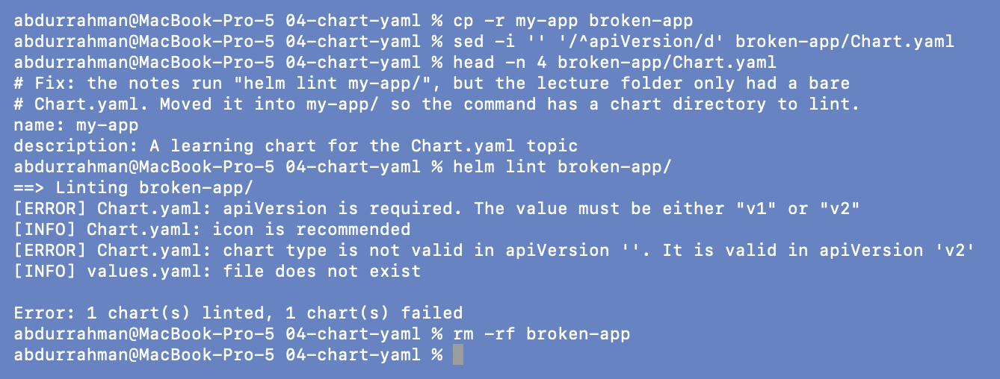

# `Chart.yaml`: chart metadata and `helm lint`

**Name:** Abdur Rahman Ibne Munir
**Enrollment number:** 24BCS10244

Lecture topic `04-chart-yaml`. `Chart.yaml` tells Helm what the chart is.

| Field | Meaning |
|---|---|
| `apiVersion: v2` | required for Helm 3 charts |
| `name` | chart name |
| `version` | the **chart's** version (SemVer); bump it when the templates change |
| `appVersion` | the version of the **app** the chart deploys, usually the image tag |
| `type` | `application` (deploys things) or `library` (shared templates only) |
| `keywords`, `home`, `maintainers` | optional metadata shown in repos and Artifact Hub |

```text
04-chart-yaml/
└── my-app/
    ├── Chart.yaml                 the lecture's Chart.yaml (moved here, see below)
    └── templates/chart-info.yaml  addition: renders .Chart.* fields
```

## Problem found: `helm lint my-app/` has no chart to lint

```bash
ls
cat Chart.yaml
helm lint my-app/
```



**Problem.** `Error unable to check Chart.yaml file in chart: stat my-app/Chart.yaml: no
such file or directory`.

**Root cause.** The lecture's `04-chart-yaml/` folder contains only a bare `Chart.yaml`.
There is no `my-app/` directory there. The `my-app` chart lives in `05-values-yaml/`. A
chart is a directory, and `helm lint` needs that directory.

**Fix.** Put the `Chart.yaml` in a `my-app/` folder (with a comment at the top of the
file explaining why), then lint again:

```bash
mkdir my-app && mv Chart.yaml my-app/
find my-app
helm lint my-app/
```



`1 chart(s) linted, 0 chart(s) failed`. The two `[INFO]` lines are suggestions, not
errors: an `icon` URL is recommended, and there is no `values.yaml`. A chart with only a
`Chart.yaml` is valid.

## Addition: chart metadata inside a template

Section 6 of the notes shows `.Chart.Name`, `.Chart.Version` and `.Chart.AppVersion`
only as a snippet. I added a tiny ConfigMap template so the values are visible in a
render:

```bash
cat my-app/templates/chart-info.yaml
helm lint my-app/
helm template demo my-app/
```



The label renders as `chart: "my-app-0.1.0"` (name + chart version) and
`app-version: "1.0"` (appVersion). The description comes straight from `Chart.yaml`.

## Addition: what a lint error looks like

The notes mention the `apiVersion is required` error. To see it for real, I made a
throwaway copy without that line:

```bash
cp -r my-app broken-app
sed -i '' '/^apiVersion/d' broken-app/Chart.yaml
head -n 4 broken-app/Chart.yaml
helm lint broken-app/
rm -rf broken-app
```



Two `[ERROR]` lines and `1 chart(s) failed`. Without `apiVersion`, Helm doesn't know
whether this is a v1 (Helm 2) or v2 (Helm 3) chart, so it also rejects `type`, a field
that only exists in v2.

## What I understood

- `version` and `appVersion` are different things. A template change bumps `version`; a
  new image of the app bumps `appVersion`. They move independently.
- `helm lint` checks the chart structure and renders the templates. A missing or invalid
  `Chart.yaml` fails the lint. Missing optional files are only `[INFO]`.
- Everything in `Chart.yaml` is available to templates as `.Chart.*`, which is how charts
  put `helm.sh/chart: name-version` labels on objects.
