# `values.yaml`: defaults, `-f` files and `--set`

**Name:** Abdur Rahman Ibne Munir
**Enrollment number:** 24BCS10244

Lecture topic `05-values-yaml`. Templates read settings from `.Values`. The defaults live
in the chart's `values.yaml`, and you can override them per install with `-f <file>` or
`--set key=value`.

```text
05-values-yaml/
├── my-app/            the lecture's chart (a stock "helm create my-app" chart)
├── values.yaml        the values file shown in the notes (image tag: latest)
└── values-prod.yaml   production overrides (replicaCount: 5, app.name: demo-app-prod)
```

```bash
ls
cat values.yaml
cat values-prod.yaml
grep -E '^replicaCount|^image:|^  repository|^  tag' my-app/values.yaml
grep appVersion my-app/Chart.yaml
```

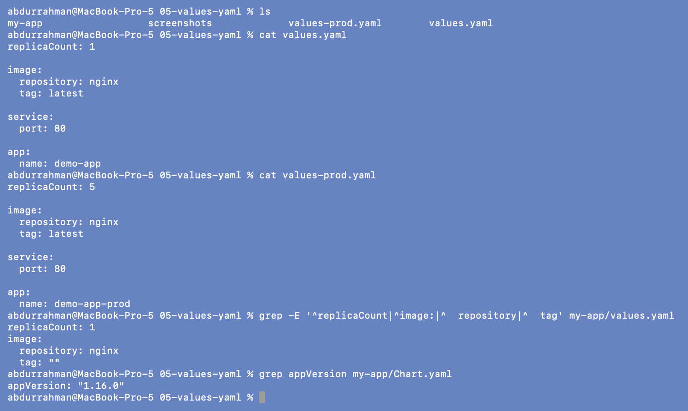

The chart's own `values.yaml` has `tag: ""`, so its image falls back to the chart's
`appVersion` (`1.16.0`). The two files next to the chart are separate override files.

## Problem found: `./chart` does not exist

```bash
helm install my-app ./chart --set replicaCount=3
```

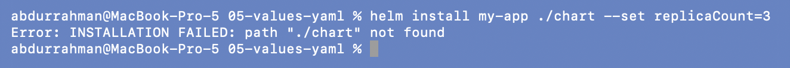

**Problem.** `INSTALLATION FAILED: path "./chart" not found`.
**Root cause.** The notes use `./chart` as a placeholder, but the chart in this folder is
called `my-app/`.
**Fix.** Use `./my-app`:

```bash
helm install my-app ./my-app --set replicaCount=3
```

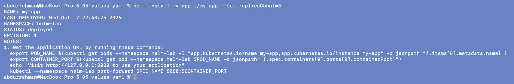

## Problem found: the prod install reuses the release name `my-app`

Option B as written, with only the chart path already corrected:

```bash
helm install my-app ./my-app -f values-prod.yaml
```

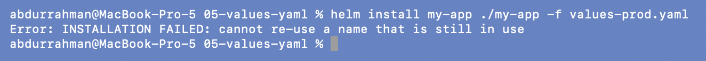

**Problem.** `cannot re-use a name that is still in use`.
**Root cause.** Release names are unique per namespace. Options A and B in the notes both
install a release called `my-app`, and the first one still exists.
**Fix.** Give the prod install its own name. (`helm upgrade my-app … -f values-prod.yaml`
would also work, but then option A's release would be replaced, and the point here is to
compare the two side by side.)

```bash
helm install my-app-prod ./my-app -f values-prod.yaml | head -n 6
helm list
kubectl get deployments -o wide
kubectl get pods
```

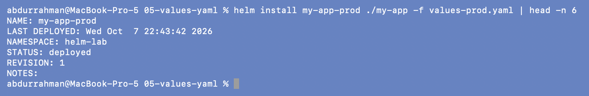
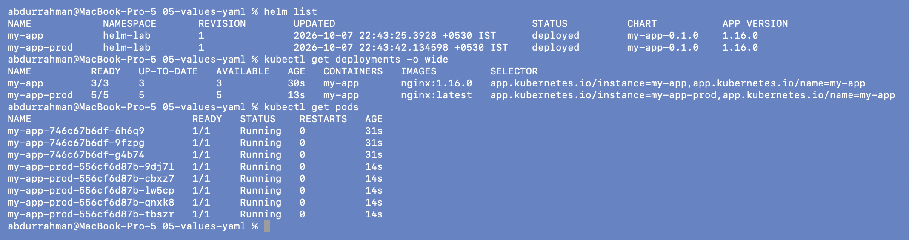

Same chart, two releases, different results:

| Release | Overrides | Replicas | Image |
|---|---|---|---|
| `my-app` | `--set replicaCount=3` | 3 | `nginx:1.16.0` (chart default from `appVersion`) |
| `my-app-prod` | `-f values-prod.yaml` | 5 | `nginx:latest` (from the file) |

## Check values before installing (`helm template`)

The notes' commands also use `./chart`, so they fail the same way:

```bash
helm template my-app ./chart | grep "replicas:"
```

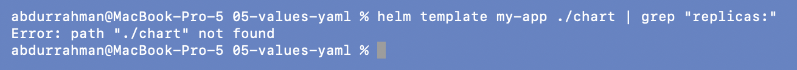

With the right path:

```bash
helm template my-app ./my-app | grep "replicas:"
helm template my-app ./my-app --set replicaCount=3 | grep "replicas:"
```

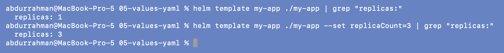

`replicas: 1` from the defaults, `replicas: 3` with `--set`, as the notes expect.

### Addition: priority of values, shown in one screenshot

```bash
helm template my-app ./my-app | grep -E "replicas:|image:"
helm template my-app ./my-app -f values.yaml | grep -E "replicas:|image:"
helm template my-app ./my-app -f values-prod.yaml | grep -E "replicas:|image:"
helm template my-app ./my-app -f values-prod.yaml --set replicaCount=2 | grep -E "replicas:|image:"
```

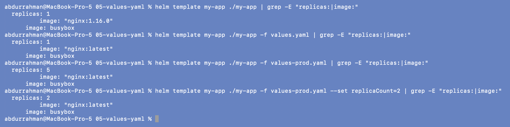

1. chart defaults: 1 replica, `nginx:1.16.0`
2. `-f values.yaml`: the tag becomes `latest`
3. `-f values-prod.yaml`: 5 replicas
4. `-f values-prod.yaml --set replicaCount=2`: **2** replicas. `--set` beats the file,
   and the file beats the chart defaults.

(`image: busybox` is the chart's `helm test` Pod, which is also rendered.)

## Note: the README's prod tag differs from the file

The notes show `values-prod.yaml` with `tag: v2.0.0`, but the file in the lecture repo has
`tag: latest`. I kept the file. `nginx:v2.0.0` doesn't exist, so the README version would
leave every prod Pod stuck pulling an image:

```bash
grep -A2 "^image" values-prod.yaml
docker manifest inspect nginx:v2.0.0; echo "exit code: $?"
docker manifest inspect nginx:latest > /dev/null && echo "nginx:latest exists"
```

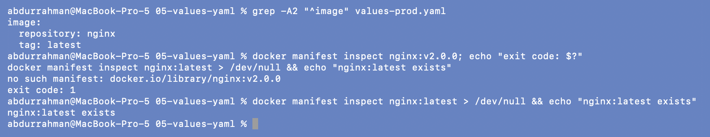

`no such manifest: docker.io/library/nginx:v2.0.0`.

## Clean up

```bash
helm uninstall my-app my-app-prod
helm list
kubectl get all
```

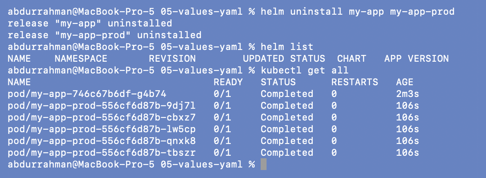
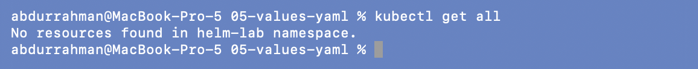

Right after the uninstall the six Pods were still on their way out: shown as `0/1
Completed` while their containers stopped. The Deployments and Services were already gone.
A few seconds later the namespace was empty.

`app.name` from the notes' values is never used: the `helm create` templates name objects
with `fullname` from `_helpers.tpl`, not with `.Values.app.name`. That is why the
Deployments are called `my-app` and `my-app-prod`, not `demo-app` / `demo-app-prod`.

## What I understood

- Values merge in layers: the chart's `values.yaml`, then each `-f` file in order, then
  `--set`. The last one wins, key by key, so an override file only needs the keys it
  changes.
- Release names are unique per namespace. To run the same chart twice, give each install
  its own name. To change an existing install, use `helm upgrade`.
- Values files belong in Git; `--set` is for quick one-offs. A prod deploy driven by
  `--set` flags in someone's shell history can't be reviewed or repeated.
- A value only does something if a template reads it. Setting `app.name` changed nothing
  here.
