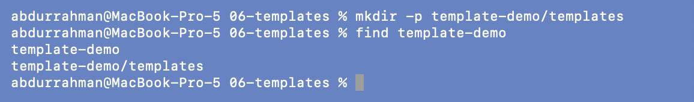
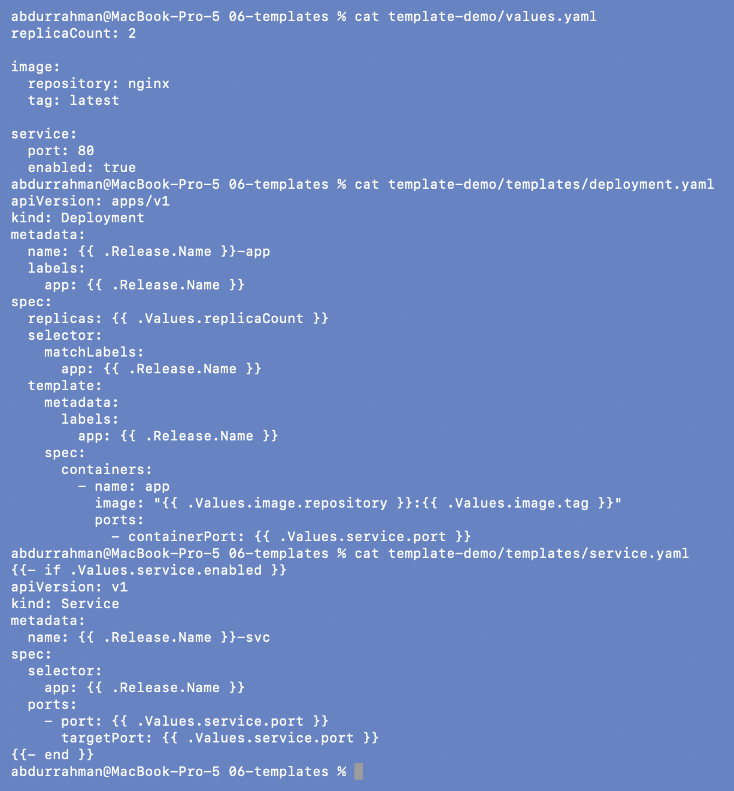
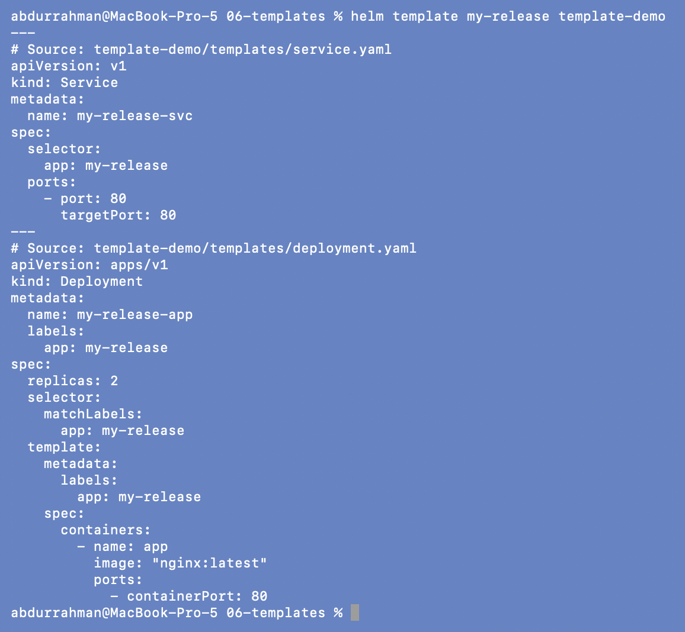
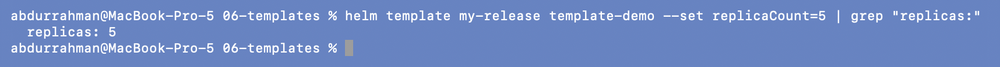
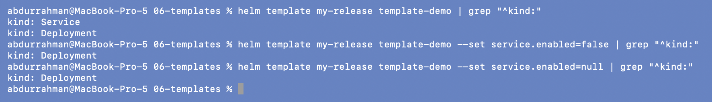

# Templates: Go template variables and conditionals

**Name:** Abdur Rahman Ibne Munir
**Enrollment number:** 24BCS10244

Lecture topic `06-templates`. A template is ordinary Kubernetes YAML with Go template
expressions inside `{{ }}`. Helm fills them in from the release, the chart and the values.

| Expression | Comes from |
|---|---|
| `{{ .Release.Name }}` | the name given to `helm install` |
| `{{ .Values.replicaCount }}` | `values.yaml`, `-f`, `--set` |
| `{{ .Chart.Name }}`, `{{ .Chart.Version }}` | `Chart.yaml` |
| `{{- if … }} … {{- end }}` | renders the block only when the condition is true |

```text
06-templates/
└── template-demo/
    ├── Chart.yaml
    ├── values.yaml              replicaCount: 2, service.enabled: true
    └── templates/
        ├── deployment.yaml
        └── service.yaml         wrapped in {{- if .Values.service.enabled }}
```

## 1. Create the chart

```bash
mkdir -p template-demo/templates
find template-demo
```



Then I added the files from the lecture and printed them:

```bash
cat template-demo/values.yaml
cat template-demo/templates/deployment.yaml
cat template-demo/templates/service.yaml
```



The values in the lecture repo's file include `service.enabled: true`. The values shown in
section 3 of the notes leave that key out, but the Service template in section 6 depends
on it (see step 4).

## 2. Render

```bash
helm template my-release template-demo
```



`{{ .Release.Name }}-app` became `my-release-app` and `{{ .Values.replicaCount }}`
became `2`. Because `service.enabled` is true, the Service is rendered as well.

## 3. Render with a different value

```bash
helm template my-release template-demo --set replicaCount=5 | grep "replicas:"
```



`replicas: 5`. The template stayed the same; only the input changed.

## 4. Addition: the conditional in action

The notes explain `{{- if .Values.service.enabled }}` but never switch it off, so I
rendered it three ways and kept only the `kind:` lines:

```bash
helm template my-release template-demo | grep "^kind:"
helm template my-release template-demo --set service.enabled=false | grep "^kind:"
helm template my-release template-demo --set service.enabled=null | grep "^kind:"
```



- default (`true`): Service **and** Deployment
- `false`: only the Deployment. The whole Service block is skipped.
- `null` (the key removed, as with the values from section 3 of the notes): also only the
  Deployment. A missing key counts as false in `if`, so a chart built from the notes'
  values exactly would silently produce no Service.

## What I understood

- Templates are rendered on my machine before anything goes to the cluster, so
  `helm template` shows exactly what would be applied.
- `{{- if }}` lets one chart serve different setups (Service on or off, Ingress on or off)
  without keeping separate YAML files.
- A missing value counts as false. That is convenient for optional features, but a typo in
  a key name can quietly turn a feature off. That's why charts document every key in
  `values.yaml`, even when it's off.
- The `-` in `{{-` trims the whitespace before the tag. Without it, the `if` and `end`
  lines would leave blank lines in the YAML.
