# Install and Upgrade, plus `helm status` and `helm get`

**Name:** Abdur Rahman Ibne Munir
**Enrollment number:** 24BCS10244

Lecture topic `07-install-upgrade`. `helm install` creates a release, `helm upgrade`
changes it, and each one writes a new **revision**. For Task 1 I also added
`helm status`, `helm get values/manifest/all` and a look at where Helm stores revisions,
because the notes don't cover them and this release (with two revisions) is a good place
to show them.

```text
07-install-upgrade/
└── app-chart/              one Deployment, values: replicaCount 1, nginx:1.24
    ├── Chart.yaml
    ├── values.yaml
    └── templates/deployment.yaml
```

`app-chart` is also used by [`../08-rollback/`](../08-rollback/).

## 1. Create the chart

```bash
mkdir -p app-chart/templates
find app-chart
```

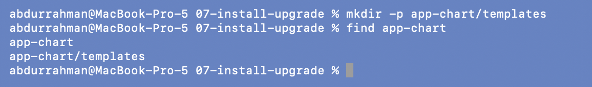

```bash
cat app-chart/Chart.yaml app-chart/values.yaml
cat app-chart/templates/deployment.yaml
```

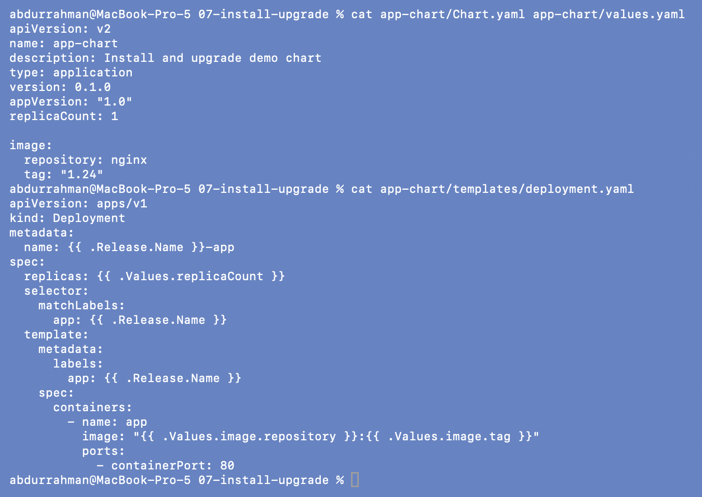

The lecture repo's `deployment.yaml` has a `containerPort: 80` that the README version
leaves out. It makes no difference to how the chart behaves; I kept the repo file.

## 2. Install (`helm install`)

```bash
helm install web-app ./app-chart
kubectl get pods
helm list
```

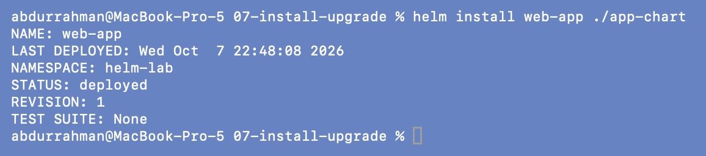
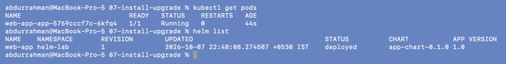

`REVISION: 1`, one `web-app-app-…` Pod running, and `helm list` shows the release in
`helm-lab` with chart `app-chart-0.1.0`.

## 3. Upgrade with a new value (`helm upgrade`)

```bash
helm upgrade web-app ./app-chart --set replicaCount=3
kubectl get pods
kubectl get deploy web-app-app -o wide
helm list
```

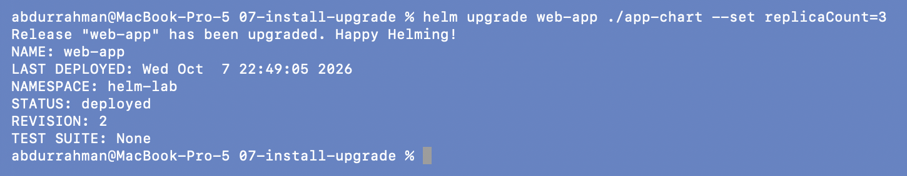
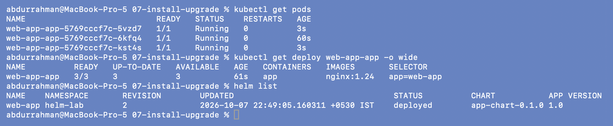

`REVISION: 2`. Two new Pods (3s old) were added next to the original (60s old), and the
Deployment is `3/3`. Only the replica count changed, so no Pod was replaced. The image is
still `nginx:1.24`.

## 4. Addition: `helm status`

```bash
helm status web-app
helm status web-app --revision 1
```

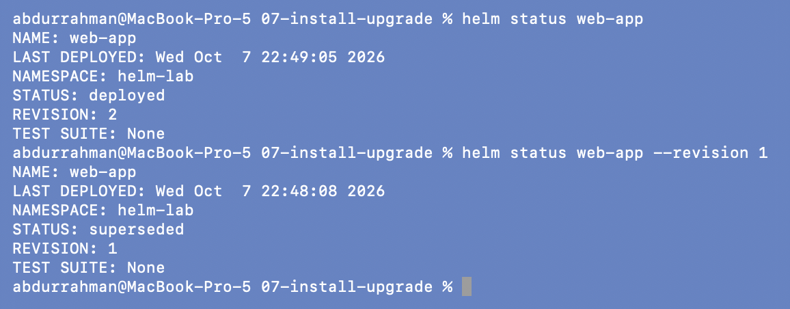

`helm status` shows the summary for the current revision (2, `deployed`). With
`--revision 1` I get the old one, now `superseded`. It's the same block `helm install`
prints, so it's the quick way to see a release's state and NOTES again later.

## 5. Addition: `helm get values`, `helm get manifest`, `helm get all`

```bash
helm get values web-app
helm get values web-app --revision 1
helm get values web-app --all
```

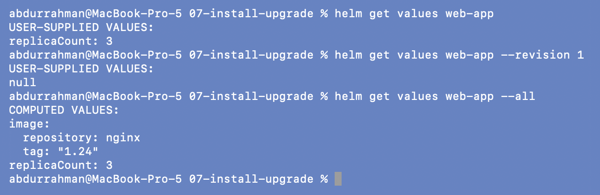

- Revision 2's **user-supplied** values are just `replicaCount: 3`, the `--set` I typed.
- Revision 1 has none (`null`); it was a plain install.
- `--all` shows the **computed** values: chart defaults merged with my overrides
  (`nginx`, `"1.24"`, `3`).

```bash
helm get manifest web-app
```

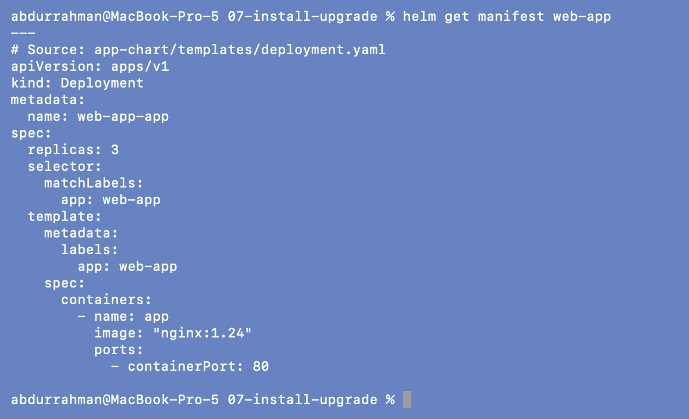

The exact YAML Helm sent to the cluster for this revision, with every template already
filled in (`replicas: 3`, `image: "nginx:1.24"`). It's the stored, applied version of
what `helm template` prints.

```bash
helm get all web-app
```

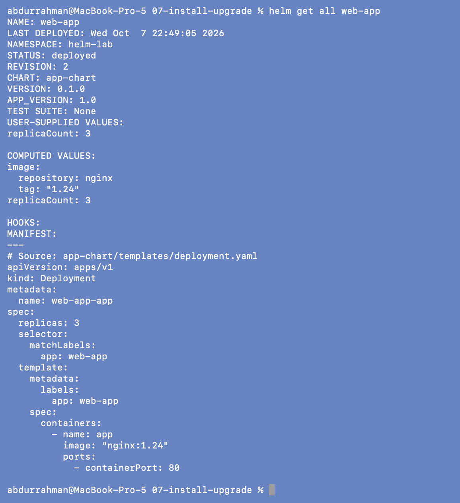

Everything for the revision in one place: status, chart and version, user-supplied values,
computed values, hooks (none) and the manifest.

## 6. Release history (`helm history`) and where it is stored

```bash
helm history web-app
kubectl get secrets -l owner=helm
```

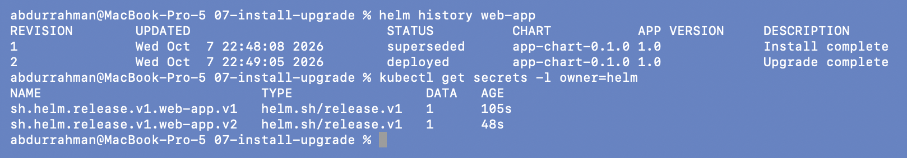

Revision 1 `superseded` / `Install complete`, revision 2 `deployed` /
`Upgrade complete`. Each revision is a Secret of type `helm.sh/release.v1` in the
release's namespace (`sh.helm.release.v1.web-app.v1`, `.v2`). That is the "release state
stored as Kubernetes Secrets" from the Helm 2 vs 3 notes, and it's what `helm get`,
`helm history` and `helm rollback` read.

## 7. install vs upgrade vs upgrade --install

```bash
helm install web-app ./app-chart
helm upgrade new-app ./app-chart
helm upgrade --install web-app ./app-chart
```

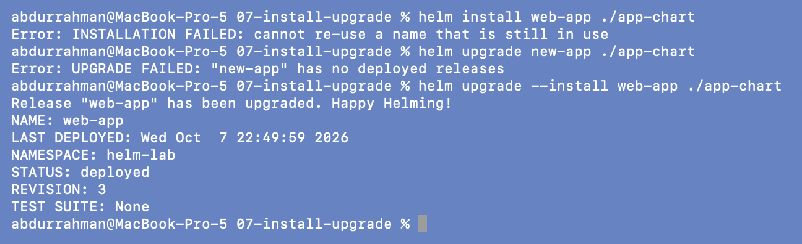

| Command | Release exists? | Result |
|---|---|---|
| `helm install web-app` | yes | `cannot re-use a name that is still in use` |
| `helm upgrade new-app` | no | `"new-app" has no deployed releases` |
| `helm upgrade --install web-app` | yes | upgraded, `REVISION: 3` |

```bash
helm get values web-app
kubectl get deploy web-app-app
helm upgrade --install new-app ./app-chart | head -n 3
helm list
```

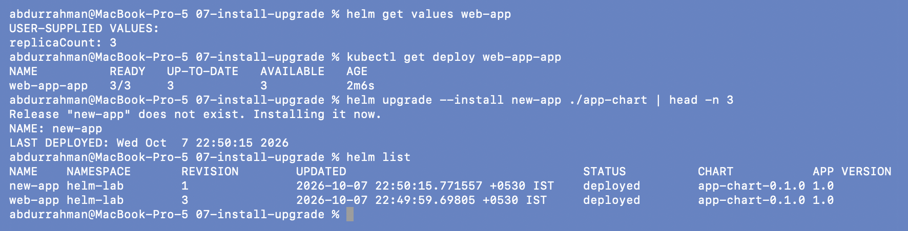

`helm upgrade --install new-app` printed `Release "new-app" does not exist. Installing it
now.`, so the same command covers both cases. That's why CI/CD pipelines use it.

Something I didn't expect: revision 3 was run **without** `--set`, yet it still has
`replicaCount: 3` and the Deployment stayed at 3/3. When an upgrade gets no values at all
(no `-f`, no `--set`), Helm 3 reuses the previous revision's values. As soon as you pass
any value, it starts from the chart defaults plus only what you passed. That second rule
is what goes wrong in the [mini project](../mini-project/README.md#problem-found-step-13-quietly-drops-the-production-values).

## 8. Uninstall

```bash
helm uninstall web-app new-app
helm list
kubectl get secrets -l owner=helm
```

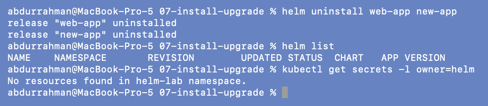

`helm uninstall` takes several release names at once. The revision Secrets are deleted
too, so the history is gone. (`--keep-history` would keep them.)

## What I understood

- Every install, upgrade and rollback is a numbered revision, stored as a Secret in the
  release's namespace. That stored history is what makes rollback possible.
- `helm get values` shows only what I supplied; `--all` shows the merged result. Comparing
  the two is the fastest way to answer "what is actually configured?".
- `helm get manifest` is the source of truth for what Helm applied. It's what I'd diff
  against `kubectl get -o yaml` if I suspected someone had edited objects by hand.
- `helm upgrade --install` is safe to run repeatedly, so it fits pipelines. Because an
  upgrade with any `--set` starts again from the chart defaults, a pipeline should always
  pass its full values file.
