# Rollback: `helm rollback` and `--atomic`

**Name:** Abdur Rahman Ibne Munir
**Enrollment number:** 24BCS10244

Lecture topic `08-rollback`. If an upgrade breaks the app, `helm rollback <release> <N>`
re-applies revision N's stored manifest in one command. This folder has no chart of its
own: it reuses `app-chart` from [`../07-install-upgrade/`](../07-install-upgrade/).

```text
Revision 1: working  (1 replica, nginx:1.24)
Revision 2: broken   (image tag that doesn't exist: nginx:doesnotexist)
```

The longer, Task 2 version of this workflow (install, two upgrades, rollback, with checks
after every step) is in [`../task-2-rollback-workflow/`](../task-2-rollback-workflow/).

## Problem found: `./app-chart` isn't in this folder

```bash
ls
helm install rollback-demo ./app-chart
```

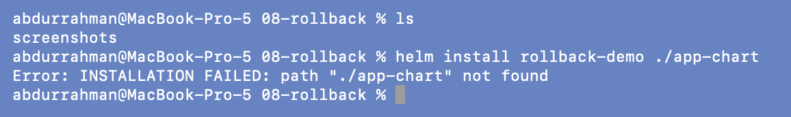

**Problem.** `INSTALLATION FAILED: path "./app-chart" not found`.
**Root cause.** The notes say "use the `app-chart` from topic 07", but the command is
written as if the chart sat inside `08-rollback/`.
**Fix.** Point at the chart where it lives instead of copying it, so there is only one
copy of `app-chart`:

```bash
helm install rollback-demo ../07-install-upgrade/app-chart
kubectl get pods
kubectl get deploy rollback-demo-app -o wide
```

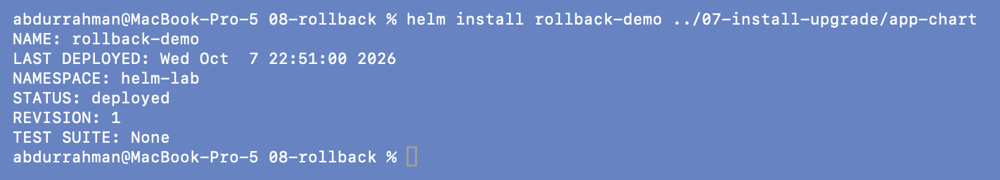
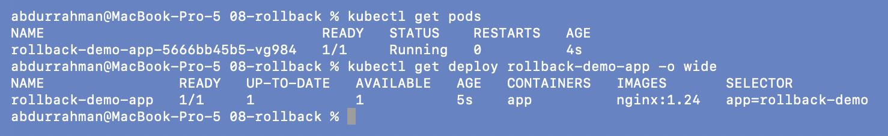

Revision 1: one Pod running `nginx:1.24`.

## 1. Upgrade to a broken image

```bash
helm upgrade rollback-demo ../07-install-upgrade/app-chart --set image.tag=doesnotexist
kubectl get pods
kubectl get deploy rollback-demo-app -o wide
```

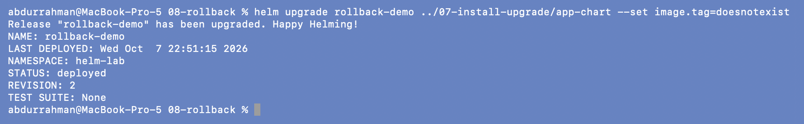
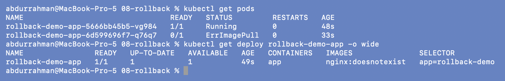

Helm reports `STATUS: deployed`, but the new Pod is in `ErrImagePull`. The old Pod
(`…5666bb45b5-vg984`) is still `Running`. That's the Deployment's rolling update at work:
the old Pod is only removed once a new one becomes ready, and that never happens. So the
app is still up on the old version, but the Deployment's image is already
`nginx:doesnotexist`.

```bash
helm history rollback-demo
```

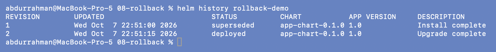

Revision 2 says `deployed` / `Upgrade complete` even though it is broken. Without
`--wait` or `--atomic`, Helm only checks that the API server **accepted** the objects,
not that the Pods came up.

## 2. Roll back to revision 1

```bash
helm rollback rollback-demo 1
kubectl get pods
kubectl get deploy rollback-demo-app -o wide
helm history rollback-demo
```

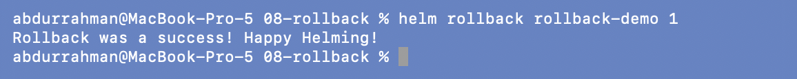
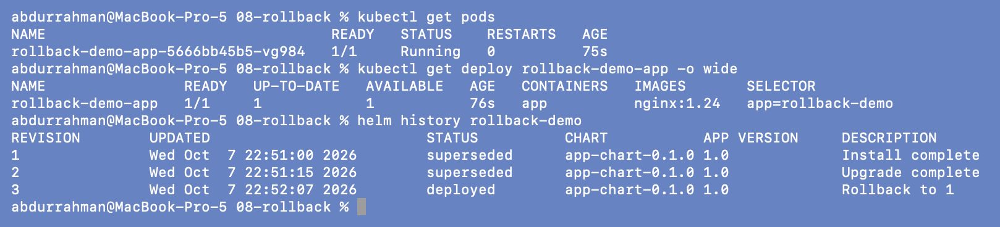

The image is `nginx:1.24` again and only the original Pod remains: the broken one was
removed. The history shows a new **revision 3** with `Rollback to 1`. Rollback doesn't
delete revision 2; it writes a new revision with revision 1's contents.

## 3. `--atomic`: automatic rollback

```bash
time helm upgrade rollback-demo ../07-install-upgrade/app-chart \
  --set image.tag=doesnotexist --atomic --timeout 60s
```

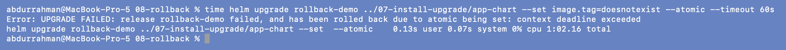

This time the command waited, then failed:
`release rollback-demo failed, and has been rolled back due to atomic being set: context
deadline exceeded`. `time` shows it took about 62 seconds: the 60s timeout plus the
rollback.

```bash
helm history rollback-demo
kubectl get pods
kubectl get deploy rollback-demo-app -o wide
```

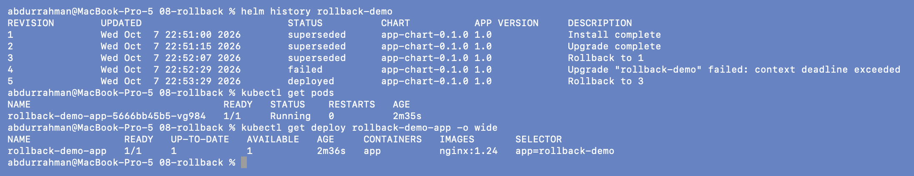

Revision 4 is `failed`, and revision 5, `Rollback to 3`, was created by Helm itself. The
Deployment is back on `nginx:1.24`, and the same Pod (now 2m35s old) never stopped
serving.

## Clean up

```bash
helm uninstall rollback-demo
helm list
kubectl get secrets -l owner=helm
```

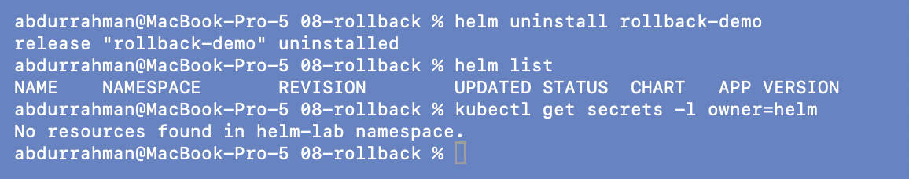

## What I understood

- A plain `helm upgrade` reports success as soon as Kubernetes accepts the objects, so a
  broken image still shows `deployed`. I have to check the Pods (or use `--wait`) to know
  whether the release actually works.
- `helm rollback` never rewrites history. It adds a new revision that copies an old one,
  so the record shows what broke and when it was undone.
- `--atomic` (which implies `--wait`) makes the upgrade all or nothing: if the Pods aren't
  ready before `--timeout`, Helm rolls back on its own and the command exits with an
  error, which a CI job will see as a failure.
- The Deployment's rolling update and Helm's rollback work together. The old Pod kept
  serving during the bad upgrade, so this mistake caused no downtime.
