# Deploying an Application with Helm: the guestbook

**Name:** Abdur Rahman Ibne Munir
**Enrollment number:** 24BCS10244

Lecture topic `09-deploying-application`. Everything from the previous topics in one go:
write a chart from scratch, lint it, render it, install it, check it, upgrade, roll back,
uninstall.

```text
09-deploying-application/
└── guestbook-chart/
    ├── Chart.yaml
    ├── values.yaml                  replicaCount 1, nginx, service.port 80, config.*
    └── templates/
        ├── configmap.yaml           welcome + appName from values
        ├── deployment.yaml          envFrom the ConfigMap
        └── service.yaml             NodePort 30080 (hardcoded)
```

## 1. Create the chart

```bash
mkdir -p guestbook-chart/templates
find guestbook-chart
```

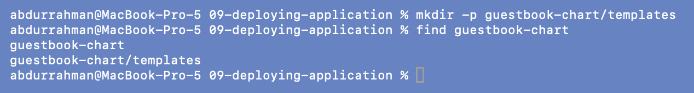

```bash
find guestbook-chart -type f | sort
cat guestbook-chart/Chart.yaml guestbook-chart/values.yaml
cat guestbook-chart/templates/configmap.yaml
cat guestbook-chart/templates/deployment.yaml
cat guestbook-chart/templates/service.yaml
```

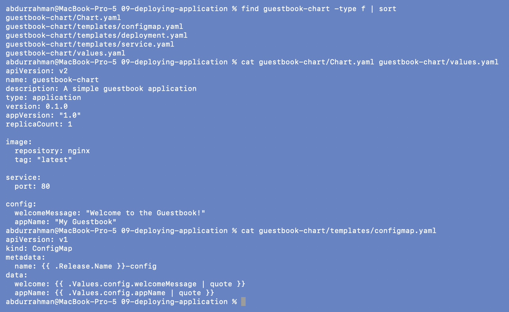
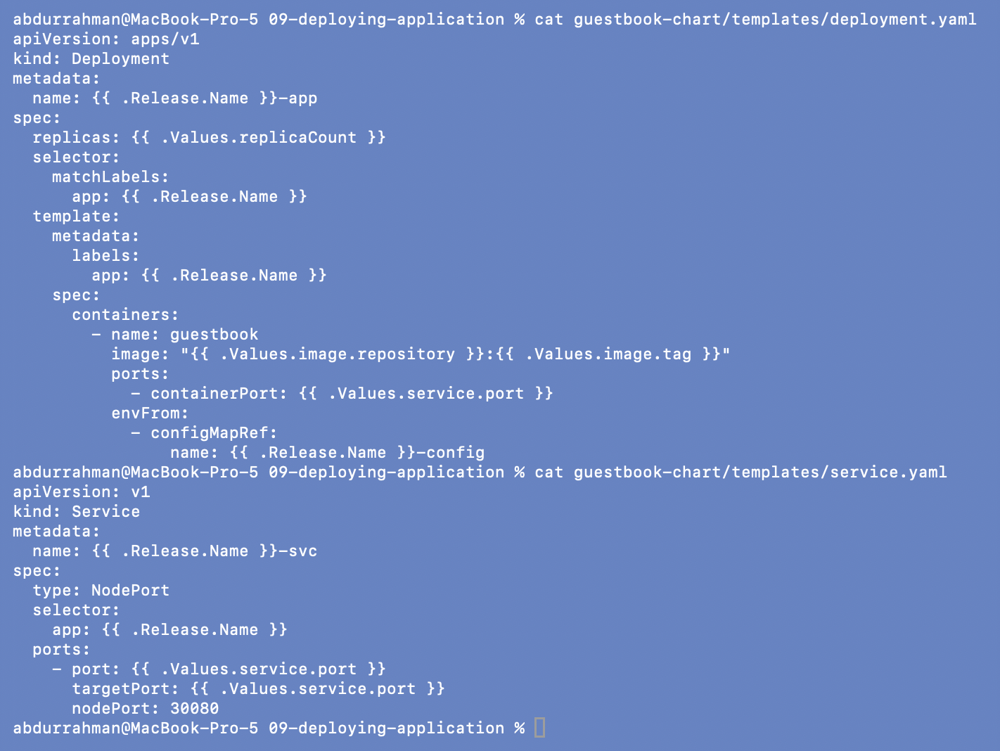

### Note: the values file's image tag differs from the README

Section 4 of the notes shows `image.tag: "1.24"`, but the lecture repo's
`guestbook-chart/values.yaml` has `tag: "latest"`. I kept the repo file as it is, so this
guestbook runs `nginx:latest` (the curl in step 5 shows `nginx/1.31.6`). Both tags exist,
so it runs either way. A pinned tag like `1.24` would be the better choice, because
`latest` can change between two installs of the same chart version.

## 2. Lint

```bash
helm lint guestbook-chart
```

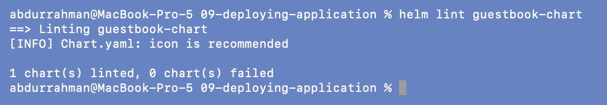

`1 chart(s) linted, 0 chart(s) failed`. The `icon is recommended` line is only `[INFO]`.

## 3. Render locally

```bash
helm template my-guestbook guestbook-chart
```

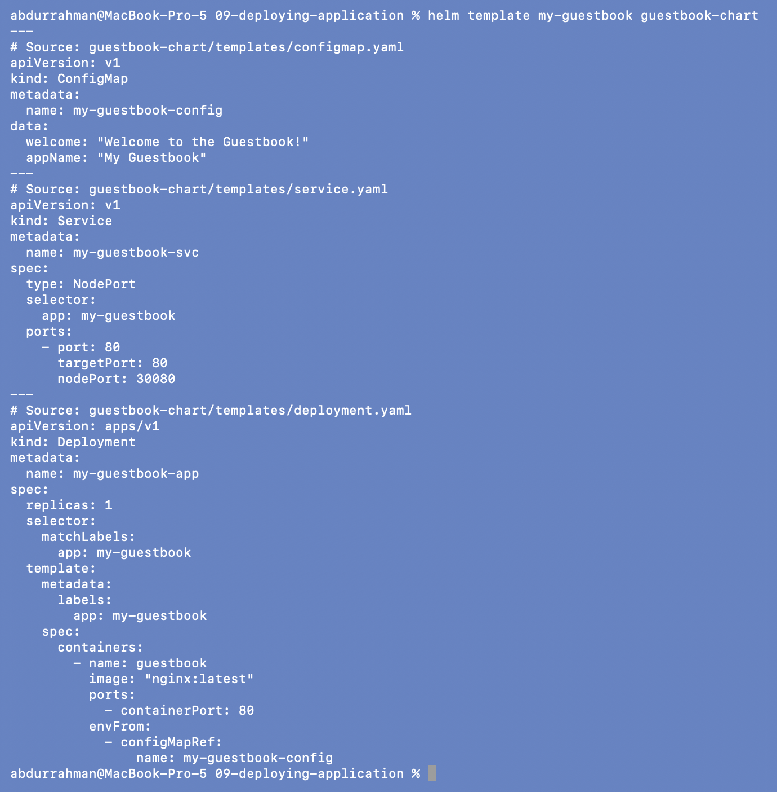

Every `{{ }}` is filled in: `my-guestbook-config` with the two quoted strings, the
Deployment reads it with `envFrom`, and the Service is `NodePort` 30080.

## 4. Install and verify

```bash
helm install my-guestbook guestbook-chart
kubectl get pods
kubectl get services
kubectl get configmaps
```

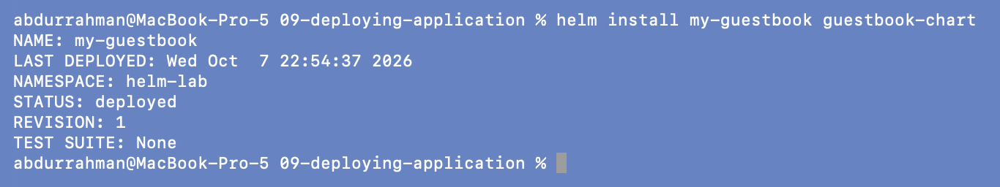
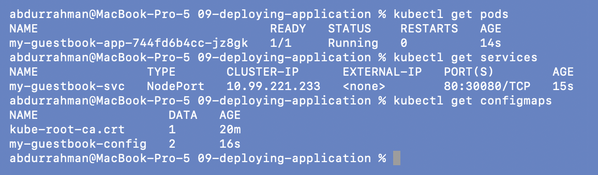

One Pod running, Service `my-guestbook-svc` on `80:30080/TCP`, and ConfigMap
`my-guestbook-config` with 2 keys. (`kube-root-ca.crt` is created automatically in every
namespace.)

**Addition: is the ConfigMap really inside the container?**

```bash
kubectl exec deploy/my-guestbook-app -- env | grep -E "^welcome|^appName"
```

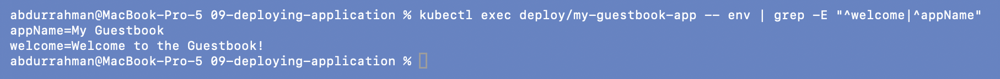

Yes: `appName=My Guestbook` and `welcome=Welcome to the Guestbook!` are environment
variables in the Pod, straight from `values.yaml` through the ConfigMap.

## 5. Reach the app

On minikube with the docker driver on macOS, the node IP isn't reachable from the Mac, so
the NodePort can't be used directly:

```bash
minikube ip
curl -sS --max-time 5 http://$(minikube ip):30080 -o /dev/null -w "%{http_code}\n"
```

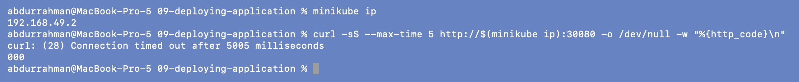

`Connection timed out`. The node `192.168.49.2` lives on Docker Desktop's internal
network. So I used a port-forward to the Service on my session's port 18153:

```bash
kubectl port-forward svc/my-guestbook-svc 18153:80
curl -sI http://localhost:18153 | head -n 2
curl -s http://localhost:18153 | grep "<title>"
```

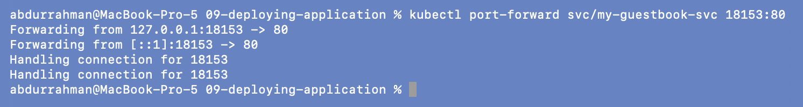
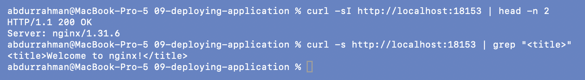

`200 OK`, `Server: nginx/1.31.6`, "Welcome to nginx!".

## 6. Upgrade: scale to 3 replicas

```bash
helm upgrade my-guestbook guestbook-chart --set replicaCount=3
kubectl get pods
helm history my-guestbook
```

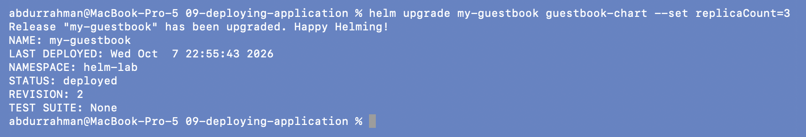

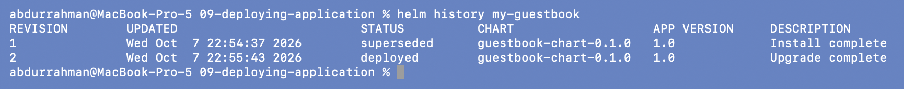

`REVISION: 2`, three Pods (two new, 4s old, and the original, 70s old), and the history
shows `Install complete` then `Upgrade complete`.

## 7. Rollback

```bash
helm rollback my-guestbook 1
kubectl get pods
helm history my-guestbook
```

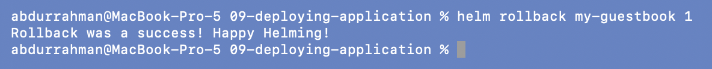
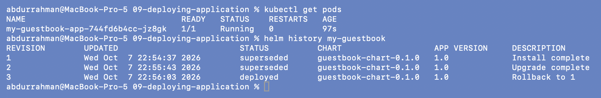

Back to one Pod, the original `…jz8gk`. Revision 3 is `Rollback to 1`.

## Problem found: release name `guestbook` vs `my-guestbook`, and a fixed nodePort

The notes start with `helm install guestbook ./guestbook-chart`, but every later step uses
`my-guestbook`. I followed the later steps (above). Then I also ran the header command,
while `my-guestbook` was still installed:

```bash
helm install guestbook ./guestbook-chart
helm list -a
kubectl get deploy,cm,svc
```

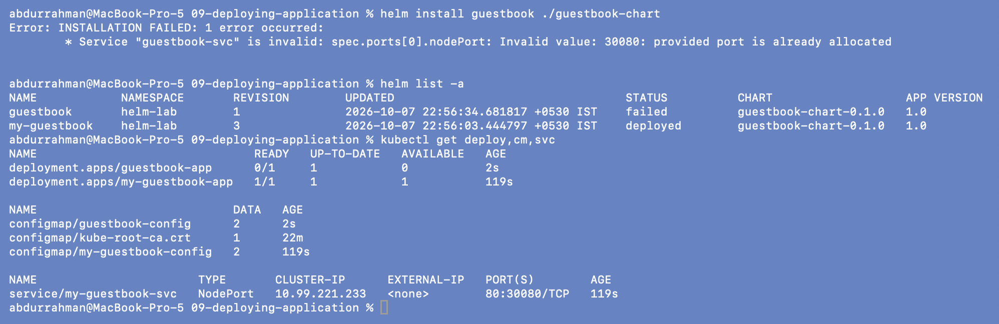

**Problem.** `Service "guestbook-svc" is invalid: spec.ports[0].nodePort: Invalid value:
30080: provided port is already allocated`. The release is left in `failed` state, with
its Deployment and ConfigMap created but no Service.

**Root cause.** `service.yaml` hardcodes `nodePort: 30080`. NodePorts are cluster-wide,
not per namespace, so only one Service in the whole cluster can hold 30080, and a second
release of the same chart can never install. The name mix-up in the notes is what exposed
it.

**What I did.** Removed the failed release (Helm still tracks it and its objects, so
`helm uninstall` is the clean way out):

```bash
helm uninstall guestbook
kubectl get deploy,cm
```

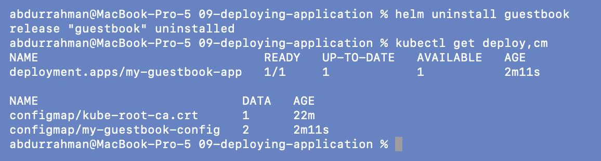

The proper fix is in the chart. The [mini project](../mini-project/) chart already does
it: it reads `nodePort` from values, so each release can pick a free port. Even better,
leave `nodePort` out and let Kubernetes pick one. I did not change this chart, so the
copy here is exactly the lecture's.

## 8. Clean up

```bash
helm uninstall my-guestbook
helm list -a
kubectl get deploy,svc,cm
```

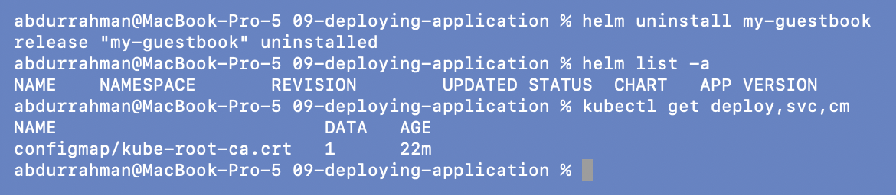

The Deployment, Service and ConfigMap all went with the release. Only the automatic
`kube-root-ca.crt` remains.

## What I understood

- The lint, template, install, verify, upgrade, rollback, uninstall loop is the whole
  life of a release. Each step is one command because Helm treats all of the chart's
  objects as one unit.
- Config changes go through `values.yaml` and land in a ConfigMap, so the same image runs
  with different settings per release without being rebuilt.
- Anything cluster-wide that is hardcoded in a template (NodePorts, cluster-scoped names)
  breaks the "install the chart many times" promise. Those should come from values or be
  left for Kubernetes to choose.
- A failed install still leaves a release behind (`helm list -a` shows it). It has to be
  uninstalled before the name can be reused.
