# Mini Project (Task 3): Package and Deploy the Notes App with Helm

**Name:** Abdur Rahman Ibne Munir
**Enrollment number:** 24BCS10244

Homework Task 3. A Helm chart written from scratch for a "Notes" web app (nginx stands in
for the app), with separate dev and prod values. I took it through lint, render, a dev
install, an upgrade to prod values, a deliberately bad upgrade, rollback and cleanup.

```text
mini-project/
└── notes-chart/
    ├── Chart.yaml           notes-chart 0.1.0, appVersion 1.0
    ├── values.yaml          dev:  1 replica,  nginx:1.24, environment: development
    ├── values-prod.yaml     prod: 3 replicas, nginx:1.25, environment: production
    └── templates/
        ├── configmap.yaml   APP_NAME, ENVIRONMENT from values
        ├── deployment.yaml  envFrom the ConfigMap; label environment=<env>
        └── service.yaml     NodePort, port and nodePort from values (30090)
```

This chart is reused for the Task 2 rollback workflow in
[`../task-2-rollback-workflow/`](../task-2-rollback-workflow/).

## Steps 1-7: create the chart

```bash
mkdir -p notes-chart/templates
find notes-chart
```

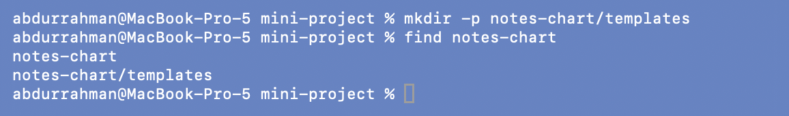

I added the six files exactly as in the notes (identical to the lecture repo's copies):

```bash
find notes-chart -type f | sort
cat notes-chart/Chart.yaml
diff notes-chart/values.yaml notes-chart/values-prod.yaml
```

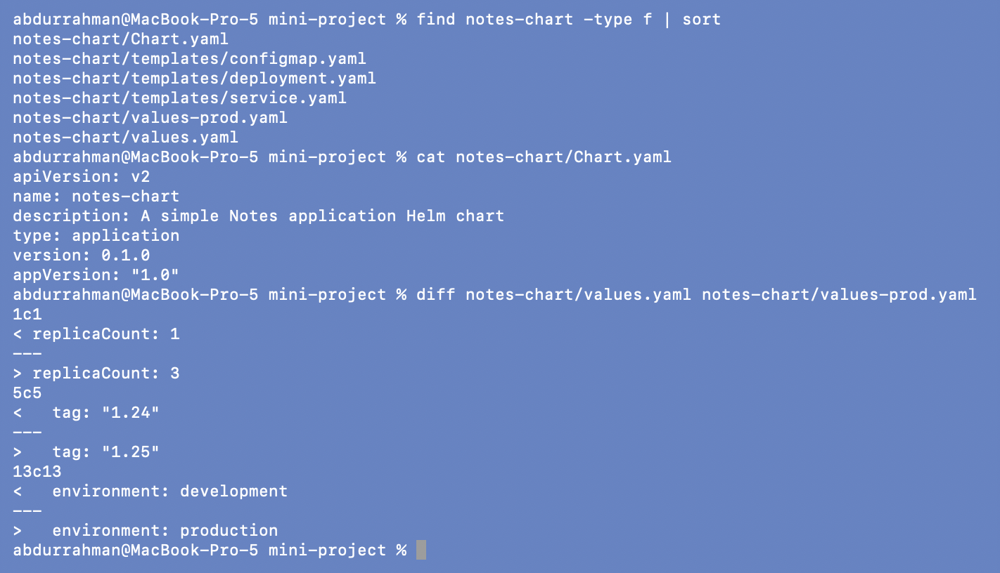

The `diff` shows the whole difference between dev and prod in one place:
`replicaCount 1 → 3`, `tag "1.24" → "1.25"`, `environment development → production`.

```bash
cat notes-chart/templates/configmap.yaml
cat notes-chart/templates/deployment.yaml
cat notes-chart/templates/service.yaml
```

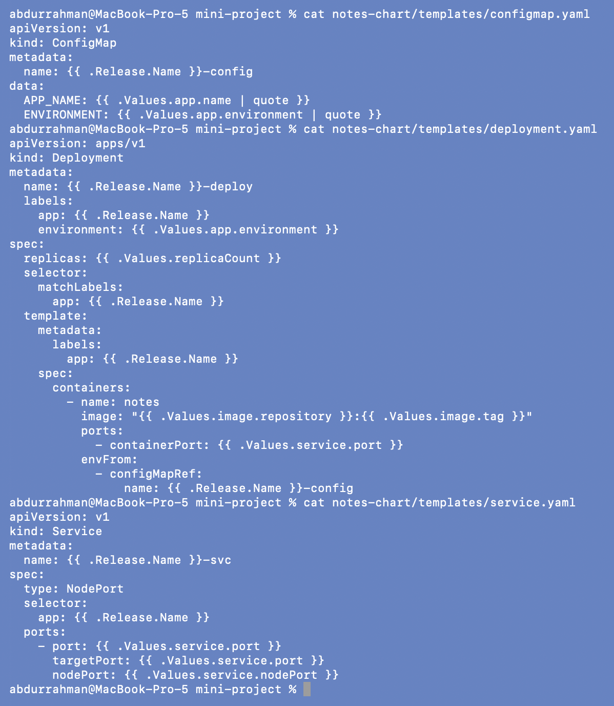

## Step 8: lint

```bash
helm lint notes-chart
```

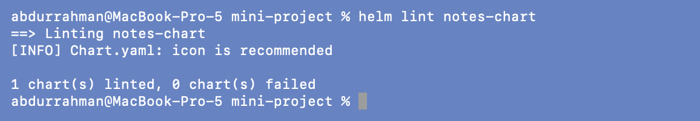

## Step 9: render locally

```bash
helm template notes-dev notes-chart
```

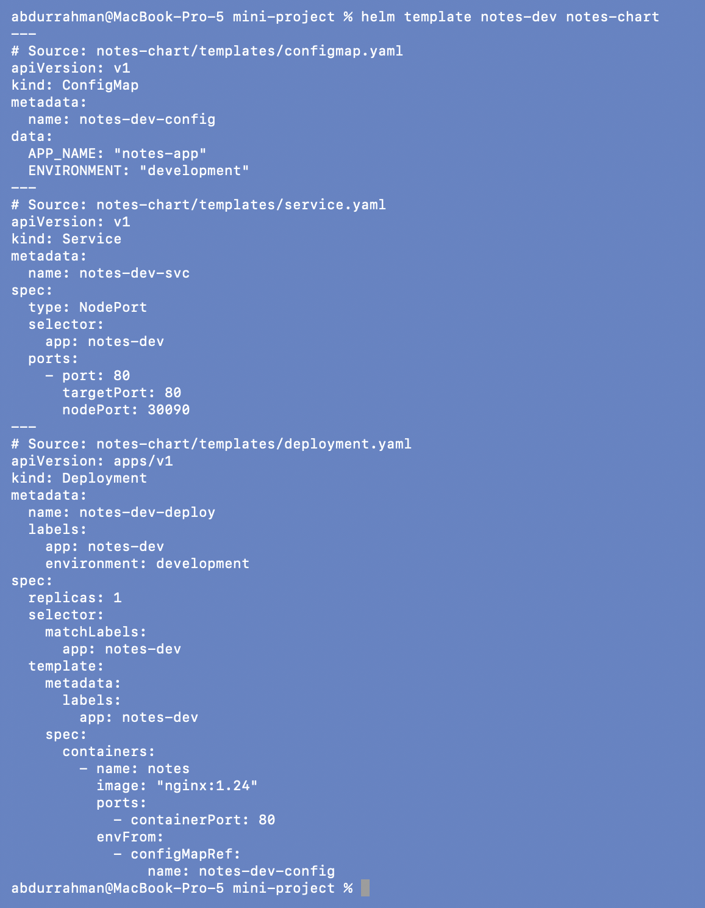

All `{{ }}` are filled in with the dev values. As an addition, I previewed what prod
values would change before touching the cluster:

```bash
helm template notes-dev notes-chart -f notes-chart/values-prod.yaml | grep -E "replicas:|image:|ENVIRONMENT:|environment:"
```

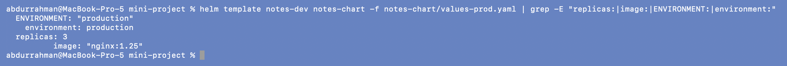

`production`, `replicas: 3`, `nginx:1.25`.

## Step 10: install (development)

The chart sets `nodePort: 30090`. NodePorts are cluster-wide, so this only works while
no other Service in the cluster holds 30090 (see the clash in
[09](../09-deploying-application/README.md#problem-found-release-name-guestbook-vs-my-guestbook-and-a-fixed-nodeport)).
Unlike the guestbook, this chart reads the port from values, so a second install could
pick another one with `--set service.nodePort=…`.

```bash
helm install notes-dev notes-chart
kubectl get pods
kubectl get services
kubectl get configmaps
kubectl exec deploy/notes-dev-deploy -- env | grep -E "APP_NAME|ENVIRONMENT"
kubectl exec deploy/notes-dev-deploy -- nginx -v
```

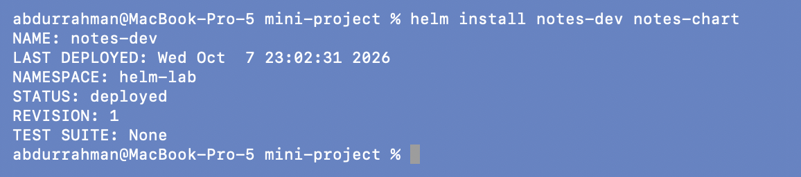
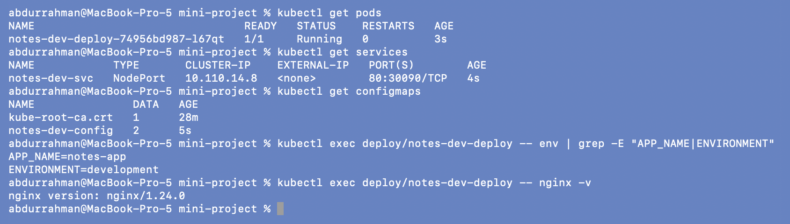

One Pod, Service `80:30090/TCP`, ConfigMap with 2 keys. Inside the container:
`ENVIRONMENT=development` and `nginx/1.24.0`. The checks with `exec` are my additions;
they prove the values really reached the running container.

NodePort 30090 isn't reachable from macOS with the docker driver, so I used a
port-forward on my session's port 18154:

```bash
kubectl port-forward svc/notes-dev-svc 18154:80
curl -sI http://localhost:18154 | head -n 2
curl -s http://localhost:18154 | grep "<title>"
```

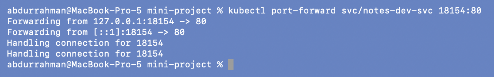
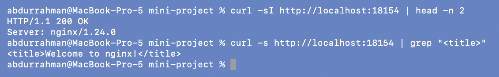

`200 OK`, `Server: nginx/1.24.0`.

## Step 11: upgrade to production values

```bash
helm upgrade notes-dev notes-chart -f notes-chart/values-prod.yaml
kubectl get pods
kubectl get deploy notes-dev-deploy -o wide
kubectl exec deploy/notes-dev-deploy -- env | grep ENVIRONMENT
kubectl exec deploy/notes-dev-deploy -- nginx -v
```

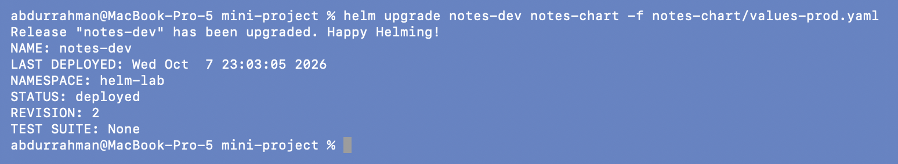
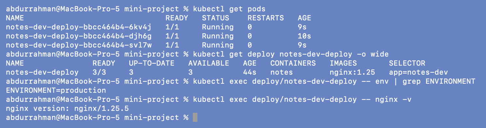

`REVISION: 2`. Three new Pods (the image changed, so every Pod was replaced), `nginx:1.25`
(`nginx/1.25.5` inside), `ENVIRONMENT=production`.

## Step 12: release history

```bash
helm history notes-dev
helm get values notes-dev
```

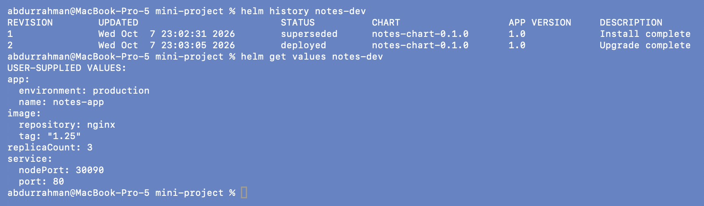

Revision 2 `deployed`. `helm get values` shows the whole prod file as the user-supplied
values for this revision.

## Problem found: step 13 quietly drops the production values

Step 13 as written:

```bash
helm upgrade notes-dev notes-chart --set image.tag=broken-tag-does-not-exist
kubectl get pods
kubectl get deploy notes-dev-deploy -o wide
```

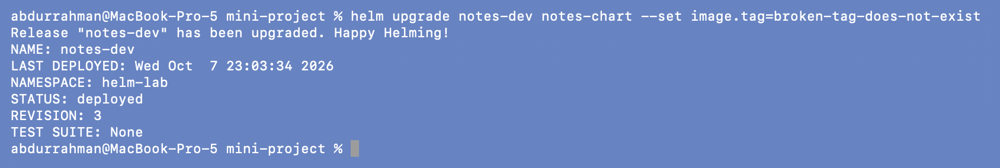
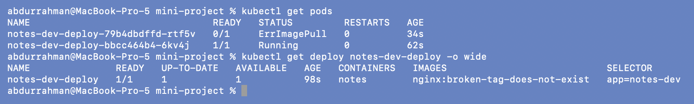

The notes expect one `ImagePullBackOff` Pod among the prod Pods. What I got: the broken
Pod (`ErrImagePull`) plus only **one** of the three prod Pods still running, and the
Deployment now wants **1** replica, not 3.

```bash
helm get values notes-dev
kubectl get deploy notes-dev-deploy --show-labels
kubectl get configmap notes-dev-config -o jsonpath='{.data}'; echo
```

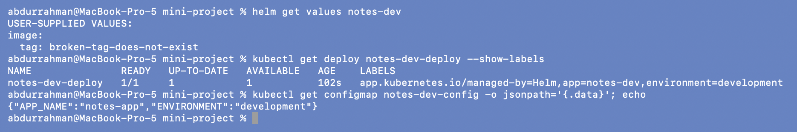

**Root cause.** The only user-supplied value in revision 3 is the broken tag. When
`helm upgrade` gets any `--set` or `-f`, it starts again from the chart's `values.yaml`
(the **dev** defaults) and applies only what was passed. The prod file from revision 2 is
not carried over. So the "bad upgrade" changed three things, not one: the image broke,
replicas went from 3 to 1, and `ENVIRONMENT` / the `environment` label went back to
`development`. In a real cluster that would take capacity away from prod and point it at
dev config.

**Fix.** Pass the prod file again on every prod upgrade (or use `--reuse-values`, which
I avoid because it hides what the release is really running). First, step 14 as
written:

### Step 14: roll back to revision 2

```bash
helm rollback notes-dev 2
kubectl get pods
kubectl get deploy notes-dev-deploy -o wide --show-labels
kubectl get configmap notes-dev-config -o jsonpath='{.data}'; echo
helm history notes-dev
```


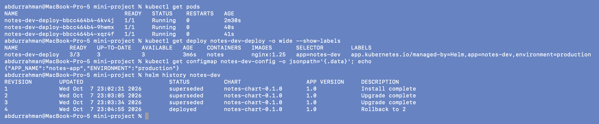

Back to 3/3 on `nginx:1.25`, label `environment=production`, ConfigMap
`"ENVIRONMENT":"production"`. Revision 4 is `Rollback to 2`. The rollback restored the
whole revision, ConfigMap included, not just the image.

### Step 13 done correctly

```bash
helm upgrade notes-dev notes-chart -f notes-chart/values-prod.yaml --set image.tag=broken-tag-does-not-exist | grep -E "STATUS|REVISION"
helm get values notes-dev | grep -E "environment|tag|replicaCount"
kubectl get pods
kubectl get deploy notes-dev-deploy -o wide
```

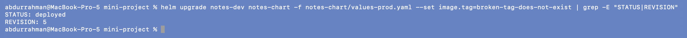
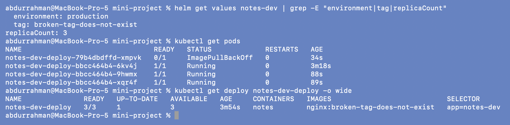

Now only the image changes: `environment: production` and `replicaCount: 3` stay. The
result is what the notes describe: three prod Pods still `Running` and one new Pod in
`ImagePullBackOff`. The rolling update can't continue, so users are still served by the
old version.

```bash
helm rollback notes-dev
kubectl get pods
kubectl get deploy notes-dev-deploy -o wide
helm history notes-dev
```


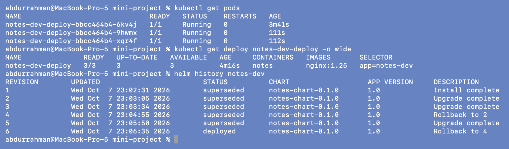

`helm rollback` without a revision number goes to the previous one: revision 6 says
`Rollback to 4`, the healthy prod state. The broken Pod is gone and the three prod Pods
were never touched (the oldest is 3m41s).

## Step 15: clean up

```bash
helm uninstall notes-dev
helm list
kubectl get services
kubectl get configmaps
kubectl get pods
```

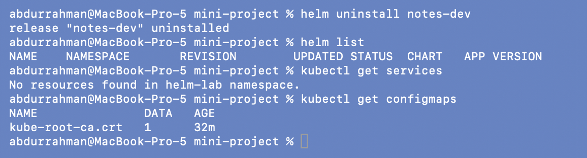
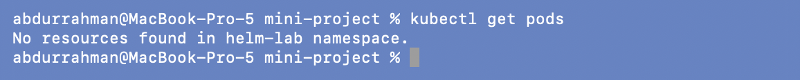

Deployment, Service and ConfigMap are gone. The last screenshot is from a few seconds
later, once the Pods had finished terminating.

## What I practiced

```text
[PASS] Created a Helm chart from scratch
[PASS] Used values.yaml and values-prod.yaml
[PASS] Deployed to Kubernetes with helm install
[PASS] Upgraded the release with different values
[PASS] Simulated a bad upgrade (broken image tag), as written and corrected
[PASS] Rolled back to a healthy revision (by number, and to "previous")
[PASS] Cleaned up with helm uninstall
```

## What I understood

- One chart plus two small values files replaces two full sets of YAML. The `diff` of
  the values files is the entire difference between environments.
- `helm upgrade` doesn't remember the values files of earlier upgrades. Every upgrade must
  pass the full set of values for that environment, or the chart defaults come back.
- `helm get values` is how I caught that: it shows exactly what each revision was given.
- A rollback restores the whole revision: Deployment, ConfigMap and labels together. That
  is the advantage over `kubectl rollout undo`, which only knows about the Deployment.
- The Deployment's rolling update kept the old Pods serving during both bad upgrades, so
  the rollback fixed the release without any downtime.
