# Task 2: Helm Rollback Workflow

**Name:** Abdur Rahman Ibne Munir
**Enrollment number:** 24BCS10244

Homework Task 2: **Install → Upgrade → Verify → Upgrade again → Verify → Rollback →
Verify**, with the whole process documented. The lecture's rollback demos
([08](../08-rollback/), [mini project](../mini-project/)) roll back from a *broken*
upgrade. Here both upgrades are healthy, and I roll back from a working version to an
older working version, the "the new release is fine but we need the old one back" case.

The chart is the mini project's `notes-chart`, used in place (`CHART=../mini-project/notes-chart`),
installed as a separate release `notes-rb`.

| Revision | Action | Values | Expected |
|---|---|---|---|
| 1 | install | chart defaults (dev) | 1 replica, nginx 1.24, development |
| 2 | upgrade | `-f values-prod.yaml` | 3 replicas, nginx 1.25, production |
| 3 | upgrade again | `-f values-prod.yaml --set image.tag=1.27 --set replicaCount=4` | 4 replicas, nginx 1.27, production |
| 4 | rollback to 2 | (revision 2's stored values) | 3 replicas, nginx 1.25, production |

After every step I check the same things: `helm history`, `kubectl get pods`, the image
on the Deployment, and the nginx version **inside** the running container (`nginx -v`), so
the result is proven from inside the Pod, not just read from the Deployment spec.

Both upgrades pass `-f values-prod.yaml`. That's the lesson from the mini project's
step 13: an upgrade with `--set` but no values file falls back to the dev defaults.

## Step 1: Install

```bash
CHART=../mini-project/notes-chart
helm install notes-rb $CHART
```

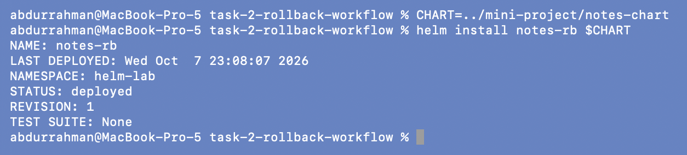

### Verify revision 1

```bash
helm history notes-rb
kubectl get pods
kubectl get deploy notes-rb-deploy -o wide
kubectl exec deploy/notes-rb-deploy -- nginx -v
kubectl exec deploy/notes-rb-deploy -- printenv ENVIRONMENT
```

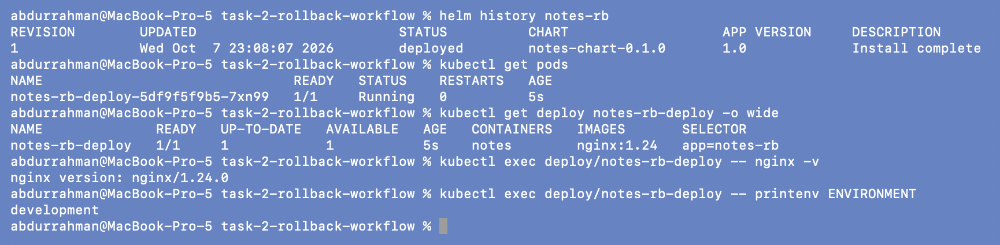

Revision 1 `deployed`, 1 Pod, `nginx:1.24`, `nginx/1.24.0` inside, `development`.

## Step 2: Upgrade (to production values)

```bash
helm upgrade notes-rb $CHART -f $CHART/values-prod.yaml
```

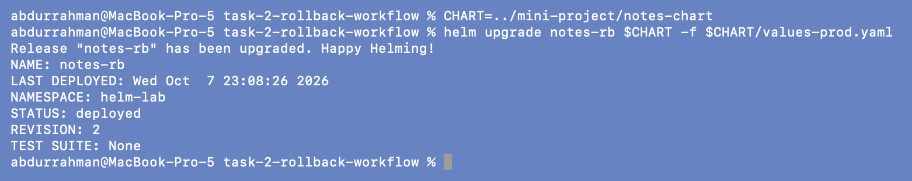

### Verify revision 2

```bash
helm history notes-rb
kubectl get pods
kubectl get deploy notes-rb-deploy -o wide
kubectl exec deploy/notes-rb-deploy -- nginx -v
kubectl exec deploy/notes-rb-deploy -- printenv ENVIRONMENT
```

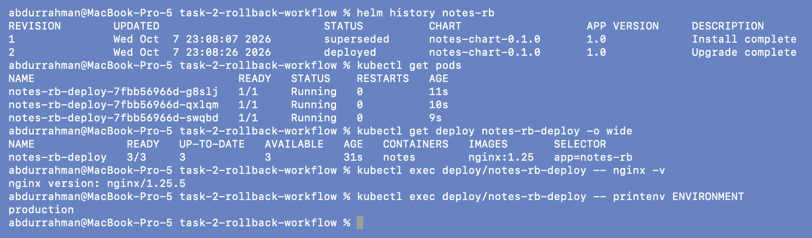

Revision 1 `superseded`, revision 2 `deployed`. 3/3 Pods from the new ReplicaSet
`7fbb56966d`, `nginx:1.25` (`nginx/1.25.5`), `production`.

## Step 3: Upgrade again (new image + one more replica)

```bash
helm upgrade notes-rb $CHART -f $CHART/values-prod.yaml --set image.tag=1.27 --set replicaCount=4
```

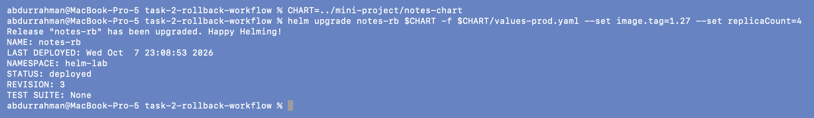

### Verify revision 3

```bash
helm history notes-rb
kubectl get pods
kubectl get deploy notes-rb-deploy -o wide
kubectl exec deploy/notes-rb-deploy -- nginx -v
helm get values notes-rb | grep -E "tag|replicaCount"
```

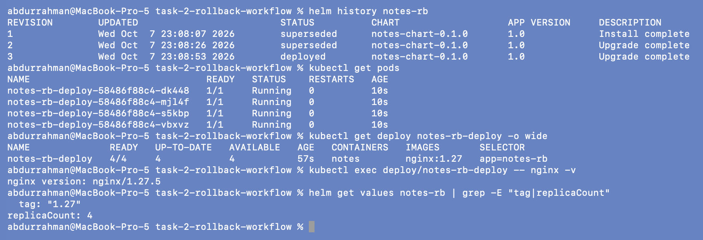

Revision 3 `deployed`. 4/4 Pods from another new ReplicaSet (`58486f88c4`), `nginx:1.27`
(`nginx/1.27.5` inside). `helm get values` confirms the two `--set` overrides were stored
with the revision.

## Step 4: Rollback to revision 2

```bash
helm rollback notes-rb 2
```

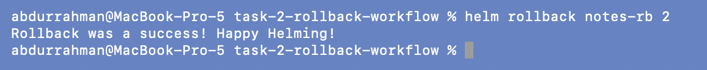

### Verify revision 4

```bash
helm history notes-rb
kubectl get pods
kubectl get deploy notes-rb-deploy -o wide
kubectl exec deploy/notes-rb-deploy -- nginx -v
kubectl exec deploy/notes-rb-deploy -- printenv ENVIRONMENT
```

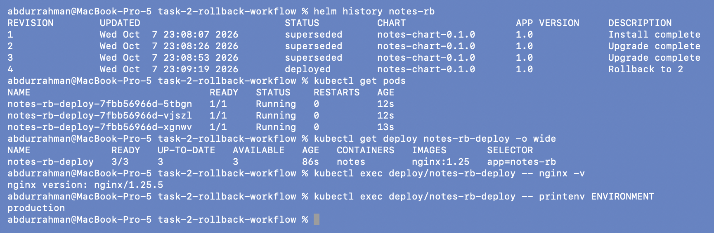

- History: a **new** revision 4, `Rollback to 2`. Revisions 1-3 are still listed as
  `superseded`, so nothing was erased.
- 3/3 Pods on `nginx:1.25`, `nginx/1.25.5` inside, `production`: exactly revision 2.
- The Pods belong to ReplicaSet `7fbb56966d`, the **same** hash as in revision 2. The
  rendered Pod template is identical to revision 2's, so the Deployment scaled its old
  ReplicaSet back up instead of creating a new one. The Pods themselves are new (12s old).

### Addition: prove revision 4 has exactly revision 2's values

```bash
diff <(helm get values notes-rb --revision 2) <(helm get values notes-rb) && echo "revision 4 values == revision 2 values"
diff <(helm get values notes-rb --revision 3) <(helm get values notes-rb)
```

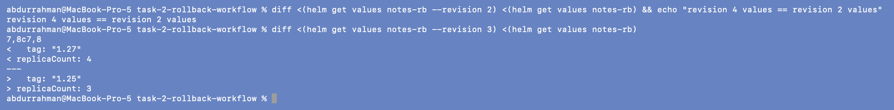

The first `diff` is empty, so revision 4 is a copy of revision 2's values. The second
shows exactly what the rollback undid: `tag "1.27" → "1.25"` and `replicaCount 4 → 3`.

### Addition: verify from outside the cluster

```bash
kubectl port-forward svc/notes-rb-svc 18155:80
curl -sI http://localhost:18155 | grep -E "HTTP|Server"
```

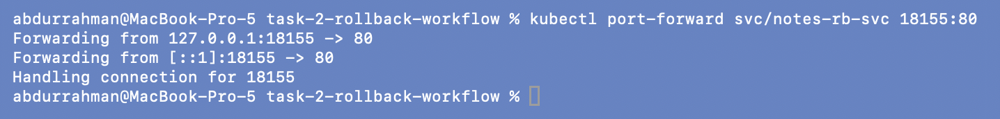
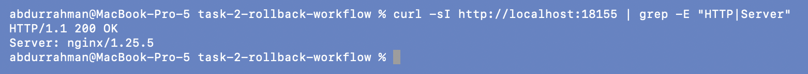

`200 OK` and `Server: nginx/1.25.5`: a real request through the Service is answered by
the rolled-back version. (Port 18155 is from my session's range; the NodePort isn't
reachable from macOS with the docker driver.)

## Cleanup (end of the whole session)

```bash
helm uninstall notes-rb
helm list -a
kubectl get secrets -l owner=helm
kubectl delete namespace helm-lab
kubectl get namespace helm-lab
```

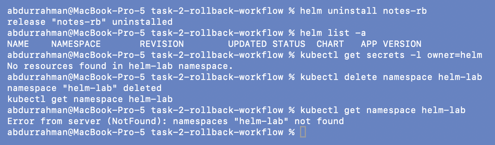

Release, revision Secrets and the session namespace `helm-lab` are all gone.

## The whole workflow in one picture

```text
rev 1  install          1 x nginx:1.24  development   superseded
rev 2  upgrade (prod)   3 x nginx:1.25  production    superseded
rev 3  upgrade again    4 x nginx:1.27  production    superseded
rev 4  rollback to 2    3 x nginx:1.25  production    deployed    (same ReplicaSet as rev 2)
```

## What I understood

- A rollback is a new revision. `helm history` keeps a full log of what was deployed and
  when, including the rollback itself, which is what I'd want during an incident review.
- A rollback restores the **values and rendered manifest** of the target revision, not
  just the image. Replicas, ConfigMap data and labels all went back together.
- Verifying at several levels matters: `helm history` says what Helm thinks, the
  Deployment shows the spec, `nginx -v` inside the Pod and `curl` through the Service
  show what is actually running.
- Because both upgrades passed the prod values file explicitly, every revision is fully
  described by its own values. That's what makes rolling back to any of them predictable.
