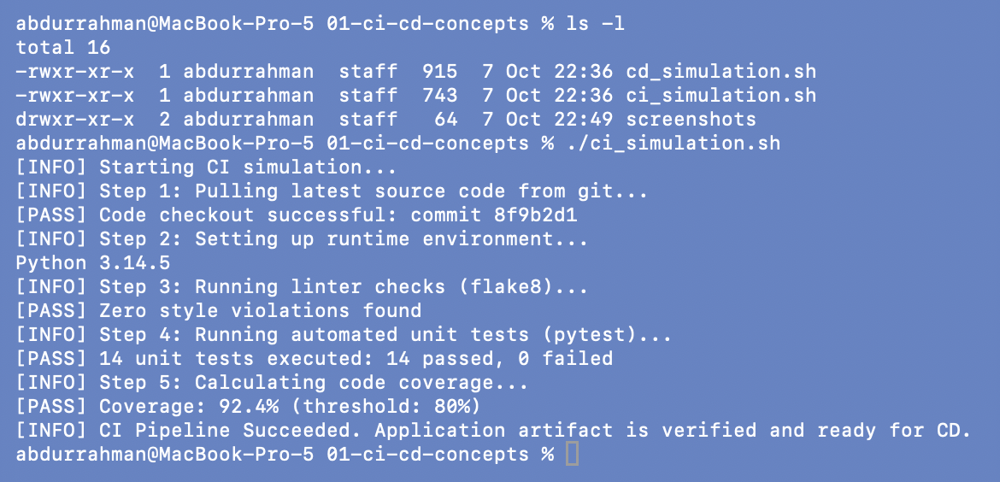
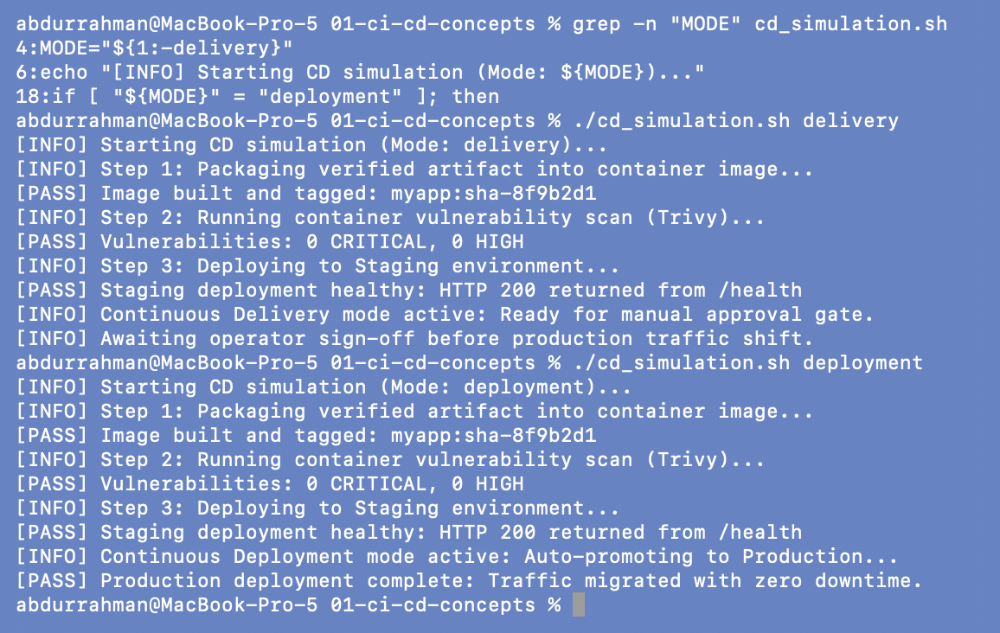

# CI vs CD and the CI/CD Pipeline

**Name:** Abdur Rahman Ibne Munir
**Enrollment number:** 24BCS10244

Session 16, lecture parts `01-ci-vs-cd` and `02-cicd-pipeline`. These two parts are theory
only (no code), so this folder has my summary plus two small simulation scripts I borrowed
from the older copy of the notes (`01-ci-vs-cd 10-33-34-211/`). The real, working
pipelines are in the later folders.

## Folder structure

```text
01-ci-cd-concepts/
├── ci_simulation.sh     borrowed from the older notes, unchanged
├── cd_simulation.sh     borrowed from the older notes, unchanged
├── screenshots/
└── README.md
```

## CI, Continuous Delivery, Continuous Deployment

| | Continuous Integration | Continuous Delivery | Continuous Deployment |
|---|---|---|---|
| Question it answers | "Did this change break the code?" | "Is this build ready to release?" | "Is it already live?" |
| Runs on | every push / pull request | every change that passed CI | every change that passed CI |
| Typical stages | checkout, build, unit tests, lint | package (image/zip), push to a registry, deploy to staging | the same, plus deploy to production |
| Last step | PASS / FAIL report | a human approves the production release | no human gate, it ships automatically |
| In this homework | `test`, `security-check`, `build` jobs | `docker` job: build image, smoke test, push to GHCR | not done (no production target) |

A CI/CD pipeline is just these stages chained so that each one only runs if the previous
one passed:

```text
git push ─▶ Checkout ─▶ Build ─▶ Test ──FAIL──▶ STOP (nobody ships broken code)
                                   │
                                  PASS
                                   ▼
                               Package ─▶ Deliver / Deploy
```

---

## 1. CI simulation

```bash
ls -l
./ci_simulation.sh
```



The script walks through the CI stages: checkout, runtime setup, lint, unit tests,
coverage. Only the `python3 --version` line is real (it printed my Mac's 3.14.5); the
rest is hard-coded `echo` text. "14 unit tests" and "92.4%" are not measured. I used it
only to see the stage order.

## 2. Continuous Delivery vs Continuous Deployment

```bash
grep -n "MODE" cd_simulation.sh
./cd_simulation.sh delivery
./cd_simulation.sh deployment
```



Both modes package the app, scan it and deploy to staging. The only difference is the last
stage. `delivery` stops at "Awaiting operator sign-off", while `deployment` auto-promotes to
production. So the two CDs differ only in whether a human approves the final step.

---

## What I understood

- **CI is about the code, CD is about the release.** CI builds and tests every change so
  bugs are caught the same day; CD takes a build that already passed CI and moves it
  towards users.
- **Delivery and Deployment differ by one gate.** Continuous Delivery keeps a manual
  approval before production; Continuous Deployment removes it.
- **A pipeline is a chain of gates.** If any stage fails, everything after it is skipped.
  I saw this for real in `04-build-and-test` and `final-cicd-project`, where a failing test
  stopped the build and the Docker stage.
- **Simulations are not pipelines.** The borrowed scripts only print text; the later
  folders run real tests inside a real runner container.
