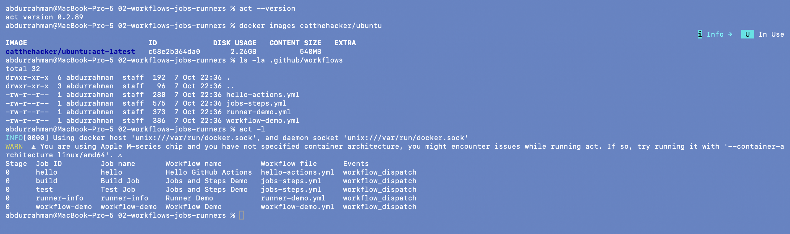
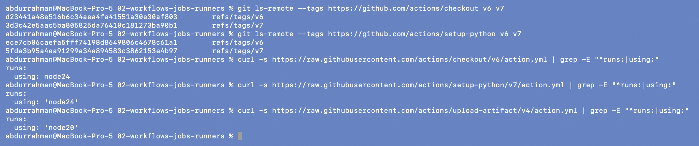
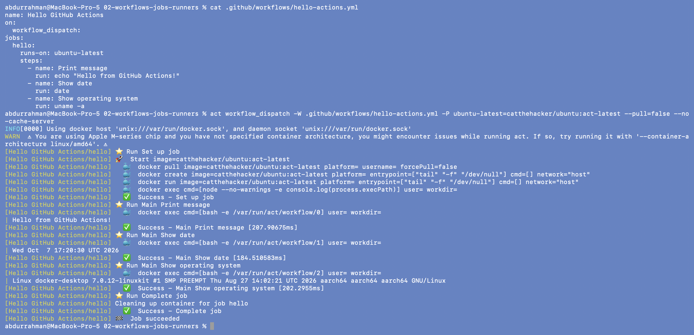
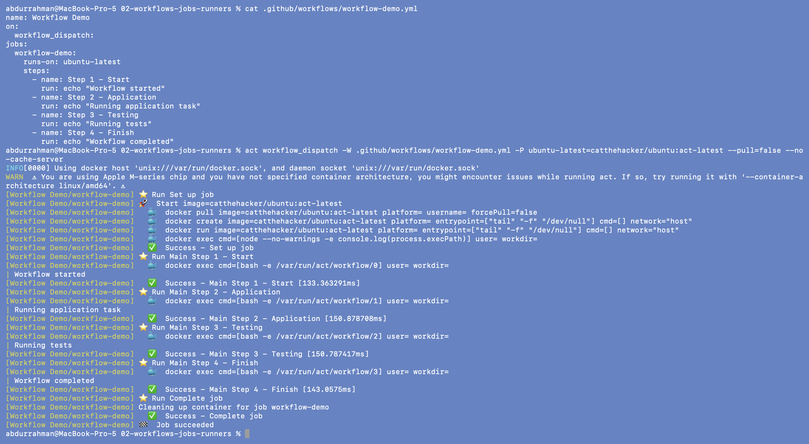
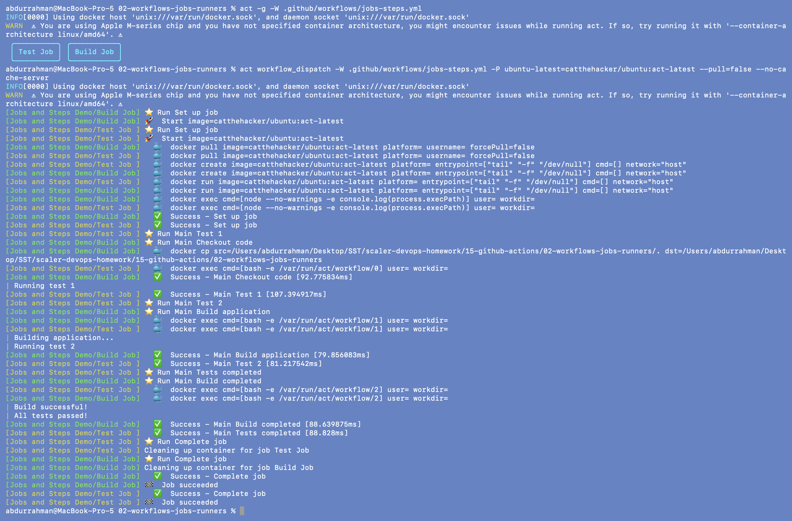
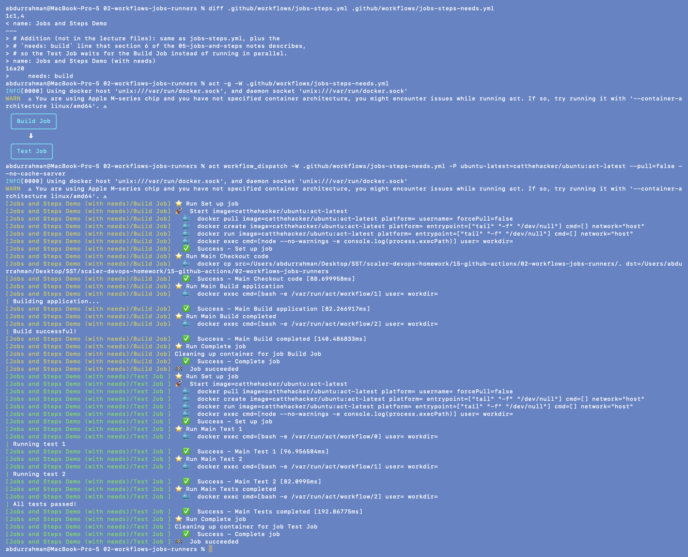
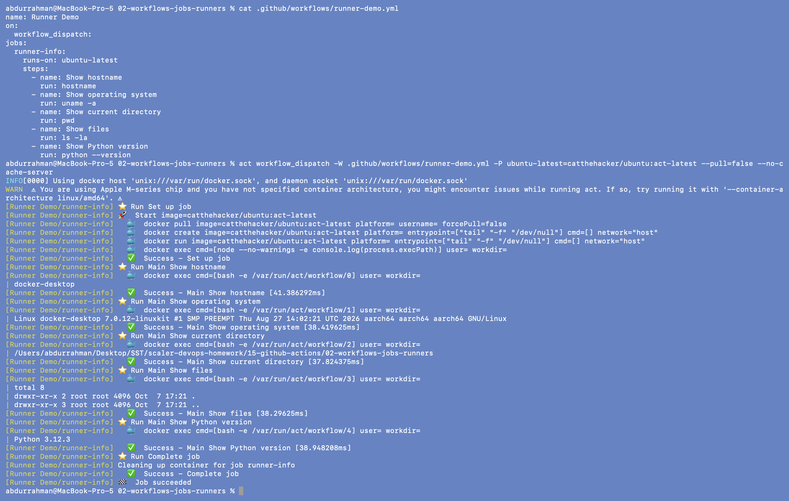

# GitHub Actions: Workflows, Jobs, Steps and Runners

**Name:** Abdur Rahman Ibne Munir
**Enrollment number:** 24BCS10244

Session 16, lecture parts `03-github-actions`, `04-workflows`, `05-jobs-and-steps` and
`06-runners`. The notes run each workflow from the GitHub **Actions** tab ("Run workflow").
I can't push to GitHub for this homework, so I ran the same YAML files on my Mac with
[`act`](https://github.com/nektos/act). act reads `.github/workflows/`, starts a Docker
container that plays the role of the `ubuntu-latest` runner, and runs every step inside it.

## Folder structure

```text
02-workflows-jobs-runners/
├── .github/workflows/
│   ├── hello-actions.yml       03-github-actions (lecture, unchanged)
│   ├── workflow-demo.yml       04-workflows      (lecture, unchanged)
│   ├── jobs-steps.yml          05-jobs-and-steps (lecture, unchanged)
│   ├── jobs-steps-needs.yml    addition: jobs-steps.yml + `needs: build`
│   └── runner-demo.yml         06-runners        (lecture, unchanged)
├── screenshots/
└── README.md
```

All four lecture workflows only have the `workflow_dispatch` trigger (manual "Run
workflow" button), so they are started with `act workflow_dispatch`.

## How the act command maps to GitHub

```bash
act workflow_dispatch -W .github/workflows/<file>.yml \
    -P ubuntu-latest=catthehacker/ubuntu:act-latest --pull=false --no-cache-server
```

| Part | Meaning |
|---|---|
| `workflow_dispatch` | the event to simulate (same as clicking "Run workflow") |
| `-W …yml` | run only this workflow file |
| `-P ubuntu-latest=catthehacker/ubuntu:act-latest` | which Docker image plays the `ubuntu-latest` runner |
| `--pull=false` | the image is already local, don't re-pull it on every job |
| `--no-cache-server` | act would otherwise open a cache server on a random port; this lecture doesn't use `actions/cache` |

---

## 1. Setup and the action versions in the notes

```bash
act --version
docker images catthehacker/ubuntu
ls -la .github/workflows
act -l
```



`act -l` lists every job act found: job ID, display name, workflow and trigger. All jobs are
in **stage 0**, which means none of them waits for another. The `WARN` about Apple M-series
can be ignored: `catthehacker/ubuntu:act-latest` has an arm64 build, so I didn't need
`--container-architecture linux/amd64` (emulation).

The notes use `actions/checkout@v6` and `actions/setup-python@v7`, which are newer than most
tutorials, so I checked that these tags really exist before relying on them:

```bash
git ls-remote --tags https://github.com/actions/checkout v6 v7
git ls-remote --tags https://github.com/actions/setup-python v6 v7
curl -s https://raw.githubusercontent.com/actions/checkout/v6/action.yml | grep -E "^runs:|using:"
curl -s https://raw.githubusercontent.com/actions/setup-python/v7/action.yml | grep -E "^runs:|using:"
curl -s https://raw.githubusercontent.com/actions/upload-artifact/v4/action.yml | grep -E "^runs:|using:"
```



Both tags exist and run on Node 24, so **no version fix was needed**. act later downloaded
`setup-python@v7` and ran it without problems. `upload-artifact@v4` (also from the notes)
still declares Node 20, which GitHub has deprecated; it still works, it just isn't the
newest major.

## 2. Hello GitHub Actions (03-github-actions)

```bash
cat .github/workflows/hello-actions.yml
act workflow_dispatch -W .github/workflows/hello-actions.yml -P ubuntu-latest=catthehacker/ubuntu:act-latest --pull=false --no-cache-server
```



Same three outputs the notes expect: `Hello from GitHub Actions!`, the date (in UTC, the
runner's timezone) and `uname -a`. The `uname` line shows `linuxkit … aarch64`. On GitHub it
would be an Azure VM kernel on x86_64; here the "runner" is a container in Docker Desktop's
Linux VM.

## 3. Workflow Demo (04-workflows)

```bash
cat .github/workflows/workflow-demo.yml
act workflow_dispatch -W .github/workflows/workflow-demo.yml -P ubuntu-latest=catthehacker/ubuntu:act-latest --pull=false --no-cache-server
```



The four steps print exactly the expected output (`Workflow started` … `Workflow
completed`), one after the other. A workflow file is **when** (`on:`) plus **what**
(`jobs:` → `steps:`).

## 4. Jobs and Steps (05-jobs-and-steps): jobs run in parallel

```bash
act -g -W .github/workflows/jobs-steps.yml
act workflow_dispatch -W .github/workflows/jobs-steps.yml -P ubuntu-latest=catthehacker/ubuntu:act-latest --pull=false --no-cache-server
```



`act -g` draws the two jobs side by side. In the run, lines from `Build Job` and `Test Job`
are interleaved: `Running test 1` is printed before the build job has finished its checkout.
Each job got **its own container** (two `docker create` lines), so they really run in
parallel. Inside each job the steps still run strictly in order.

## 5. Addition: making Test wait for Build with `needs`

The notes explain `needs: build` (section 6) but the lecture workflow doesn't use it, so I
made a copy with that single line added.

```bash
diff .github/workflows/jobs-steps.yml .github/workflows/jobs-steps-needs.yml
act -g -W .github/workflows/jobs-steps-needs.yml
act workflow_dispatch -W .github/workflows/jobs-steps-needs.yml -P ubuntu-latest=catthehacker/ubuntu:act-latest --pull=false --no-cache-server
```



Now the graph is `Build Job ⬇ Test Job`, and in the log the whole Build Job finishes
(`Job succeeded`) before the Test Job's container is even created. If the build failed, the
test job would not run at all.

## 6. Runner Demo (06-runners)

```bash
cat .github/workflows/runner-demo.yml
act workflow_dispatch -W .github/workflows/runner-demo.yml -P ubuntu-latest=catthehacker/ubuntu:act-latest --pull=false --no-cache-server
```



| Step | On GitHub (from the notes) | Under act (my run) | Why |
|---|---|---|---|
| `hostname` | `runner-xxxx` | `docker-desktop` | act starts job containers with `network=host`, so they share the Docker VM's hostname |
| `uname -a` | Linux x86_64 | Linux `aarch64` linuxkit | the container runs on Docker Desktop's arm64 VM |
| `pwd` | `/home/runner/work/...` | my Mac path | act uses the same path inside the container as the folder on my Mac |
| `ls -la` | (not shown) | empty directory | this workflow has **no checkout step**, so the runner starts with an empty workspace. That would be the same on GitHub |
| `python --version` | `Python 3.x.x` | `Python 3.12.3` | the Ubuntu 24.04 runner image ships Python 3.12 |

The empty `ls -la` is a useful lesson: a runner is a fresh machine. Your repository is not
there until `actions/checkout` puts it there.

---

## What I understood

- **Workflow → Job → Step.** A workflow (one YAML file in `.github/workflows/`) says *when*
  to run (`on:`) and *what* to run (`jobs:`). Each job is a list of steps that run in order.
- **Every job gets its own runner.** Jobs share nothing by default and run in parallel.
  `needs:` turns them into a sequence, and `act -g` / `act -l` (the Stage column) show that
  ordering before anything runs.
- **A runner is a throw-away machine.** It starts empty (no checkout, no files), runs the
  steps and is deleted. With act the runner is a Docker container, so hostname, kernel and
  CPU architecture differ from GitHub's VMs, but the workflow logic is the same.
- **`uses:` vs `run:`.** `run:` is a shell command; `uses:` runs a published action such as
  `actions/checkout@v6`, so it's worth checking that the version tag exists.
