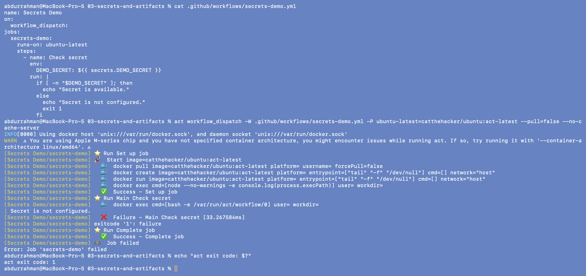
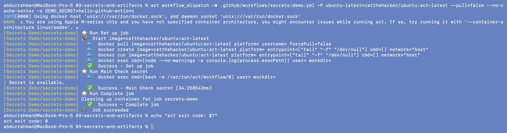
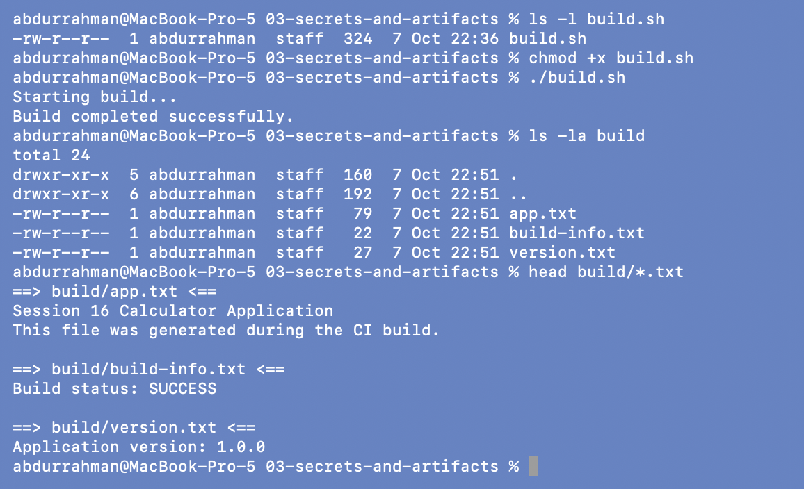
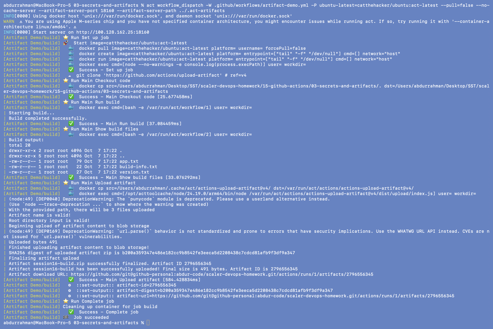
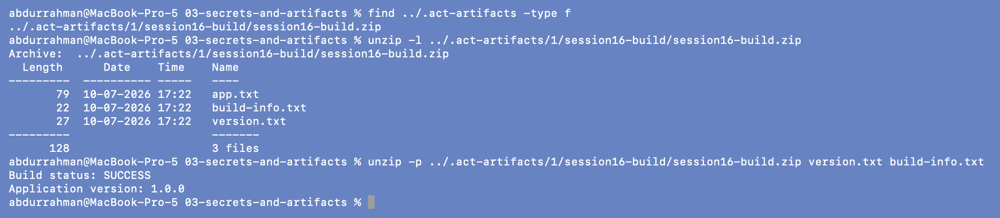

# Secrets and Artifacts

**Name:** Abdur Rahman Ibne Munir
**Enrollment number:** 24BCS10244

Session 16, lecture parts `07-secrets` and `08-artifacts`. Both workflows only have the
`workflow_dispatch` trigger and were run locally with `act` (see
`02-workflows-jobs-runners/README.md` for what the act flags mean).

## Folder structure

```text
03-secrets-and-artifacts/
├── .github/workflows/
│   ├── secrets-demo.yml     07-secrets   (lecture, unchanged)
│   └── artifact-demo.yml    08-artifacts (lecture, unchanged)
├── build.sh                 08-artifacts (lecture, unchanged)
├── screenshots/
└── README.md
```

## Where the secret comes from

| | On GitHub | With act (my run) |
|---|---|---|
| Create it | Repository → Settings → Secrets and variables → Actions → New repository secret, or `gh secret set DEMO_SECRET` | `-s DEMO_SECRET=hello-github-actions` on the command line |
| Read it in YAML | `${{ secrets.DEMO_SECRET }}` | same |
| Missing secret | expression becomes an empty string | same |

`hello-github-actions` is the lecture's fake demo value. For a real secret I would use
`--secret-file` or plain `-s NAME` instead of `-s NAME=value`, so the value doesn't end up
in my shell history.

---

## 1. Secret not configured: the workflow fails

```bash
cat .github/workflows/secrets-demo.yml
act workflow_dispatch -W .github/workflows/secrets-demo.yml -P ubuntu-latest=catthehacker/ubuntu:act-latest --pull=false --no-cache-server
echo "act exit code: $?"
```



`Secret is not configured.`, then `exit 1` fails the step and the job, and act exits with
code 1, the same as the red run the notes describe. A missing secret doesn't cause an error
by itself; `${{ secrets.DEMO_SECRET }}` just becomes empty, which is why the workflow checks
it with `[ -n "$DEMO_SECRET" ]`.

## 2. Secret provided

```bash
act workflow_dispatch -W .github/workflows/secrets-demo.yml -P ubuntu-latest=catthehacker/ubuntu:act-latest --pull=false --no-cache-server -s DEMO_SECRET=hello-github-actions
echo "act exit code: $?"
```



`Secret is available.` and exit code 0. The value itself is never printed. The workflow
only tests whether it is non-empty, which is the "do not print secrets" rule from the notes.

## 3. Build locally

```bash
ls -l build.sh
chmod +x build.sh
./build.sh
ls -la build
head build/*.txt
```



`build.sh` came without the execute bit (`-rw-r--r--`), which is why the notes start with
`chmod +x`. It creates `build/` with the three files the notes list: `app.txt`,
`version.txt` and `build-info.txt`.

## 4. Upload the artifact

On GitHub the artifact is stored with the workflow run. act needs a local artifact server
for that, so I gave it a folder (`--artifact-server-path`) and a port from my assigned range
(`--artifact-server-port 18160`; act's default is 34567).

```bash
act workflow_dispatch -W .github/workflows/artifact-demo.yml -P ubuntu-latest=catthehacker/ubuntu:act-latest --pull=false --no-cache-server --artifact-server-port 18160 --artifact-server-path ../.act-artifacts
```



act started its artifact server on `:18160`. The workflow's own `build.sh` ran **inside the
runner** (the `build/` listing shows `root root`), and `upload-artifact@v4` uploaded 3 files
as `session16-build`.

The "Artifact download URL" it prints is not real. act builds it from my homework repo's
git remote, which uses an SSH host alias (`git@github-personal:abdur-code/...`) that act
can't parse, and nothing is ever sent to GitHub. On GitHub this is a working link on the
run's Summary page.

## 5. "Download" the artifact

act keeps uploaded artifacts as zip files in the folder I gave it, so downloading means
opening that zip:

```bash
find ../.act-artifacts -type f
unzip -l ../.act-artifacts/1/session16-build/session16-build.zip
unzip -p ../.act-artifacts/1/session16-build/session16-build.zip version.txt build-info.txt
```



The zip has the same three files (times in UTC, the runner's clock). They come from the
runner's own build: `build.sh` starts with `rm -rf build`, so nothing from my local `build/`
could get into the artifact. The `1/` in the path is the run number; act always uses run 1, so a
later run overwrites the earlier artifact. The `.act-artifacts/` folder is git-ignored and I
deleted it after taking the screenshots.

---

## What I understood

- **Secrets are injected at run time, never stored in the YAML.** The workflow only names
  the secret (`secrets.DEMO_SECRET`); the value lives in the repository settings. A missing
  secret is silently empty, so a pipeline that depends on it should check and fail early.
- **Don't print secrets, even though GitHub masks them.** Testing `-n "$VAR"` proves the
  secret is there without leaking it into logs that many people can read.
- **Artifacts are how output survives the runner.** The runner is deleted after the job,
  so `build/` would be lost. `upload-artifact` stores it with the run, where people (or
  later jobs, see `final-cicd-project`) can download it.
- **Git stores source, artifacts store build output.** `build/` is git-ignored in the
  projects but uploaded as an artifact.
