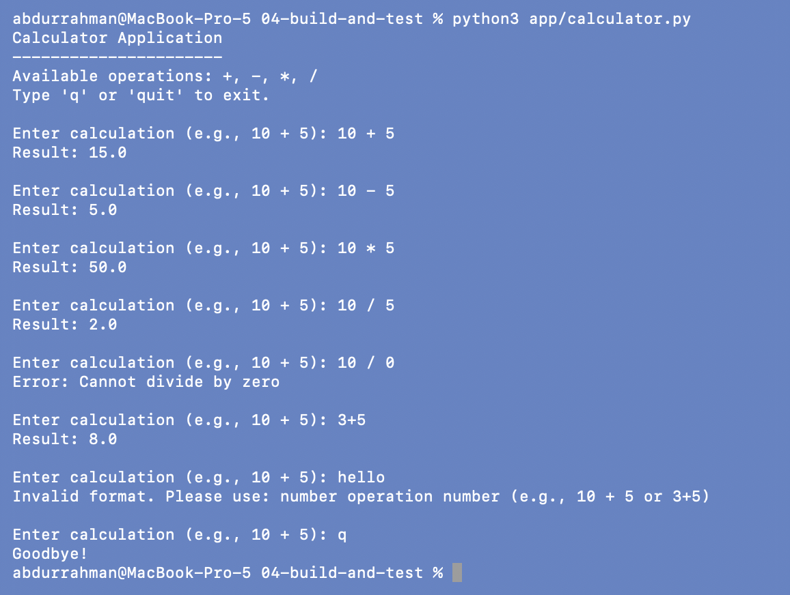
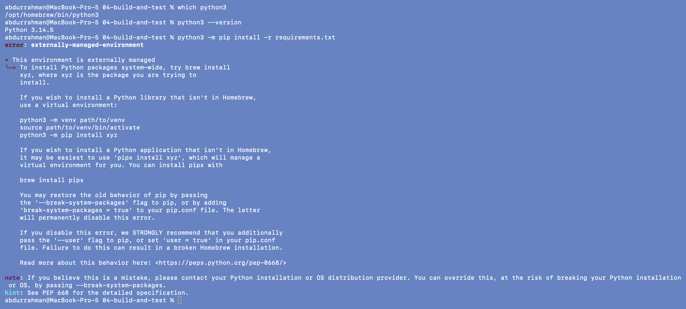
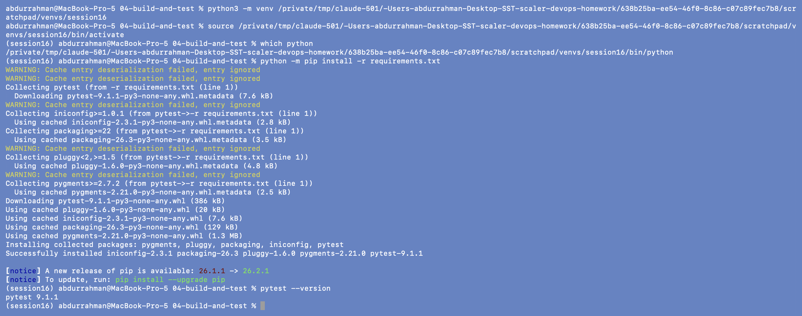
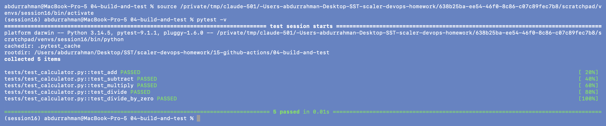
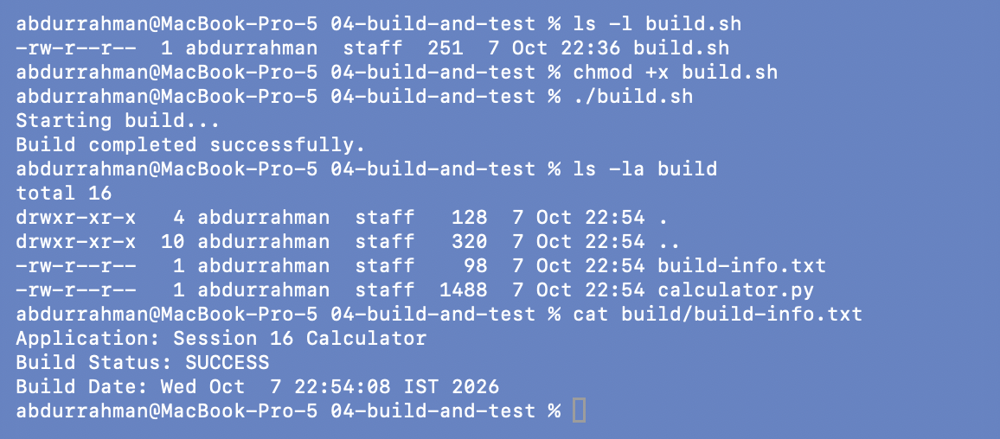
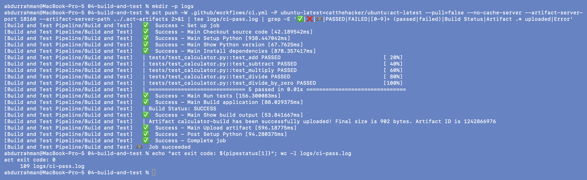
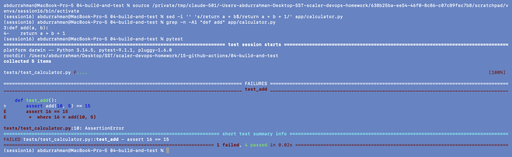
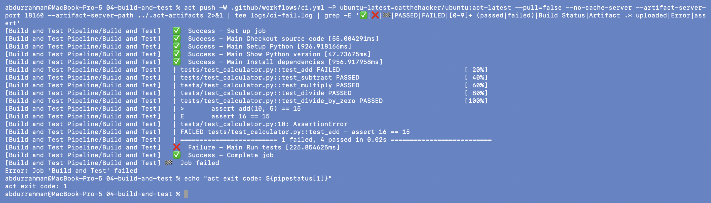
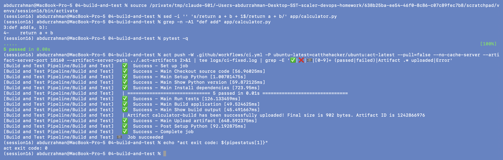

# Build and Test Pipeline

**Name:** Abdur Rahman Ibne Munir
**Enrollment number:** 24BCS10244

Session 16, lecture part `09-build-and-test`. A small Python calculator, its pytest tests, a
`build.sh` that packages it, and a one-job GitHub Actions workflow (`ci.yml`) that does
checkout → setup Python → install → test → build → upload artifact. I ran every local
command from the notes, then ran the workflow with `act`, broke the code to watch the
pipeline fail, and fixed it.

## Folder structure

```text
04-build-and-test/
├── .github/workflows/ci.yml     Build and Test Pipeline (lecture, unchanged)
├── app/
│   ├── __init__.py
│   └── calculator.py            add / subtract / multiply / divide + interactive loop
├── tests/test_calculator.py     5 tests
├── requirements.txt             pytest
├── build.sh                     copies the app into build/ and writes build-info.txt
├── screenshots/
└── README.md
```

All files are the lecture's, unchanged. The `add()` bug in steps 7–9 was introduced and
then reverted, and I checked with `diff` that `calculator.py` is identical to the notes
again.

---

## 1. Run the application

```bash
python3 app/calculator.py
# typed at the prompt:
10 + 5
10 - 5
10 * 5
10 / 5
10 / 0
3+5
hello
q
```



### Problem found: the expected output in the notes doesn't match the program

The notes expect a fixed printout (`10 + 5 = 15`, `10 - 5 = 5`, …). The actual
`calculator.py` is **interactive**: it prints a menu and waits for input. That README
section was written for an older, non-interactive version of the file. I typed the same
four calculations myself, plus `10 / 0`, `3+5` (the regex allows no spaces) and `hello`
(invalid input), then `q`. All results are floats (`15.0`), because the input is parsed with
`float()`.

## 2. Install dependencies

```bash
which python3
python3 --version
python3 -m pip install -r requirements.txt
```



### Problem found: `pip install` is refused

- **Root cause:** my `python3` is Homebrew's Python 3.14. Homebrew marks it as an
  *externally managed environment* (PEP 668), so pip refuses to install packages into it.
  This protects the Python that Homebrew itself depends on.
- **Fix:** use a virtual environment, as the error message suggests. The `demo/` notes do
  this too (`python3 -m venv path/to/venv`). I kept the venv outside the homework repo so
  that it can't be committed by accident. I did not use `--break-system-packages`.

`<scratch>` is my long session scratch folder outside the repo (the full path is visible
in the screenshot).

```bash
python3 -m venv <scratch>/venvs/session16
source <scratch>/venvs/session16/bin/activate
which python
python -m pip install -r requirements.txt
pytest --version
```



The prompt now starts with `(session16)` and `python` points into the venv. pytest 9.1.1
installed. The yellow "Cache entry deserialization failed" lines are pip ignoring old
cache entries written by a different pip version; they're harmless.

## 3. Run the tests

```bash
pytest -v
```



`5 passed`, the same five test names as the notes.

## 4. Build

```bash
ls -l build.sh
chmod +x build.sh
./build.sh
ls -la build
cat build/build-info.txt
```



`build/` contains `calculator.py` and `build-info.txt`. This is what the pipeline uploads
as the `calculator-build` artifact. `build/` and the pytest caches are git-ignored and I
removed them after the session.

## 5. Run the pipeline (act instead of `git push`)

`ci.yml` triggers on `push` to `main`, `pull_request` and `workflow_dispatch`. I ran the
`push` event. The full act log is about 110 lines (mostly pip download output), so I
filtered the screen down to the step results and
test lines, which is roughly what the GitHub run page shows.

```bash
mkdir -p logs
act push -W .github/workflows/ci.yml -P ubuntu-latest=catthehacker/ubuntu:act-latest --pull=false --no-cache-server \
    --artifact-server-port 18160 --artifact-server-path ../.act-artifacts 2>&1 \
  | tee logs/ci-pass.log \
  | grep -E '✅|❌|🏁|PASSED|FAILED|[0-9]+ (passed|failed)|Build Status|Artifact .* uploaded|Error'
echo "act exit code: ${pipestatus[1]}"
```



Every step from the notes' "Expected GitHub Output" passed: Checkout, Setup Python, Show
Python version, Install dependencies, Run tests (5 passed, now on Linux with Python
3.12.15 from `setup-python@v7`), Build, Show build output, Upload artifact. The
`${pipestatus[1]}` is zsh's exit code of `act` itself, not of `grep`.

## 6. Failure test: break `add()`

```bash
sed -i '' 's/return a + b$/return a + b + 1/' app/calculator.py
grep -n -A1 "def add" app/calculator.py
pytest
```



`FAILED tests/test_calculator.py::test_add - assert 16 == 15`, which matches the notes.

```bash
act push -W .github/workflows/ci.yml -P ubuntu-latest=catthehacker/ubuntu:act-latest --pull=false --no-cache-server \
    --artifact-server-port 18160 --artifact-server-path ../.act-artifacts 2>&1 \
  | tee logs/ci-fail.log \
  | grep -E '✅|❌|🏁|PASSED|FAILED|[0-9]+ (passed|failed)|Build Status|Artifact .* uploaded|Error|assert'
echo "act exit code: ${pipestatus[1]}"
```



The pipeline went Checkout (pass), Setup Python (pass), Install dependencies (pass), Run tests (**fail**), and
then nothing else ran: no Build, no Upload artifact. The job failed and act exited with 1.
The notes do a `git commit` + `git push` here. act doesn't need that, because it copies my
working directory into the runner, so the uncommitted change was enough. On GitHub only
pushed commits trigger a run. The commit-then-run cycle is shown in `05-demo-project` and
`final-cicd-project`.

## 7. Fix it and run again

```bash
sed -i '' 's/return a + b + 1$/return a + b/' app/calculator.py
grep -n -A1 "def add" app/calculator.py
pytest -q
act push -W .github/workflows/ci.yml -P ubuntu-latest=catthehacker/ubuntu:act-latest --pull=false --no-cache-server \
    --artifact-server-port 18160 --artifact-server-path ../.act-artifacts 2>&1 \
  | tee logs/ci-fixed.log \
  | grep -E '✅|❌|🏁|[0-9]+ (passed|failed)|Artifact .* uploaded|Error'
echo "act exit code: ${pipestatus[1]}"
```



Green again: `5 passed`, Build application, artifact uploaded, exit code 0.

---

## What I understood

- **CI is a gate.** Steps in a job run in order and stop at the first failure, so one
  wrong `+ 1` was enough to stop the build and the artifact upload. Broken code never
  produced a build.
- **The same tests run in two places.** I ran `pytest` on macOS with Python 3.14 and the
  pipeline ran it on Linux with Python 3.12. Passing in both places shows the code doesn't
  depend on my machine.
- **`setup-python` pins the version.** The runner image has its own Python, but
  `actions/setup-python@v7` with `python-version: "3.12"` makes the version explicit and
  repeatable.
- **Modern Python on macOS needs a venv.** PEP 668 blocks global `pip install`; a venv
  (outside the repo, or a git-ignored `.venv/`) is the right fix.
