# Demo Project: session16-cicd-github-actions

**Name:** Abdur Rahman Ibne Munir
**Enrollment number:** 24BCS10244

Session 16, lecture folder `demo/`. This is the instructor's step-by-step walkthrough:
create the project from nothing, write the calculator and its tests, run them, add a build
script and `.gitignore`, `git init` + commit, run the "Python CI Pipeline", and finish with
the **student hands-on task** (add a `power()` operation). I followed it end to end.

**Where it ran.** The walkthrough creates its own git repository, and my homework folder is
already inside a git repo that I must not commit to. So I built the project in a separate
scratch folder outside the homework repo (prompt `session16-cicd-github-actions`), with a
repo-local git identity and **no remote**. This folder is a copy of its final state, without
`.git/` and `build/`. Pushing to GitHub is left for later (see the root README, "Pending").

## Folder structure

```text
05-demo-project/                 = session16-cicd-github-actions/ in the notes
├── .github/workflows/ci.yml     "Python CI Pipeline": test → build (needs: test)
├── .gitignore
├── app/
│   ├── __init__.py
│   └── calculator.py            lecture code + power() from the hands-on task
├── tests/test_calculator.py     lecture tests + test_power()
├── requirements.txt
├── build.sh
├── screenshots/
└── README.md
```

---

## 1. Create the project skeleton

```bash
mkdir session16-cicd-github-actions
cd session16-cicd-github-actions
mkdir -p app tests .github/workflows
touch README.md
touch app/__init__.py
touch app/calculator.py
touch tests/test_calculator.py
touch requirements.txt
touch build.sh
touch .gitignore
touch .github/workflows/ci.yml
tree
find . -not -path './.git/*'
```

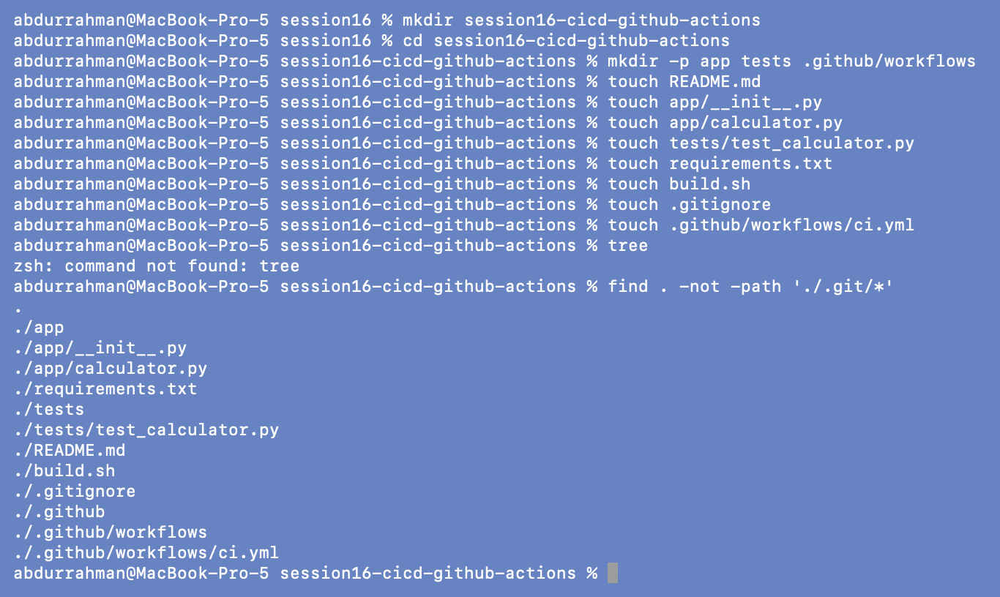

`tree` isn't installed on my Mac (`command not found`), so I used the fallback the notes
give, `find . -not -path './.git/*'`. It shows the same layout.

## 2. Write the files

I copied the code from the lecture's `demo/` folder instead of retyping it, and gave the
project README a title line.

```bash
NOTES=<instructor-repo>/session-16-github-actions/session-16-github-actions/demo
cp $NOTES/app/calculator.py app/ && cp $NOTES/tests/test_calculator.py tests/
cp $NOTES/requirements.txt $NOTES/build.sh $NOTES/.gitignore . && cp $NOTES/.github/workflows/ci.yml .github/workflows/
echo "# Session 16: CI/CD & GitHub Actions" > README.md
wc -l README.md app/*.py tests/*.py requirements.txt build.sh .gitignore .github/workflows/ci.yml
```

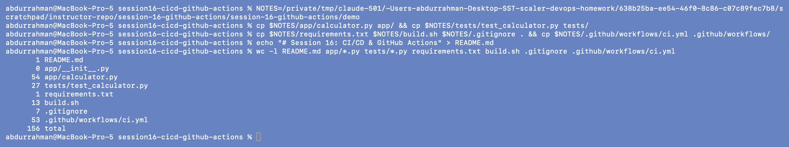

Note: the code printed in the demo README (section 4) splits the input on spaces, but the
`calculator.py` file in the `demo/` folder uses a regex, so it also accepts `3+5`. I used the
file. Its `ci.yml` is the two-job "final recommended" version from section 43.

## 3. Run the application

```bash
source <scratch>/venvs/session16/bin/activate
python3 -m pip install -r requirements.txt
pytest --version
python3 app/calculator.py
10 + 5
q
```

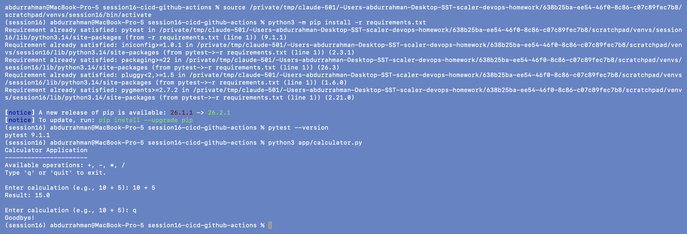

Inside the venv `pip install` works (it was already satisfied from `04-build-and-test`;
outside a venv Homebrew Python refuses it, see that folder). The output matches section 5
of the notes: `Result: 15.0` and `Goodbye!`.

## 4. Run the tests

```bash
pytest
```

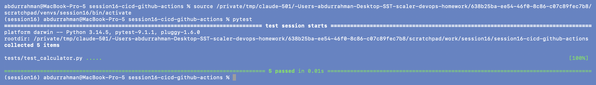

`collected 5 items … 5 passed`, as in section 8.

## 5. Build script

```bash
chmod +x build.sh
./build.sh
ls -l build
cat build/build-info.txt
```

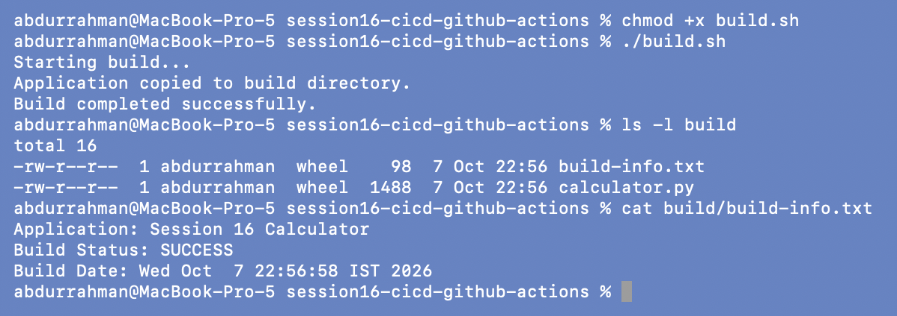

Matches section 9: the three log lines, then `calculator.py` and `build-info.txt` in `build/`.

## 6. `git init` and check status

```bash
git --version
git init
git config user.name "abdur-code"
git config user.email "abdurrahmanim2422@gmail.com"
git status
```

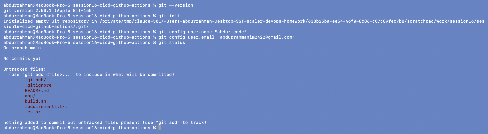

The identity is set only for this repo (no `--global`). `build/` exists on disk but is
**not** listed as untracked, because `.gitignore` excludes it. Build output stays out of
git.

## 7. First commit

```bash
git add .
git status
git commit -m "Add CI pipeline with GitHub Actions"
git branch -M main
git log --oneline
git remote -v
```

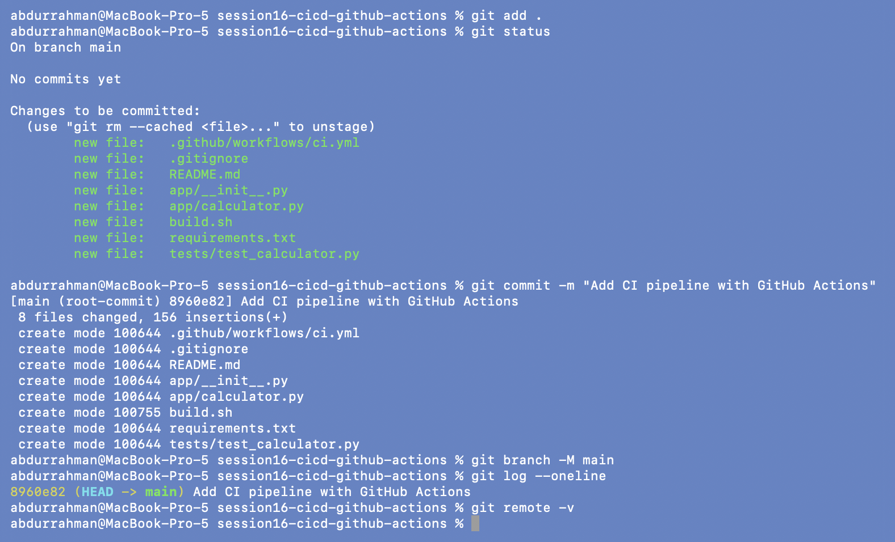

8 files committed, matching section 24–25. `git remote -v` is empty on purpose: the notes'
`git remote add origin … && git push -u origin main` is the part that needs my GitHub
account, so it is listed under "Pending" in the root README.

## 8. What the pipeline looks like

```bash
act -l
act -g
```

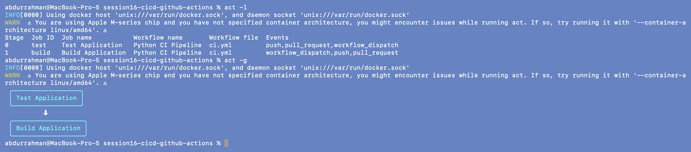

`test` is stage 0 and `build` is stage 1: `needs: test` (sections 41–42) makes the build wait
for the tests. Without `needs`, both would be stage 0 and run in parallel (shown in
`02-workflows-jobs-runners`, step 4).

## 9. Run the pipeline

```bash
act push -P ubuntu-latest=catthehacker/ubuntu:act-latest --pull=false --no-cache-server \
    --artifact-server-port 18160 --artifact-server-path ../artifacts 2>&1 \
  | tee ../logs/demo-ci.log \
  | grep -E '✅|❌|🏁|PASSED|FAILED|[0-9]+ (passed|failed)|Artifact .* uploaded|Error'
echo "act exit code: ${pipestatus[1]}"
```

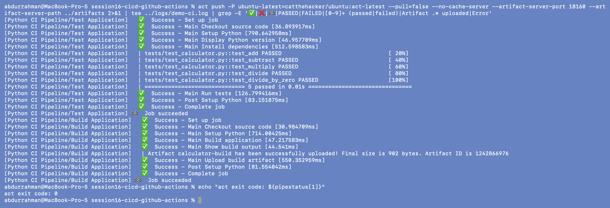

`[PASS] Test Application`, then `[PASS] Build Application` with `calculator-build`
uploaded, which is the "Expected Successful Pipeline" from the notes.

## 10. Student hands-on task: add `power()`

Tasks 1–3 of section 46: add the function, add the test, run pytest.

```bash
perl -0pi -e 's/(    return a \/ b\n)/$1\n\ndef power(a, b):\n    return a ** b\n/' app/calculator.py
sed -i '' 's/import add, subtract, multiply, divide$/import add, subtract, multiply, divide, power/' tests/test_calculator.py
printf '\n\ndef test_power():\n    assert power(2, 3) == 8\n' >> tests/test_calculator.py
git --no-pager diff
pytest -v
```

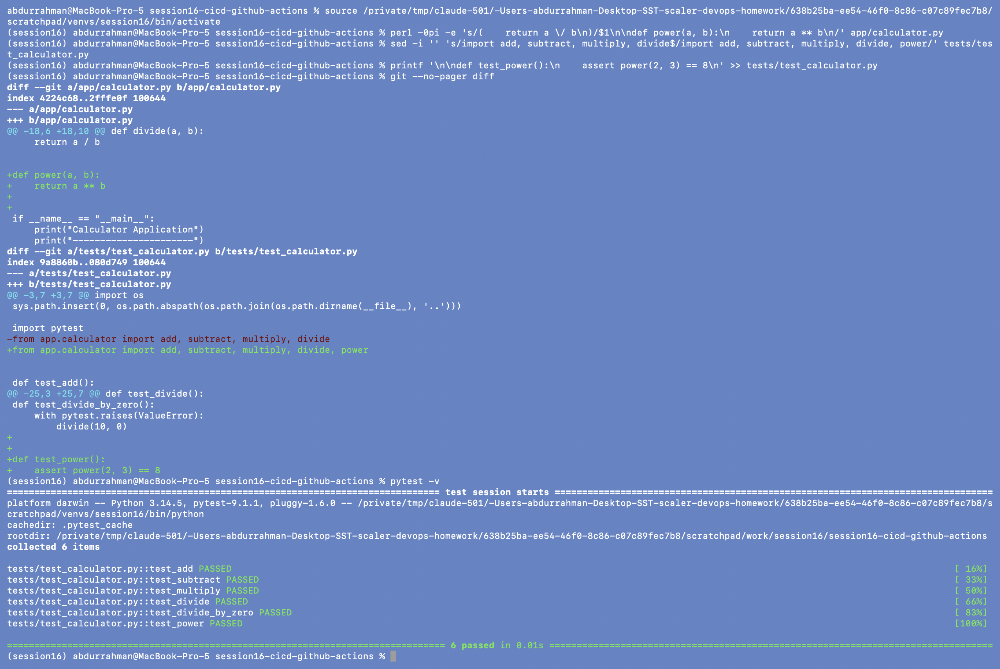

The diff shows exactly the two additions from the task. I placed `power()` next to the
other operations, above the `if __name__ == "__main__":` block, and also had to add `power`
to the test file's import line (the task doesn't mention that, but the test can't run
without it). `6 passed`, the expected result.

## 11. Commit and run the pipeline again (task 4–5)

```bash
git add .
git commit -m "Add power operation"
git log --oneline
act push -P ubuntu-latest=catthehacker/ubuntu:act-latest --pull=false --no-cache-server \
    --artifact-server-port 18160 --artifact-server-path ../artifacts 2>&1 \
  | tee ../logs/demo-power.log \
  | grep -E '✅|❌|🏁|test_power|[0-9]+ (passed|failed)|Artifact .* uploaded|Error'
echo "act exit code: ${pipestatus[1]}"
```

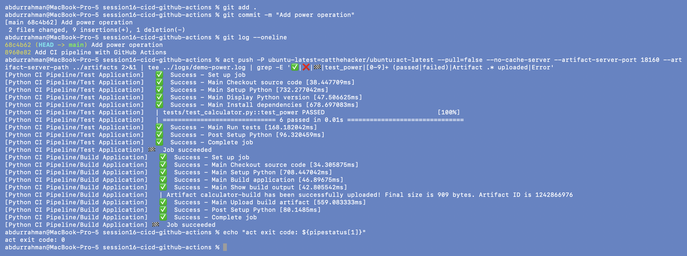

Two commits now. In the runner `test_power PASSED`, `6 passed`, and both jobs succeeded.

## 12. Inspect the artifact (task 6)

```bash
ls -l ../artifacts/1/calculator-build/
unzip -l ../artifacts/1/calculator-build/calculator-build.zip
unzip -p ../artifacts/1/calculator-build/calculator-build.zip calculator.py | grep -n -A1 "def power"
unzip -p ../artifacts/1/calculator-build/calculator-build.zip build-info.txt
```

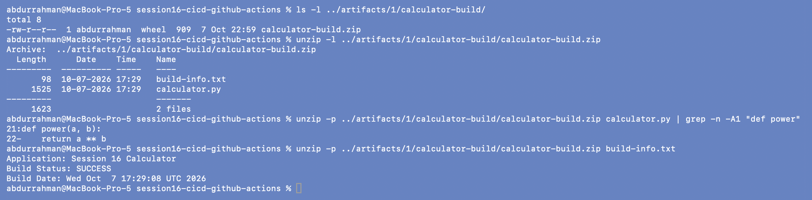

The artifact's `calculator.py` contains `def power`, so it was built from the new commit.
`Build Date` is in UTC because it was written inside the runner container, while my local
`build/` (step 5) shows IST.

---

## What I understood

- **The CI loop is: change → test locally → commit → pipeline → artifact.** The hands-on
  task went through all of it, and the artifact proves which code version was built.
- **`.gitignore` decides what reaches the runner.** `build/` and caches never get
  committed, so the pipeline always builds from source instead of reusing something from
  my laptop.
- **`needs:` turns parallel jobs into a pipeline.** With `build` depending on `test`, a
  failing test means no build and no artifact.
- **Tests need maintenance with the code.** Adding `power()` was one line, but the test
  file's import also had to change, which is easy to miss and is the kind of mistake CI
  catches.
