# Session 16 Final Project: CI/CD Pipeline with GitHub Actions

**Name:** Abdur Rahman Ibne Munir
**Enrollment number:** 24BCS10244

This is the homework's main deliverable: a complete CI/CD demo project built on the
lecture's `10-final-cicd-pipeline`. The app is the Session 16 Python calculator. **CI**
(test → security check → build → artifact) comes from the lecture. I added the **CD** part:
a `Dockerfile`, plus a pipeline job that turns the build artifact into a container image,
smoke-tests it and pushes it to GitHub Container Registry (`ghcr.io`), but only on a push to
`main`. Everything was run locally with `act`; pushing to GitHub is the one step left for
later (see the end of this file).

## Pipeline at a glance

```text
        git push to main  /  pull request to main  /  "Run workflow" button
                                     │
 CI   ┌──────────────────────────────▼──────────────────────────────┐
      │ test            checkout → setup-python 3.12 → pip → pytest │
      └───────────────┬─────────────────────────────┬───────────────┘
              needs: test                     needs: test
      ┌───────────────▼──────────┐   ┌──────────────▼────────────────────────┐
      │ security-check           │   │ build   check DEMO_SECRET → build.sh   │
      │ no .env / *.pem / *.key  │   │         → upload artifact              │
      └───────────────┬──────────┘   └──────────────┬────────────────────────┘
                      └──────────────┬──────────────┘
                     needs: [build, security-check]
 CD   ┌──────────────────────────────▼──────────────────────────────┐
      │ docker   download artifact → docker build → smoke test      │
      │          → docker login + push to ghcr.io (push to main only)│
      └─────────────────────────────────────────────────────────────┘
```

## Homework deliverables

| Deliverable | Where |
|---|---|
| Application source code | `app/calculator.py`, tests in `tests/test_calculator.py`, `build.sh`, `requirements.txt` |
| Dockerfile | `Dockerfile` (+ `.dockerignore`) |
| GitHub Actions workflow | `.github/workflows/ci-cd.yml` |
| CI pipeline | jobs `test`, `security-check`, `build` in `ci-cd.yml` (steps 1–8 below) |
| CD pipeline | job `docker` in `ci-cd.yml` (steps 9–17 below) |
| Screenshots of pipeline execution | `screenshots/` (17 images) |
| README | this file |

## Folder structure

```text
final-cicd-project/
├── .github/workflows/ci-cd.yml   CI/CD pipeline (lecture ci.yml + secret check + CD job)
├── app/
│   ├── __init__.py
│   └── calculator.py             lecture code, unchanged
├── tests/test_calculator.py      lecture tests, unchanged
├── requirements.txt              pytest
├── build.sh                      lecture build script → build/calculator.py, build/build-info.txt
├── Dockerfile                    addition: packages build/ into python:3.12-slim, non-root
├── .dockerignore                 addition
├── .gitignore                    lecture
├── screenshots/
└── README.md
```

## How I ran it

- **Git.** The lecture turns this folder into its own git repo. My homework folder is
  already inside a git repo that I must not commit to, so I did the git steps in a copy of
  the project in a scratch folder outside the homework repo (same folder name, so the
  prompt reads `final-cicd-project`). It used a repo-local identity and had **no remote**.
  This folder is that project's final state, without `.git/`.
- **GitHub Actions → act.** Every "push and watch the Actions tab" step was replaced by
  `act push`, which runs the same workflow file in Docker containers on my Mac. The common
  flags:

  ```bash
  -P ubuntu-latest=catthehacker/ubuntu:act-latest   # runner image (arm64 build, no emulation needed)
  --pull=false --no-cache-server                    # image is local; no cache server on a random port
  --artifact-server-port 18160                      # act's artifact server on my assigned port (default 34567)
  --artifact-server-path ../artifacts               # where uploaded artifacts are stored
  ```

  Each act run is piped through `tee ../logs/<name>.log | grep -E '…'`, so the screenshot
  shows the step results (act's Success / Failure / Job succeeded lines) and the important output lines. The complete,
  unfiltered output was only kept locally.

---

# Part A: the lecture pipeline (`ci.yml`) as written

## 1. Project files

```bash
NOTES=<instructor-repo>/session-16-github-actions/session-16-github-actions/10-final-cicd-pipeline
cp -R $NOTES final-cicd-project
cd final-cicd-project
find . -type f -not -name .DS_Store | sort
cat .gitignore requirements.txt
```

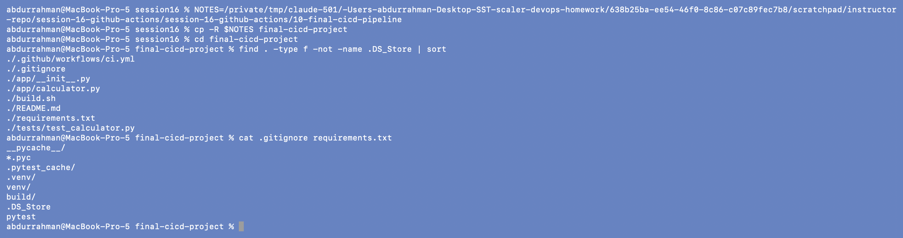

The lecture project: app, tests, `build.sh`, `requirements.txt`, `.gitignore` and the
three-job `.github/workflows/ci.yml`.

## 2. Test and build locally

```bash
source <scratch>/venvs/session16/bin/activate
pytest -v
ls -l build.sh
chmod +x build.sh
./build.sh
```

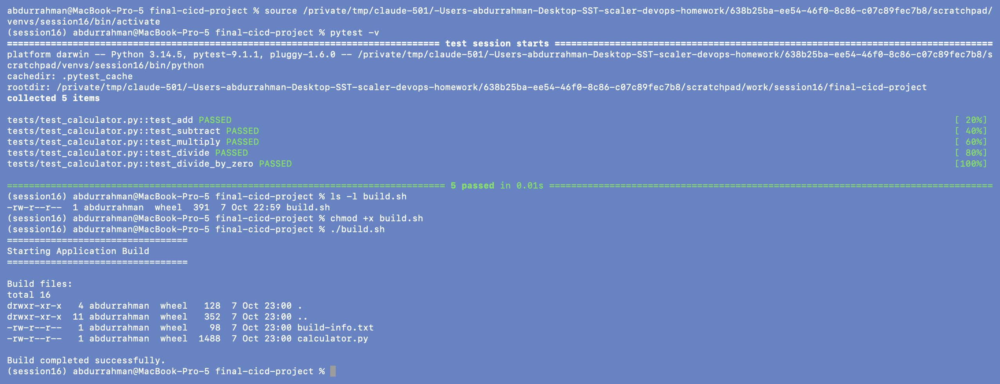

5 tests pass and the build creates `build/calculator.py` + `build/build-info.txt`. The
lecture's `python3 -m pip install -r requirements.txt` is blocked on Homebrew Python
(PEP 668), so I used a venv kept outside the repo. The failure and fix are shown in
`../04-build-and-test`.

## 3. `git init` and first commit

```bash
git init
git config user.name "abdur-code"
git config user.email "abdurrahmanim2422@gmail.com"
git add .
git commit -m "Add final CI/CD pipeline"
git branch -M main
git log --oneline
git remote -v
```

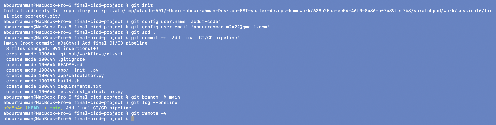

Commit `a9a8b4a` with the 8 lecture files. `build.sh` was committed as `100755` because I
ran `chmod +x` first. `git remote add origin …` and `git push -u origin main` from section 9
of the notes are pending (they need my GitHub account).

## 4. Job graph

```bash
act -l
act -g
```

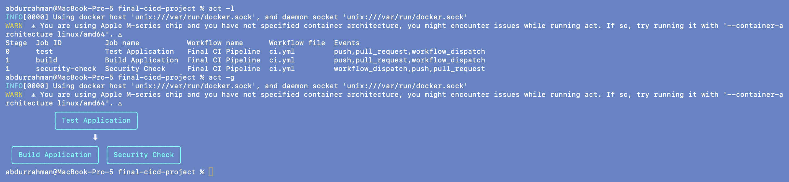

`test` is stage 0; `build` and `security-check` are both stage 1 because both have
`needs: test`. They wait for the tests and then run in parallel with each other. This is the
"Architecture" diagram from the notes.

## 5. Run the pipeline: all green

```bash
act push -P ubuntu-latest=catthehacker/ubuntu:act-latest --pull=false --no-cache-server \
    --artifact-server-port 18160 --artifact-server-path ../artifacts 2>&1 \
  | tee ../logs/final-ci-pass.log \
  | grep -E '✅|❌|🏁|[0-9]+ (passed|failed)|sensitive files|Build Status|Artifact .* uploaded|Error'
echo "act exit code: ${pipestatus[1]}"
```

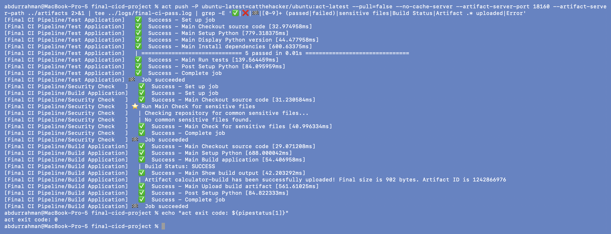

This is the "Expected Pipeline" from section 10 of the notes: ✓ Test Application (5
passed), ✓ Security Check ("No common sensitive files found."), ✓ Build Application,
✓ Upload build artifact (`calculator-build`). Exit code 0.

## 6. Failure scenario: break `add()` and commit

```bash
sed -i '' 's/return a + b$/return a + b + 1/' app/calculator.py
grep -n -A1 "def add" app/calculator.py
pytest -q
git commit -am "Test pipeline failure"
git log --oneline
```

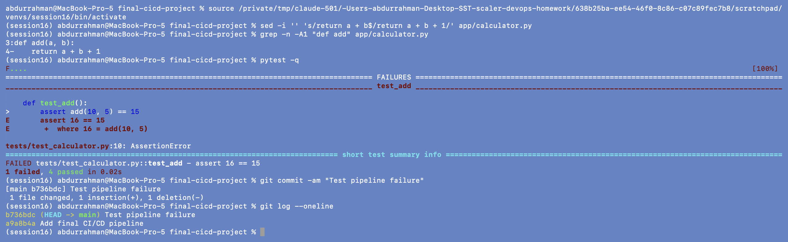

`assert 16 == 15` locally. I committed anyway, as a developer who skipped the local tests
might, to see what the pipeline does with it.

## 7. The pipeline stops at the tests

```bash
act push -P ubuntu-latest=catthehacker/ubuntu:act-latest --pull=false --no-cache-server \
    --artifact-server-port 18160 --artifact-server-path ../artifacts 2>&1 \
  | tee ../logs/final-ci-fail.log \
  | grep -E '✅|❌|🏁|FAILED|[0-9]+ (passed|failed)|sensitive files|Artifact .* uploaded|Error'
echo "act exit code: ${pipestatus[1]}"
```

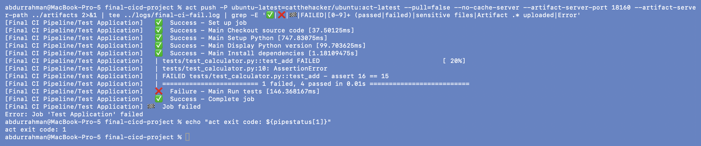

`Failure - Main Run tests`, `Job failed`, exit code 1. Build Application and Security
Check **never started** (no "Set up job" line for them), because both have `needs: test`.
The notes mention only the build being blocked, but the security check is blocked for the
same reason. No artifact was produced from the broken commit.

## 8. Fix, commit, run again

```bash
sed -i '' 's/return a + b + 1$/return a + b/' app/calculator.py
pytest -q
git commit -am "Fix application"
git log --oneline
act push -P ubuntu-latest=catthehacker/ubuntu:act-latest --pull=false --no-cache-server \
    --artifact-server-port 18160 --artifact-server-path ../artifacts 2>&1 \
  | tee ../logs/final-ci-fixed.log \
  | grep -E '🏁|❌|[0-9]+ (passed|failed)|No common|Artifact .* uploaded|Error'
echo "act exit code: ${pipestatus[1]}"
```

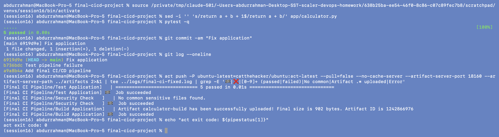

Three commits now (add → break → fix), and all three jobs succeed again, which is section 12
of the notes. (This time I filtered to just the job results to keep it short.)

---

# Part B: additions, the Dockerfile and the CD stage

The notes end with "Ready for CD / Deployment" and the homework asks for a Dockerfile and a
CD pipeline. These are my additions.

## 9. Dockerfile: build the image locally

```bash
git status --short
cat Dockerfile .dockerignore
./build.sh > /dev/null && ls build
docker build -t session16-calculator:local .
```

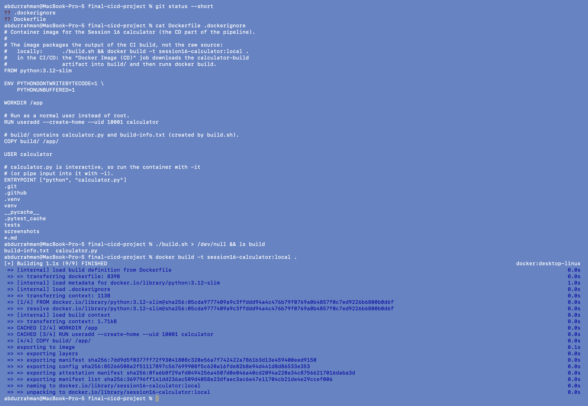

Design choices:

- **The image packages the CI build output (`build/`), not the raw source.** In the
  pipeline, the CD job downloads the `calculator-build` artifact that the build job
  produced, so the image contains exactly what was tested and built. Locally that means
  running `./build.sh` before `docker build`.
- **`python:3.12-slim`**, the same Python version the pipeline tests with.
- **Non-root user** (`uid 10001`). The app needs no privileges.
- **`PYTHONUNBUFFERED=1`**, so the prompts appear immediately when input is piped in (the
  smoke test does that).
- `.dockerignore` keeps `.git`, tests, screenshots and caches out of the build context.

Some layers say `CACHED` because I had test-built this Dockerfile once before taking the
screenshots.

## 10. Run the container

```bash
docker images session16-calculator
docker run --rm -it --name session16-calc session16-calculator:local
# typed at the prompt: 10 + 5, 7 * 6, 10 / 0, q
docker run --rm --entrypoint cat session16-calculator:local /app/build-info.txt
docker run --rm --entrypoint id session16-calculator:local
```

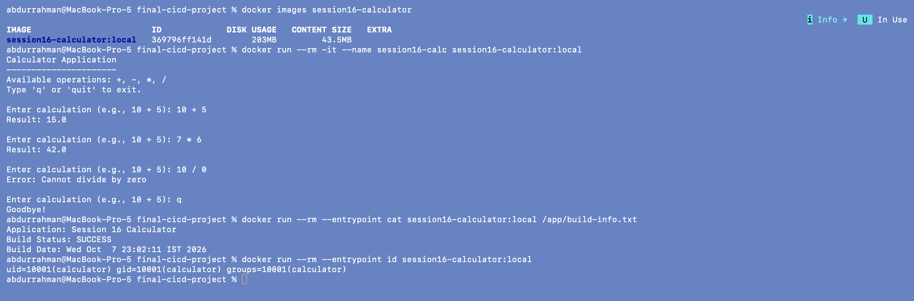

The interactive calculator works inside the container (`-it` is needed because it reads
from stdin). The image contains `build-info.txt` from the build, and the process runs as
`uid=10001(calculator)`, not root. The app has no network port, so no `-p` mapping was
needed.

## 11. Rename the workflow

```bash
git mv .github/workflows/ci.yml .github/workflows/ci-cd.yml
git status --short
```

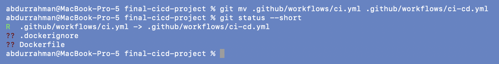

I renamed it so there is one workflow that does both CI and CD, instead of two workflows
that would both trigger on every push.

## 12. What changed in the workflow

After editing `ci-cd.yml`:

```bash
git --no-pager diff HEAD -M --stat
grep -n -E '^name:|^  [a-z-]+:$|needs:|- name:|if:' .github/workflows/ci-cd.yml
```

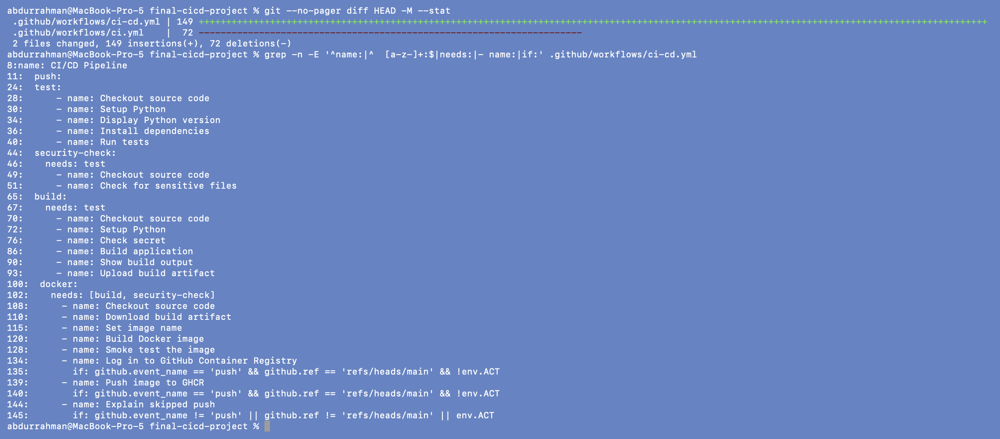

Changes compared with the lecture's `ci.yml`:

1. Name `CI/CD Pipeline`, and a workflow-level `env: IMAGE_NAME: session16-calculator`.
2. `build` job: added the **`Check secret`** step from the demo notes (section 36), so the
   pipeline uses a repository secret (`DEMO_SECRET`) without ever printing it.
3. New **`docker` job (CD)** with `needs: [build, security-check]`: it only runs when the
   tests passed, the security check passed and the build produced an artifact.

The `test` and `security-check` jobs are unchanged from the lecture.

## 13. The CD job

```bash
sed -n '/^  docker:/,$p' .github/workflows/ci-cd.yml
git add .
git commit -m "Add Dockerfile and CD stage (build image, push to GHCR on main)"
git log --oneline
```

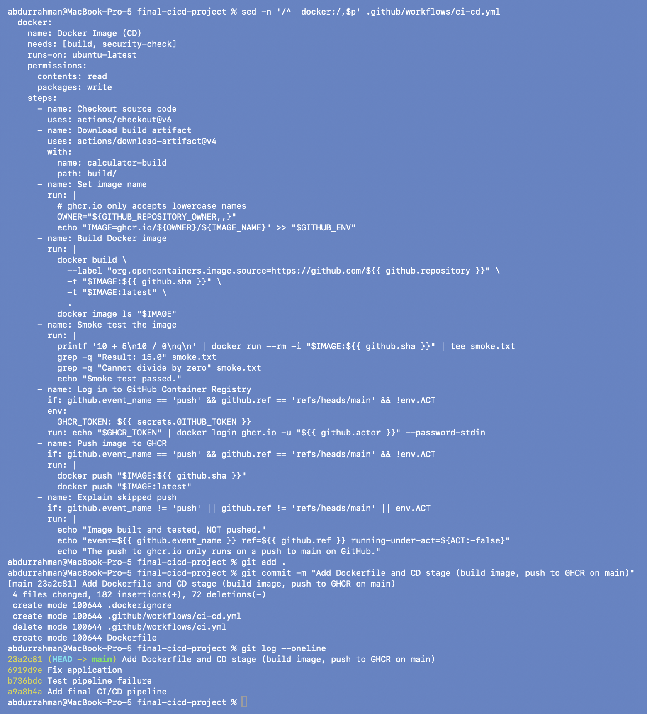

Step by step:

| Step | What it does | Why |
|---|---|---|
| `permissions: packages: write` | lets this job's `GITHUB_TOKEN` push to GHCR | new repos give the token read-only access by default; asking per job keeps the other jobs read-only |
| Download build artifact | `actions/download-artifact@v4` puts `calculator-build` into `build/` | jobs run on separate runners, so the artifact is how the build output reaches this job |
| Set image name | `ghcr.io/<owner, lowercased>/session16-calculator` | GHCR rejects upper-case names |
| Build Docker image | tags `:<commit sha>` and `:latest`, adds the `org.opencontainers.image.source` label | the sha tag says exactly which commit an image came from; the label links the package to the repo on GitHub |
| Smoke test | pipes `10 + 5`, `10 / 0`, `q` into the container and greps the answers | proves the image starts and computes before anything is published |
| Log in / Push | `docker login ghcr.io` with `secrets.GITHUB_TOKEN`, then `docker push` both tags | `GITHUB_TOKEN` is created per run by GitHub, so there is no personal token to store or leak |
| Explain skipped push | prints why nothing was pushed | so a run that didn't push says so in the log |

The token is passed through an `env:` variable and `--password-stdin`, so it never appears
on a command line.

### When is the image pushed?

Both push steps have
`if: github.event_name == 'push' && github.ref == 'refs/heads/main' && !env.ACT`.

| How the workflow started | `event_name` | `ref` | `ACT` | Image pushed? |
|---|---|---|---|---|
| `git push` to `main` on GitHub | `push` | `refs/heads/main` | unset | **yes** |
| Pull request into `main` | `pull_request` | `refs/pull/N/merge` | unset | no (built and smoke-tested only) |
| "Run workflow" button | `workflow_dispatch` | `refs/heads/main` | unset | no |
| `act push` on my Mac | `push` | `refs/heads/main` | `true` | no |

act sets `ACT=true` in every job. That is the guard that keeps my local runs from ever
trying to log in to GHCR, even though the event and branch match.

## 14. The new job graph

```bash
act -l
act -g
```

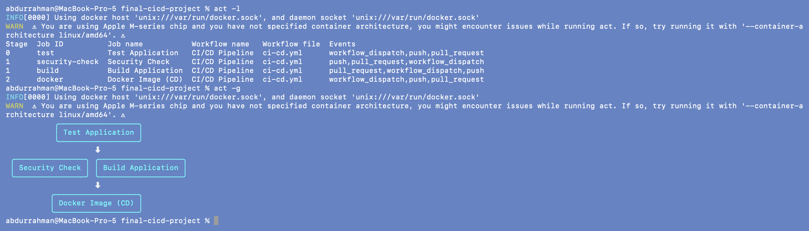

Three stages now: `test` (0) → `security-check` + `build` (1) → `docker` (2).

## 15. Run the full CI/CD pipeline

```bash
act push -P ubuntu-latest=catthehacker/ubuntu:act-latest --pull=false --no-cache-server \
    --artifact-server-port 18160 --artifact-server-path ../artifacts \
    -s DEMO_SECRET=hello-github-actions \
    --env GITHUB_REPOSITORY=abdur-code/session16-cicd-github-actions --env GITHUB_REPOSITORY_OWNER=abdur-code 2>&1 \
  | tee ../logs/final-cicd-push.log \
  | grep -E '✅|❌|🏁|[0-9]+ (passed|failed)|Secret is|No common|Artifact .* uploaded|artifact has finished|naming to|Result:|Error|Smoke test passed|NOT pushed|event=|only runs'
echo "act exit code: ${pipestatus[1]}"
```

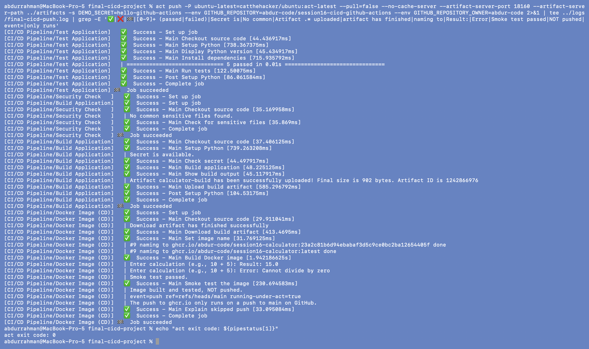

All four jobs succeeded:

- **Test Application**: 5 passed.
- **Security Check**: no sensitive files.
- **Build Application**: `Secret is available.`, build, artifact uploaded.
- **Docker Image (CD)**: downloaded the artifact; built `ghcr.io/abdur-code/session16-calculator`
  tagged with the commit sha `23a2c81…` and `latest`; the smoke test got `Result: 15.0` and
  `Cannot divide by zero`; then **"Image built and tested, NOT pushed. …
  running-under-act=true"**. The two push steps were skipped (act doesn't print skipped
  steps, and the full output of that run has no `docker login` / `docker push`).

Why `--env GITHUB_REPOSITORY…`: act fills `github.repository` from the repo's git remote.
My scratch repo has no remote on purpose, so act would use its placeholder `nektos/act` and
the image would be called `ghcr.io/nektos/…`. Passing the name the repo will have on GitHub
makes the local run produce the same image name the real pipeline will.

## 16. The image the pipeline built

```bash
docker images ghcr.io/abdur-code/session16-calculator
docker inspect --format '{{ index .Config.Labels "org.opencontainers.image.source" }}' ghcr.io/abdur-code/session16-calculator:latest
printf '6 * 7\nq\n' | docker run --rm -i ghcr.io/abdur-code/session16-calculator:latest
```

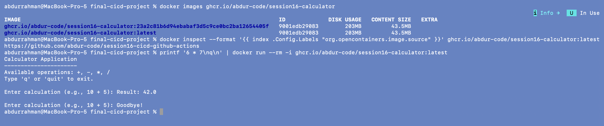

The CD job's image is on my local Docker (act's job containers use my Docker daemon), with
the sha tag and `latest` pointing to the same image ID, and the source label pointing to the
GitHub repo. It exists only locally. Nothing was pushed to ghcr.io, and I deleted these
images afterwards.

## 17. CD is gated on CI: run without the secret

```bash
act push -P ubuntu-latest=catthehacker/ubuntu:act-latest --pull=false --no-cache-server \
    --artifact-server-port 18160 --artifact-server-path ../artifacts \
    --env GITHUB_REPOSITORY=abdur-code/session16-cicd-github-actions --env GITHUB_REPOSITORY_OWNER=abdur-code 2>&1 \
  | tee ../logs/final-cicd-no-secret.log \
  | grep -E '🏁|❌|[0-9]+ (passed|failed)|Secret is|No common|Artifact .* uploaded|naming to|Error'
echo "act exit code: ${pipestatus[1]}"
```

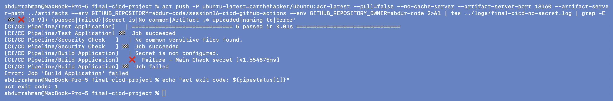

Same commit, no `-s DEMO_SECRET`. Tests and security check pass, but the build fails at
`Secret is not configured.` and the **Docker Image (CD) job never starts**: no artifact,
no image. This is also what will happen on GitHub if the repo is pushed before the
`DEMO_SECRET` secret is added, which is why the GitHub steps below add the secret first.

---

## Run it yourself

**Locally**

```bash
python3 -m venv .venv && source .venv/bin/activate      # .venv/ is git-ignored
pip install -r requirements.txt
pytest -v
./build.sh
docker build -t session16-calculator:local .
docker run --rm -it session16-calculator:local
```

**The pipeline with act** (needs Docker and act; the project must be a git repo with at
least one commit):

```bash
act push -P ubuntu-latest=catthehacker/ubuntu:act-latest \
    --artifact-server-path /tmp/act-artifacts -s DEMO_SECRET=hello-github-actions
```

## Pending: run on GitHub

Not done yet, because it needs my GitHub account. The exact commands are in the root
README of this session (`../README.md`, "Pending: needs the student"). In short:

1. Copy this folder out of the homework repo, `git init`, commit.
2. `gh auth switch` to my personal account `abdur-code`, then create
   `abdur-code/session16-cicd-github-actions`.
3. `gh secret set DEMO_SECRET` **before** the first push.
4. `git push -u origin main`, then `gh run list` / `gh run watch` / `gh run view --log`.
5. Screenshot the green run in the Actions tab and the `session16-calculator` package.

## Notes on action versions

- `actions/checkout@v6` and `actions/setup-python@v7` from the notes exist and run on
  Node 24 (checked in `../02-workflows-jobs-runners`, step 1). No version change needed.
- `actions/upload-artifact@v4` / `download-artifact@v4` declare Node 20, which GitHub has
  deprecated. I tried the newest majors (`upload-artifact@v7`, `download-artifact@v8`) in a
  trial run before the screenshots. act 0.2.89's built-in artifact server could not handle
  v7 (`Unexpected end of JSON input`, retried 5 times, then the upload failed), so I kept v4,
  which is what the lecture uses and works both under act and on GitHub. On GitHub, v7/v8
  would be a drop-in upgrade for this workflow.

---

## What I understood

- **CI decides if a commit is good; CD decides what happens to a good commit.** The
  `docker` job can only start after `test`, `security-check` and `build` all pass. A broken
  test (step 7) or a missing secret (step 17) means no image at all.
- **Artifacts connect the stages.** Each job runs on a fresh runner, so the CD job gets
  the build output by downloading the `calculator-build` artifact instead of rebuilding
  from source. The image contains exactly what CI tested and built.
- **Publishing is the dangerous step, so it gets the strictest condition.** Building and
  smoke-testing an image is safe on any event; pushing to a registry only happens for
  `push` on `main`, never for PRs, manual runs or my local act runs.
- **`GITHUB_TOKEN` plus `permissions:` replaces stored registry passwords.** The token
  exists only for the run, and the job asks only for `packages: write`.
- **act is a good rehearsal, not a replacement.** It runs the same YAML, but things like
  `github.repository` (from the git remote), artifact URLs and skipped-step display differ,
  so the real GitHub run is still the final check.

<details>
<summary>Full <code>.github/workflows/ci-cd.yml</code></summary>

```yaml
# Final CI/CD pipeline for the Session 16 calculator.
#
#   CI:  test -> (security-check, build)      on every push / PR / manual run
#   CD:  docker  (build image, smoke test it, push to GHCR)
#        The push to ghcr.io only happens on a push to main on GitHub.
#        Pull requests, manual runs and local runs with `act` build and
#        test the image but never push it.
name: CI/CD Pipeline

on:
  push:
    branches:
      - main
  pull_request:
    branches:
      - main
  workflow_dispatch:

env:
  IMAGE_NAME: session16-calculator

jobs:
  # ------------------------------------------------------------------ CI
  test:
    name: Test Application
    runs-on: ubuntu-latest
    steps:
      - name: Checkout source code
        uses: actions/checkout@v6
      - name: Setup Python
        uses: actions/setup-python@v7
        with:
          python-version: "3.12"
      - name: Display Python version
        run: python --version
      - name: Install dependencies
        run: |
          python -m pip install --upgrade pip
          pip install -r requirements.txt
      - name: Run tests
        run: |
          pytest -v

  security-check:
    name: Security Check
    needs: test
    runs-on: ubuntu-latest
    steps:
      - name: Checkout source code
        uses: actions/checkout@v6
      - name: Check for sensitive files
        run: |
          echo "Checking repository for common sensitive files..."
          if find . -type f \( \
            -name ".env" \
            -o -name "*.pem" \
            -o -name "*.key" \
          \) | grep -q .; then
            echo "Potential sensitive file found."
            exit 1
          else
            echo "No common sensitive files found."
          fi

  build:
    name: Build Application
    needs: test
    runs-on: ubuntu-latest
    steps:
      - name: Checkout source code
        uses: actions/checkout@v6
      - name: Setup Python
        uses: actions/setup-python@v7
        with:
          python-version: "3.12"
      - name: Check secret
        env:
          DEMO_SECRET: ${{ secrets.DEMO_SECRET }}
        run: |
          if [ -n "$DEMO_SECRET" ]; then
            echo "Secret is available."
          else
            echo "Secret is not configured."
            exit 1
          fi
      - name: Build application
        run: |
          chmod +x build.sh
          ./build.sh
      - name: Show build output
        run: |
          cat build/build-info.txt
      - name: Upload build artifact
        uses: actions/upload-artifact@v4
        with:
          name: calculator-build
          path: build/

  # ------------------------------------------------------------------ CD
  docker:
    name: Docker Image (CD)
    needs: [build, security-check]
    runs-on: ubuntu-latest
    permissions:
      contents: read
      packages: write
    steps:
      - name: Checkout source code
        uses: actions/checkout@v6
      - name: Download build artifact
        uses: actions/download-artifact@v4
        with:
          name: calculator-build
          path: build/
      - name: Set image name
        run: |
          # ghcr.io only accepts lowercase names
          OWNER="${GITHUB_REPOSITORY_OWNER,,}"
          echo "IMAGE=ghcr.io/${OWNER}/${IMAGE_NAME}" >> "$GITHUB_ENV"
      - name: Build Docker image
        run: |
          docker build \
            --label "org.opencontainers.image.source=https://github.com/${{ github.repository }}" \
            -t "$IMAGE:${{ github.sha }}" \
            -t "$IMAGE:latest" \
            .
          docker image ls "$IMAGE"
      - name: Smoke test the image
        run: |
          printf '10 + 5\n10 / 0\nq\n' | docker run --rm -i "$IMAGE:${{ github.sha }}" | tee smoke.txt
          grep -q "Result: 15.0" smoke.txt
          grep -q "Cannot divide by zero" smoke.txt
          echo "Smoke test passed."
      - name: Log in to GitHub Container Registry
        if: github.event_name == 'push' && github.ref == 'refs/heads/main' && !env.ACT
        env:
          GHCR_TOKEN: ${{ secrets.GITHUB_TOKEN }}
        run: echo "$GHCR_TOKEN" | docker login ghcr.io -u "${{ github.actor }}" --password-stdin
      - name: Push image to GHCR
        if: github.event_name == 'push' && github.ref == 'refs/heads/main' && !env.ACT
        run: |
          docker push "$IMAGE:${{ github.sha }}"
          docker push "$IMAGE:latest"
      - name: Explain skipped push
        if: github.event_name != 'push' || github.ref != 'refs/heads/main' || env.ACT
        run: |
          echo "Image built and tested, NOT pushed."
          echo "event=${{ github.event_name }} ref=${{ github.ref }} running-under-act=${ACT:-false}"
          echo "The push to ghcr.io only runs on a push to main on GitHub."
```

</details>
