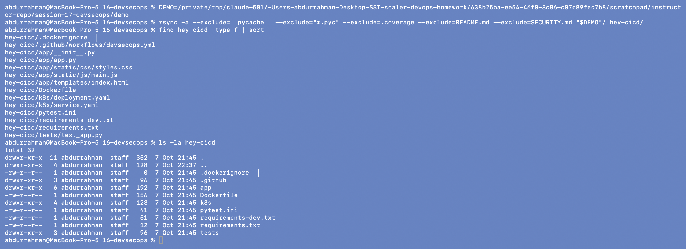
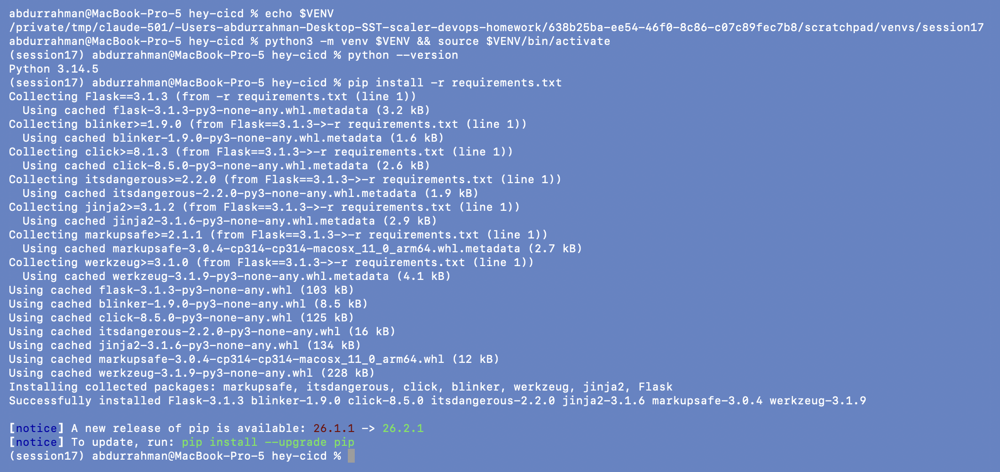
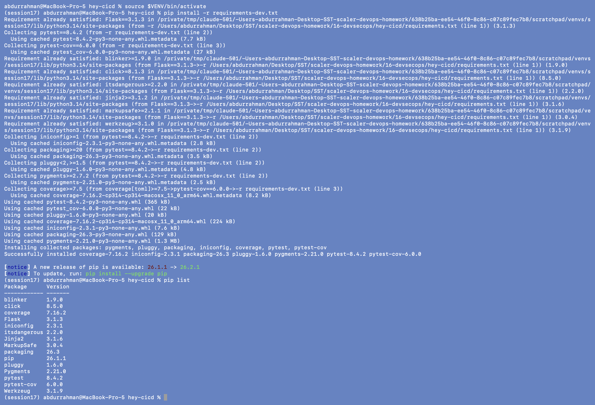
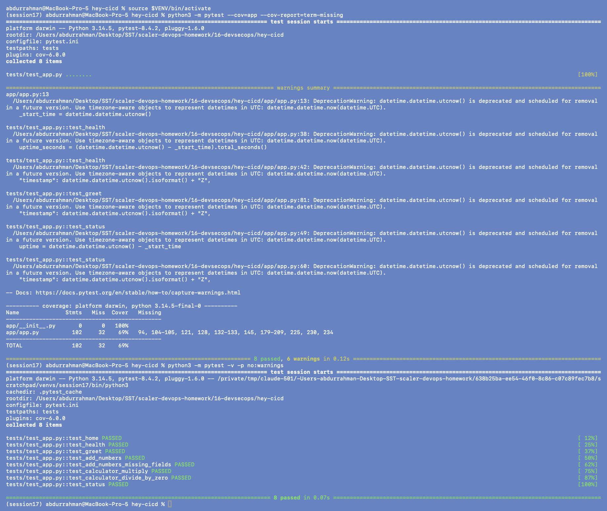
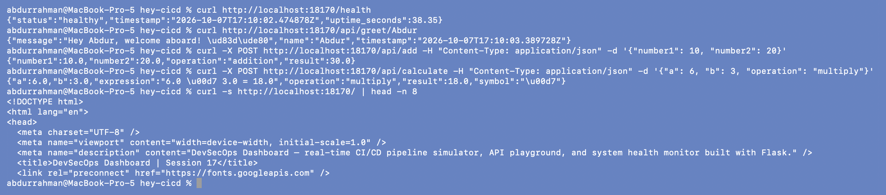
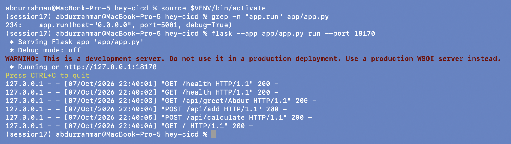

# 1. Build and Unit Test

**Name:** Abdur Rahman Ibne Munir
**Enrollment number:** 24BCS10244

The first two stages of the pipeline: get the application, install its dependencies and
prove the code works with the unit tests. The application is the lecture's demo
project `hey-cicd`, a small Flask "DevSecOps Dashboard" with a JSON API.

## 1.1 Copy the demo project

I copied the lecture's `demo/` folder into `hey-cicd/`, leaving out compiled Python
files (`__pycache__`, `*.pyc`), the stale `.coverage` file, and the instructor's README
and SECURITY.md template, which I don't use.

```bash
DEMO=<lecture repo>/session-17-devsecops/demo
rsync -a --exclude=__pycache__ --exclude="*.pyc" --exclude=.coverage --exclude=README.md --exclude=SECURITY.md "$DEMO"/ hey-cicd/
find hey-cicd -type f | sort
ls -la hey-cicd
```



The project has the Flask app (`app/`), the tests, a Dockerfile, Kubernetes manifests
and a GitHub Actions workflow. Note the line `.dockerignore  │` in the listing: that
file name is wrong, and section 5 shows why it matters.

## 1.2 Virtual environment and dependencies

```bash
python3 -m venv $VENV && source $VENV/bin/activate
python --version
pip install -r requirements.txt
pip install -r requirements-dev.txt
pip list
```

`$VENV` points to a virtualenv kept outside the repository, so nothing installed ends up
in the homework folder. macOS Homebrew Python refuses global `pip install` (PEP 668),
so a venv is required anyway.




`requirements.txt` only pins `Flask==3.1.3`; pip pulls in Werkzeug, Jinja2, click,
itsdangerous, blinker and MarkupSafe. `requirements-dev.txt` adds pytest and pytest-cov
on top (it starts with `-r requirements.txt`).

## 1.3 Unit tests

```bash
python3 -m pytest --cov=app --cov-report=term-missing
python3 -m pytest -v -p no:warnings
```



All 8 tests pass, matching the expected output in the demo README, with 69% line
coverage of `app/app.py`. The run also prints 6 `DeprecationWarning`s:
`datetime.utcnow()` is deprecated since Python 3.12 and I'm on 3.14. That's harmless
for now; I replaced it in section 2 while I was already editing `app.py`.

## 1.4 Run the app locally

The notes run `python3 app/app.py`, but `app.py` hard-codes port 5001 (and
`debug=True`, which comes back in section 2). To stay in my assigned port range I
started the same app with the Flask CLI on port **18170** instead.

```bash
grep -n "app.run" app/app.py
flask --app app/app.py run --port 18170
```

In a second terminal:

```bash
curl http://localhost:18170/health
curl http://localhost:18170/api/greet/Abdur
curl -X POST http://localhost:18170/api/add -H "Content-Type: application/json" -d '{"number1": 10, "number2": 20}'
curl -X POST http://localhost:18170/api/calculate -H "Content-Type: application/json" -d '{"a": 6, "b": 3, "operation": "multiply"}'
curl -s http://localhost:18170/ | head -n 8
```




Every endpoint answers: `/health` is `healthy`, 10 + 20 = 30, 6 × 3 = 18, and `/`
returns the dashboard HTML. The server window shows each request with status 200. Note
`Debug mode: off` here: the Flask CLI ignores the `debug=True` inside `app.run()`, which
only runs when the file is started with `python app/app.py`.

## What I understood

- For a Python app, "build" mostly means a reproducible environment: a clean venv
  plus pinned requirements, so CI and my laptop install the same versions.
- Unit tests are the first gate. If they fail nothing else should run, because
  there's no point scanning or shipping code that doesn't work.
- Coverage shows how much of the code the tests exercise. 69% here; the
  pipeline-simulator endpoint has no tests at all.
- Keeping runtime dependencies (`requirements.txt`) separate from test tools
  (`requirements-dev.txt`) keeps pytest out of the production image.
