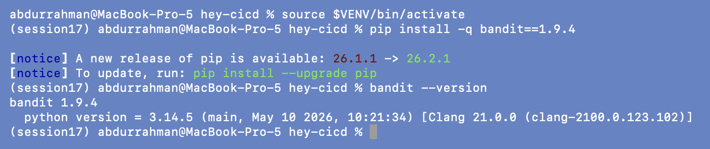
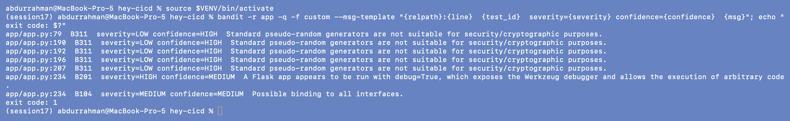
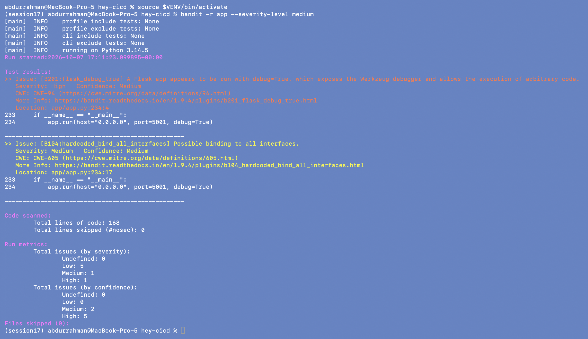
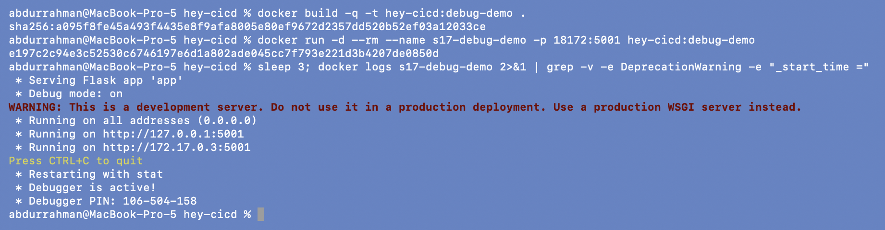
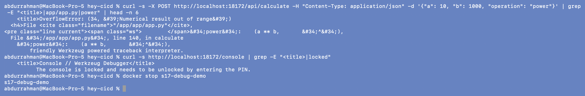
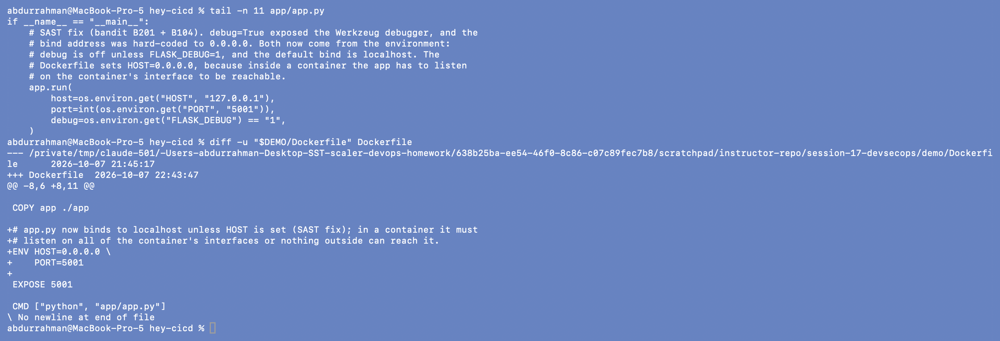
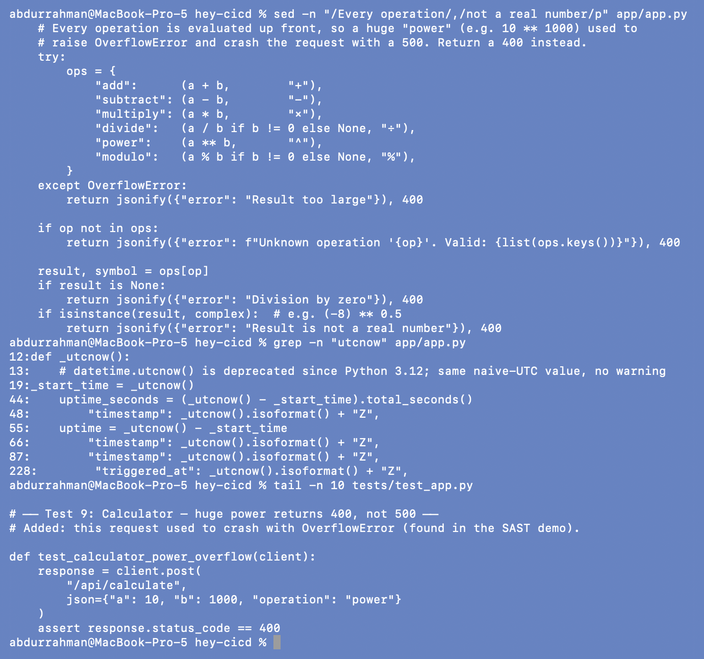
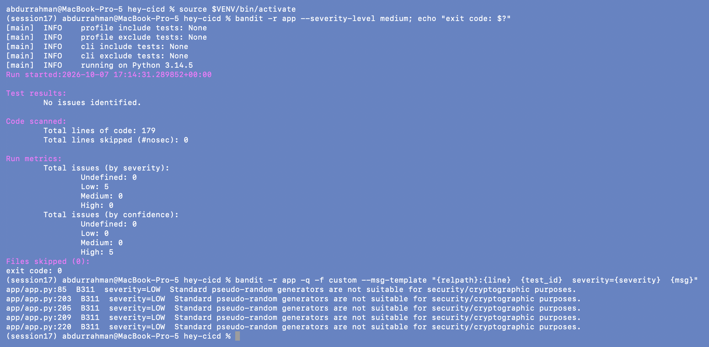
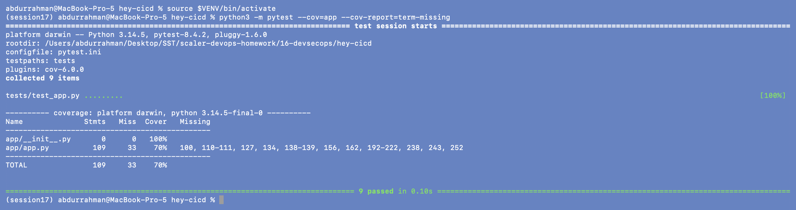
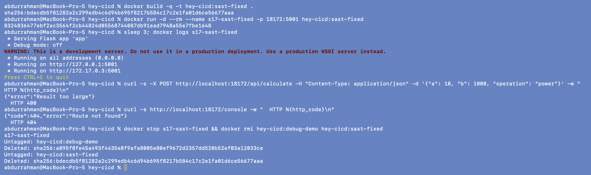

# 2. SAST: Static Application Security Testing

**Name:** Abdur Rahman Ibne Munir
**Enrollment number:** 24BCS10244

SAST reads the source code without running it and looks for insecure patterns. The
lecture uses GitHub CodeQL, which only runs inside GitHub (it uploads results to the
repository's Security tab). To scan locally, and to have a SAST stage that can really
block the pipeline, I added **bandit**, the standard Python SAST tool. CodeQL is still
in the workflow (section 9).

## 2.1 Install bandit

```bash
source $VENV/bin/activate
pip install -q bandit==1.9.4
bandit --version
```



## 2.2 First scan: two real findings

```bash
bandit -r app -q -f custom --msg-template "{relpath}:{line}  {test_id}  severity={severity} confidence={confidence}  {msg}"; echo "exit code: $?"
bandit -r app --severity-level medium
```




Seven findings, and bandit exits with code 1:

| Test | Severity | Where | Meaning |
|---|---|---|---|
| B201 `flask_debug_true` | **HIGH** | `app.py:234` | `app.run(debug=True)` turns on the Werkzeug debugger, which can run arbitrary Python (CWE-94) |
| B104 `hardcoded_bind_all_interfaces` | **MEDIUM** | `app.py:234` | `host="0.0.0.0"` listens on every network interface (CWE-605) |
| B311 (5×) | LOW | greeting and pipeline simulator | `random` is not a cryptographic RNG |

The B311 hits are false positives for this app: `random` only picks a greeting text and
fakes stage durations, nothing security-related. So my gate policy is **block on MEDIUM
and HIGH**, and LOW is reported but does not stop the pipeline. That is what
`--severity-level medium` does.

## 2.3 Is B201 real? Proving it

A finding is easier to fix once you've seen it do damage. The Dockerfile runs
`python app/app.py`, so the container really starts with `debug=True`. I built it as
it was and published it on my port 18172.

```bash
docker build -q -t hey-cicd:debug-demo .
docker run -d --rm --name s17-debug-demo -p 18172:5001 hey-cicd:debug-demo
sleep 3; docker logs s17-debug-demo 2>&1 | grep -v -e DeprecationWarning -e "_start_time ="
```



`Debug mode: on`, `Debugger is active!` and a debugger PIN in the log.

```bash
curl -s -X POST http://localhost:18172/api/calculate -H "Content-Type: application/json" -d '{"a": 10, "b": 1000, "operation": "power"}' | grep -E "<title>|app/app.py|power" | head -n 6
curl -s http://localhost:18172/console | grep -E "<title>|locked"
docker stop s17-debug-demo
```



Any client can trigger it. `10 ** 1000` overflows a float, and instead of a JSON error
the server returns the Werkzeug traceback page: the exception, the absolute path
`/app/app/app.py`, the source line, and the interactive "traceback interpreter". The
`/console` page also exists. It is PIN-locked, but the PIN was printed in the log
above, and on a real server it can sometimes be worked out from machine details. So
B201 is a real remote-code-execution risk, and the request also exposed a second bug:
an unhandled `OverflowError`.

## 2.4 Fix

```bash
tail -n 11 app/app.py
diff -u "$DEMO/Dockerfile" Dockerfile
```



- **B201:** debug now comes from the environment (`FLASK_DEBUG=1`) and is off by default.
- **B104:** the bind address comes from `HOST` and defaults to `127.0.0.1`. The
  Dockerfile sets `HOST=0.0.0.0`, because inside a container the app has to listen on
  the container's interface. A container has its own network namespace, so that is
  not the same exposure as binding every interface on a server. This keeps the
  decision in deployment config instead of hard-coding it, and needs no `# nosec`.
- `PORT` is configurable too (default 5001), so the app can run on any port without
  editing code.

```bash
sed -n "/Every operation/,/not a real number/p" app/app.py
grep -n "utcnow" app/app.py
tail -n 10 tests/test_app.py
```



- `/api/calculate` catches `OverflowError` and returns `400 {"error": "Result too large"}`.
  It also rejects complex results (`(-8) ** 0.5`), which `jsonify` cannot serialise.
- A new unit test, `test_calculator_power_overflow`, covers this case so it can't
  come back.
- `datetime.utcnow()` (deprecated, see 1.3) is replaced by a small `_utcnow()` helper
  that returns the same value.

## 2.5 Re-scan and re-test

```bash
bandit -r app --severity-level medium; echo "exit code: $?"
bandit -r app -q -f custom --msg-template "{relpath}:{line}  {test_id}  severity={severity}  {msg}"
python3 -m pytest --cov=app --cov-report=term-missing
```




The gate scan prints `No issues identified.` and exits 0. Only the five accepted LOW
B311 notes remain. The tests went from 8 to 9 and all pass, with no more deprecation
warnings.

## 2.6 Verify the fix in a container

```bash
docker build -q -t hey-cicd:sast-fixed .
docker run -d --rm --name s17-sast-fixed -p 18172:5001 hey-cicd:sast-fixed
sleep 3; docker logs s17-sast-fixed
curl -s -X POST http://localhost:18172/api/calculate -H "Content-Type: application/json" -d '{"a": 10, "b": 1000, "operation": "power"}' -w "  HTTP %{http_code}\n"
curl -s http://localhost:18172/console -w "  HTTP %{http_code}\n"
docker stop s17-sast-fixed && docker rmi hey-cicd:debug-demo hey-cicd:sast-fixed
```



`Debug mode: off`, still reachable on all container addresses because of `HOST=0.0.0.0`.
The overflow request now gets a clean `400`, and `/console` is a `404` because the
debugger is gone.

> **Problem found:** the lecture app runs `app.run(host="0.0.0.0", port=5001, debug=True)`,
> and the Dockerfile starts it that way, so the shipped container exposes the Werkzeug
> debugger. **Root cause:** a development setting hard-coded in source. **Fix:**
> `debug`, `host` and `port` come from environment variables with safe defaults, and
> the Dockerfile sets only `HOST`. bandit B201/B104 are now clean.

## What I understood

- SAST finds problems in code I wrote, before anything runs. Here it caught the most
  serious bug in the project in about a second.
- A finding needs triage. B201 was a real RCE risk; B311 was noise. The gate threshold
  (MEDIUM+) is a policy decision and should be written down, not left to habit.
- Fix the cause, not the warning. Adding `# nosec` would have made bandit quiet but
  left the debugger on in production.
- CodeQL and bandit complement each other. CodeQL does deeper data-flow analysis but
  reports to GitHub's Security tab and doesn't fail the job by itself. bandit is fast,
  runs locally, and its exit code can block the pipeline.
