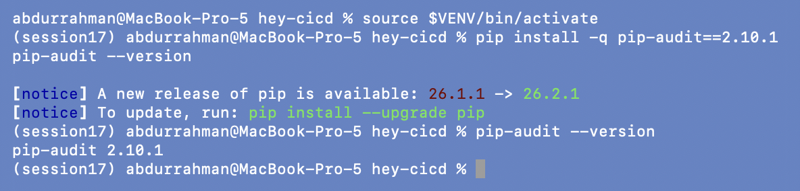
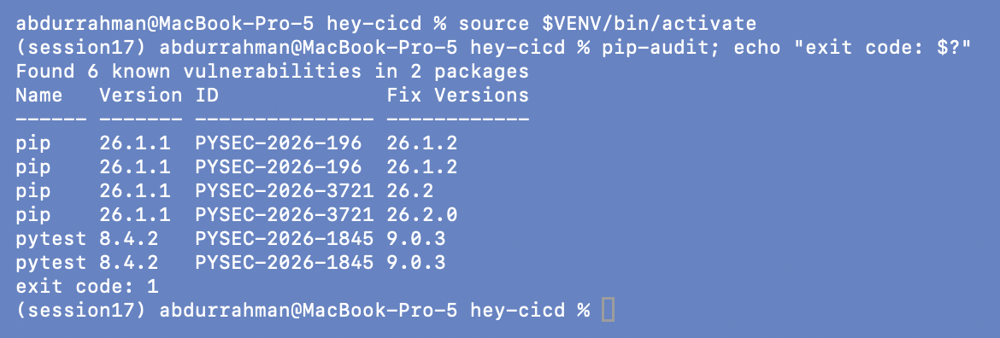
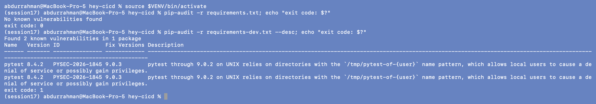
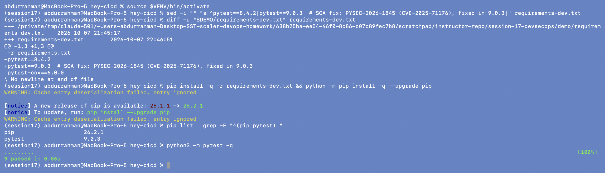
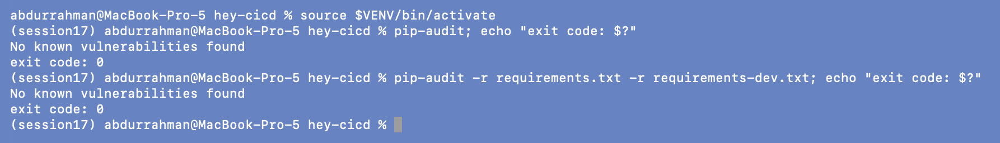

# 3. SCA: Software Composition Analysis

**Name:** Abdur Rahman Ibne Munir
**Enrollment number:** 24BCS10244

SAST checks the code I wrote; SCA checks the code I *imported*. `pip-audit` resolves
the Python dependencies and looks each version up in the PyPI/OSV vulnerability
databases.

## 3.1 Install and run pip-audit (as in the notes)

```bash
source $VENV/bin/activate
pip install -q pip-audit==2.10.1
pip-audit --version
pip-audit; echo "exit code: $?"
```




Plain `pip-audit` audits **everything installed in the current environment**. It found
6 known vulnerabilities in 2 packages (each row is printed twice in this output):

| Package | Installed | ID | Fixed in |
|---|---|---|---|
| pip | 26.1.1 | PYSEC-2026-196 (CVE-2026-8643) | 26.1.2 |
| pip | 26.1.1 | PYSEC-2026-3721 (CVE-2026-13346) | 26.2 |
| pytest | 8.4.2 | PYSEC-2026-1845 (CVE-2025-71176) | 9.0.3 |

## 3.2 Audit what the project actually declares

The environment also contains pip itself, bandit and pip-audit, which are not
dependencies of the app. In CI the useful question is "are the versions pinned in my
requirements files vulnerable?", so I audited each file on its own.

```bash
pip-audit -r requirements.txt; echo "exit code: $?"
pip-audit -r requirements-dev.txt --desc; echo "exit code: $?"
```



- `requirements.txt` (Flask and everything it pulls in, which is what ships in the
  image) is clean.
- `requirements-dev.txt` pins `pytest==8.4.2`, which is affected by PYSEC-2026-1845:
  pytest through 9.0.2 uses predictable `/tmp/pytest-of-{user}` directories, so another
  local user can cause a denial of service or possibly gain privileges. pytest never
  goes into the container, but it runs on every CI runner and developer laptop.
- The pip findings belong to the venv's own pip, not to the project.

## 3.3 Remediate

Following the notes' flow: identify the package and version → check the fixed version →
update the dependency → run the tests → run SCA again.

```bash
sed -i "" "s|^pytest==8.4.2|pytest==9.0.3  # SCA fix: PYSEC-2026-1845 (CVE-2025-71176), fixed in 9.0.3|" requirements-dev.txt
diff -u "$DEMO/requirements-dev.txt" requirements-dev.txt
pip install -q -r requirements-dev.txt && python -m pip install -q --upgrade pip
pip list | grep -E "^(pip|pytest) "
python3 -m pytest -q
```



pytest is now 9.0.3 (a major-version jump, so the tests matter here) and pip is
26.2.1. All 9 tests still pass on the new pytest, and pytest-cov 6.0.0 works with it.

```bash
pip-audit; echo "exit code: $?"
pip-audit -r requirements.txt -r requirements-dev.txt; echo "exit code: $?"
```



Both audits print `No known vulnerabilities found` with exit code 0. The second command
is the exact SCA gate used in `devsecops-pipeline.sh` and in the workflow.

> **Problem found:** the lecture's `requirements-dev.txt` pins a vulnerable pytest
> (8.4.2, PYSEC-2026-1845). **Root cause:** pins never get updated unless something
> checks them. **Fix:** bumped to the first fixed release, 9.0.3, and made
> `pip-audit -r requirements.txt -r requirements-dev.txt` a blocking stage.

## What I understood

- Pinning versions makes builds reproducible, but it also freezes vulnerabilities in
  place. SCA is what tells you when a pin has gone bad.
- Which dependencies you audit changes the answer. A bare `pip-audit` mixes tool
  packages with app packages; `-r <file>` audits what the project declares.
- Dev dependencies count too. They don't ship to users, but they run in CI with access
  to secrets and tokens.
- SCA here only covers Python packages. The OS packages in the image (Debian or Alpine
  libraries) are a separate layer, which is why the image is scanned again in section 6.
