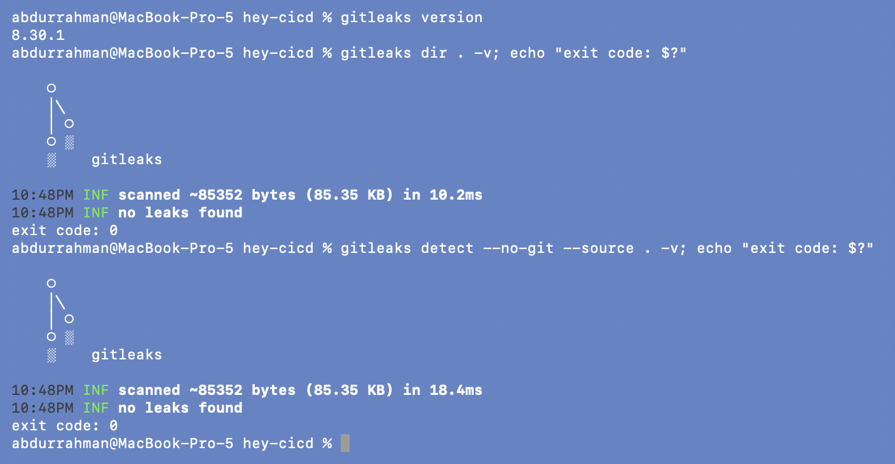
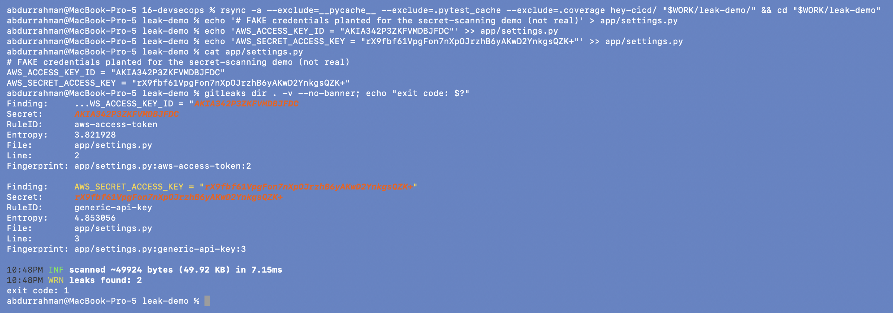
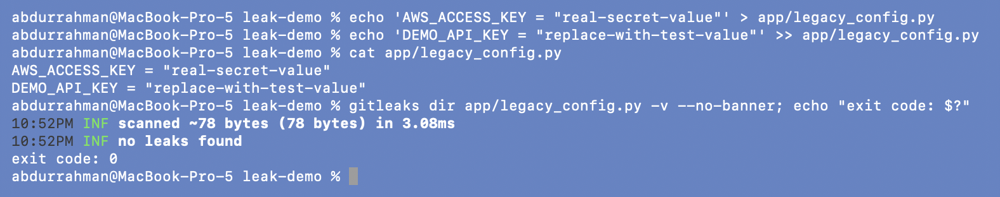
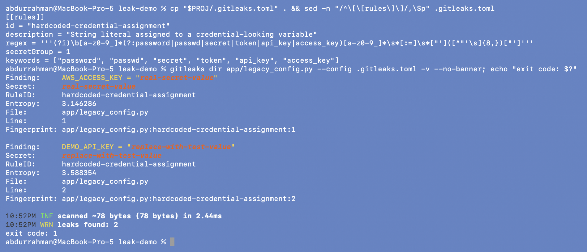
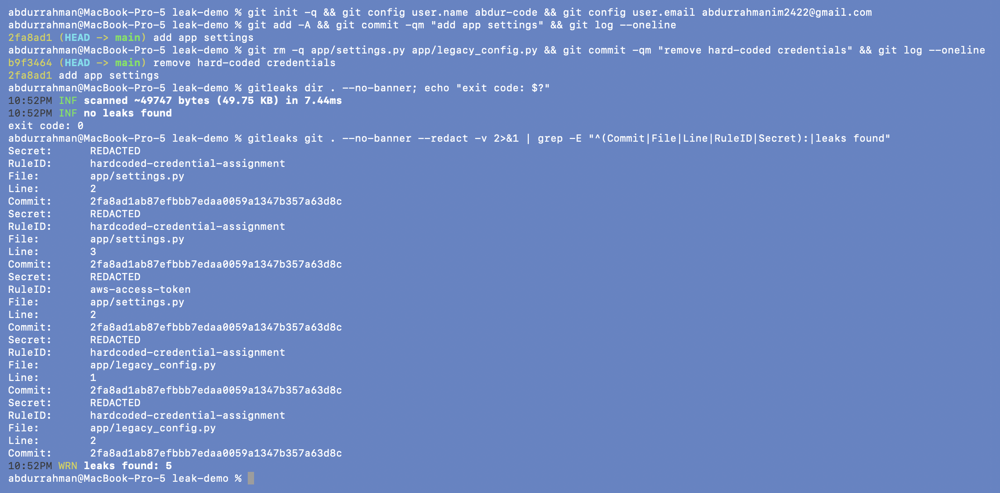
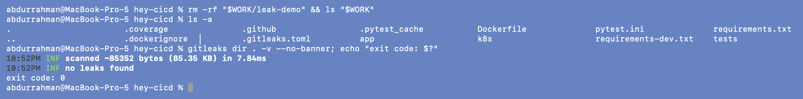

# 4. Secret Scanning

**Name:** Abdur Rahman Ibne Munir
**Enrollment number:** 24BCS10244

The lecture covers secret scanning in theory (GitHub Secret Scanning and push protection)
but has no tool in the pipeline. I added **gitleaks** as a local and CI stage. Every
"secret" below is a fake value typed for the demo. All the planting happened in a
throwaway copy outside the repository, which I deleted at the end.

## 4.1 Scan the real project

```bash
gitleaks version
gitleaks dir . -v; echo "exit code: $?"
gitleaks detect --no-git --source . -v; echo "exit code: $?"
```



`no leaks found`, exit code 0. `gitleaks dir` is the current command for scanning a
folder. `detect --no-git` is the older spelling of the same scan and still works in 8.30.

## 4.2 Plant a fake AWS key in a scratch copy: caught

```bash
rsync -a --exclude=__pycache__ --exclude=.pytest_cache --exclude=.coverage hey-cicd/ "$WORK/leak-demo/" && cd "$WORK/leak-demo"
echo '# FAKE credentials planted for the secret-scanning demo (not real)' > app/settings.py
echo 'AWS_ACCESS_KEY_ID = "<fake AKIA... key id>"' >> app/settings.py
echo 'AWS_SECRET_ACCESS_KEY = "<fake 40-char secret>"' >> app/settings.py
cat app/settings.py
gitleaks dir . -v --no-banner; echo "exit code: $?"
```

The values are random strings shaped like AWS keys (visible in the screenshot). They
are written as placeholders here so this README doesn't trip a secret scanner itself.



Two findings and exit code 1. The key ID matches the built-in `aws-access-token` rule
(the `AKIA` prefix plus 16 characters). The 40-character secret is caught by
`generic-api-key` because of its high entropy (4.85). That non-zero exit code is what
turns the scan into a gate.

## 4.3 The lecture's own example is *not* caught by default

The notes' "Never do this" example is `AWS_ACCESS_KEY = "real-secret-value"`, and the
classroom demo uses `DEMO_API_KEY=replace-with-test-value`.

```bash
echo 'AWS_ACCESS_KEY = "real-secret-value"' > app/legacy_config.py
echo 'DEMO_API_KEY = "replace-with-test-value"' >> app/legacy_config.py
cat app/legacy_config.py
gitleaks dir app/legacy_config.py -v --no-banner; echo "exit code: $?"
```



`no leaks found`. gitleaks' default rules look for known token formats (AWS, GitHub,
Slack, private keys...) and for high-entropy strings. A plain-English password like
`real-secret-value` is neither, so it slips through, even though it's exactly what the
notes warn about.

## 4.4 A custom rule in `.gitleaks.toml`

I added a project config (`hey-cicd/.gitleaks.toml`). gitleaks picks it up automatically
when it scans the folder. It keeps every default rule (`[extend] useDefault = true`)
and adds one rule: a string literal of 8+ characters assigned to a name containing
`password`, `secret`, `token`, `api_key` or `access_key`.

```bash
cp "$PROJ/.gitleaks.toml" . && sed -n "/^\[\[rules\]\]/,\$p" .gitleaks.toml
gitleaks dir app/legacy_config.py --config .gitleaks.toml -v --no-banner; echo "exit code: $?"
```



Both lines are now reported under `hardcoded-credential-assignment`, with exit code 1.
The rule doesn't fire on the safe pattern from the notes, `api_key = os.getenv("API_KEY")`,
because that isn't a string literal.

## 4.5 Deleting the line is not enough

The notes say a leaked secret has to be treated as compromised even after it is
removed. I turned the scratch copy into a throwaway git repository (repo-local
identity, no remote), committed the fake secrets, then deleted them in a second commit.

```bash
git init -q && git config user.name abdur-code && git config user.email abdurrahmanim2422@gmail.com
git add -A && git commit -qm "add app settings" && git log --oneline
git rm -q app/settings.py app/legacy_config.py && git commit -qm "remove hard-coded credentials" && git log --oneline
gitleaks dir . --no-banner; echo "exit code: $?"
gitleaks git . --no-banner --redact -v 2>&1 | grep -E "^(Commit|File|Line|RuleID|Secret):|leaks found"
```



The working tree is clean (`gitleaks dir`: no leaks), but `gitleaks git` scans every
commit and still reports 5 findings (the four fake values; the key ID matches two rules),
all in commit `2fa8ad1`. Anyone who clones the repo
gets that commit. That's why the fix order in the notes is *revoke/rotate first*, then
clean history. It's also why the CI job checks out with `fetch-depth: 0` and runs
`gitleaks git`, not only `gitleaks dir`. `--redact` hides the values in the output, so
the scan log doesn't become a leak itself.

## 4.6 Clean up and re-scan the real project

```bash
rm -rf "$WORK/leak-demo" && ls "$WORK"
ls -a
gitleaks dir . -v --no-banner; echo "exit code: $?"
```



The scratch copy is gone. The real project, now with `.gitleaks.toml`, still has no
leaks, so the custom rule adds no false positives here.

## Practice questions from the notes

1. **Why should secrets not be stored in source code?** Everyone with read access to the
   repo (and every fork, clone, CI log and backup) gets them, and git history keeps them
   forever, as 4.5 shows.
2. **GitHub Actions secret vs source-code secret?** An Actions secret is stored
   encrypted by GitHub, injected only at run time as `${{ secrets.NAME }}`, and masked
   in logs. A source-code secret is plain text in every copy of the repository.
3. **A real cloud key was pushed by accident. What now?** Revoke or rotate it at the
   provider immediately (assume it's compromised), check the provider's logs for use
   of it, remove it from code *and* history (`git filter-repo` / BFG, then force-push
   and ask collaborators to re-clone), and store the replacement in a secret manager or
   as an Actions secret.

## What I understood

- Secret scanners are pattern matchers: very good at known token formats, blind to an
  ordinary password unless you add a rule for it. A clean scan doesn't prove there are
  no secrets.
- The real defence is not putting secrets in code at all: environment variables,
  Actions secrets or a secret manager.
- Scan the history, not just the latest commit. A deleted line is still in git.
- The exit code is what makes the scan a gate: 1 means stop the pipeline.
