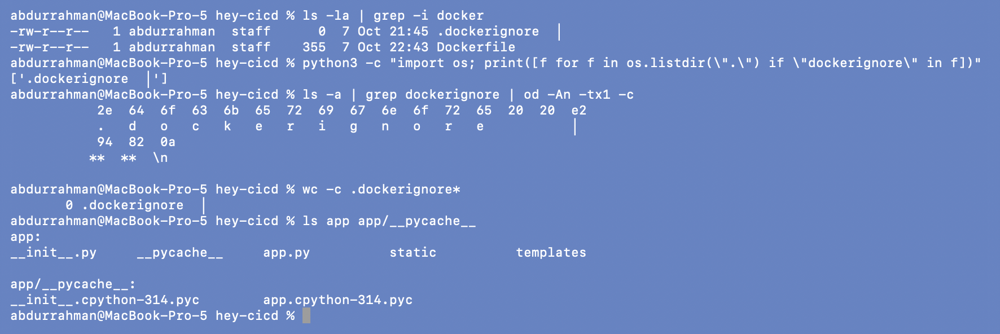
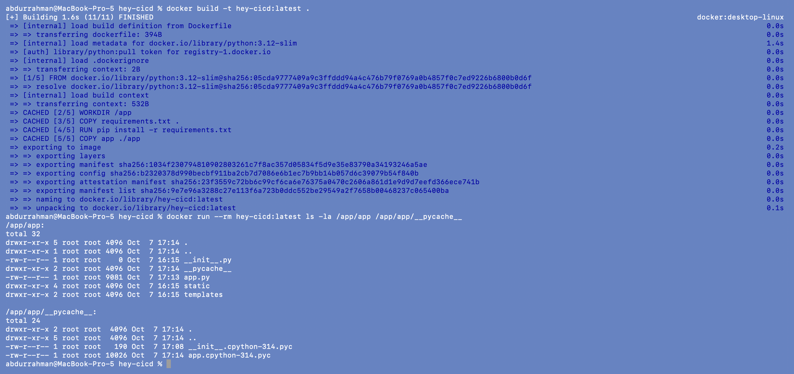
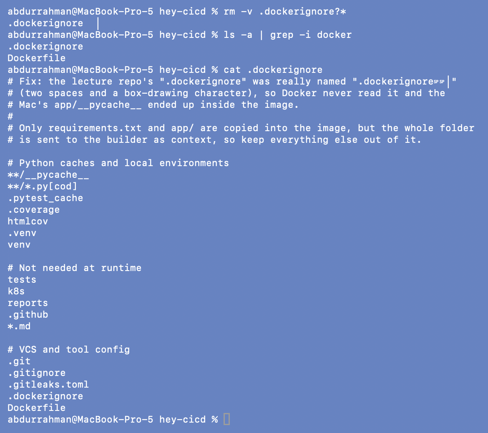
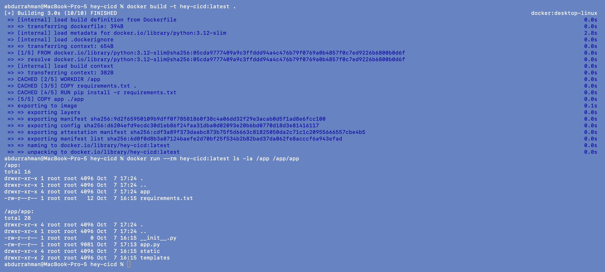
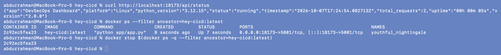
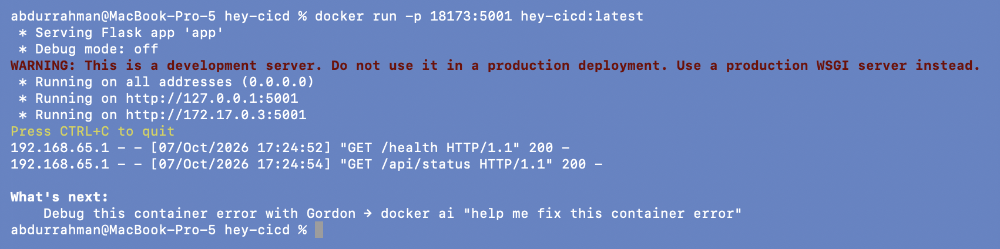
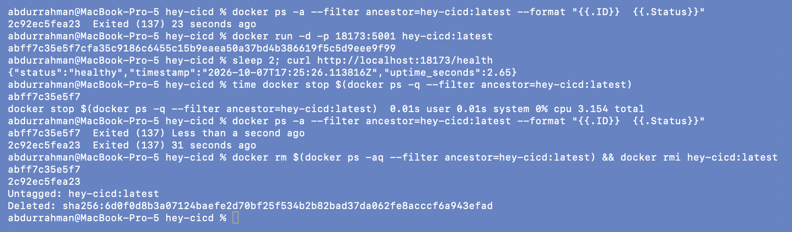

# 5. Docker Build

**Name:** Abdur Rahman Ibne Munir
**Enrollment number:** 24BCS10244

Package the app into an image. This follows "Method 2: Run with Docker" from the demo
README, with the published port changed from `5001:5001` to **`18173:5001`** (my
assigned range). The app still listens on 5001 inside the container.

## 5.1 Problem found: the project has no working `.dockerignore`

```bash
ls -la | grep -i docker
python3 -c "import os; print([f for f in os.listdir(\".\") if \"dockerignore\" in f])"
ls -a | grep dockerignore | od -An -tx1 -c
wc -c .dockerignore*
ls app app/__pycache__
```



The file looks like `.dockerignore` in a normal listing, but Python and `od` show its
real name: `.dockerignore` + two spaces (`20 20`) + `e2 94 82`, the UTF-8 bytes of `│`
(a box-drawing character, probably pasted from a tree diagram). It is also 0 bytes.
Docker only reads a file named exactly `.dockerignore`, so the project effectively has
none. Meanwhile, running the tests in section 1 created `app/__pycache__/` with
Python 3.14 bytecode.

## 5.2 Build as written

```bash
docker build -t hey-cicd:latest .
docker run --rm hey-cicd:latest ls -la /app/app /app/app/__pycache__
```



BuildKit still logs `[internal] load .dockerignore` but transfers 2 bytes (nothing to
ignore). `COPY app ./app` then copied my Mac's `__pycache__` into the image:
`app.cpython-314.pyc` and `__init__.cpython-314.pyc`. The image runs Python 3.12, so
those files are useless junk, and they make the image depend on whatever happened to be
in my working folder. Anything else dropped into `app/` locally would have been
shipped too.

## 5.3 Fix

```bash
rm -v .dockerignore?*
ls -a | grep -i docker
cat .dockerignore
```



The new `.dockerignore` excludes Python caches, virtualenvs, test and coverage output,
the tests, k8s manifests, CI config, docs and git metadata. Only `requirements.txt`
and `app/` are copied into the image, but the whole folder is sent to the builder as
context, so excluding the rest also keeps the context small and keeps things like a
local `.env` from ever reaching the builder.

```bash
docker build -t hey-cicd:latest .
docker run --rm hey-cicd:latest ls -la /app /app/app
```



The build context shrank from 532 B to 382 B, and `/app/app` contains only `__init__.py`, `app.py`, `static` and `templates`. No `__pycache__`.

> **Problem found:** `demo/.dockerignore  │` (0 bytes, name ends in two spaces + U+2502).
> **Root cause:** a typo in the file name, so Docker never found a `.dockerignore`.
> **Fix:** deleted it and wrote a real `.dockerignore`. The image no longer contains
> host bytecode.

## 5.4 Run the container (port 18173)

```bash
docker run -p 18173:5001 hey-cicd:latest
```

In a second terminal:

```bash
curl http://localhost:18173/api/status
docker ps --filter ancestor=hey-cicd:latest
docker stop $(docker ps -q --filter ancestor=hey-cicd:latest)
```




The API reports `python_version 3.12.15` on Linux, and `docker ps` shows the port
mapping `0.0.0.0:18173->5001/tcp`. The container log shows `Debug mode: off` (the SAST
fix from section 2) and listening on all container addresses because the Dockerfile
sets `HOST=0.0.0.0`. The "Debug this container error" hint printed when I stopped it is
Docker reacting to the non-zero exit code explained in 5.5.

## 5.5 Detached mode and cleanup (rest of the demo README)

```bash
docker ps -a --filter ancestor=hey-cicd:latest --format "{{.ID}}  {{.Status}}"
docker run -d -p 18173:5001 hey-cicd:latest
sleep 2; curl http://localhost:18173/health
time docker stop $(docker ps -q --filter ancestor=hey-cicd:latest)
docker ps -a --filter ancestor=hey-cicd:latest --format "{{.ID}}  {{.Status}}"
docker rm $(docker ps -aq --filter ancestor=hey-cicd:latest) && docker rmi hey-cicd:latest
```



Both containers ended with **`Exited (137)`**, and `docker stop` took over 3 seconds.
137 = 128 + 9, meaning the process was killed with SIGKILL. `python app/app.py` runs as
PID 1 in the container, and Linux doesn't apply default signal handlers to PID 1, so
Docker's polite SIGTERM was ignored and Docker had to kill it after the grace period.
Kubernetes stops Pods the same way, so every rollout would wait out the grace period
and drop in-flight requests. I fixed this in the next section's Dockerfile with
`STOPSIGNAL SIGINT` (Python turns SIGINT into `KeyboardInterrupt` and exits cleanly).

## What I understood

- The build context is everything in the folder unless `.dockerignore` says
  otherwise, and a single invisible character in a file name silently disables it.
- Check what really ended up in an image (`docker run --rm <image> ls ...`) instead of
  assuming the Dockerfile tells the whole story.
- `-p 18173:5001` is host port : container port. Only the left side has to be free on
  my machine, so the app didn't need any change to run on a different port.
- Exit code 137 on `docker stop` means the app ignored SIGTERM. Worth fixing before
  Kubernetes, which relies on the same signal for every rolling update.
