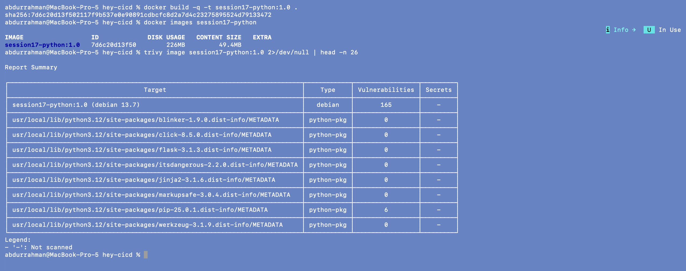
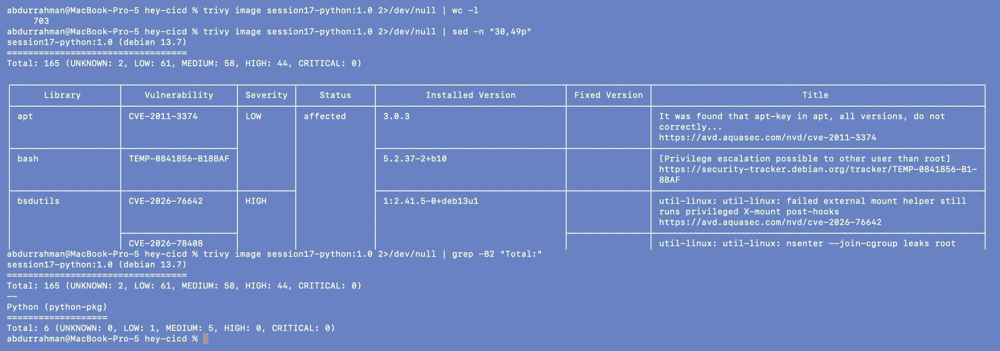
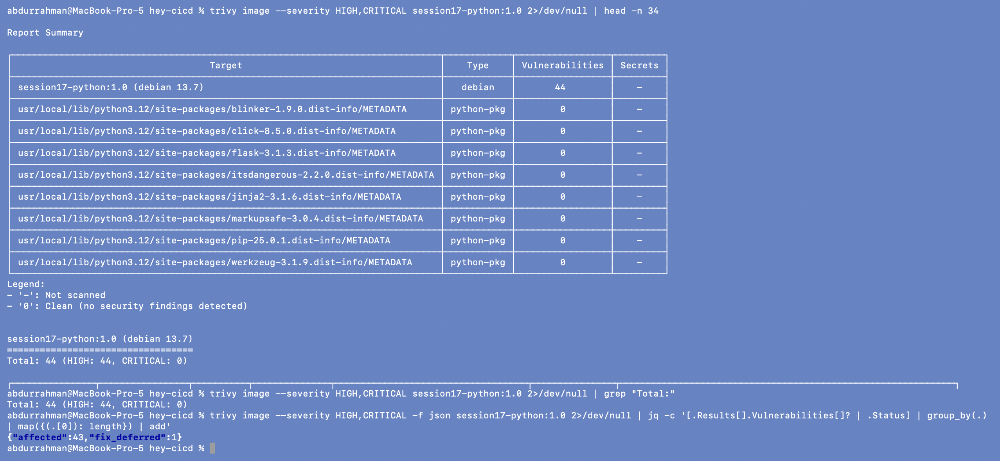
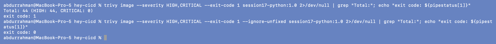
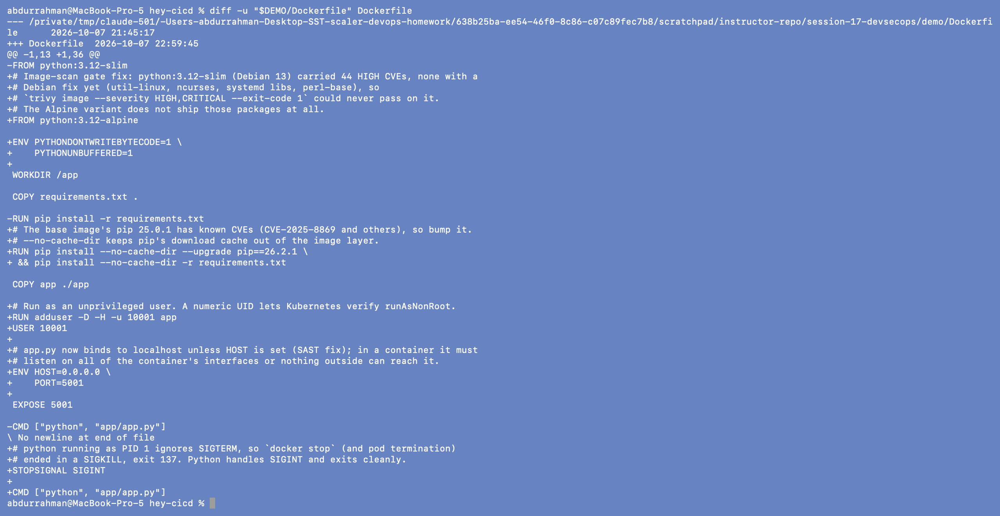
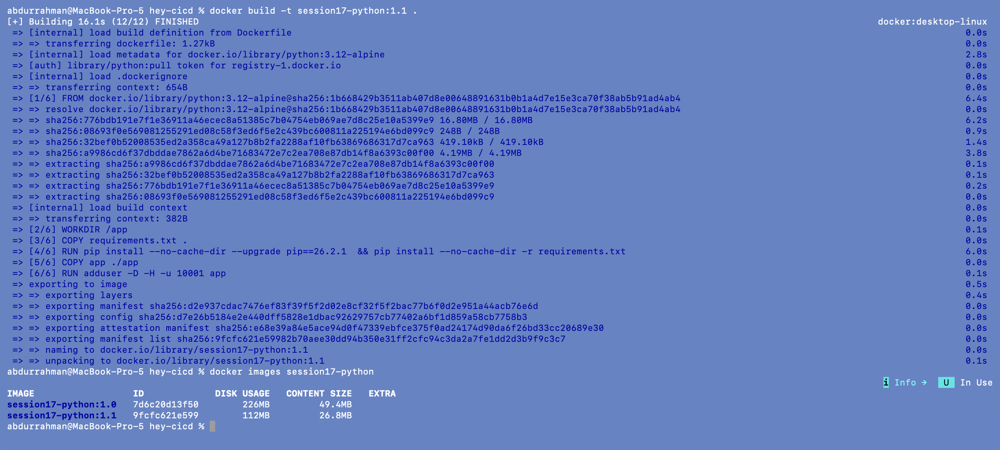
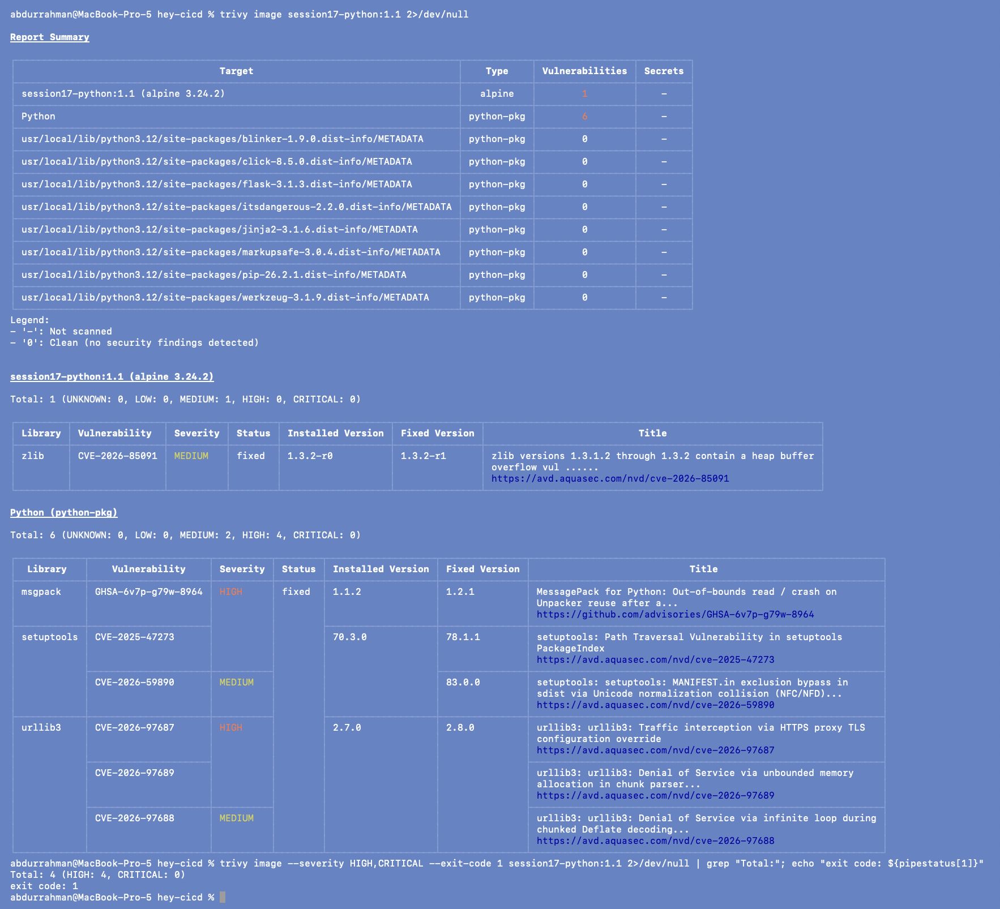
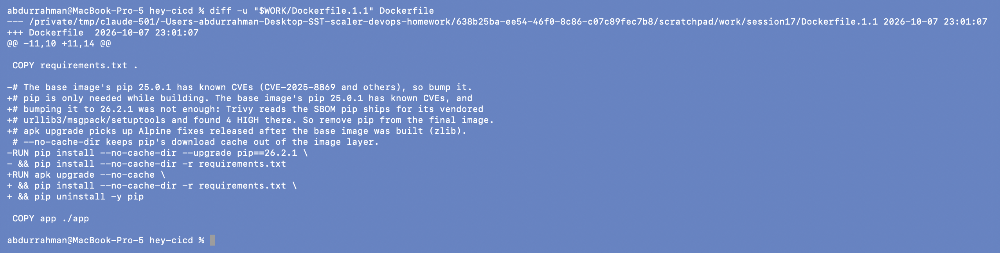
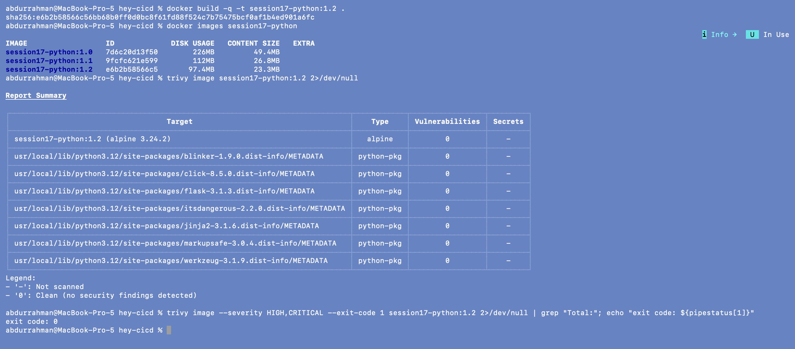
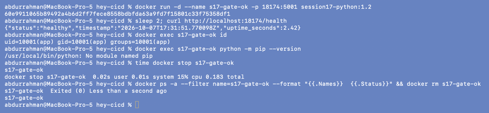

# 6. Container Image Scan and Security Gate

**Name:** Abdur Rahman Ibne Munir
**Enrollment number:** 24BCS10244

The source can be clean and the image still vulnerable, because the image also contains
an operating system, system libraries and Python's own tooling. Trivy scans the
finished image. I ran the commands from `07-container-image-scanning` and
`08-security-gates` in order, using the notes' image name `session17-python`.

## 6.1 Build and first scan

```bash
docker build -q -t session17-python:1.0 .
docker images session17-python
trivy image session17-python:1.0 2>/dev/null | head -n 26
```



(The very first run also downloaded Trivy's ~120 MB vulnerability database; I hid that
progress bar with `2>/dev/null` on the retake.) The report summary lists **165**
vulnerabilities in the Debian 13.7 base of `python:3.12-slim`, **6** in the bundled
`pip-25.0.1`, and 0 in Flask and its dependencies.

## 6.2 Full report and HIGH/CRITICAL only

```bash
trivy image session17-python:1.0 2>/dev/null | wc -l
trivy image session17-python:1.0 2>/dev/null | sed -n "30,49p"
trivy image session17-python:1.0 2>/dev/null | grep -B2 "Total:"
```



The full table is 703 lines, so I show the start and the per-target totals:
`Total: 165 (UNKNOWN: 2, LOW: 61, MEDIUM: 58, HIGH: 44, CRITICAL: 0)` for the OS and
`Total: 6 (LOW: 1, MEDIUM: 5)` for Python packages. Each row gives the package, CVE,
severity, status, installed version and fixed version.

```bash
trivy image --severity HIGH,CRITICAL session17-python:1.0 2>/dev/null | head -n 34
trivy image --severity HIGH,CRITICAL session17-python:1.0 2>/dev/null | grep "Total:"
trivy image --severity HIGH,CRITICAL -f json session17-python:1.0 2>/dev/null | jq -c '[.Results[].Vulnerabilities[]? | .Status] | group_by(.) | map({(.[0]): length}) | add'
```



44 HIGH, 0 CRITICAL. The JSON shows why this matters: **43 are `affected`** (Debian
has no fixed package yet) and 1 is `fix_deferred`. They are in util-linux (`mount`,
`libblkid1`, `login`...), ncurses, systemd's `libudev1`/`libsystemd0` and `perl-base`.
None of them has a fixed version to upgrade to.

## 6.3 Make it a gate: `--exit-code 1`

```bash
trivy image --severity HIGH,CRITICAL --exit-code 1 session17-python:1.0 2>/dev/null | grep "Total:"; echo "exit code: ${pipestatus[1]}"
trivy image --severity HIGH,CRITICAL --exit-code 1 --ignore-unfixed session17-python:1.0 2>/dev/null | grep "Total:"; echo "exit code: ${pipestatus[1]}"
```

(`${pipestatus[1]}` is zsh for "exit code of the first command in the pipe", i.e. trivy,
not grep.)



With `--exit-code 1` Trivy exits **1** whenever it finds anything at the requested
severity. In GitHub Actions a non-zero exit fails the step, so the job stops and
everything that `needs:` it is skipped. The lecture workflow ran this exact scan
**without** `--exit-code 1`, so it printed 44 HIGH and passed anyway. That was a scan,
not a gate.

The second line shows the easy way out: `--ignore-unfixed` hides all 44 (none has a
fix) and the gate passes with exit code 0. That is a legitimate *documented threshold*
some teams choose ("block only what we can actually fix"), but it means shipping 44
known HIGH vulnerabilities. Since there was a better option, I fixed the image instead.

## 6.4 Fix 1: Alpine base, non-root, clean shutdown

```bash
diff -u "$DEMO/Dockerfile" Dockerfile
```



- `FROM python:3.12-alpine`: Alpine doesn't ship util-linux, ncurses, systemd libs or
  perl, which is where all 44 HIGH were.
- `pip install --no-cache-dir`: no pip download cache left in the layer.
- `USER 10001`: the app no longer runs as root (the lecture image did).
- `STOPSIGNAL SIGINT`: fixes the `Exited (137)` shutdown from section 5.
- `PYTHONDONTWRITEBYTECODE=1`: no `.pyc` files written at runtime.

```bash
docker build -t session17-python:1.1 .
docker images session17-python
```



The image dropped from 226 MB to 112 MB.

```bash
trivy image session17-python:1.1 2>/dev/null
trivy image --severity HIGH,CRITICAL --exit-code 1 session17-python:1.1 2>/dev/null | grep "Total:"; echo "exit code: ${pipestatus[1]}"
```



The OS is down to 1 MEDIUM (zlib, fixed in `1.3.2-r1`). But the gate **still fails** with
4 HIGH in a new target called `Python`: msgpack, setuptools and urllib3. My app doesn't
use any of them. They are libraries that **pip vendors inside itself**, and pip ships a
software bill of materials (SBOM) listing them, which Trivy reads. So bumping pip to the
newest version wasn't enough: its vendored copies are still behind.

## 6.5 Fix 2: no pip in the runtime image

The app never needs pip at runtime; pip is only there to install requirements during
the build.

```bash
diff -u "$WORK/Dockerfile.1.1" Dockerfile
```



- `pip uninstall -y pip` in the same `RUN` as the install, so pip and its vendored
  libraries never reach a final layer.
- `apk upgrade --no-cache` picks up Alpine security fixes published after the base image
  was built (the zlib MEDIUM).

```bash
docker build -q -t session17-python:1.2 .
docker images session17-python
trivy image session17-python:1.2 2>/dev/null
trivy image --severity HIGH,CRITICAL --exit-code 1 session17-python:1.2 2>/dev/null | grep "Total:"; echo "exit code: ${pipestatus[1]}"
```



Every target now reports **0** vulnerabilities of any severity, and the gate exits
**0**. The image is 97 MB, 43% of the original.

## 6.6 Does the hardened image still work?

```bash
docker run -d --name s17-gate-ok -p 18174:5001 session17-python:1.2
sleep 2; curl http://localhost:18174/health
docker exec s17-gate-ok id
docker exec s17-gate-ok python -m pip --version
time docker stop s17-gate-ok
docker ps -a --filter name=s17-gate-ok --format "{{.Names}}  {{.Status}}" && docker rm s17-gate-ok
```



Healthy, running as `uid=10001(app)`, `No module named pip`, and `docker stop` now takes
**0.18 s** with **`Exited (0)`** instead of 3+ seconds and 137.

> **Problem found:** the lecture image (`python:3.12-slim`) has 44 HIGH CVEs, and the
> lecture workflow's Trivy step has no `--exit-code 1`, so it never blocked anything.
> **Root cause:** a large Debian base whose HIGH CVEs have no fix yet, pip and its
> vendored libraries left in the runtime image, and a scan with no failure condition.
> **Fix:** `--exit-code 1` on HIGH/CRITICAL, Alpine base, `apk upgrade`, pip removed
> after install, non-root user. Result: 0 vulnerabilities, gate passes.

Later, in section 9, I also pinned the base image by digest
(`python:3.12-alpine@sha256:1b66…`, the digest this build resolved in screenshot 06), so
the image that passed this gate is the one every future build starts from.

## Gate policy used everywhere

| Severity | Pipeline behaviour |
|---|---|
| CRITICAL, HIGH | **fail** (`--severity HIGH,CRITICAL --exit-code 1`), including unfixed ones |
| MEDIUM, LOW, UNKNOWN | reported in the full scan, not blocking |

As the notes say, HIGH/CRITICAL is a classroom threshold, not a universal policy. If a
HIGH with no fix ever has to be accepted, the honest way is a `.trivyignore` entry with
the CVE ID, a reason and an expiry date, not `--ignore-unfixed` for everything.

## What I understood

- A scan only becomes a gate when it can fail. `--exit-code 1` is the whole difference.
- Most image vulnerabilities come from the base image, not my code. Choosing a smaller
  base removed 165 findings in one line.
- Tools inside the image count too: pip's vendored urllib3 kept the gate red even
  though my app never imports it. Anything not needed at runtime shouldn't be in the
  image.
- `--ignore-unfixed` turns the gate green without making anything safer. A threshold
  should be a deliberate, written decision.
