# 7. Kubernetes Deployment

**Name:** Abdur Rahman Ibne Munir
**Enrollment number:** 24BCS10244

Deploy the image to the local minikube cluster, in my own namespace `devsecops-lab`.

**Names and ports.** The lecture has two versions of these manifests.
`03-kubernetes-deployment/README.md` uses `devsecops-python`, port **5000** and NodePort
30080. The files in `demo/k8s/` use `session17-python`, port **5001** and NodePort
30001. I deployed the `demo/k8s/` files, because that is the app I built and it listens
on 5001. So every name below is `session17-python`, and the Service maps port 80 to 5001.

## 7.1 Namespace and the manifests as written

```bash
kubectl create namespace devsecops-lab
kubectl config view --minify -o jsonpath="{..namespace}"; echo
cat k8s/deployment.yaml k8s/service.yaml
```

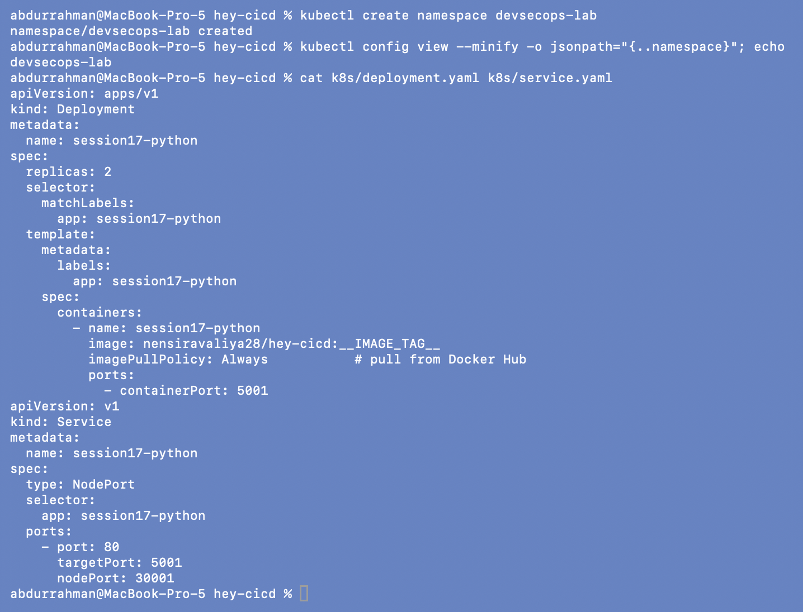

My terminal's kubeconfig context uses `devsecops-lab` as its default namespace, so
plain `kubectl get pods` below means this namespace. Other sessions were running on the
same cluster at the same time.

## 7.2 Problem found: ImagePullBackOff

```bash
kubectl apply -f k8s/deployment.yaml
kubectl apply -f k8s/service.yaml
sleep 15; kubectl get deployment
kubectl get pods
kubectl get service
```

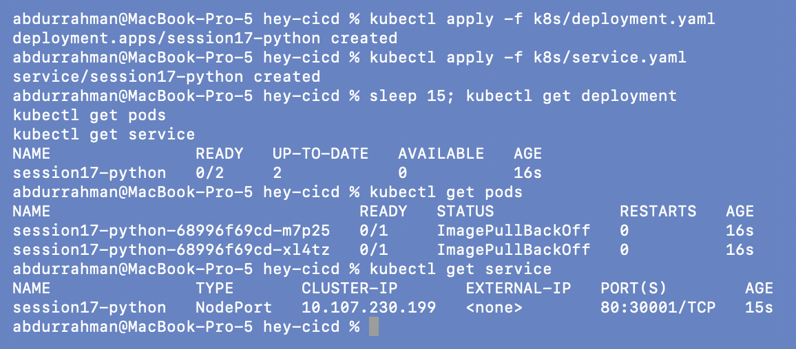

```bash
kubectl get pods
kubectl describe pod -l app=session17-python | grep -E "^Name:|Image:|Reason:|Pull Policy"
kubectl get events --field-selector reason=Failed -o custom-columns=POD:.involvedObject.name,MESSAGE:.message | tail -n 3
```

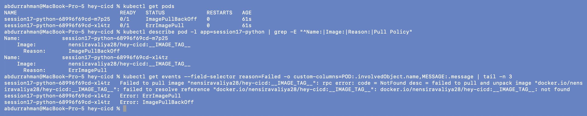

Both Pods are `0/1`, alternating between `ErrImagePull` and `ImagePullBackOff`. The event
says `docker.io/nensiravaliya28/hey-cicd:__IMAGE_TAG__: not found`.

**Root cause**, three things together:
1. `__IMAGE_TAG__` is a placeholder. Only the instructor's CI replaces it (with `sed`)
   before applying, so applied by hand it's a literal tag that doesn't exist.
2. `nensiravaliya28/hey-cicd` is the instructor's Docker Hub repository, not an image I
   built, and my GitHub Actions run pushes to GHCR instead.
3. `imagePullPolicy: Always` makes the kubelet contact the registry on every Pod
   start, so even an image I loaded into minikube by hand would be ignored.

**Fix** (in `k8s/deployment.yaml`, with a comment in the file): `image: hey-cicd:1.0` and
`imagePullPolicy: IfNotPresent`. I also added the readiness/liveness probes from the
`03-kubernetes-deployment` notes (port changed from 5000 to 5001), a securityContext
matching the non-root image (`runAsNonRoot`, read-only root filesystem, no privilege
escalation, all capabilities dropped), and resource requests/limits.

```bash
diff -u "$DEMO/k8s/deployment.yaml" k8s/deployment.yaml
```

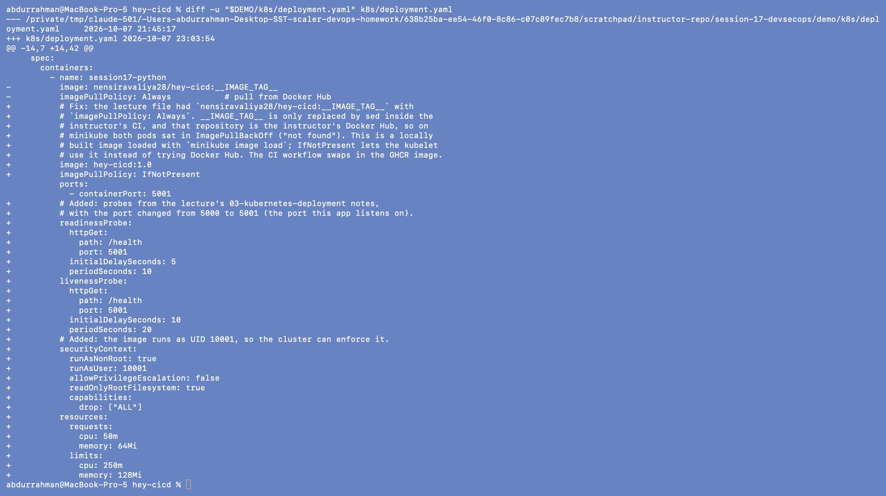

## 7.3 Build, "push" into minikube, deploy

The cluster runs inside minikube's own container runtime, not on my Mac's Docker, so
an image built locally has to be copied in. `minikube image load` is the local stand-in
for a registry push.

```bash
docker build -q -t hey-cicd:1.0 .
docker images hey-cicd
minikube image load hey-cicd:1.0
minikube image ls | grep hey-cicd
```

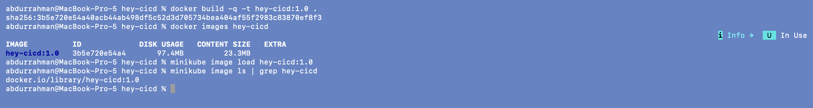

```bash
kubectl apply -f k8s/deployment.yaml -f k8s/service.yaml
kubectl rollout status deployment/session17-python --timeout=120s
kubectl get deployment,pods,service -o wide
```

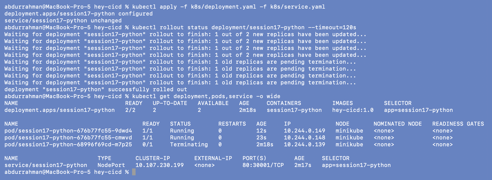

Applying the fixed file started a rolling update from the broken ReplicaSet. `rollout
status` waits until both new Pods are Ready (the readiness probe on `/health` passed)
and the old ones are gone. The Deployment is `2/2` with image `hey-cicd:1.0`, and the
Service is `NodePort 80:30001/TCP`.

## 7.4 Reach the app

The notes use `kubectl port-forward ... 8080:5000` (and the demo README uses
`minikube service`). With minikube's docker driver on macOS the node IP isn't routable
from the Mac, and `minikube service` opens a tunnel on a random port, so I used
port-forward on my own port **18171**.

```bash
kubectl port-forward svc/session17-python 18171:80
```

In a second terminal:

```bash
curl http://localhost:18171/health
curl http://localhost:18171/api/status
curl -X POST http://localhost:18171/api/calculate -H "Content-Type: application/json" -d '{"a": 6, "b": 3, "operation": "multiply"}'
curl -s http://localhost:18171/ | grep "<title>"
kubectl logs deployment/session17-python --tail=6
```

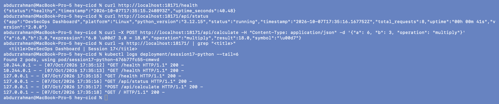
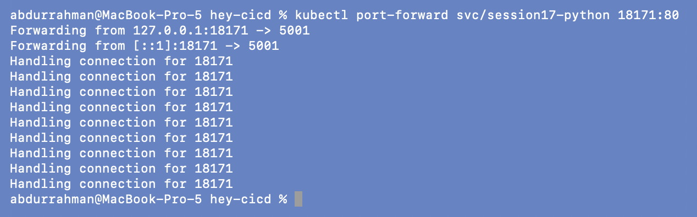

All endpoints answer from inside the cluster. The Pod log shows both kinds of traffic:
`10.244.0.1` is the kubelet running the probes, and `127.0.0.1` is my port-forwarded
requests. The dashboard also loads in a browser through the same port-forward:

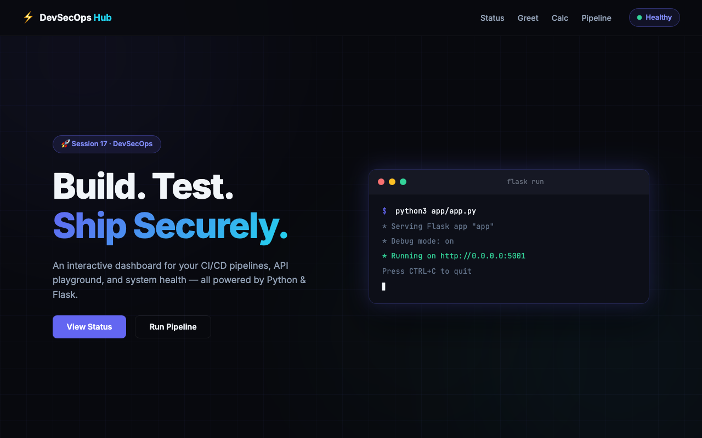

(The terminal graphic on the page is static HTML from the template. It still says
`Debug mode: on` even though the real server has debug off.)

## 7.5 Change the image tag with `kubectl set image`

The lecture's practice questions: change the image tag, run `kubectl set image`, watch
the rollout, verify the new Pods.

```bash
docker tag hey-cicd:1.0 hey-cicd:1.1 && minikube image load hey-cicd:1.1
kubectl set image deployment/session17-python session17-python=hey-cicd:1.1
kubectl rollout status deployment/session17-python --timeout=120s
kubectl rollout history deployment/session17-python
```

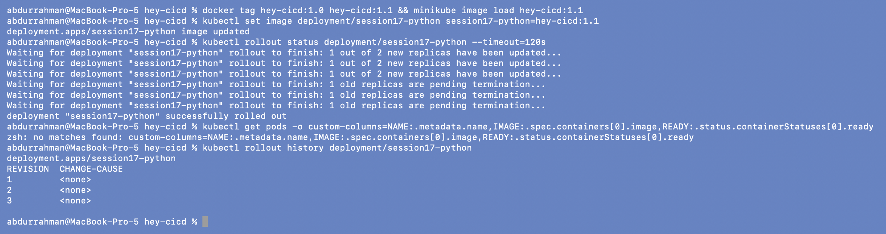

(My `get pods -o custom-columns=...` line in this screenshot failed because zsh tried to
expand the unquoted `[0]` as a glob, so I re-ran it quoted below.)

```bash
kubectl get pods -o custom-columns='NAME:.metadata.name,IMAGE:.spec.containers[0].image,READY:.status.containerStatuses[0].ready'
kubectl rollout history deployment/session17-python --revision=3 | grep -E "Image|revision"
kubectl get replicasets -o wide
```

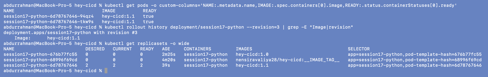

Both Pods now run `hey-cicd:1.1`. Revision 3 records the new image, and the
ReplicaSets show the whole story: revision 1 (`nensiravaliya28/hey-cicd:__IMAGE_TAG__`)
and revision 2 (`hey-cicd:1.0`) are scaled to 0 and kept for `rollout undo`.

## What I understood

- `ImagePullBackOff` is about the *image reference*: wrong name, missing tag, private
  registry or no access. The event message names the exact reference that failed.
- `imagePullPolicy` decides whether a locally loaded image is used. `Always` forces a
  registry pull, while `IfNotPresent` uses the node's copy. With real registries and
  immutable tags (like a commit SHA), `IfNotPresent` is safe.
- Readiness probes are what make `rollout status` meaningful: a Pod only counts as
  available once `/health` answers, so a broken image would stall the rollout instead
  of replacing healthy Pods.
- Changing the image and then waiting on `rollout status` is the whole CD step. The
  workflow in section 9 does the same with the commit SHA as the tag, so every
  deployed Pod can be traced back to one commit.
